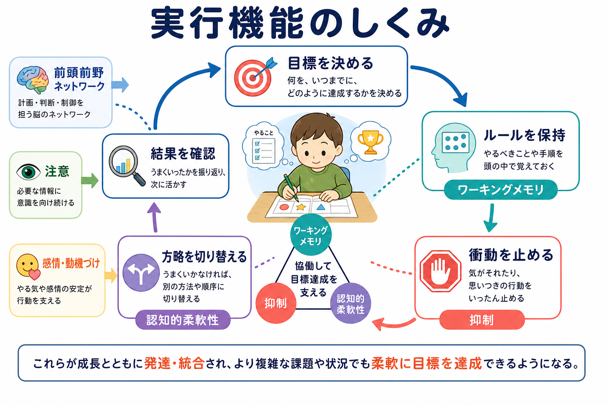

# 実行機能は子どもでどのように発達するのか

## 要点

- [[実行機能とは何か|実行機能]]は、目標を保ち、衝動を抑え、状況に応じて方略を変えるための認知制御である。
- 幼児期には「今したいこと」を止める抑制が目立って伸び、児童期には[[ワーキングメモリとは何か|ワーキングメモリ]]とルール利用が安定し、青年期には複数の目標や社会的文脈を扱う柔軟な制御が洗練される。
- 実行機能は単一能力ではなく、抑制、ワーキングメモリ、[[認知的柔軟性とは何か|認知的柔軟性]]が相互に支え合う家族的な能力群である[1][6]。
- 発達は直線的な成熟ではなく、課題の難しさ、感情・動機づけ、睡眠、ストレス、養育・学校環境によって大きく変わる[2][3]。

## この記事で答える問い

この記事では、子どもの実行機能が「何歳で完成するか」ではなく、「どの構成要素が、どのような順序と条件で使えるようになるか」を考える。中心となる問いは次の3つである。

1. 抑制・ワーキングメモリ・認知的柔軟性は、幼児期から青年期にどう変化するのか。
2. 前頭前野を中心とする制御ネットワークの発達は、行動の変化とどう関係するのか。
3. 学習、感情調整、発達支援では、実行機能をどう理解すればよいのか。

## まず結論

子どもの実行機能は、幼児期に急に芽生え、児童期に課題や学校生活の中で使えるようになり、青年期にかけて複雑な状況へ適用されるようになる。特に3-5歳頃は、待つ、順番を守る、ルールを切り替えるといった行動が大きく変化する時期である[1][2]。ただし、青年期でも情動が強い場面、仲間の影響が大きい場面、報酬が近い場面では制御が不安定になりうる[3]。

そのため、実行機能の発達は「できる／できない」の二分法ではなく、「どの条件なら使えるか」「どの支えがあれば使えるか」と見るほうが正確である。

## 背景

実行機能は、学習の成績だけでなく、遊び、対人関係、感情調整、生活習慣にも関わる。たとえば、子どもが問題を解くときには、問題文を読み、手順を覚え、不要な反応を抑え、うまくいかなければ方略を変える必要がある。これは[[注意とは何か|注意]]、記憶、情動、動機づけが結びついた活動である。

代表的なレビューでは、実行機能は抑制制御、ワーキングメモリ、認知的柔軟性を基礎とし、そこから計画、推論、問題解決のような高次の制御が成り立つと整理される[1]。また、発達研究では、5歳以降も実行機能は大きく伸び続け、青年期まで変化することが示されている[2]。

## 基本概念

### 抑制

抑制とは、目の前の刺激や衝動にすぐ反応せず、目標に合わない行動を止める働きである。幼児期には、待つ、触らない、別のルールに従うといった課題で急速な変化が見られる[1][4]。ただし、抑制は単なる我慢ではない。何を目標にするか、どのルールを保つか、どの感情状態にあるかによって、同じ子どもでも成績は変わる。

### ワーキングメモリ

ワーキングメモリは、今使う情報を一時的に保ちながら操作する働きである。たとえば「赤なら丸を押すが、青なら押さない」というルールを覚えながら反応するには、ルール保持と反応選択が同時に必要になる。児童期には、保持できる情報量と操作の安定性が増し、読み書きや算数のような学習場面で重要になる[2][7]。

### 認知的柔軟性

認知的柔軟性は、状況が変わったときに見方や方略を切り替える働きである。幼児は一度使ったルールに固着しやすいが、年齢とともに「色で分ける」から「形で分ける」へ切り替えるような課題で成績が上がる[1][4]。柔軟性は、抑制とワーキングメモリの上に成り立つ面が強い。古いルールを止め、新しいルールを保つ必要があるからである。

## 仕組み

実行機能の発達には、前頭前野、前頭頭頂ネットワーク、線条体、帯状皮質などを含む広い制御ネットワークが関わる。これらは[[前頭頭頂ネットワークは認知制御をどう支えるのか|前頭頭頂ネットワーク]]や[[中央実行ネットワークとは何か|中央実行ネットワーク]]として説明されることが多い。子どもでは、単に前頭前野が成熟するだけでなく、複数の脳領域が協調し、課題に応じて効率的に使われるようになることが重要である[1][4]。

実行機能は、発達の早い時期から3つの要素が完全に分かれているわけではない。成人の研究では、実行機能には共通因子と、更新・抑制・切り替えに比較的固有の成分があるとされる[6]。子どもの場合、この分化は発達とともに変わるため、年齢が低いほど「実行機能全体」として現れやすく、年齢が上がるほど課題ごとの差が見えやすくなる。

## 図解

子どもの実行機能は、次のような循環として理解できる。

1. 目標を決める。
2. ルールや手順をワーキングメモリに保つ。
3. 目標に合わない衝動を抑える。
4. うまくいかなければ方略を切り替える。
5. 結果を確認し、次の行動に反映する。

この循環は、静かな実験室ではうまく働いても、疲労、不安、強い報酬、対人葛藤がある場面では乱れやすい。ZelazoとCarlsonは、比較的抽象的・認知的な「クール」な実行機能と、報酬や感情を含む「ホット」な実行機能を区別して論じている[3]。学校や家庭での困りごとは、後者の影響を強く受けることがある。

## 臨床・研究との接続

実行機能は、読み書き、算数、授業参加、対人場面の調整と関係する。就学前の実行機能や努力的制御が、幼稚園期の数学・読み書き関連スキルと関連することも報告されている[7]。ただし、これは「実行機能が高ければ成績が必ずよい」という単純な因果ではない。言語、家庭環境、教育経験、睡眠、ストレス、動機づけなどが同時に関わる。

臨床・支援の文脈では、[[ADHDは前頭線条体回路の障害として説明できるのか|ADHD]]、学習困難、不安、トラウマ経験などで実行機能の困難が話題になる。ここで重要なのは、実行機能の弱さを「怠け」や「性格」の問題に還元しないことである。環境を整える、手順を外在化する、課題を小さく分ける、休息を確保する、といった支えは、子どもがすでに持っている制御能力を使いやすくする。

介入研究のレビューでは、実行機能を伸ばす可能性のある活動として、認知訓練、運動、武道、マインドフルネス、学校カリキュラムなどが検討されているが、効果は活動の種類、実施の質、対象児、測定課題によって異なる[8]。したがって、「このトレーニングで実行機能が万能に伸びる」とは考えず、日常環境と学習機会の設計として扱うのが現実的である。

## よくある誤解

### 「実行機能は前頭前野だけで決まる」

前頭前野は重要だが、実行機能は単独の部位ではなくネットワークの働きである。注意、記憶、報酬、感情、運動制御を含む広いシステムが関わる。

### 「幼児期に決まったら変わらない」

幼児期は大きな変化の時期だが、5歳以降も児童期・青年期にかけて発達は続く[2][5]。学校生活、遊び、睡眠、対人関係、ストレスへの支援は、その後の使いやすさに影響する。

### 「我慢できない子は意思が弱い」

抑制は意思の問題だけではない。課題が難しすぎる、ルールが多すぎる、疲れている、報酬が近い、感情が高ぶっている、といった条件で制御は不安定になる。支援では、子どもを責める前に、課題と環境の要求を見直す必要がある。

### 「実行機能トレーニングをすれば何にでも効く」

訓練効果は、練習した課題に近いものには出やすいが、遠い日常行動へどこまで一般化するかは慎重に見る必要がある[8]。実行機能の支援は、単発の訓練より、日常の構造化、フィードバック、休息、成功経験と組み合わせるほうが実践的である。

## 関連ノート

- [[実行機能とは何か]]
- [[ワーキングメモリとは何か]]
- [[認知的柔軟性とは何か]]
- [[注意とは何か]]
- [[トップダウン注意とボトムアップ注意は何が違うのか]]
- [[発達とは何か]]
- [[養育環境は発達にどう影響するのか]]
- [[神経発達の異常は精神疾患にどう関わるのか]]
- [[ADHDは前頭線条体回路の障害として説明できるのか]]

## 理解チェック

1. 抑制、ワーキングメモリ、認知的柔軟性は、それぞれ日常のどの行動に表れるか。
2. 実行機能の発達を「年齢だけ」で説明すると、どのような見落としが起こるか。
3. 「できない=怠けではない」と考えると、家庭や学校での支援はどう変わるか。
4. クールな実行機能とホットな実行機能の違いは何か。

## 今後の作成候補

- 実行機能と学校適応
- ホットな実行機能とは何か
- 抑制制御はどのように発達するのか
- 実行機能と睡眠の関係
- 実行機能支援のエビデンス

## MOC更新候補

- `content/00_MOC/MOC｜認知科学・心理学.md`
- `content/00_MOC/MOC｜認知機能.md`

並列ジョブとの競合を避けるため、この作業ではMOC本体は更新していない。

## 未解決問題

- 実行機能の各成分が、発達のどの時点でどの程度分化するのかは、課題・年齢・分析法によって見え方が変わる。
- 実験室課題の成績が、家庭や学校での自己調整をどこまで予測するかには限界がある。
- 介入研究では、短期的な課題成績の改善と、長期的な日常機能の改善を区別して評価する必要がある。

## 参考文献

[1] Diamond, A. (2013). Executive functions. *Annual Review of Psychology, 64*, 135-168. https://doi.org/10.1146/annurev-psych-113011-143750

[2] Best, J. R., Miller, P. H., & Jones, L. L. (2009). Executive functions after age 5: Changes and correlates. *Developmental Review, 29*(3), 180-200. https://doi.org/10.1016/j.dr.2009.05.002

[3] Zelazo, P. D., & Carlson, S. M. (2012). Hot and cool executive function in childhood and adolescence: Development and plasticity. *Child Development Perspectives, 6*(4), 354-360. https://doi.org/10.1111/j.1750-8606.2012.00246.x

[4] Davidson, M. C., Amso, D., Anderson, L. C., & Diamond, A. (2006). Development of cognitive control and executive functions from 4 to 13 years: Evidence from manipulations of memory, inhibition, and task switching. *Neuropsychologia, 44*(11), 2037-2078. https://doi.org/10.1016/j.neuropsychologia.2006.02.006

[5] Huizinga, M., Dolan, C. V., & van der Molen, M. W. (2006). Age-related change in executive function: Developmental trends and a latent variable analysis. *Neuropsychologia, 44*(11), 2017-2036. https://doi.org/10.1016/j.neuropsychologia.2006.01.009

[6] Miyake, A., & Friedman, N. P. (2012). The nature and organization of individual differences in executive functions: Four general conclusions. *Current Directions in Psychological Science, 21*(1), 8-14. https://doi.org/10.1177/0963721411429458

[7] Blair, C., & Razza, R. P. (2007). Relating effortful control, executive function, and false belief understanding to emerging math and literacy ability in kindergarten. *Child Development, 78*(2), 647-663. https://doi.org/10.1111/j.1467-8624.2007.01019.x

[8] Diamond, A., & Ling, D. S. (2016). Conclusions about interventions, programs, and approaches for improving executive functions that appear justified and those that, despite much hype, do not. *Developmental Cognitive Neuroscience, 18*, 34-48. https://doi.org/10.1016/j.dcn.2015.11.005
