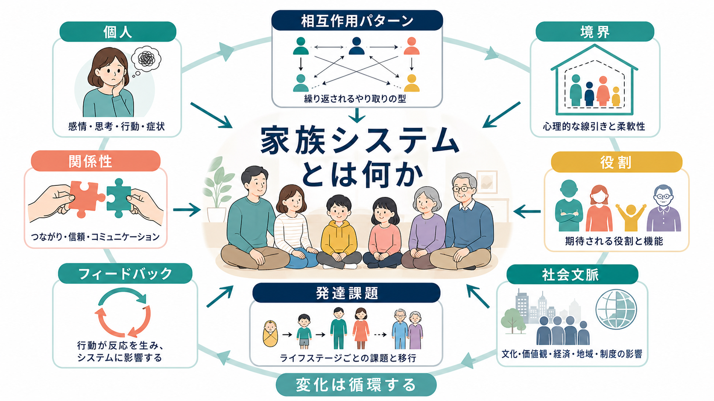
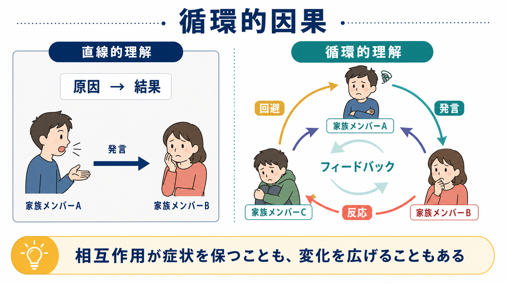

# 家族システムとは何か

## 要点

- 家族システムとは、個人の感情・行動・症状を、その人だけの内的問題としてではなく、家族内の関係性、役割、境界、相互作用パターン、世代間の影響のなかで理解する視点である[1][2]。
- 家族システム論は「誰が悪いか」を探す理論ではない。むしろ、ある行動が別の人の反応を生み、その反応がさらに最初の行動を変えるという循環的な理解を重視する[1][3]。
- Bowen の家族システム理論は、家族を情動的単位として捉え、三角関係、自己分化、核家族情動過程、家族投影過程、世代間伝達などの概念で説明する[2]。
- Minuchin の構造的家族療法は、家族内のサブシステム、境界、階層、役割の組織化に注目し、硬すぎる境界や曖昧すぎる境界が問題維持に関わることを示した[3]。
- 臨床応用では、家族療法やシステミック介入として用いられる。ただし効果は問題領域・対象年齢・比較条件によって異なり、単独で万能な治療法として扱うべきではない[5][6][7]。

## この記事で答える問い

1. 家族システムとは何を意味するのか。
2. 個人の心理を「関係性」から見るとは、具体的にどういうことか。
3. 循環的因果、境界、役割、三角関係、自己分化とは何か。
4. 家族システムの視点は、発達・愛着・臨床実践にどう接続するのか。
5. 「家族が原因である」と短絡しないために、どのような注意が必要か。

## まず結論

家族システムとは、家族を複数の個人の集合ではなく、互いに影響し合う関係のシステムとして見る考え方である。たとえば、子どもの不登校、親の過干渉、夫婦間の緊張、祖父母の介入を別々の出来事として見るのではなく、「誰のどの反応が、誰のどの反応を引き出し、その循環がどのように保たれているか」と問う。

この視点では、個人の苦痛は軽視されない。むしろ、個人の苦痛が家族内でどのような意味を持ち、どのような相互作用によって強まったり和らいだりするかを細かく見る。家族システム論は、[[愛着とは何か]]、[[内的作業モデルとは何か]]、[[安全基地とは何か]]、[[養育環境は発達にどう影響するのか]]と接続しやすい。いずれも、個人の心が関係性のなかで形成され、維持され、変化することを扱うからである。

## 背景

家族をシステムとして見る発想は、一般システム理論、サイバネティクス、発達心理学、臨床家族療法の流れを背景に発展した。Cox と Paley は、家族システムの見方が、子どもの発達や成人の適応を、複数の影響が交差する動的過程として理解するために有用だと整理している[1]。また、生態学的・生物生態学的な発達モデルは、家族を学校、職場、地域、文化、歴史的時間と切り離さずに扱う視点を与える[4]。

Bowen は、家族を「情動的単位」として捉え、家族員の機能は相互依存的に変化すると考えた。誰か一人の不安が高まると、他の家族員の注意、距離の取り方、支援、批判、回避が変化し、その変化がまた最初の人に戻ってくる[2]。この循環は、[[社会心理学とは何か]]で扱われる相互作用や集団規範とも重なるが、家族システム論では、とくに長期的で情動的に濃い関係に焦点を置く。

Minuchin は、家族の構造に注目した。家族には夫婦、親子、きょうだいなどのサブシステムがあり、それぞれに境界と役割がある。境界が硬すぎると孤立し、曖昧すぎると巻き込まれやすくなる。構造的家族療法は、この境界や階層の再編成を通じて、家族の相互作用を変えることを目指した[3]。

## 基本概念

### システム

システムとは、要素どうしが相互に影響し、全体として一定のパターンを作るまとまりである。家族システムでは、要素は家族員だけではない。会話のしかた、沈黙、役割期待、家庭内ルール、経済状況、文化的価値観、学校や職場との関係も含まれる。

重要なのは、全体が部分の単純な足し算ではないことである。同じ「厳しい発言」でも、信頼関係がある家族では励ましとして機能し、緊張が高い家族では攻撃や拒絶として受け取られることがある。意味は、発言そのものだけでなく、関係の歴史と文脈で変わる。

### 循環的因果

家族システム論は、直線的因果だけではなく、循環的因果を重視する。直線的因果は「A が B を起こした」と考える。循環的因果は「A の行動が B の反応を引き出し、その反応が A の次の行動を変え、さらに C の反応も変える」と考える。

たとえば、親が心配して細かく確認する。子どもは干渉されたと感じて黙る。親は情報が得られないためさらに確認を強める。子どもはさらに距離を取る。この場合、「親が悪い」「子どもが悪い」と切るより、心配、沈黙、確認、回避が一つの循環として固定化していると見るほうが、変化の入口を見つけやすい。

### フィードバック

フィードバックとは、ある行動の結果がシステムに戻り、次の行動を調整することである。家族では、安心する反応が緊張を下げることもあれば、批判や回避が緊張を維持することもある。否定的フィードバックは現状維持に、肯定的フィードバックは変化の拡大に関わると説明されることが多い。

### 境界

境界とは、家族員やサブシステムのあいだで、どこまで関わり、どこから距離を取るかを調整する心理的・行動的な線引きである[3]。親子境界が曖昧だと、子どもが親の感情調整役を担いすぎることがある。逆に境界が硬すぎると、困ったときに助けを求めにくくなる。

### 役割

役割とは、家族内で暗黙に期待される位置づけである。「しっかり者」「問題児」「仲裁役」「空気を読む人」「感情を出さない人」などが例である。役割は家族を安定させる働きを持つが、固定化すると個人の発達や自己理解を狭めることがある。

### 三角関係

Bowen 理論でいう三角関係は、二者間の緊張が高まったとき、第三者を巻き込んで安定を取り戻そうとする過程である[2]。たとえば、夫婦間の緊張が高いとき、子どもの問題に焦点が移ることで、夫婦の直接的な葛藤が一時的に避けられることがある。これは意図的な操作とは限らず、情動的な安定化のパターンとして生じうる。

### 自己分化

自己分化とは、他者とのつながりを保ちながら、自分の考えや責任を保つ力である[2]。自己分化が高いとは、冷たい個人主義という意味ではない。むしろ、家族の不安に過度に巻き込まれず、かつ断絶せずに関係を続けられる柔軟性を指す。

## 仕組み

家族システムの仕組みは、次のように整理できる。

| 観点 | 何を見るか | 例 |
|---|---|---|
| 相互作用 | 誰の反応が誰の反応を引き出すか | 心配、確認、沈黙、回避の循環 |
| 境界 | 近すぎるか、遠すぎるか | 親子の過剰な巻き込み、相談できない孤立 |
| 役割 | 誰が何を担わされているか | 仲裁役、問題を背負う人、感情を出さない人 |
| 発達段階 | 家族がどの移行期にあるか | 出産、入学、思春期、独立、介護、喪失 |
| 世代間伝達 | 過去の関係パターンがどう受け継がれるか | 感情表出の禁止、過度な期待、距離の取り方 |
| 社会文脈 | 家族外の条件がどう影響するか | 貧困、差別、仕事、学校、医療、地域資源 |

この仕組みは、[[発達とは何か]]で扱うライフスパンの変化とも関係する。家族は固定された単位ではなく、発達するシステムである。子どもの誕生、思春期、進学、就職、結婚、介護、死別などの移行期には、これまで機能していた役割や境界が合わなくなる。問題は「誰かが壊れた」からではなく、「古い調整様式が新しい発達課題に合わなくなった」ために表面化することがある。

## 図解

この記事で作成した図は、二つの読み方を意図している。

1. 1枚目は、個人、関係性、相互作用パターン、境界、役割、社会文脈を一つの概念地図として整理している。
2. 2枚目は、直線的理解と循環的理解を対比し、フィードバックが症状や緊張を維持する場合と、変化を広げる場合の両方を示している。

図を読むときは、矢印を「責任の矢印」としてではなく、「影響の戻り道」として見るとよい。家族システム論の目的は、責任追及ではなく、変化可能な相互作用の点を探すことである。

## 臨床・研究との接続

家族システムの視点は、家族療法、システミック心理療法、親子支援、発達臨床、児童思春期精神医学、学校臨床、地域支援で使われる。臨床では、症状を「家族のせい」と説明するのではなく、症状がどのような関係文脈で強まり、どのような文脈で弱まるかを評価する。

エビデンスについては、問題領域ごとに慎重に見る必要がある。Carr のレビューは、子ども・青年のさまざまな困難に対する家族療法やシステミック介入の研究を整理し、外在化問題、摂食障害、身体疾患関連問題、虐待・ネグレクト後の支援など、領域によって一定の有用性が示されているとまとめている[5]。

一方、うつ症状や自殺念慮を対象にしたメタ分析では、家族療法が他の能動的治療より一貫して優れるとは限らない。Waraan らは、青年の抑うつでは治療終了時の抑うつ症状について能動的比較治療との差が明確ではない一方、自殺念慮では家族療法に有利な効果が示されたと報告している[6]。また、自傷後の若者を対象にした大規模ランダム化比較試験では、システミック家族療法が通常治療より自傷再発を明確に減らすとは示されなかった[7]。

したがって、家族システムの視点は「有効な問いの立て方」であり、特定の診断や治療を自動的に決めるものではない。臨床では、本人の安全、希望、発達段階、家族内の暴力や支配、文化的背景、利用できる支援資源を含めて評価する必要がある。とくに虐待、DV、深刻な自傷リスクがある場合、家族全員を同席させることが常に安全とは限らない。安全確保と専門的支援が優先される。

## よくある誤解

### 誤解1: 家族システム論は「家族が悪い」と言う理論である

これは誤解である。家族システム論は、責任の所在を一人に固定するより、相互作用の循環を理解する。誰かを責める理論ではなく、変えられるパターンを見つけるための理論である。

### 誤解2: 個人の脳・性格・症状を無視する

家族システムの視点は、個人要因を否定しない。うつ、不安、神経発達特性、トラウマ、身体疾患、認知機能、気質は重要である。ただし、それらが家族内でどう理解され、支えられ、時には悪循環に巻き込まれるかを同時に見る。

### 誤解3: 家族全員で話し合えば解決する

話し合いは有用なこともあるが、常に安全とは限らない。暴力、威圧、支配、強い依存、深刻な自傷他害リスクがある場合、全員参加の対話がリスクを高めることがある。家族システムの評価は、安全計画、個別面接、外部支援、法的・福祉的資源と組み合わせる必要がある。

### 誤解4: 家族の形が標準から外れると問題が起きる

家族システム論が見るのは、家族形態そのものではなく、関係の機能である。ひとり親家庭、再婚家庭、同性カップルの家庭、祖父母同居、里親家庭など、家族形態は多様である。重要なのは、境界、役割、支援、コミュニケーション、安全性、柔軟性がどう働いているかである。

## 関連ノート

- [[愛着とは何か]]
- [[内的作業モデルとは何か]]
- [[安全基地とは何か]]
- [[養育環境は発達にどう影響するのか]]
- [[逆境的小児期体験ACEとは何か]]
- [[トラウマは発達にどう影響するのか]]
- [[社会心理学とは何か]]
- [[発達とは何か]]

### MOC更新候補

- `content/00_MOC/` 配下の心理学・発達心理学・臨床実践関連 MOC に追加候補。
- 並列ジョブとの競合を避けるため、本記事では MOC ファイルは更新しない。

### 今後の作成候補

- 家族療法とは何か
- Bowen の家族システム理論とは何か
- 構造的家族療法とは何か
- 循環的因果とは何か
- 家族内三角関係とは何か

## 理解チェック

1. 家族システム論が「個人の問題」ではなく「関係のパターン」として見るのはなぜか。
2. 直線的因果と循環的因果の違いを、家庭内の会話例で説明できるか。
3. 境界が硬すぎる場合と曖昧すぎる場合、それぞれどのような困難が起こりうるか。
4. 三角関係は、なぜ短期的には緊張を下げ、長期的には問題を維持することがあるのか。
5. 家族システムの視点を使うとき、暴力や自傷リスクに関してどのような注意が必要か。

## 限界と未解決問題

家族システム論は強力な視点だが、測定と検証が難しい概念も多い。相互作用パターン、境界、役割、自己分化は臨床的には有用でも、研究では操作的定義が必要になる。また、家族療法の効果研究では、対象疾患、家族構成、治療者訓練、比較条件、文化的背景によって結果が変わる。

未解決問題としては、オンライン環境や共働き・移住・多文化家庭における家族システムの変化、神経発達特性をもつ家族員への適用、家族内暴力がある場合の安全なシステミック介入、個人療法と家族療法の最適な組み合わせが挙げられる。

## 参考文献

[1] Cox, M. J., & Paley, B. (1997). Families as systems. *Annual Review of Psychology, 48*, 243-267. https://doi.org/10.1146/annurev.psych.48.1.243

[2] The Bowen Center for the Study of the Family. Introduction to the Eight Concepts. https://www.thebowencenter.org/introduction-eight-concepts

[3] Minuchin, S. (1974). *Families and Family Therapy*. Harvard University Press. https://doi.org/10.4159/9780674041127

[4] Bronfenbrenner, U., & Ceci, S. J. (1994). Nature-nurture reconceptualized in developmental perspective: A bioecological model. *Psychological Review, 101*(4), 568-586. https://doi.org/10.1037/0033-295X.101.4.568

[5] Carr, A. (2014). The evidence-base for family therapy and systemic interventions for child-focused problems. *Journal of Family Therapy, 36*(2), 107-157. https://doi.org/10.1111/1467-6427.12032

[6] Waraan, L., Siqveland, J., Hanssen-Bauer, K., Czjakowski, N. O., Axelsdottir, B., Mehlum, L., & Aalberg, M. (2023). Family therapy for adolescents with depression and suicidal ideation: A systematic review and meta-analysis. *Clinical Child Psychology and Psychiatry, 28*(2), 831-849. https://doi.org/10.1177/13591045221125005

[7] Cottrell, D. J., Wright-Hughes, A., Collinson, M., Boston, P., Eisler, I., Fortune, S., Graham, E. H., Green, J., House, A. O., Kerfoot, M., Owens, D. W., Saloniki, E. C., Simic, M., Tubeuf, S., & Farrin, A. J. (2018). Effectiveness of systemic family therapy versus treatment as usual for young people after self-harm: A pragmatic, phase 3, multicentre, randomised controlled trial. *The Lancet Psychiatry, 5*(3), 203-216. https://doi.org/10.1016/S2215-0366(18)30058-0
