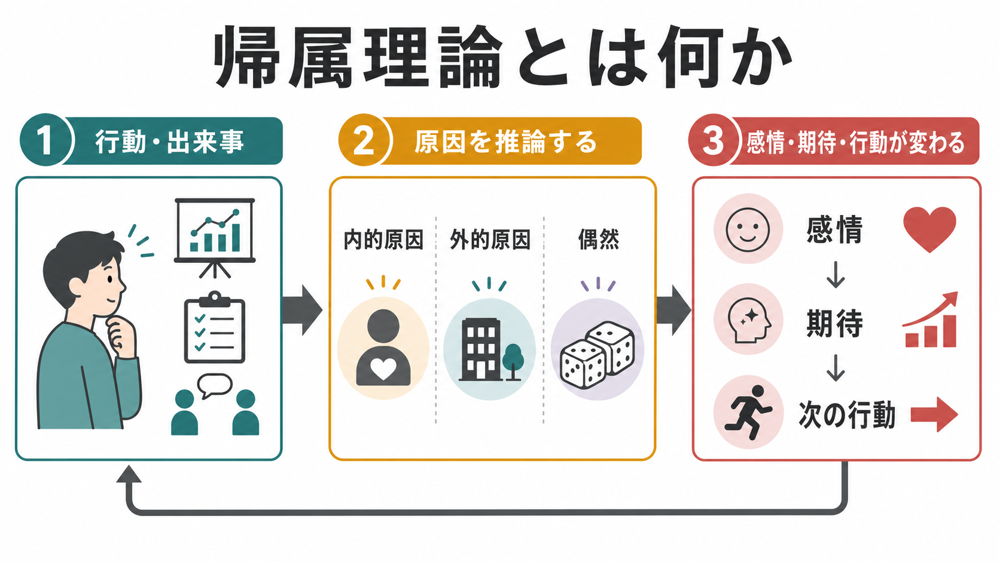
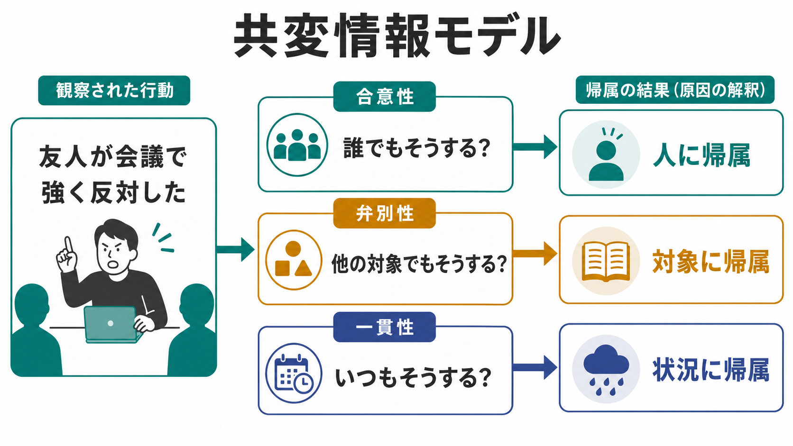
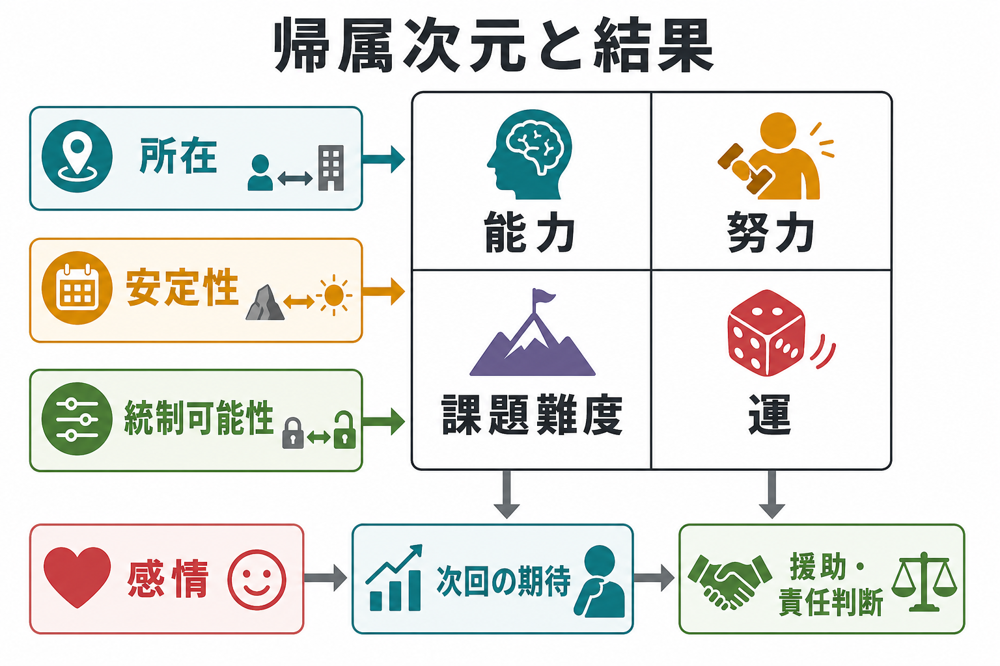

# 帰属理論とは何か

## 要点

- 帰属理論とは、人が「なぜその行動や出来事が起きたのか」を、性格・能力・努力などの内的要因、状況・課題・他者・偶然などの外的要因に説明する認知過程を扱う理論群である[1][3]。
- 帰属は単なる説明ではなく、感情、期待、責任判断、援助行動、対人評価、次の行動選択に影響する[4][5]。
- 代表的な枠組みには、Heider の素朴心理学、Jones と Davis の対応推論、Kelley の共変情報モデル、Weiner の達成動機づけモデルがある[1][2][3][4]。
- 人は情報を合理的に統合しようとする一方で、他者の行動を性格で説明しすぎる基本的帰属錯誤や、成功を自分に、失敗を外的要因に結びつけやすい自己奉仕バイアスを示すことがある[5][7]。
- 臨床・教育・組織で使うときは、帰属を個人診断としてではなく、状況、学習歴、社会的文脈、支援可能性を読むための枠組みとして扱う必要がある[6][8]。

## この記事で答える問い

1. 帰属理論は、行動や出来事の「原因説明」をどのように捉えるのか。
2. 内的帰属、外的帰属、安定性、統制可能性は何を意味するのか。
3. 帰属は、感情、動機づけ、対人判断、援助行動にどう影響するのか。
4. 帰属理論を研究・臨床・教育で使うとき、どのような誤解を避けるべきか。

## まず結論

帰属理論は、「人は行動を見たあと、原因を推論し、その推論にもとづいて感情や行動を変える」という枠組みである。たとえば、同じ「約束に遅れた」という出来事でも、「その人がだらしない」と見るなら内的・安定的な帰属になりやすく、「電車事故があった」と見るなら外的・状況的な帰属になりやすい。前者では怒りや不信が強まり、後者では理解や援助が生じやすい。

重要なのは、帰属が「真の原因の発見」そのものではなく、限られた情報から原因を構成する社会的認知だという点である。したがって帰属理論は、他者理解、[[心の理論はどのように発達するのか]]、[[発達とは何か]]、[[愛着とは何か]]、教育場面のフィードバック、臨床での語りの理解と接続する。

## 背景

帰属理論の出発点は、Heider が示した「人は日常生活の中で素朴な心理学者として振る舞う」という見方にある[1]。人は、他者の行動を偶然の連続として見るのではなく、「その人が何を望んだのか」「何を知っていたのか」「状況がどのような制約を与えたのか」を推論しながら理解する。

その後、Jones と Davis は、ある行為から行為者の安定した性質をどのように推論するかを「対応推論」として整理した[2]。Kelley は、行動が人、対象、状況のどれと共変するかを、合意性、弁別性、一貫性という情報から判断するモデルを示した[3]。Weiner は、成功や失敗の原因を、所在、安定性、統制可能性という次元で整理し、それが期待や感情に影響すると論じた[4]。

## 基本概念

### 内的帰属と外的帰属

内的帰属とは、行動の原因を性格、能力、態度、意図、努力など行為者の内側に置く説明である。外的帰属とは、状況、課題難度、他者の圧力、制度、偶然、運など行為者の外側に原因を置く説明である[1][3]。

ただし、内的か外的かは二分法ではない。実際の出来事では、能力、努力、状況、相手の反応、文化的規範、偶然が複合している。帰属理論の意義は、どちらか一方だけを選ぶことではなく、どの情報が見落とされやすいかを点検することにある。

### 対応推論

対応推論とは、ある行為から「その人はそういう性質を持つ」と推論する過程である[2]。たとえば、会議で強く反対した人を見て「攻撃的な人だ」と判断する場合、行為と性格を対応づけている。

しかし、その人に役割上の責任があったのか、選択肢が限られていたのか、組織規範が反対意見を求めていたのかによって、同じ行為の意味は変わる。対応推論は日常的には便利だが、状況情報が少ないと過剰な性格判断になりやすい。

### 共変情報モデル

Kelley の共変情報モデルは、原因を推論するときに、合意性、弁別性、一貫性という三種類の情報を見る[3]。

| 情報 | 問い | 帰属判断の例 |
|---|---|---|
| 合意性 | 他の人も同じ反応をするか | 多くの人も反対するなら、対象や状況の要因を疑う |
| 弁別性 | 他の対象にも同じ反応をするか | その議題だけに反対するなら、対象の特徴を疑う |
| 一貫性 | いつも同じ反応をするか | いつも同じ場面で反対するなら、安定した要因を疑う |

### 帰属次元

Weiner のモデルでは、原因を次のような次元で整理する[4]。

| 次元 | 意味 | 例 |
|---|---|---|
| 所在 | 原因が自分の内側か外側か | 能力、努力、課題難度、運 |
| 安定性 | 原因が今後も続きやすいか | 能力は比較的安定、努力や運は変動しやすい |
| 統制可能性 | 本人や周囲が変えられるか | 努力や戦略は変えやすく、偶然は変えにくい |

この区別は教育や支援で重要である。「能力がない」と安定的・内的に説明すると期待が下がりやすい。一方、「方法が合っていない」「練習条件を変えられる」と捉えると、次の行動につながりやすい。

## 仕組み

帰属は、おおまかに次の流れで働く。

1. 行動や出来事を観察する。
2. 行為者、対象、状況、過去の経験、文化的規範などから原因候補を作る。
3. 原因を内的・外的、安定・不安定、統制可能・統制不能などの次元で評価する。
4. その評価にもとづき、怒り、同情、罪悪感、誇り、恥、希望、無力感などが生じる。
5. 次の期待、援助、非難、回避、再挑戦、関係修復などの行動が変わる。

この過程は、常に熟慮的に進むわけではない。Ross が論じた基本的帰属錯誤では、人は他者の行動を状況よりも性格で説明しやすい[5]。一方、自分の成功は内的要因に、失敗は外的要因に結びつけやすい自己奉仕バイアスも、多くの研究で確認されている[7]。

## 図解

この記事の 3 枚の図は、次の役割で読むとよい。

| 図 | 主題 | 読み方 |
|---|---|---|
| 図1 | 帰属理論の全体像 | 出来事を見る、原因を推論する、感情・期待・行動が変わるという循環を見る |
| 図2 | 共変情報モデル | 合意性、弁別性、一貫性が、人・対象・状況への帰属をどう支えるかを見る |
| 図3 | 帰属次元と結果 | 所在、安定性、統制可能性が、感情や次回の期待、援助・責任判断につながる点を見る |

## 臨床・研究との接続

帰属理論は、臨床心理学、教育心理学、社会心理学、組織心理学で広く使われてきた。たとえば、学習場面では、失敗を「自分には能力がない」と安定的に説明するか、「方法や条件を変えれば改善できる」と説明するかで、次の挑戦への期待が変わる[4]。これは[[発達とは何か]]や学習支援の設計とも関係する。

抑うつや学習性無力感の研究では、悪い出来事を内的、安定的、全般的に帰属する傾向が、無力感や抑うつ的認知と関係するという再定式化が提案された[6]。ただし、これは個別の診断や治療指示ではない。臨床で扱う場合は、症状、生活史、トラウマ、社会的孤立、身体状態、文化的背景、支援資源を含めて慎重に理解する必要がある。[[逆境的小児期体験ACEとは何か]]のような発達・環境要因とも切り離せない。

近年の説明研究では、Malle が、行動説明は単純な「人か状況か」だけでは捉えきれないと論じた[8]。人は、意図的行為については理由、信念、欲求、意図を説明し、非意図的行為については原因を説明する。つまり、帰属理論は重要な基盤だが、すべての行動説明を単一の内的・外的軸に還元しないことが重要である。

## よくある誤解

### 帰属理論は「本当の原因」を当てる理論である

帰属理論は、真の原因を直接発見する手続きではない。人が限られた情報から原因をどう構成し、それが判断や行動にどう影響するかを扱う理論である。

### 内的帰属は悪く、外的帰属は良い

そうではない。内的帰属は責任感や自己効力感につながる場合があり、外的帰属は状況理解や支援につながる場合がある。問題は、どちらか一方に固定され、利用可能な情報や変えられる条件を見落とすことである。

### 基本的帰属錯誤は、すべての人が同じように示す

基本的帰属錯誤は重要な現象だが、文化、状況、動機づけ、情報量によって変化する。自己奉仕バイアスも、発達、文化、精神的健康状態によって大きさが異なる[7]。

### 帰属スタイルを見れば個人を診断できる

帰属スタイルは有用な研究概念だが、それだけで個人を診断することはできない。教育・臨床では、個人の語りを責めるためではなく、支援可能な条件、回復可能性、関係性、環境調整を見つけるために使う。

## 関連ノート

- [[心の理論はどのように発達するのか]]
- [[発達とは何か]]
- [[愛着とは何か]]
- [[安全基地とは何か]]
- [[逆境的小児期体験ACEとは何か]]

## 関連ノート候補

- 社会的認知とは何か
- 基本的帰属錯誤とは何か
- 自己奉仕バイアスとは何か
- 学習性無力感とは何か
- 原因帰属スタイルとは何か

## MOC更新候補

- `content/00_MOC/MOC｜認知科学・心理学.md`
- 発達・愛着・社会心理カテゴリの統合 MOC がある場合は、社会的認知、社会心理、動機づけ、臨床心理との接続項目に本記事を追加する。

## 理解チェック

1. 内的帰属と外的帰属は、それぞれどのような原因説明を指すか。
2. Kelley の共変情報モデルにおける合意性、弁別性、一貫性は何を問う情報か。
3. Weiner の帰属次元では、安定性と統制可能性は感情や期待にどう影響するか。
4. 基本的帰属錯誤と自己奉仕バイアスは、どのように異なるか。
5. 臨床や教育で帰属理論を使うとき、なぜ個人診断として扱ってはいけないのか。

## 未解決問題

- 帰属の文化差は、個人主義・集団主義だけでどこまで説明できるのか。
- SNS や短い動画のような情報量の少ない環境は、基本的帰属錯誤や責任判断をどのように強めるのか。
- 抑うつ、不安、トラウマ経験、発達特性は、帰属過程のどの段階に影響するのか。
- AI やロボットの行動に対して、人はどの程度まで意図や責任を帰属するのか。

## 参考文献

[1] Heider, F. (1958). *The Psychology of Interpersonal Relations*. Wiley. https://archive.org/details/psychologyofinte00heid

[2] Jones, E. E., & Davis, K. E. (1965). From acts to dispositions: The attribution process in person perception. *Advances in Experimental Social Psychology, 2*, 219-266. https://doi.org/10.1016/S0065-2601(08)60107-0

[3] Kelley, H. H. (1973). The processes of causal attribution. *American Psychologist, 28*(2), 107-128. https://doi.org/10.1037/h0034225

[4] Weiner, B. (1985). An attributional theory of achievement motivation and emotion. *Psychological Review, 92*(4), 548-573. https://doi.org/10.1037/0033-295X.92.4.548

[5] Ross, L. (1977). The intuitive psychologist and his shortcomings: Distortions in the attribution process. *Advances in Experimental Social Psychology, 10*, 173-220. https://doi.org/10.1016/S0065-2601(08)60357-3

[6] Abramson, L. Y., Seligman, M. E. P., & Teasdale, J. D. (1978). Learned helplessness in humans: Critique and reformulation. *Journal of Abnormal Psychology, 87*(1), 49-74. https://doi.org/10.1037/0021-843X.87.1.49

[7] Mezulis, A. H., Abramson, L. Y., Hyde, J. S., & Hankin, B. L. (2004). Is there a universal positivity bias in attributions? A meta-analytic review of individual, developmental, and cultural differences in the self-serving attributional bias. *Psychological Bulletin, 130*(5), 711-747. https://doi.org/10.1037/0033-2909.130.5.711

[8] Malle, B. F. (1999). How people explain behavior: A new theoretical framework. *Personality and Social Psychology Review, 3*(1), 23-48. https://doi.org/10.1207/s15327957pspr0301_2
