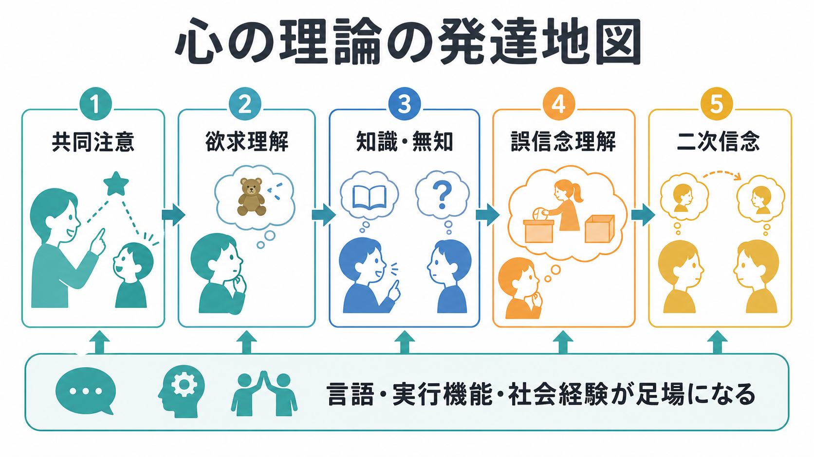
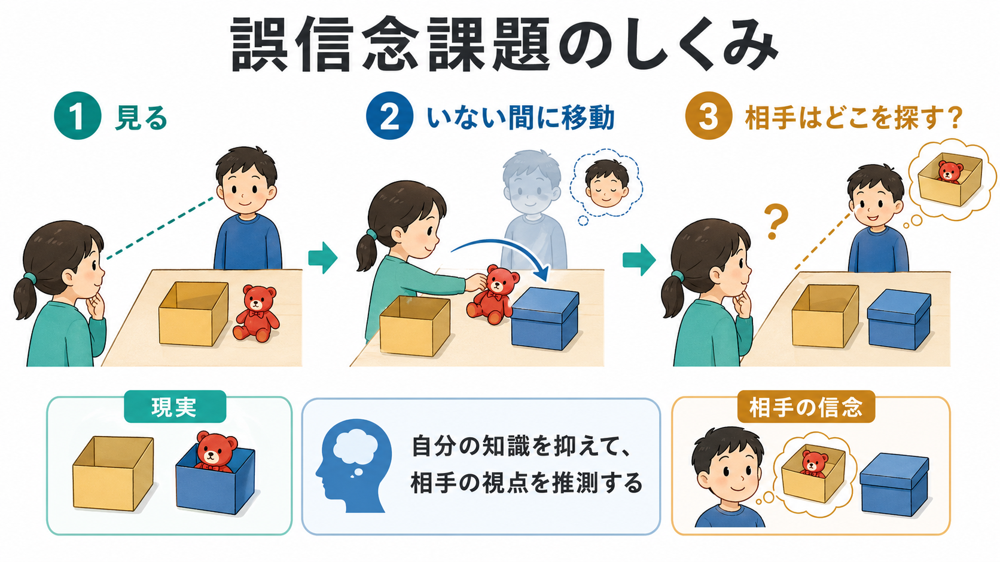

# 心の理論はどのように発達するのか

## 要点

- [[心の理論とは何か|心の理論]]は、他者が自分とは異なる欲求、知識、信念、意図をもつと理解し、その心的状態にもとづいて行動を予測する能力である。
- 発達は一気に完成するのではなく、共同注意、欲求理解、知識・無知の理解、誤信念理解、二次信念理解へと段階的に洗練される[1][2][3][4]。
- 誤信念課題は重要な指標だが、成績は言語能力、記憶、抑制、課題形式、文化的経験に左右される[2][5][6]。
- 乳児期の非言語課題では早期能力を示す結果もあるが、それをそのまま就学前児の明示的な説明能力と同一視する必要はない[7]。
- 臨床・教育では、心の理論の困難さを個人診断として単純化せず、[[社会的認知とは何か|社会的認知]]、[[実行機能とは何か|実行機能]]、言語、感覚特性、環境調整を分けて考える。

## この記事で答える問い

1. 心の理論は、子どもの発達の中でどのような順序で現れるのか。
2. 誤信念課題は、なぜ心の理論研究の中心的課題になったのか。
3. 言語、実行機能、社会経験は、心の理論の発達をどのように支えるのか。
4. 研究・臨床・教育で、心の理論を読むときに何を誤解しやすいのか。

## まず結論

心の理論の発達は、「相手にも心がある」と漠然と気づくことから、「相手は自分と違うものを欲しがる」「相手は自分と違う情報を知っている」「相手は現実と違う信念にもとづいて行動する」と理解する方向へ進む。代表的な誤信念課題では、子どもは実際の場所を知っていても、登場人物が古い場所を信じているなら、そこを探すはずだと答える必要がある[1]。

ただし、この発達は年齢だけで機械的に決まるものではない。課題の言語負荷、物語の理解、ワーキングメモリ、自分の知識を抑える力、家庭や文化での会話経験によって成績は変わる[2][5][6]。したがって、心の理論は単一の「読心能力」ではなく、社会的情報、言語、認知制御、経験が組み合わさって育つ能力として読むのがよい。

## 背景

心の理論研究で古典的な転換点になったのが、Wimmer と Perner の誤信念課題である。子どもは、登場人物が物をある場所に置き、その人物がいない間に物が別の場所へ移される場面を見る。そこで「その人物は戻ってきたらどこを探すか」と問われる。正しく答えるには、現実の場所ではなく、登場人物の古い信念を表象する必要がある[1]。

その後のメタ分析では、誤信念課題の通過は就学前期に大きく伸びるが、課題条件によって成績が変わることが示された[2]。さらに、Wellman と Liu は複数の心の理論課題を尺度化し、欲求、信念、知識、隠された感情などの理解が、ある程度一貫した発達順序をもつことを示した[3]。

## 基本概念

### 欲求理解

初期の子どもは、他者が自分と違うものを欲しがることを理解し始める。これは「自分はこれが好きだから相手も同じはず」という自己中心的な推測から少し離れる段階である。欲求理解は、後の信念理解よりも早く現れやすい[3]。

### 知識・無知の理解

他者が何を見たか、何を聞いたか、何を知らないかを区別する力も重要である。相手が箱の中身を見ていなければ、相手は中身を知らない。この理解は、[[注意とは何か|注意]]や記憶、会話の文脈理解と深く関係する。

### 誤信念理解

誤信念理解とは、他者が現実とは異なる信念をもち、その信念にもとづいて行動しうると理解することである。ここでは、自分が知っている現実をそのまま相手に投影しないことが必要になる[1][2]。

### 二次信念理解

一次信念は「A は X だと思っている」という理解である。二次信念は「A は、B が X だと思っていると思っている」という入れ子状の理解である。Perner と Wimmer の研究では、5歳から10歳の子どもを対象に、二次信念の理解が一次誤信念より遅れて発達することが検討された[4]。

## 仕組み

心の理論の発達には、少なくとも三つの足場がある。

第一に、言語である。心的状態語、補文構造、物語理解、会話のやり取りは、他者の信念を明示的に考えるための道具になる。Milligan らのメタ分析は、7歳未満の子どもを対象に、言語能力と誤信念理解の関連を整理している[5]。

第二に、実行機能である。誤信念課題では、自分が知っている現実を抑え、相手が利用できた情報に注意を切り替える必要がある。このため、抑制、ワーキングメモリ、認知的柔軟性は課題成績に影響しやすい。これは [[認知的柔軟性とは何か]] や [[ワーキングメモリとは何か]] とも接続する。

第三に、社会経験である。きょうだい、親子会話、物語、遊び、文化的な会話習慣は、他者の視点を説明し合う機会を増やす。中国語圏と英語圏の子どもを比較した研究では、発達順序には共通性がある一方で、どの課題が先に通過されやすいかには社会文化差も示された[6]。

## 図解

| 図 | 主題 | 読み方 |
|---|---|---|
| 図1 | 心の理論の発達地図 | 共同注意から二次信念までを、単線ではなく足場づけられた発達として読む。 |
| 図2 | 誤信念課題のしくみ | 現実の場所と相手の信念を分け、自分の知識を抑えて相手の視点を推測する過程を見る。 |

画像生成で採用しなかった第3案は、本文末尾の「図解案」にプロンプトとして残す。

## 臨床・研究との接続

研究では、心の理論は発達心理学、社会神経科学、自閉スペクトラム症研究、教育心理学、ロボット・AI研究で使われてきた。古典的には、自閉症児が誤信念課題で困難を示すかが検討され、社会的コミュニケーションの理解枠組みとして大きな影響をもった[8]。

ただし、ここで注意が必要である。心の理論課題の成績は、共感の有無や人間性を測るものではない。ASD の人が一律に「他者の心がわからない」と断定することも不適切である。臨床・教育では、言語理解、感覚過敏、注意、予測困難な環境、明示的説明の不足、疲労や不安などを分けて見る必要がある。本記事は教育・研究目的の整理であり、個別診断や治療方針を示すものではない。

乳児研究も重要である。Onishi と Baillargeon は、15か月児が非言語的な期待違反課題で他者の誤信念に敏感である可能性を示した[7]。一方で、この種の結果は、就学前児が言語で理由を説明できる能力と同じものなのか、より自動的・暗黙的な処理なのかをめぐって議論が続いている。したがって、乳児期の早期能力と、幼児期以降の明示的な心の理論を区別して読む必要がある。

## よくある誤解

### 「4歳で突然できるようになる」

誤信念課題の通過率は就学前期に大きく伸びるが、発達は突然のオン・オフではない。欲求、知識、信念、感情、二次信念など、複数の理解が時間をかけて組み合わさる[2][3]。

### 「誤信念課題に失敗したら心の理論がない」

そうは言えない。課題に失敗した理由は、心的状態の理解だけでなく、質問文の理解、記憶、抑制、注意、語彙、課題への慣れにもありうる[5]。

### 「心の理論は共感そのもの」

心の理論は、他者の信念や意図を推測する認知的側面を含む。共感は、他者の感情への反応や配慮を含むため、重なる部分はあるが同じではない。関連して [[共感は認知機能としてどう理解できるのか]] を参照できる。

### 「文化差は発達の遅れを意味する」

文化差は、どの会話経験が多いか、どの心的状態が強調されるか、課題がどの程度なじみやすいかを反映しうる。単純な優劣や遅れとして読まないほうがよい[6]。

## 関連ノート

- [[心の理論とは何か]]
- [[社会的認知とは何か]]
- [[実行機能とは何か]]
- [[認知的柔軟性とは何か]]
- [[ワーキングメモリとは何か]]
- [[自己意識はどのように発達するのか]]
- [[模倣学習はなぜ重要なのか]]
- [[言語理解はどのように行われるのか]]

## MOC更新候補

- `content/00_MOC/MOC｜認知科学・心理学.md`
- `content/00_MOC/MOC｜認知機能.md`
- 発達・愛着・社会心理カテゴリの統合更新時に、本記事を「社会的認知」「発達心理学」「心の理論」周辺へ追加する候補。

## 理解チェック

1. 誤信念課題で、子どもは「現実」と「相手の信念」のどちらを答える必要があるか。
2. 心の理論尺度で、欲求理解と誤信念理解はどちらが早く現れやすいか。
3. 言語能力が誤信念課題に影響する理由を二つ挙げられるか。
4. ASD と心の理論を結びつけて語るとき、なぜ「共感がない」と言ってはいけないのか。

## 図解案

第3図として使える日本語インフォグラフィック用プロンプト:

> 「研究・臨床への接続」というタイトルの横長16:9教育用インフォグラフィック。左列に「測る課題: 誤信念、視点取得、二次信念」、中央列に「支える要因: 言語、実行機能、社会経験」、右列に「注意点: 個人診断ではなく、発達理解と支援仮説として読む」。白背景、読みやすい日本語、シンプルなアイコン、医学的断定なし、ロゴなし、透かしなし。

## 未解決問題

- 乳児期の暗黙的な信念処理と、幼児期以降の明示的な説明能力は、同じ発達系列に属するのか。
- 言語、実行機能、社会経験のうち、どれが原因でどれが結果なのかを、縦断研究でどこまで分離できるか。
- 心の理論課題を、多様な文化・言語・神経発達特性に公平な形で設計するにはどうすればよいか。

## 参考文献

[1] Wimmer, H., & Perner, J. (1983). Beliefs about beliefs: Representation and constraining function of wrong beliefs in young children's understanding of deception. *Cognition, 13*(1), 103-128. https://doi.org/10.1016/0010-0277(83)90004-5

[2] Wellman, H. M., Cross, D., & Watson, J. (2001). Meta-analysis of theory-of-mind development: The truth about false belief. *Child Development, 72*(3), 655-684. https://doi.org/10.1111/1467-8624.00304

[3] Wellman, H. M., & Liu, D. (2004). Scaling of theory-of-mind tasks. *Child Development, 75*(2), 523-541. https://doi.org/10.1111/j.1467-8624.2004.00691.x

[4] Perner, J., & Wimmer, H. (1985). “John thinks that Mary thinks that...” attribution of second-order beliefs by 5- to 10-year-old children. *Journal of Experimental Child Psychology, 39*(3), 437-471. https://doi.org/10.1016/0022-0965(85)90051-7

[5] Milligan, K., Astington, J. W., & Dack, L. A. (2007). Language and theory of mind: Meta-analysis of the relation between language ability and false-belief understanding. *Child Development, 78*(2), 622-646. https://doi.org/10.1111/j.1467-8624.2007.01018.x

[6] Wellman, H. M., Fang, F., Liu, D., Zhu, L., & Liu, G. (2006). Scaling of theory-of-mind understandings in Chinese children. *Psychological Science, 17*(12), 1075-1081. https://doi.org/10.1111/j.1467-9280.2006.01830.x

[7] Onishi, K. H., & Baillargeon, R. (2005). Do 15-month-old infants understand false beliefs? *Science, 308*(5719), 255-258. https://doi.org/10.1126/science.1107621

[8] Baron-Cohen, S., Leslie, A. M., & Frith, U. (1985). Does the autistic child have a “theory of mind”? *Cognition, 21*(1), 37-46. https://doi.org/10.1016/0010-0277(85)90022-8
