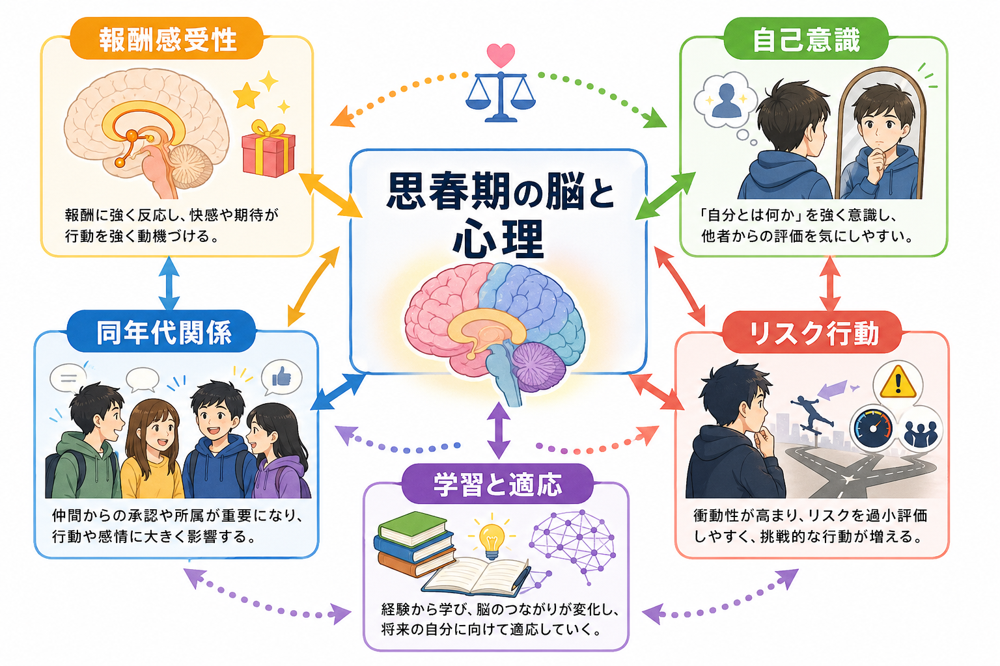
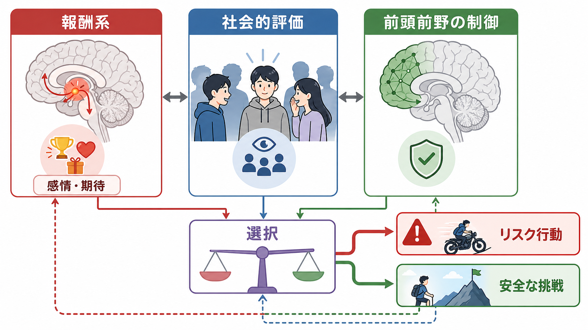
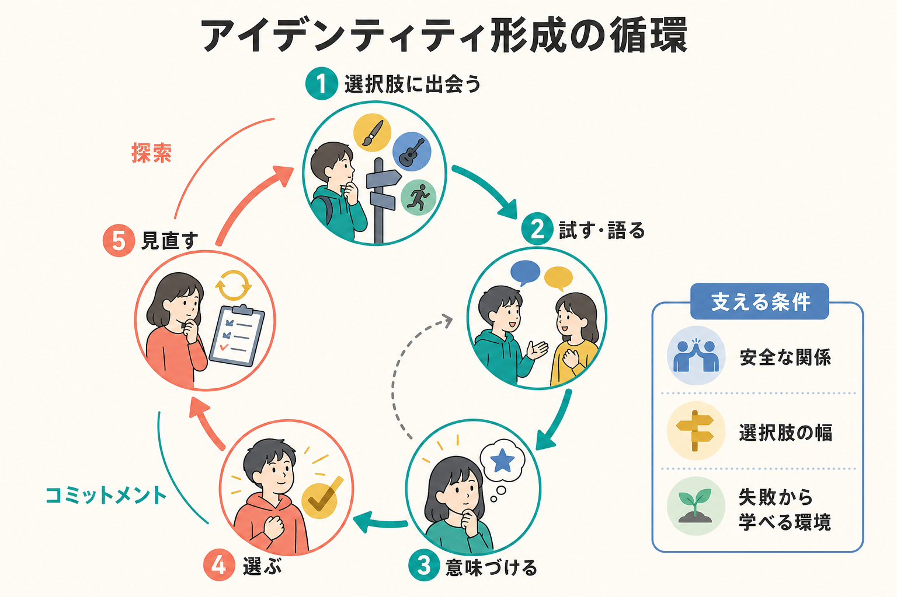

# 思春期の脳と心理はどう変化するのか

## 要点

- 思春期は「脳が未完成だから危ない時期」ではなく、報酬、社会的評価、自己理解、認知制御が大きく再編成される発達期である。
- 報酬や新奇性に対する反応が強まり、同年代からの承認や排除が行動選択に影響しやすくなる[1][4]。
- 前頭前野を含む制御系は発達を続けるが、思春期のリスク行動は単純な制御不足だけでは説明できない。社会的文脈、感情、学習機会が重要である[3][4]。
- 自己意識の高まりは、不安や恥ずかしさを増やすだけでなく、価値観、目標、所属、将来像を作り直す機会でもある[5]。
- 教育・臨床・家庭支援では、リスクをゼロにする発想だけでなく、安全な挑戦、睡眠、ストレス調整、信頼できる関係、選択肢の幅を整える視点が必要になる[1]。

## この記事で答える問い

1. 思春期の脳では、どのような構造的・機能的変化が起きるのか。
2. なぜ報酬、同年代関係、自己意識が強く感じられるようになるのか。
3. 思春期のリスク行動は「未熟さ」だけで説明できるのか。
4. 研究・教育・臨床では、思春期の変化をどのように扱うとよいのか。

## まず結論

思春期の変化は、[[発達とは何か|発達]]の中でも、身体成熟、社会的役割、脳回路、自己理解が同時に動く時期として理解すると見通しがよい。脳の大きさそのものは早い時期にかなり成人に近づくが、前頭前野、白質結合、社会的情報処理、報酬処理は思春期から若年成人期にかけて変化し続ける[1][2]。

この時期に目立つのは、単なる「ブレーキ不足」ではない。報酬系が、楽しさ、承認、新しい経験、達成可能性に強く反応しやすくなる。一方で、[[実行機能とは何か|実行機能]]や[[抑制制御とは何か|抑制制御]]も発達途上にあり、感情的・社会的に熱い場面では選択が揺れやすい[3][4]。そのため、思春期のリスク行動は、本人の知識不足だけでなく、誰といるか、何が評価されるか、失敗しても戻れるか、睡眠やストレスが保たれているかによって大きく変わる。

## 背景

思春期は、第二次性徴だけを指す言葉ではない。生物学的には思春期発来に伴うホルモン変化があり、心理学的には自立、所属、親密さ、将来の選択、価値観の形成が進む。社会的には、家族中心の関係から、友人、学校、SNS、部活動、地域、進路選択などへ生活圏が広がる。

発達神経科学では、思春期の脳を「子どもの脳から大人の脳へ直線的に近づく過程」とは見ない。皮質の灰白質量や皮質厚は領域ごとに異なる発達軌道を示し、白質結合は長く発達を続ける。感覚・運動系が比較的早く成熟する一方、前頭前野や高次連合野は遅くまで変化する[2]。ただし、この事実だけで「前頭前野が未熟だから思春期は危険」と言い切るのは単純化である。

Crone と Dahl は、思春期を社会的・情動的関与と目標の柔軟性が高まる時期として捉え直している[4]。この視点では、感情が強いことや仲間の影響を受けやすいことは、危険因子であると同時に、新しい関係、学習、挑戦、価値観の更新を可能にする仕組みでもある。

## 基本概念

### 報酬感受性

報酬感受性とは、快、達成、承認、新奇性、期待される利益に対してどれくらい強く反応するかを指す。思春期には、腹側線条体など報酬関連回路の反応が高まりやすく、報酬、社会的フィードバック、感情的刺激が行動選択に強く影響するという知見がある[4][8]。これは、[[報酬系の異常はうつ病をどう説明するのか|報酬系]]を「快楽だけの回路」と見るより、学習、動機づけ、期待、選択を支える回路として見ると理解しやすい。

### 自己意識

思春期には「自分はどう見られているか」「自分は何者か」「どの集団に属するのか」という問いが強くなる。これは単に自意識過剰になるというより、自己概念が再編成される過程である。社会脳の研究では、内側前頭前野、側頭頭頂接合部、上側頭溝など、他者の視点や意図を読むネットワークが思春期にも発達し続けることが示されている[5]。この変化は、[[心の理論はどのように発達するのか|心の理論]]や[[社会的認知とは何か|社会的認知]]ともつながる。

### 同年代関係

同年代関係は、思春期の行動を大きく変える。Gardner と Steinberg の実験では、青年は単独よりも同年代の仲間がいる条件でリスクを取りやすく、リスク判断も利益側に傾きやすかった[7]。Chein らの研究では、仲間の存在が青年のリスク行動を増やし、報酬回路の活動とも関連することが示された[6]。

ただし、同年代関係は悪い影響だけを持つわけではない。仲間は、所属感、共感、協力、役割取得、社会的学習を支える。安全な集団や信頼できる関係では、挑戦や失敗からの回復を支える保護因子にもなる。

### リスク行動

思春期のリスク行動には、危険運転、物質使用、無謀な挑戦、対人トラブルなどが含まれる。一方で、リスクを取ること自体は発達上すべて悪いわけではない。新しい友人に話しかける、部活動に参加する、進路を選ぶ、失敗するかもしれない課題に挑むことも、広い意味ではリスクを伴う。重要なのは、[[リスク下の意思決定はどのように行われるのか|リスク下の意思決定]]を、危険回避だけでなく「安全な挑戦をどう設計するか」として考えることである。

## 仕組み

### 1. 報酬系と制御系の時間差

古典的な説明では、思春期には報酬系や情動系の反応が相対的に強く、前頭前野を中心とする制御系の成熟がゆっくり進むため、リスクを取りやすいとされてきた[3]。この説明は、直感的で教育的にも使いやすい。

しかし近年のレビューは、この説明だけでは不十分だと指摘する。前頭前野の発達は単純に「弱い制御が強くなる」過程ではなく、課題、文脈、感情、社会的評価によって活動の見え方が変わる[4]。つまり、思春期の選択は冷静な場面では十分に合理的でも、仲間が見ている、強い報酬がある、評価される、すぐ反応しなければならない、といった状況で揺れやすくなる。

### 2. 社会的評価が報酬になる

思春期には、同年代からの承認、拒絶、比較、評判が強い意味を持つ。社会的評価は、単なる外部情報ではなく、報酬や脅威として経験される。仲間の前で成功することは大きな報酬になり、仲間から外れることは強いストレスになりうる。

このため、同じ行動でも、単独なら避けるが仲間の前では試す、家族の前では言えないが友人の前では言う、SNS上の評価で気分が大きく動く、といったことが起きる。これは[[情動と認知は分けられるのか|情動と認知]]の相互作用として理解できる。

### 3. 自己意識とアイデンティティ形成

自己意識の高まりは、しばしば「恥ずかしさ」「人目が気になる」「過剰に比較する」として現れる。しかし、その背後には、自己像を作り直す発達課題がある。自分は何が得意か、何を大切にしたいか、どの集団にいたいか、どんな将来を選ぶかを、他者との関係の中で試している。

この時期の自己意識は、[[メタ認知とは何か|メタ認知]]や[[心の理論はどのように発達するのか|心の理論]]とも関係する。自分の考えを考える力、他者が自分をどう見るかを想像する力、過去の自分と未来の自分をつなぐ力が伸びる一方で、社会的評価への敏感さも増す。

### 4. 睡眠・ストレス・環境の影響

NIMH は、思春期の脳は学習と適応の可能性を持つ一方、ストレスや睡眠不足の影響も受けやすいと説明している[1]。睡眠不足は注意、衝動制御、気分、学業に影響しやすい。ストレスが強い環境では、同じ発達的変化が不安、抑うつ、対人困難、物質使用などのリスクと結びつきやすくなる。

ここで重要なのは、個人の「意志の弱さ」に問題を還元しないことである。家庭、学校、地域、SNS環境、経済条件、差別、文化的期待、支援者との関係は、思春期の選択肢と回復可能性を変える。

## 図解

下の図は、思春期を「困りごと」だけでなく、変化、環境、支援の相互作用として見るための整理である。脳と心理の変化は、個人内の現象であると同時に、環境の中で意味を持つ。

## 臨床・研究との接続

思春期は、多くの精神疾患の初発が見られやすい時期でもある[1]。ただし、思春期らしい変化と疾患を短絡的に同一視してはいけない。気分の揺れ、対人敏感性、挑戦、衝動性は発達の一部でもあり、臨床的に問題になるかどうかは、苦痛の強さ、持続期間、機能障害、危険性、環境要因、支援資源を合わせて見る必要がある。

研究では、横断研究だけでなく、同じ個人を追跡する縦断研究が重要になる。思春期の脳活動は、年齢、思春期段階、性差、文化、社会経済的条件、課題の種類、仲間の有無によって変わる。したがって「思春期の脳はこうである」と一枚岩にまとめるより、どの条件で、どの行動が、どの回路と関連するのかを丁寧に問う必要がある。

教育や支援では、知識を伝えるだけでは不十分な場合がある。リスクの危険性を理解していても、仲間の前、強い感情の中、睡眠不足のとき、即時報酬が目立つ場面では行動が変わるからである。実践的には、事前のルール、選択肢の準備、信頼できる大人、相談先、失敗しても戻れる構造、安全に挑戦できる機会を作ることが重要になる。

## よくある誤解

### 誤解1: 思春期の若者は合理的に考えられない

思春期の若者も、落ち着いた条件では多くの場面で合理的に判断できる。問題は、社会的評価、強い感情、即時報酬、仲間の存在が加わると、選択の重みづけが変わることである[6][7]。

### 誤解2: リスク行動は知識不足で起きる

知識は必要だが十分ではない。リスクを知っていても、目の前の承認や興奮が大きく感じられることがある。予防では、情報提供だけでなく、環境設計と関係性の設計が必要になる[3]。

### 誤解3: 仲間の影響は悪い

仲間はリスク行動を増やすことがあるが、同時に学習、支援、所属感、向社会的行動も促す。どのような仲間関係か、何が評価される集団か、失敗したときにどう扱われるかが重要である。

### 誤解4: 脳が成熟すれば問題は自然に消える

年齢とともに変わる部分はあるが、環境、経験、支援、睡眠、ストレス、文化的文脈も発達を形作る。成熟を待つだけでなく、安全な経験を積める条件を整える必要がある。

## 関連ノート

- [[発達とは何か]]
- [[発達段階理論とは何か]]
- [[心の理論はどのように発達するのか]]
- [[社会的認知とは何か]]
- [[実行機能とは何か]]
- [[抑制制御とは何か]]
- [[リスク下の意思決定はどのように行われるのか]]
- [[情動と認知は分けられるのか]]
- [[愛着とは何か]]
- [[安全基地とは何か]]

### 関連ノート候補

- 思春期と睡眠
- 同年代関係と社会的報酬
- 青年期のアイデンティティ形成
- 思春期のメンタルヘルスと予防

### MOC更新候補

- `content/00_MOC/MOC｜認知科学・心理学.md`
- `content/00_MOC/MOC｜脳・神経科学.md`
- `content/00_MOC/MOC｜精神医学.md`

## 理解チェック

1. 思春期のリスク行動を「前頭前野が未熟だから」とだけ説明すると、何を見落とすか。
2. 仲間の存在は、どのような条件でリスクになり、どのような条件で保護因子になるか。
3. 自己意識の高まりは、不安や恥ずかしさ以外にどのような発達的意味を持つか。
4. 教育・支援で、知識提供に加えて環境設計が必要になる理由は何か。

## 参考文献

[1] National Institute of Mental Health. (2023). *The Teen Brain: 7 Things to Know*. https://www.nimh.nih.gov/health/publications/the-teen-brain-7-things-to-know

[2] Casey, B. J., Jones, R. M., & Hare, T. A. (2008). The adolescent brain. *Annals of the New York Academy of Sciences, 1124*, 111-126. https://pmc.ncbi.nlm.nih.gov/articles/PMC2475802/

[3] Steinberg, L. (2008). A social neuroscience perspective on adolescent risk-taking. *Developmental Review, 28*(1), 78-106. https://doi.org/10.1016/j.dr.2007.08.002

[4] Crone, E. A., & Dahl, R. E. (2012). Understanding adolescence as a period of social-affective engagement and goal flexibility. *Nature Reviews Neuroscience, 13*, 636-650. https://doi.org/10.1038/nrn3313

[5] Blakemore, S.-J., & Mills, K. L. (2014). Is adolescence a sensitive period for sociocultural processing? *Annual Review of Psychology, 65*, 187-207. https://doi.org/10.1146/annurev-psych-010213-115202

[6] Chein, J., Albert, D., O'Brien, L., Uckert, K., & Steinberg, L. (2011). Peers increase adolescent risk taking by enhancing activity in the brain's reward circuitry. *Developmental Science, 14*(2), F1-F10. https://pubmed.ncbi.nlm.nih.gov/21499511/

[7] Gardner, M., & Steinberg, L. (2005). Peer influence on risk taking, risk preference, and risky decision making in adolescence and adulthood: An experimental study. *Developmental Psychology, 41*(4), 625-635. https://doi.org/10.1037/0012-1649.41.4.625

[8] Somerville, L. H., Jones, R. M., & Casey, B. J. (2010). A time of change: Behavioral and neural correlates of adolescent sensitivity to appetitive and aversive environmental cues. *Brain and Cognition, 72*(1), 124-133. https://pubmed.ncbi.nlm.nih.gov/19695759/

## 未解決問題

- 報酬感受性、自己意識、同年代影響のどれが、どの条件で保護因子またはリスク因子になるのか。
- SNS上の評価や常時接続環境は、従来の同年代影響研究とどの程度同じ仕組みで説明できるのか。
- 思春期段階、性差、文化差、社会経済的条件を含めた縦断研究を、教育・臨床支援へどう接続するか。
