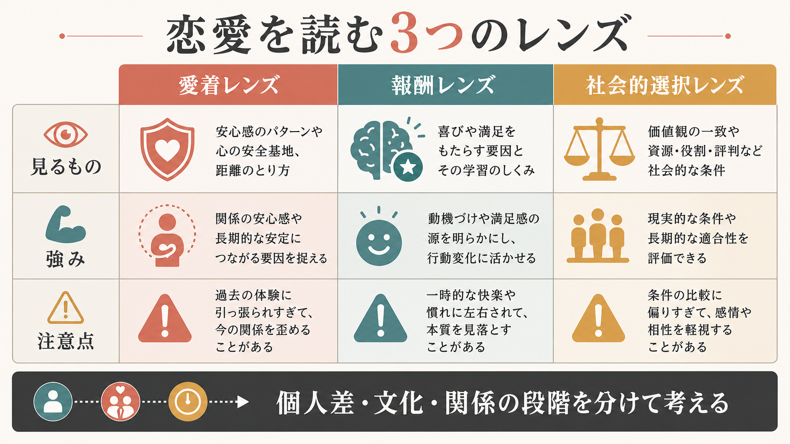
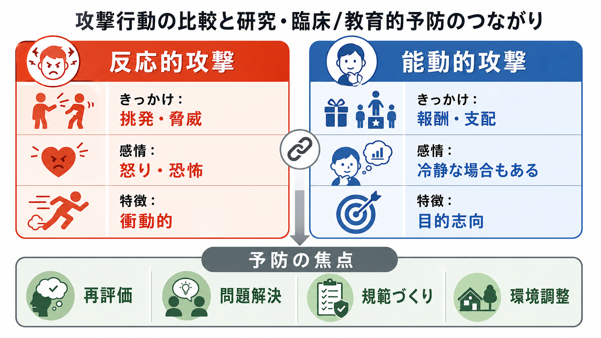

# 恋愛は心理学でどう説明されるのか

## 要点

- 恋愛は「好き」という単一の感情ではなく、親密さ、情熱、コミットメント、愛着、報酬、情動調整、社会的判断が重なった複合過程である。
- 初期の強い恋愛感情では、相手に注意が集中し、報酬予測や接近動機づけが高まりやすい。fMRI 研究では、初期恋愛で VTA や尾状核など報酬・動機づけ系の活動が報告されている[4]。
- 恋愛関係が続くと、単なる高揚だけでなく、相手を「安心できる避難所」「探索を支える安全基地」として使う愛着過程が重要になる[2][3]。
- 関係が維持されるかどうかは、感情の強さだけでなく、満足度、代替選択肢、投資、相互性、文化的規範といった社会的選択にも左右される[8]。

## この記事で答える問い

1. 恋愛感情は、心理学ではどのような構成要素に分けられるのか。
2. なぜ恋愛では、相手のことを繰り返し考えたり、会いたくなったりするのか。
3. 恋愛と[[愛着とは何か|愛着]]はどのように関係するのか。
4. 恋愛は脳内の報酬系だけで説明できるのか。
5. 関係が続く・壊れる・変化することを、社会心理学はどう説明するのか。

## まず結論

恋愛は、少なくとも4つの層を分けて考えると理解しやすい。

第1に、恋愛は「親密さ・情熱・コミットメント」の組み合わせとして記述できる。Sternberg の三角理論では、親密さは近さや結びつき、情熱は性的・身体的な引きつけや高揚、コミットメントは相手を愛すると決め、関係を維持しようとする成分として整理される[1]。この枠組みは、恋愛を「胸が高鳴るかどうか」だけで判断しないための地図になる。

第2に、恋愛は[[報酬系とは何か|報酬系]]と動機づけの問題でもある。恋愛初期には、相手の顔、声、メッセージ、記憶が強い報酬予測を帯びる。Aron らの研究では、強い初期恋愛の参加者が恋人の写真を見ると、VTA や尾状核などの報酬・動機づけ系が活動しやすいことが示された[4]。これは恋愛を「快楽」だけでなく、「相手に向かって行動を組織する動機づけ」として見る根拠になる。

第3に、恋愛は成人の愛着過程でもある。Hazan と Shaver は、恋愛を乳幼児期の愛着と連続する「成人同士の情緒的絆」として捉えた[2]。関係が安定すると、相手は不安なときに近づきたい存在であり、安心したあとに外界を探索する基盤にもなる。これは[[安全基地とは何か|安全基地]]や[[内的作業モデルとは何か|内的作業モデル]]の議論とつながる。

第4に、恋愛は社会的選択である。人は相手の魅力だけでなく、関係から得られる満足、すでに投じた時間や共有資源、他の選択肢、周囲の承認、将来像を含めて関係を評価する。投資モデルでは、コミットメントは満足度、代替選択肢の質、投資量によって説明される[8]。つまり、恋愛は「自然に湧く感情」であると同時に、「関係を続けるかどうかを調整する社会的判断」でもある。

## 背景

日常語では、恋愛はしばしば「ときめき」「好き」「運命」「依存」「相性」といった言葉で語られる。しかし心理学では、恋愛をひとつの実体としてではなく、複数の過程の重なりとして扱う。ここで重要なのは、どの理論も恋愛のすべてを単独で説明するわけではないという点である。

たとえば、報酬系の説明は「なぜ相手に注意が向き、会いたくなるのか」を説明しやすい。一方で、「なぜ安心できる相手になるのか」「なぜ不安や嫉妬が強まるのか」は、[[愛着スタイルにはどのような種類があるのか|愛着スタイル]]や情動調整の視点が必要になる。さらに、「なぜ関係を続けるのか」「なぜ別れにくいのか」は、満足度、投資、代替選択肢などを扱う[[社会心理学とは何か|社会心理学]]の視点が必要になる。

このため本記事では、恋愛を「愛着・報酬・情動・社会的選択」という4層モデルで読む。これは恋愛を冷たい計算に還元するためではなく、恋愛の苦しさ、魅力、持続、変化を混同せずに考えるための枠組みである。

## 基本概念

### 恋愛感情

恋愛感情とは、特定の相手に対する親密さ、欲求、注意集中、身体的高揚、将来志向、独占性、保護したい気持ち、承認されたい気持ちなどがまとまって経験される状態である。情動研究の観点では、恋愛は単純な快・不快ではなく、評価、身体反応、行動傾向、表情、記憶、期待が結びついた複合的な情動過程として扱われる[6]。

### 親密さ・情熱・コミットメント

Sternberg の三角理論では、愛は親密さ、情熱、コミットメントの3要素で説明される[1]。

| 成分 | 何を指すか | 恋愛での例 |
|---|---|---|
| 親密さ | 近さ、理解されている感覚、信頼 | 弱さを話せる、相手の日常を知りたい |
| 情熱 | 身体的・性的な引きつけ、強い高揚 | 会いたい、触れたい、相手を強く意識する |
| コミットメント | 関係を続ける意思、将来志向 | 一緒に問題を解く、関係を守る選択をする |

この3要素は同時に強くなるとは限らない。短期的には情熱が強くても、親密さやコミットメントが十分でないことがある。反対に、長期関係では情熱の形が変わり、親密さやコミットメントが関係満足を支えることがある[1][5]。

### 愛着

愛着とは、不安や苦痛が高まったときに特定の相手に近づき、安心を回復しようとする情緒的な結びつきである。成人の恋愛では、恋人や配偶者が「困ったときに戻る相手」「安心したら外界に向かえる基盤」になることがある[2][3]。この点で、恋愛は単なる魅力や性的欲求ではなく、[[内的作業モデルとは何か|内的作業モデル]]を更新しうる関係経験でもある。

### 報酬と動機づけ

報酬とは、快をもたらす対象そのものではなく、行動を方向づける価値の信号である。恋愛では、相手の反応が「予測できる報酬」になる。返信が来る、目が合う、名前を呼ばれる、会う約束ができる、といった手がかりが、接近行動を強める。これは[[報酬予測誤差とは何か|報酬予測誤差]]や学習の観点とも関係する。

### 社会的選択

恋愛関係は二者だけで完結しない。友人、家族、職場、SNS、文化的規範、経済的制約、将来の生活設計が関係の評価に入る。投資モデルでは、関係へのコミットメントは、関係満足、代替選択肢の魅力度、投資量によって左右される[8]。恋愛は情動であると同時に、選択肢を評価し、関係を維持・変更する社会的意思決定でもある。

## 仕組み

### 1. 相手の手がかりが報酬価を帯びる

恋愛初期には、相手に関する刺激が強い意味をもつ。写真、声、匂い、会話の記憶、既読表示、予定表の空白までが、期待と不確実性を伴った手がかりになる。報酬系の観点では、これは「相手そのものが報酬になる」というより、相手に近づく行動が学習され、注意と行動が相手に向かって組織されるということである[4]。

この過程は快だけではない。返信が遅い、会えるか不確か、相手の気持ちが読めないといった状況では、[[情動と認知は分けられるのか|情動と認知]]が絡み合い、不安、期待、反すうが強まる。恋愛がしばしば「嬉しいのに苦しい」形をとるのは、報酬予測と不確実性が同時に働くためである。

### 2. 注意集中と理想化が起こる

恋愛では、相手の良い側面が目立ち、欠点が相対的に見えにくくなることがある。これは単なる錯覚ではなく、関係形成を促す注意の偏りとして働くことがある。一方で、理想化が強すぎると、相手の実際の境界、価値観、拒否のサインを見落としやすい。

心理学的には、ここで「相手をどう評価しているか」と「自分が何を求めているか」を分けることが重要である。恋愛対象は実在の人物であると同時に、自分の欲求、記憶、予測、[[自己概念とは何か|自己概念]]が投影される対象にもなる。

### 3. 愛着システムが作動する

恋愛が深まると、相手は報酬対象であるだけでなく、情動調整の相手になる。つらいときに声を聞きたい、安心したあとに仕事や学習へ戻れる、距離があると不安が高まる、といった反応は、愛着システムの働きとして理解できる[2][3]。

ただし、愛着スタイルによって恋愛の経験は異なりやすい。安定した愛着傾向では、親密さと自律性が両立しやすい。回避傾向が強い場合は、近づきたい気持ちがあっても距離を保つことで情動を調整しやすい。不安傾向が強い場合は、相手の反応を繰り返し確認し、拒絶の可能性に敏感になりやすい[3]。これは診断名ではなく、関係の中で現れる調整方略として読む必要がある。

### 4. 長期関係では報酬と愛着が再編成される

恋愛の高揚は時間とともに弱まることがあるが、それは愛が必ず消えるという意味ではない。長期の強い恋愛を対象にした fMRI 研究では、平均20年以上結婚している参加者でも、パートナーの顔に対して報酬系や愛着関連領域の活動が報告された[5]。初期恋愛の激しさと、長期関係の安定した結びつきは、完全に別物ではなく、報酬・親密さ・愛着の比重が変化したものとして考えられる。

長期関係で重要になるのは、単に「慣れる」ことではない。新しい経験を共有する、互いの成長を支える、相手を通じて自分の可能性が広がる、といった自己拡張の経験も関係満足に関わる[7]。これは、恋愛を「相手を所有すること」ではなく、「相手との関係を通じて世界への関わり方が広がること」として見る視点である。

### 5. 関係の維持は投資と選択の問題でもある

人が関係を続ける理由は、愛情の強さだけではない。投資モデルでは、コミットメントは満足度、代替選択肢の質、投資量から説明される[8]。たとえば、関係に満足しているほど、他の選択肢が魅力的でないほど、共有した時間・友人関係・生活・将来計画への投資が大きいほど、関係を続ける力は強まりやすい。

ここで注意すべきなのは、コミットメントが常に良いとは限らないことである。相互尊重があり、問題解決が可能な関係では、コミットメントは関係を支える。一方で、暴力、支配、深刻な搾取がある関係では、投資量や孤立が「離れにくさ」として働くことがある。心理学的説明は、関係を正当化するためではなく、どの要因が人を結びつけ、どの要因が苦しさを固定しているのかを分けるために使う必要がある。

## 図解

| 説明レンズ | 見ているもの | 強み | 注意点 |
|---|---|---|---|
| 愛着レンズ | 不安時の接近、安心、距離の取り方 | 恋愛の不安、嫉妬、安心感を説明しやすい | 個人を固定的な「タイプ」にしない |
| 報酬レンズ | 注意集中、接近動機づけ、予測と期待 | 初期恋愛の高揚や反すうを説明しやすい | 恋愛を快楽や神経伝達物質だけに還元しない |
| 情動レンズ | 身体反応、評価、記憶、行動傾向 | 「嬉しいのに苦しい」を扱える | 感情だけで関係の安全性を判断しない |
| 社会的選択レンズ | 満足度、代替選択肢、投資、規範 | 関係維持や別れにくさを説明しやすい | 計算だけで恋愛を説明しすぎない |

## 臨床・研究との接続

恋愛の心理学は、臨床場面では個別の診断や治療指示ではなく、関係経験を整理する補助線として役立つ。たとえば、恋愛の苦しさが強いとき、「相手が好きすぎる」だけでなく、報酬予測の不確実性、愛着不安、過去の内的作業モデル、関係内の力の不均衡を分けて見ることができる。

研究面では、恋愛は心理尺度、縦断研究、実験、fMRI、文化比較研究を組み合わせて扱われる。尺度研究は主観的な親密さや情熱を測る。神経科学研究は報酬・動機づけ系の関与を示す。関係科学は、満足度、コミットメント、投資、自己拡張、別れや継続を縦断的に調べる[4][5][7][8]。

臨床的に重要なのは、恋愛の強さと関係の安全性を混同しないことである。強い高揚、不安、独占欲、相手への没頭は、恋愛として経験されることがあるが、それだけで関係が健康であるとは言えない。逆に、高揚が穏やかでも、尊重、安心、修復可能性、相互性がある関係は長期的な安定を支えうる。

## よくある誤解

### 誤解1: 恋愛は脳内物質だけで説明できる

報酬系やドパミンは恋愛理解に重要だが、それだけで恋愛は説明できない。恋愛には愛着、自己概念、文化、言語、約束、生活設計が関わる。神経科学は「脳のどこが光ったか」ではなく、どのような心理過程が行動を方向づけているかを考えるために使う。

### 誤解2: 情熱が弱まったら愛は終わりである

情熱は変動しやすいが、親密さやコミットメントは別の時間軸で変化する[1]。長期恋愛では、初期の強烈な接近動機づけが、安心、協働、共有された記憶、自己拡張へと再編成されることがある[5][7]。

### 誤解3: 愛着スタイルで恋愛の運命が決まる

愛着スタイルは固定的な性格診断ではない。成人の愛着研究では、不安や回避は関係経験、状況、相手、支援、心理療法、生活史によって変化しうるものとして扱われる[3]。重要なのは「自分はこのタイプだから無理」と決めることではなく、どの状況でどの調整方略が出るのかを観察することである。

### 誤解4: 好きなら関係は自然にうまくいく

恋愛感情は関係の出発点になりうるが、関係維持には葛藤調整、境界設定、生活上の協働、相互尊重、コミットメントが必要である。投資モデルが示すように、関係の継続は満足度や投資量だけでなく、代替選択肢や社会的環境にも影響される[8]。

## 関連ノート

- [[愛着とは何か]]
- [[愛着スタイルにはどのような種類があるのか]]
- [[内的作業モデルとは何か]]
- [[安全基地とは何か]]
- [[社会心理学とは何か]]
- [[報酬系とは何か]]
- [[報酬予測誤差とは何か]]
- [[情動と認知は分けられるのか]]
- [[意思決定とは何か]]
- [[自己概念とは何か]]

MOC更新候補: `content/00_MOC/MOC｜認知科学・心理学.md` に、本記事 `[[恋愛は心理学でどう説明されるのか]]` を「発達・愛着・社会心理」または「社会心理学」周辺へ追加する。並列ジョブとの競合を避けるため、本タスクでは MOC 本体は更新しない。

## 理解チェック

1. 恋愛を「情熱」だけで説明すると、どの要素が見落とされるか。
2. 恋愛初期に相手のことを繰り返し考えやすい理由を、報酬予測の観点から説明できるか。
3. 愛着の視点から見ると、恋人や配偶者はどのような役割をもつか。
4. 投資モデルでは、コミットメントを左右する要因は何か。
5. 「恋愛感情が強いこと」と「関係が安全であること」を分けて考える必要があるのはなぜか。

## 未解決問題

- 恋愛の神経科学研究は、文化、性別、性的指向、関係形式の多様性をどこまで反映できているか。
- 長期関係で情熱が維持される条件は、個人差、共有活動、生活環境、ストレスによってどのように変わるか。
- SNSやマッチングアプリは、報酬予測、代替選択肢の知覚、コミットメントをどのように変えるか。
- 愛着不安や回避が強い人にとって、どのような関係経験が内的作業モデルの更新につながるか。

## 参考文献

[1] Sternberg, R. J. (1986). A triangular theory of love. *Psychological Review, 93*(2), 119-135. https://doi.org/10.1037/0033-295X.93.2.119

[2] Hazan, C., & Shaver, P. R. (1987). Romantic love conceptualized as an attachment process. *Journal of Personality and Social Psychology, 52*(3), 511-524. https://doi.org/10.1037/0022-3514.52.3.511

[3] Mikulincer, M., & Shaver, P. R. (2016). *Attachment in Adulthood: Structure, Dynamics, and Change* (2nd ed.). Guilford Press. https://www.guilford.com/books/Attachment-in-Adulthood/Mikulincer-Shaver/9781462533817

[4] Aron, A., Fisher, H., Mashek, D. J., Strong, G., Li, H., & Brown, L. L. (2005). Reward, motivation, and emotion systems associated with early-stage intense romantic love. *Journal of Neurophysiology, 94*(1), 327-337. https://doi.org/10.1152/jn.00838.2004

[5] Acevedo, B. P., Aron, A., Fisher, H. E., & Brown, L. L. (2012). Neural correlates of long-term intense romantic love. *Social Cognitive and Affective Neuroscience, 7*(2), 145-159. https://doi.org/10.1093/scan/nsq092

[6] Hatfield, E., Bensman, L., & Rapson, R. L. (2012). A brief history of social scientists' attempts to measure passionate love. *Journal of Social and Personal Relationships, 29*(2), 143-164. https://doi.org/10.1177/0265407511431055

[7] Aron, A., Lewandowski, G., Branand, B., Mashek, D., & Aron, E. (2022). Self-expansion motivation and inclusion of others in self: An updated review. *Journal of Social and Personal Relationships, 39*(12), 3821-3852. https://doi.org/10.1177/02654075221110630

[8] Rusbult, C. E., Martz, J. M., & Agnew, C. R. (1998). The Investment Model Scale: Measuring commitment level, satisfaction level, quality of alternatives, and investment size. *Personal Relationships, 5*(4), 357-391. https://doi.org/10.1111/j.1475-6811.1998.tb00177.x
