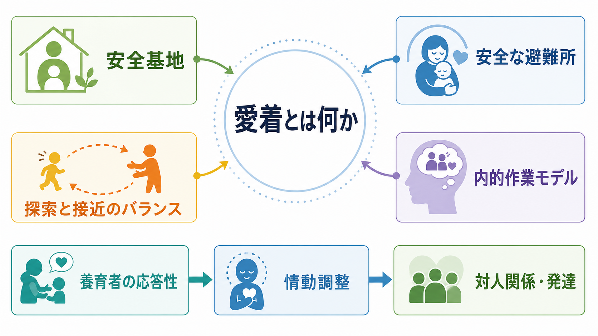
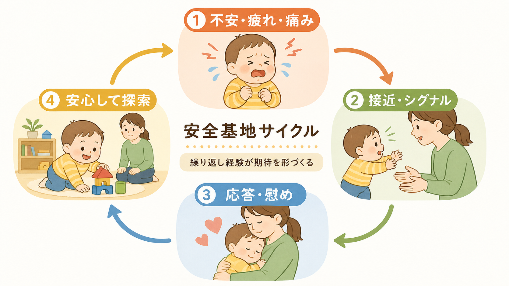
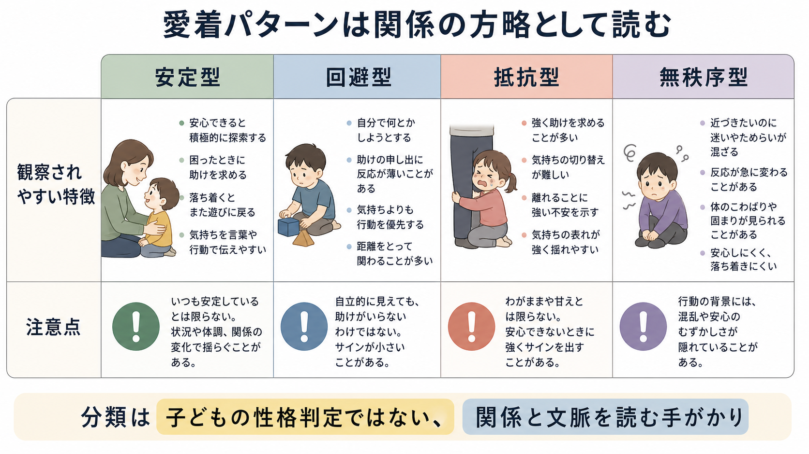

# 愛着とは何か

## 要点

- 愛着とは、乳幼児が不安、疲労、痛み、分離などを感じたとき、特定の養育者へ接近し、安全を回復しようとする情緒的結びつきである。
- 愛着は「甘え」や「依存」の同義語ではない。安心できる相手がいるからこそ、子どもは探索し、遊び、他者と関わる範囲を広げられる[1][2]。
- 安定型、回避型、抵抗型、無秩序型は、子どもの人格ラベルではなく、特定の関係と観察場面に現れる方略として読む必要がある[2][3]。
- 早期愛着は、その後の社会的適応や外在化問題と関連するが、単独で発達を決定するものではない。気質、家族環境、貧困、逆境、文化、支援資源が重なって発達経路を形づくる[5][6][7]。

## この記事で答える問い

1. 愛着とは、どのような行動システムなのか。
2. 安全基地、内的作業モデル、愛着パターンとは何を指すのか。
3. 乳幼児期の愛着は、情動調整、探索、対人関係にどう関わるのか。
4. 研究・臨床・支援場面では、愛着概念をどこまで使えるのか。

## まず結論

愛着は、乳幼児が「危険や不快を感じたときに、誰に近づけば安心できるか」を学ぶ関係システムである。養育者が子どものシグナルを読み取り、ほどよく一貫して応答すると、子どもはその人を安全な避難所として使い、落ち着いた後に環境を探索しやすくなる[1][2]。この繰り返しは、他者は助けてくれるか、自分の苦痛は受け止められるか、世界は探索可能かという期待、すなわち内的作業モデルの形成に関わる[1]。

ただし、愛着は万能の説明ではない。乳幼児期の愛着分類は、子どもの将来を決める判定ではなく、特定の関係における安全感と調整の手がかりである。発達を理解するには、愛着だけでなく、気質、認知発達、家庭外の関係、文化的規範、社会経済的環境、トラウマや慢性ストレスの影響を合わせて読む必要がある[6][7][8]。

## 背景

愛着理論は、Bowlby が精神分析、動物行動学、発達心理学、臨床観察を統合して提案した枠組みである。Bowlby は、乳幼児が養育者に近づこうとする行動を、単なる食物報酬への反応ではなく、危険時に保護を得るための生物学的に組織化された行動システムとして考えた[1]。

Ainsworth らは、ストレンジ・シチュエーション法によって、乳幼児が分離と再会の場面でどのように養育者を使うかを観察した。重要なのは、泣くか泣かないかだけではなく、養育者を安全基地として使い、再会後に安心を回復し、探索へ戻れるかである[2]。

この視点は、[[心の理論とは何か]]や情動理解の発達とも接続する。子どもは最初から自分の不安を言語化できるわけではない。身体の緊張、泣き、視線、抱っこを求める動きなどを通じてシグナルを出し、養育者の応答を通じて、情動を調整する足場を得る。

## 基本概念

### 愛着行動システム

愛着行動システムとは、子どもが脅威、疲労、痛み、見知らぬ状況、養育者との分離を感じたときに活性化し、養育者への接近を促す仕組みである。安心が回復すると、このシステムの活動は弱まり、探索や遊びが再開される[1][2]。

このため、愛着は「ずっと養育者にくっついていること」ではない。むしろ、近づく必要があるときに近づけること、落ち着いたら離れて探索できること、その往復が柔軟にできることが中心である。

### 安全基地と安全な避難所

安全基地とは、子どもが環境を探索するときの心理的な拠点である。子どもは、困ったときに戻れる相手がいると感じるほど、未知の対象に近づきやすくなる。安全な避難所とは、不安や苦痛が高まったときに戻り、慰めや保護を得る相手である[1][2]。

この二つは一体で働く。安全な避難所があるから安全基地が成立し、安全基地があるから探索が広がる。

### 内的作業モデル

内的作業モデルとは、愛着経験を通じて形成される「自分と他者と世界についての予測モデル」である。たとえば、他者は助けを求めたときに応答してくれるのか、自分の苦痛は扱う価値があるのか、親密な関係では近づいてよいのか、といった期待が含まれる[1]。

これは固定的な性格ではない。後の安定した関係、支援、心理療法、環境変化によって更新されうる。一方で、幼少期に繰り返された関係パターンは、注意、記憶、感情調整、対人予測に影響しやすい。

### 愛着パターン

Ainsworth らは、乳幼児の再会場面における行動から、安定型、回避型、抵抗型を整理した[2]。その後、Main と Solomon は、接近と回避がまとまらず、凍りつき、奇妙な姿勢、混乱した行動などを示す無秩序型を記述した[3]。

| パターン | 観察上の特徴 | 読み方の注意 |
|---|---|---|
| 安定型 | 苦痛時に接近し、慰められると探索へ戻りやすい | 「良い子」という意味ではなく、養育者を調整資源として使える関係を示す |
| 回避型 | 再会時に接近や苦痛表出が少なく見える | 苦痛がないとは限らない。表出を抑える方略として読む |
| 抵抗型 | 接近を求めつつ、怒りや抵抗が強く、落ち着きにくい | 養育者への期待が不安定な関係文脈で現れやすい |
| 無秩序型 | 接近・回避・凍りつきがまとまらない | 子どもの性格判定ではなく、恐怖と保護が同じ人物に結びつく可能性を含めて慎重に読む[3][6] |

## 仕組み

愛着の中心には、情動調整の外部足場がある。乳幼児は、空腹、不快、驚き、痛み、分離不安を自分だけで十分に調整できない。養育者が抱く、声をかける、視線を合わせる、状況を整える、過剰刺激を減らすといった応答を通じて、子どもの覚醒は下がり、行動が再び組織化される。

この過程は一回の出来事ではなく、繰り返し経験である。子どもが泣いたときに、常に完璧な応答が必要なわけではない。重要なのは、子どものシグナルに気づき、意味を推測し、ずれたときに修復しようとする応答性である。養育者の感受性と乳幼児の愛着安定性の関連は、メタ分析でも示されているが、その効果は中程度であり、愛着を養育者一人の責任へ還元してはならない[4]。

発達的には、愛着は[[実行機能とは何か]]や[[ワーキングメモリとは何か]]のような認知機能と別物だが、情動が高まった場面で注意を戻す、待つ、他者の助けを使う、遊びに戻るといった日常行動を通じて接続する。安心できる関係は、子どもが失敗や不安を経験しても、課題から完全に撤退せずに再挑戦する条件を支える。

## 図解

| 図 | 何を見るか | 対応する本文 |
|---|---|---|
| 概念地図 | 愛着を安全基地、安全な避難所、探索、内的作業モデルの関係として読む | 要点、基本概念 |
| 安全基地サイクル | 不安時の接近、養育者の応答、安心、探索再開の循環を見る | 仕組み |
| 愛着パターン比較 | 分類を人格ラベルではなく、関係方略として扱う | 基本概念、よくある誤解 |

## 臨床・研究との接続

研究では、早期愛着の安定性は、その後の社会的能力や外在化問題と関連することが示されている。たとえば、外在化問題に関するメタ分析では、不安定愛着と行動上の問題との間に小から中程度の関連が報告され、無秩序型ではリスクが相対的に高いことが示された[6]。また、早期愛着と気質を比較したメタ分析では、気質だけで愛着を説明し切れない一方、愛着と発達アウトカムの関連には領域差があることが整理されている[7]。

臨床・福祉・教育では、愛着概念は有用だが、濫用されやすい。NICE のガイドラインは、養護、里親、養子縁組、虐待リスクの高い子どもなど、愛着困難が問題になりやすい文脈で、安定したケア、包括的評価、子どもと養育者への支援を重視している[8]。これは、愛着を「親子関係だけの問題」としてではなく、ケアの継続性、生活環境、学校、支援制度を含む文脈で扱う必要があることを示している。

精神医学的な理解と接続するときは、愛着を診断名の代替にしないことが重要である。たとえば、対人不安、抑うつ、トラウマ反応、行動上の困難に愛着経験が関わることはあるが、個別の症状は生物学的要因、現在のストレス、発達特性、家族外の関係、身体状態も含めて評価されるべきである。教育・研究目的の整理としては、[[身体性は精神医学にどう関わるのか]]や[[内受容感覚は感情にどう関わるのか]]と合わせると、情動調整を身体・関係・環境の相互作用として読みやすい。

## よくある誤解

### 誤解1: 愛着は母親だけで決まる

愛着研究の古典には母子関係を中心にした研究が多いが、理論上も実践上も、愛着対象は母親に限られない。父親、祖父母、里親、養子縁組後の養育者、保育者など、継続的に応答する人物が愛着関係の一部になりうる。重要なのは性別や血縁ではなく、子どものシグナルへの応答性と関係の安定性である。

### 誤解2: 安定愛着でなければ発達は失敗する

愛着分類はリスクや保護因子を読む道具であって、人生の判定ではない。早期の不安定愛着は後の困難と関連することがあるが、効果量は決定論的ではなく、後の支援、学校、友人、治療的関係、生活環境の改善によって発達経路は変わりうる[6][7][8]。

### 誤解3: 泣かない子は安心している

回避型のように、分離や再会で苦痛表出が少ない子どももいる。しかし、表情や接近行動が少ないことは、必ずしも内的苦痛が低いことを意味しない。観察では、行動、文脈、生理反応、養育者との履歴を合わせて考える必要がある[2]。

### 誤解4: 愛着理論は子育て責任を個人に押しつける理論である

そう使われる危険はあるが、本来の愛着理論は、子どもが安全を得るための関係条件を問う枠組みである。養育者の応答性は、睡眠、貧困、孤立、暴力、労働条件、精神健康、支援制度に左右される。したがって、愛着支援は「親を責める」ことではなく、子どもと養育者の周囲に安定した支援環境を作ることを含む。

## 関連ノート

- [[心の理論とは何か]]
- [[実行機能とは何か]]
- [[ワーキングメモリとは何か]]
- [[内受容感覚は感情にどう関わるのか]]
- [[身体性は精神医学にどう関わるのか]]
- [[PTSDでは恐怖記憶ネットワークに何が起きているのか]]

## MOC更新候補

- `content/00_MOC/` 配下の認知科学・心理学系 MOC に、本記事 `[[愛着とは何か]]` を「発達心理学」「社会的発達」「情動調整」の入口として追加する候補。
- 並列生成ジョブとの競合を避けるため、本タスクでは MOC ファイルは更新しない。

## 理解チェック

1. 愛着を「依存」ではなく「安全基地と探索の往復」として説明すると、何が見えやすくなるか。
2. 安定型、回避型、抵抗型、無秩序型を、子どもの性格ではなく関係方略として読む理由は何か。
3. 養育者の感受性は重要だが、それだけで愛着を説明し切れないのはなぜか。
4. 愛着研究の知見を臨床・教育・福祉に使うとき、どのような決定論や責任化を避けるべきか。

## 未解決問題

- 文化ごとの養育慣行、睡眠習慣、保育制度の違いを、愛着分類とどのように対応づけるべきか。
- 早期愛着から後の社会的適応へ至る媒介経路、たとえば情動調整、言語、実行機能、仲間関係の寄与をどう分離して測るか。
- 無秩序型愛着を、虐待リスク、養育者の未解決トラウマ、子どもの神経発達特性、環境不安定性とどう区別して評価するか。
- 支援介入の効果を、親の行動変化だけでなく、子どもの安全感、生活安定、学校適応まで含めてどう評価するか。

## 参考文献

[1] Bowlby, J. (1988). *A Secure Base: Parent-Child Attachment and Healthy Human Development*. Basic Books. https://books.google.com/books/about/A_Secure_Base.html?id=MxcXsB9-rSEC

[2] Ainsworth, M. D. S., Blehar, M. C., Waters, E., & Wall, S. (1978). *Patterns of Attachment: A Psychological Study of the Strange Situation*. Erlbaum. https://www.scirp.org/reference/referencespapers?referenceid=1162619

[3] Main, M., & Solomon, J. (1990). Procedures for identifying infants as disorganized/disoriented during the Ainsworth Strange Situation. In M. T. Greenberg, D. Cicchetti, & E. M. Cummings (Eds.), *Attachment in the Preschool Years: Theory, Research, and Intervention* (pp. 121-160). University of Chicago Press. https://www.scirp.org/reference/referencespapers?referenceid=3614055

[4] De Wolff, M. S., & van IJzendoorn, M. H. (1997). Sensitivity and attachment: A meta-analysis on parental antecedents of infant attachment. *Child Development, 68*(4), 571-591. https://doi.org/10.1111/j.1467-8624.1997.tb04218.x

[5] Groh, A. M., Fearon, R. M. P., van IJzendoorn, M. H., Bakermans-Kranenburg, M. J., & Roisman, G. I. (2017). Attachment in the early life course: Meta-analytic evidence for its role in socioemotional development. *Child Development Perspectives, 11*(1), 70-76. https://doi.org/10.1111/cdep.12213

[6] Fearon, R. P., Bakermans-Kranenburg, M. J., van IJzendoorn, M. H., Lapsley, A. M., & Roisman, G. I. (2010). The significance of insecure attachment and disorganization in the development of children's externalizing behavior: A meta-analytic study. *Child Development, 81*(2), 435-456. https://doi.org/10.1111/j.1467-8624.2009.01405.x

[7] Groh, A. M., Narayan, A. J., Bakermans-Kranenburg, M. J., Roisman, G. I., Vaughn, B. E., Fearon, R. M. P., & van IJzendoorn, M. H. (2017). Attachment and temperament in the early life course: A meta-analytic review. *Child Development, 88*(3), 770-795. https://doi.org/10.1111/cdev.12677

[8] National Collaborating Centre for Mental Health. (2015). *Children's Attachment: Attachment in Children and Young People Who Are Adopted from Care, in Care or at High Risk of Going into Care* (NICE Guideline No. 26). National Institute for Health and Care Excellence. https://www.ncbi.nlm.nih.gov/books/NBK338143/
