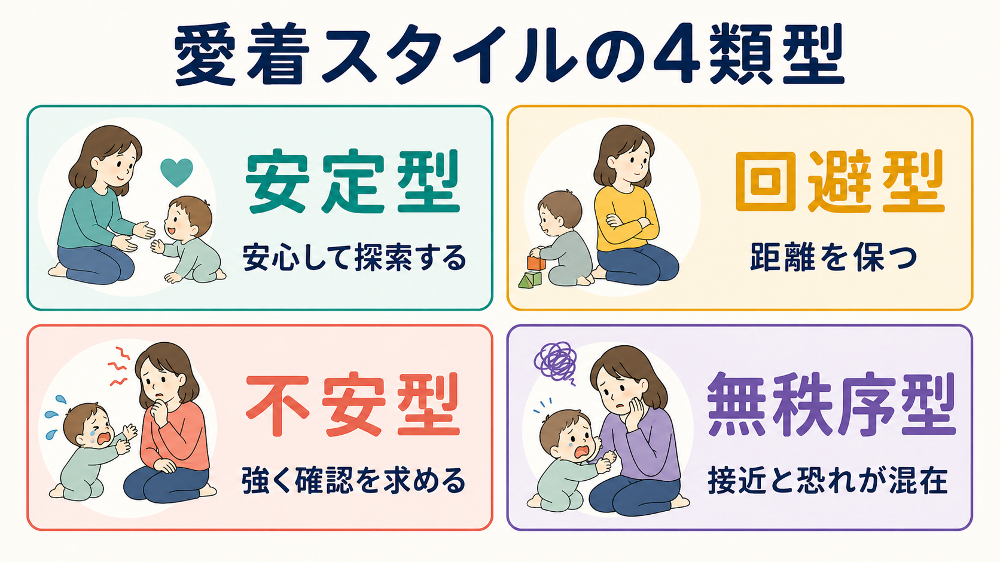
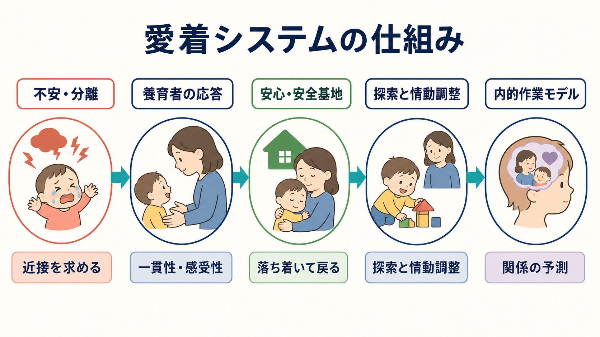
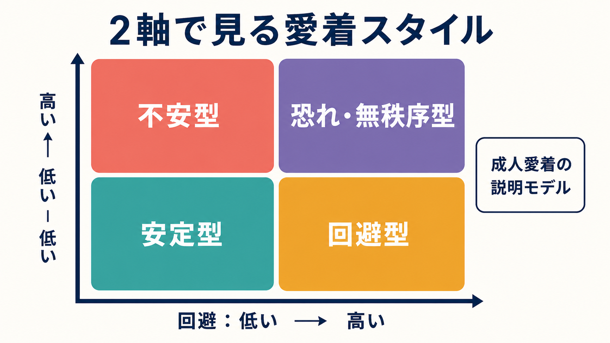

# 愛着スタイルにはどのような種類があるのか

## 要点

- 愛着とは、乳幼児が不安や危険を感じたときに、特定の養育者へ近接し、安心を回復しようとする行動システムである[1]。
- 乳幼児研究では、ストレンジ・シチュエーション法を通じて、安定型、回避型、不安型、無秩序型という分類が整理されてきた[2][3]。
- 成人愛着では、親密な関係における「不安」と「回避」の2次元で説明されることが多い[4][5]。
- 愛着スタイルは固定された性格診断ではなく、関係経験、発達段階、文脈、測定法によって変わりうる傾向として理解する必要がある[6][8]。

## この記事で答える問い

この記事では、次の問いに答える。

1. 安定型・回避型・不安型・無秩序型は、それぞれどのような特徴をもつのか。
2. それらは、乳幼児期の養育者との相互作用からどのように理解されるのか。
3. 成人の恋愛・対人関係で語られる愛着スタイルと、乳幼児研究の分類はどのように関係するのか。
4. 愛着スタイルを自己理解や臨床理解に使うとき、どのような誤解を避けるべきか。

## まず結論

愛着スタイルは、「人は不安なとき、他者をどの程度頼れると予測するか」をめぐる関係のパターンである。安定型は、他者を頼りながら探索や自律へ戻りやすい。回避型は、苦痛をあまり表に出さず、近接よりも距離を保ちやすい。不安型は、相手の利用可能性を強く確認し、再会後も落ち着くまで時間がかかりやすい。無秩序型は、養育者に近づきたい気持ちと恐れが同時に生じ、行動が一貫しにくい[2][3]。

ただし、これらは人を4箱に固定する分類ではない。とくに成人愛着では、安定、回避、不安、恐れといった言葉は、対人場面での不安と回避の強さを表す連続的な傾向として扱われる[4][5]。

## 背景

愛着理論は、John Bowlby が、子どもと養育者の結びつきを単なる依存や報酬学習ではなく、生存と情動調整に関わる行動システムとして捉えたことから発展した[1]。乳幼児は、疲労、恐怖、痛み、見知らぬ環境などで不安が高まると、養育者に近づき、抱かれ、声をかけられ、安心を回復しようとする。

Mary Ainsworth らは、短い分離と再会を含む観察手続きであるストレンジ・シチュエーション法を用い、乳幼児の再会時の行動を中心に愛着パターンを分類した[2]。重要なのは、単に「泣くかどうか」ではなく、分離で不安が高まったあと、養育者をどのように求め、再会後にどのように落ち着き、探索へ戻るかである。

## 基本概念

### 安定型

安定型では、子どもは養育者を安全基地として使いやすい。分離では不安を示しても、再会時には養育者へ接近し、慰められると落ち着き、再び探索へ戻る[2]。発達的背景としては、養育者が子どものシグナルに比較的一貫して気づき、過不足なく応答する経験が関係すると考えられる[6]。

成人愛着では、安定型は親密さへの抵抗が低く、見捨てられ不安も低い状態として説明される。相手を頼ることと自律することが両立しやすく、葛藤時にも関係修復の余地を保ちやすい[5]。

### 回避型

回避型では、子どもは分離や再会の場面で苦痛をあまり表に出さず、養育者を避ける、視線を外す、物への注意に戻るといった行動を示しやすい[2]。これは「本当に不安がない」というより、近接を求めても応答されにくい環境で、苦痛表出や接近を抑える方略として理解されることがある。

成人愛着では、回避型は親密さへの警戒や距離の維持として現れやすい。自立を重んじること自体は問題ではないが、困ったときにも援助要請を避け、感情を切り離して処理しようとする場合がある[4][5]。

### 不安型

不安型は、Ainsworth らの分類では抵抗型・アンビバレント型とも呼ばれる[2]。子どもは分離で強い不安を示し、再会時には養育者へ強く接近する一方で、怒り、抵抗、ぐずりが残り、落ち着くまで時間がかかる。背景には、養育者の応答が不安定で、子どもから見て予測しにくい経験が関係すると考えられる。

成人愛着では、不安型は見捨てられ不安、拒絶への敏感さ、相手の気持ちを頻繁に確認したくなる傾向として説明される[4][5]。これは単なる「依存」ではなく、関係の利用可能性を確かめ続けることで不安を下げようとする方略である。

### 無秩序型

無秩序型は、Main と Solomon らによって追加的に整理された分類である[3]。子どもは、養育者へ近づきたい一方で、養育者そのものが恐れや混乱の手がかりにもなる場合、凍りつき、接近してから急に避ける、ちぐはぐな姿勢や動きを示すことがある。愛着システムが活性化しているのに、近接によって安心が得られるとは限らないため、行動方略がまとまりにくい。

無秩序型は虐待やトラウマだけで決まるものではないが、養育者の恐怖を与える行動、解離的・怯えた行動、喪失や未解決のトラウマなどと関連して研究されてきた[7]。臨床的には重要な概念だが、個人を一枚のラベルで判断するための用語ではない。

## 仕組み

愛着システムは、平常時には探索や遊びを支え、不安や分離で活性化する。養育者が利用可能で、子どもの状態に応答できると、子どもは安心を回復し、再び環境へ注意を向ける。この反復経験は、「自分は助けを求めてよい」「他者は応答してくれる」「苦痛は調整できる」といった内的作業モデルを形成する[1][2]。

この仕組みは、[[実行機能とは何か]]や情動調整とも関係する。安心できる関係は、注意を脅威から探索へ戻す足場になり、子どもが待つ、切り替える、助けを求めるといった調整を学ぶ場にもなる。一方で、応答が予測しにくい、拒否されやすい、あるいは恐怖を伴う環境では、子どもはそれぞれの環境で比較的ましに機能する方略を発達させる。

## 図解

成人愛着研究では、愛着スタイルを「不安」と「回避」の2軸で整理することが多い[5]。不安は「相手に見捨てられるのではないか」という心配の強さ、回避は「親密さや依存を避けたい」という傾向の強さである。

この2軸モデルは成人の恋愛・親密関係を理解するには便利だが、乳幼児のストレンジ・シチュエーション分類と完全に同じものではない。乳幼児分類は特定の養育者との観察場面に基づく一方、成人愛着は自己報告、面接、恋愛関係、親密な友人関係など、測定文脈が多様である[4][8]。

## 臨床・研究との接続

研究では、養育者の感受性は安定型愛着と関連するが、その関連は決定論的ではない。メタ分析では、養育者の感受性は重要な要因である一方、気質、家族ストレス、文化、社会的支援、測定法も関わることが示されている[6]。したがって、愛着スタイルを親の責任だけに還元するのは不正確である。

臨床・支援の場では、愛着スタイルは「この人は何型か」と分類するためだけでなく、「この人は不安なとき、何を予測し、どのように自分を守っているのか」を理解する視点として有用である。たとえば回避的な人は援助を拒んでいるように見えても、近づくこと自体が危険だと学んできた可能性がある。不安型の人は相手を試しているように見えても、関係が保たれるかを必死に確認している可能性がある。

愛着は、[[自己概念とは何か]]、[[自己評価はどのように形成されるのか]]、[[アイデンティティとは何か]]とも接続する。自分は助けを求めてよい存在か、他者は信頼できる存在かという予測は、対人関係だけでなく、自己理解や人生の物語にも影響する。また、逆境のあとにどのような支援関係を得られるかは、[[レジリエンスは学習されるのか]]を考えるうえでも重要である。

## よくある誤解

### 誤解1: 愛着スタイルは一生変わらない

愛着には一定の連続性があるが、固定された運命ではない。安定した関係、心理療法、養育環境の変化、社会的支援、重要な対人経験によって、関係の予測や情動調整の方略は変わりうる[8]。

### 誤解2: 不安型や回避型は「悪い性格」である

不安型や回避型は、もともと不安を下げるための適応方略として理解できる。問題になるのは、その方略が現在の関係や生活に合わなくなり、援助要請、親密さ、境界設定、葛藤解決を難しくするときである。

### 誤解3: 無秩序型は虐待の証拠である

無秩序型はリスク理解に重要だが、それだけで虐待や特定の診断を断定するものではない。観察場面、発達歴、家族状況、文化的背景、他の臨床情報と合わせて慎重に解釈する必要がある[7]。

### 誤解4: 乳幼児分類と成人の恋愛タイプは同じである

乳幼児研究の分類と成人愛着の分類は関連するが、測定対象が違う。乳幼児では特定の養育者との分離・再会場面、成人では恋愛、友人、家族、面接で語られる関係表象などが扱われる[4][5]。

## 関連ノート

- [[自己概念とは何か]]
- [[自己評価はどのように形成されるのか]]
- [[アイデンティティとは何か]]
- [[実行機能とは何か]]
- [[心の理論とは何か]]
- [[レジリエンスは学習されるのか]]

MOC更新候補: `content/00_MOC/MOC｜認知科学・心理学.md` の発達・愛着・社会心理セクションに追加候補。並列実行時の衝突を避けるため、本記事作成ではMOC本体を更新しない。

## 理解チェック

1. 安定型愛着において、「安全基地」とは何を意味するか。
2. 回避型の子どもが苦痛を表に出しにくいことは、なぜ「不安がない」とは限らないのか。
3. 不安型では、再会時にどのような行動が見られやすいか。
4. 無秩序型を、個人への固定的ラベルとして使うべきでない理由は何か。
5. 成人愛着の「不安」と「回避」の2軸は、乳幼児分類とどこが違うか。

## 未解決問題

- 愛着スタイルの安定性と変化を、文化差や家族構造の多様性を含めてどのように測定するか。
- 養育者の感受性、子どもの気質、社会経済的ストレス、トラウマ経験の寄与をどのように分けて理解するか。
- 成人愛着の自己報告尺度、面接法、行動観察をどのように統合するか。
- 愛着概念を臨床支援で使うとき、ラベル化を避けながら支援計画にどう接続するか。

## 参考文献

[1] Bowlby, J. (1969/1982). *Attachment and Loss: Vol. 1. Attachment* (2nd ed.). Basic Books. https://books.google.com/books?q=Attachment+and+Loss+Volume+1+Attachment+Bowlby

[2] Ainsworth, M. D. S., Blehar, M. C., Waters, E., & Wall, S. N. (1978). *Patterns of Attachment: A Psychological Study of the Strange Situation*. Lawrence Erlbaum. https://doi.org/10.4324/9780203758047

[3] Main, M., & Solomon, J. (1990). Procedures for identifying infants as disorganized/disoriented during the Ainsworth Strange Situation. In M. T. Greenberg, D. Cicchetti, & E. M. Cummings (Eds.), *Attachment in the Preschool Years: Theory, Research, and Intervention* (pp. 121-160). University of Chicago Press. https://press.uchicago.edu/ucp/books/book/chicago/A/bo3684533.html

[4] Hazan, C., & Shaver, P. (1987). Romantic love conceptualized as an attachment process. *Journal of Personality and Social Psychology, 52*(3), 511-524. https://doi.org/10.1037/0022-3514.52.3.511

[5] Bartholomew, K., & Horowitz, L. M. (1991). Attachment styles among young adults: A test of a four-category model. *Journal of Personality and Social Psychology, 61*(2), 226-244. https://doi.org/10.1037/0022-3514.61.2.226

[6] De Wolff, M. S., & van IJzendoorn, M. H. (1997). Sensitivity and attachment: A meta-analysis on parental antecedents of infant attachment. *Child Development, 68*(4), 571-591. https://doi.org/10.1111/j.1467-8624.1997.tb04218.x

[7] van IJzendoorn, M. H., Schuengel, C., & Bakermans-Kranenburg, M. J. (1999). Disorganized attachment in early childhood: Meta-analysis of precursors, concomitants, and sequelae. *Development and Psychopathology, 11*(2), 225-249. https://doi.org/10.1017/S0954579499002035

[8] Cassidy, J., & Shaver, P. R. (Eds.). (2016). *Handbook of Attachment: Theory, Research, and Clinical Applications* (3rd ed.). Guilford Press. https://www.guilford.com/books/Handbook-of-Attachment/Cassidy-Shaver/9781462525294
