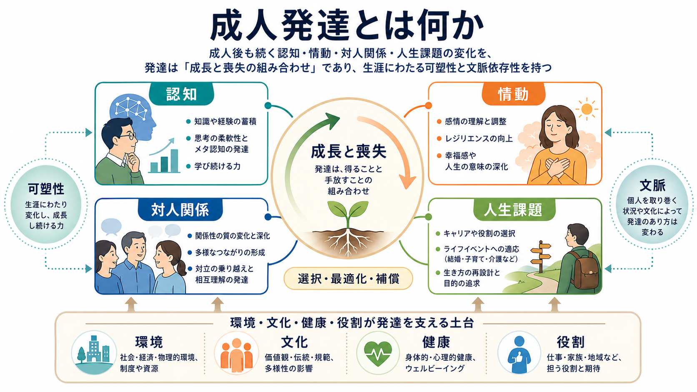
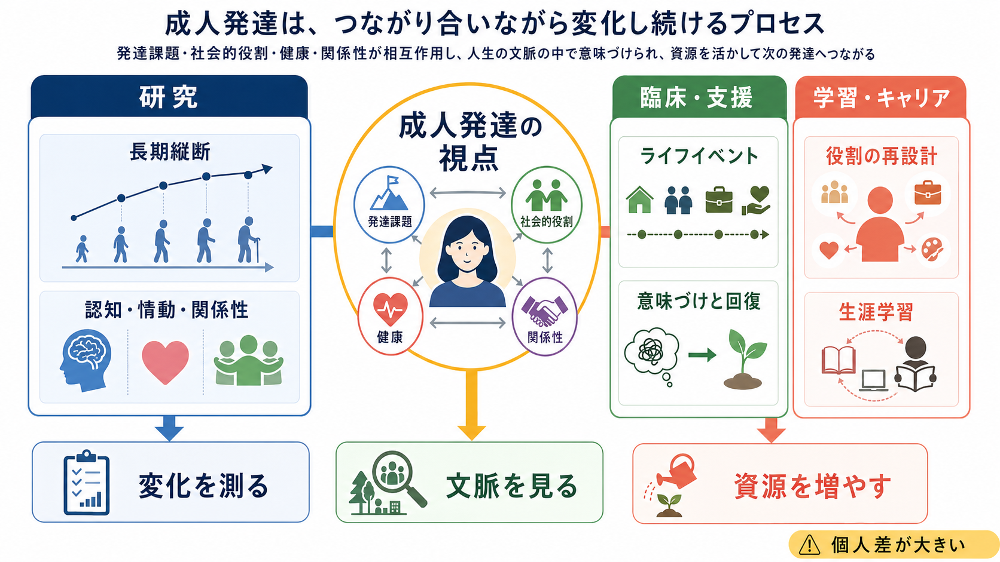

# 成人発達とは何か

## 要点

- 成人発達とは、成人後も続く認知、情動、対人関係、社会的役割、人生課題の変化を扱う視点である。
- 発達は「子どもから大人への一方向の成長」ではなく、生涯にわたる獲得と喪失、安定と変化、個人差と文脈の相互作用として理解される[1][2]。
- 成人期には、認知の一部は低下しうる一方で、経験知、情動調整、関係性の選択、役割の再設計は発達しうる[3][4][5][6]。
- 臨床・教育・キャリア支援では、「もう変わらない人」と見るよりも、「制約の中で資源を組み替える人」と見ることが重要になる。

## この記事で答える問い

- 成人発達は、[[発達とは何か]] と何が違うのか。
- 成人後には、どのような領域で変化が起こるのか。
- 成人期の変化は、単なる老化や能力低下とどう区別できるのか。
- 研究・臨床・学習支援では、成人発達の視点をどう使えるのか。

## まず結論

成人発達とは、成人後の人生を「完成した状態」ではなく、変化し続ける発達過程として捉える考え方である。成人になると、発達は幼少期ほど目に見えやすい形では現れない。しかし、職業選択、親密な関係、子育て、介護、喪失、病気、引退、学び直しなどを通じて、人は自分の目標、時間感覚、情動調整、他者との距離、社会的役割を組み替え続ける。

ライフスパン発達心理学では、発達を「成長だけ」とは考えない。発達には、獲得と喪失が同時に含まれる。たとえば処理速度や一部の流動性知能は加齢に伴って低下しやすいが、語彙、知識、判断、対人経験、感情の扱い方は維持・発達することがある[2][4][6]。したがって成人発達を理解する鍵は、「何が伸びるか」だけでなく、「何を選び、何を補い、どの文脈で適応するか」にある。

## 背景

従来の発達観では、発達はしばしば児童期・青年期の問題として扱われてきた。[[発達段階理論とは何か]] のように、年齢段階ごとの課題を整理する考え方は、人生を見通すうえで有用である。しかし成人期を詳しく見ると、同じ年齢でも、学歴、仕事、家族、健康、文化、経済状況、社会制度によって課題は大きく異なる。

ライフスパン発達心理学は、この点を重視する。Baltes は、発達を生涯にわたる多方向的な変化として捉え、年齢だけでなく、歴史的時代、社会文化的文脈、個人の可塑性を含めて考える必要を示した[1]。この視点では、成人期の変化は「成熟後のおまけ」ではない。成人期そのものが、複数の発達経路が分岐し、再編される時期である。

## 基本概念

### 成人発達

成人発達は、成人期以降の心理・行動・社会的役割の変化を扱う領域である。主な対象は、若年成人期、中年期、高齢期にまたがる。研究対象には、認知機能、情動調整、パーソナリティ、親密性、仕事、家族、健康、喪失、意味づけ、ウェルビーイングが含まれる。

### ライフスパン発達

ライフスパン発達は、発達を出生から死までの全生涯に広げて理解する枠組みである。重要なのは、発達が単一方向ではない点である。ある領域では伸び、別の領域では低下し、さらに別の領域では環境の支援によって維持される。成人発達は、このライフスパン発達の成人期部分に焦点を当てる。

### 獲得と喪失

成人期の発達では、獲得と喪失が同時に生じる。たとえば、若い頃の瞬発的な処理速度は下がっても、経験に基づく判断や、対人関係での距離の取り方は洗練されることがある[4][6]。このため、「若い頃と同じ能力を保つこと」だけが発達の指標ではない。

### 可塑性と個人差

成人期にも可塑性は残る。ただし、可塑性は無限ではない。健康状態、教育機会、職場環境、家族役割、経済的資源、文化的期待によって、変化の方向と幅は制約される[1][2]。成人発達は、個人内の変化と、個人を取り巻く文脈の変化を同時に見る必要がある。

## 仕組み

成人発達の代表的な仕組みとして、選択・最適化・補償、時間展望の変化、情動調整、社会的役割の再編がある。

### 選択・最適化・補償

選択・最適化・補償（selection, optimization, and compensation: SOC）は、成人期の適応を説明する重要なモデルである。人の時間、体力、注意、社会的資源は有限である。そのため、すべてを同じように追求するのではなく、重要な目標を選び、選んだ領域に練習や支援を集中し、弱くなった機能や失われた機会を道具・人・方略で補う[3]。

たとえば、視力が落ちた人が読書をやめるとは限らない。文字サイズを上げる、音声読み上げを使う、読む時間帯を変える、読む本を選ぶといった補償によって、活動の意味を維持できる。ここで発達とは、単に機能が高まることではなく、制約の中で重要な生活機能を保ち、再構成することを含む。

### 認知の変化

成人期の認知発達は、単純な上昇・下降ではない。Seattle Longitudinal Study などの縦断研究は、成人期の知的能力に能力別の軌道があることを示してきた[4]。処理速度や新奇課題への素早い対応は低下しやすい一方で、語彙、蓄積された知識、実務的判断は長く維持されることがある。

この区別は臨床的にも重要である。高齢者の認知変化をすべて病的低下として扱うのは誤りである一方、日常機能に影響する変化を「年のせい」として見逃すのも危険である。教育・研究目的では、発達的変化、健康要因、環境要因、測定課題の性質を分けて考える必要がある。

### 情動と時間展望

成人期には、情動の扱い方も変わる。社会情動的選択性理論では、残された時間の感覚が変わるにつれて、人は新奇な情報獲得よりも、情動的に意味のある関係や経験を優先しやすくなると考える[5]。これは、交友範囲が狭くなることを単なる社会的撤退と見なすのではなく、関係性を選び直す過程として理解する視点を与える。

一方で、情動調整が常に向上するわけではない。SAVI モデルは、加齢に伴って日常的な情動調整の強みが増す一方、高覚醒で逃れにくい慢性ストレスや喪失状況では、身体的脆弱性によって調整が難しくなる可能性を指摘する[6]。つまり成人発達は、「年を取るほど穏やかになる」という単純な話ではない。

### 対人関係と役割

成人期の対人発達は、親密な関係、家族、職場、地域、ケア関係の中で進む。[[愛着とは何か]] や [[内的作業モデルとは何か]] は主に早期経験との関連で語られることが多いが、成人期の親密性や信頼の形成にも関係する。成人は、過去の関係パターンを反復するだけでなく、新しい関係、喪失、支援、葛藤を通じて関係の持ち方を修正していく。

成人期には、役割も重層化する。働く人、親、子、配偶者、ケア提供者、地域の成員、学習者といった複数の役割が重なる。成人発達を理解するには、個人の内面だけでなく、その人がどの役割を引き受け、どの役割を手放し、どの役割に意味を見出すかを見る必要がある。

## 図解

3 枚の図は、成人発達を次のように整理している。

| 図 | 主題 | 読み取り方 |
|---|---|---|
| 1 | 成人発達の全体像 | 認知、情動、対人関係、人生課題が、環境・文化・健康・役割に支えられて変化する |
| 2 | SOC モデル | 有限な資源の中で、目標を選び、資源を集中し、弱点を補う |
| 3 | 研究・支援への接続 | 変化を測り、文脈を見て、資源を増やすことで支援に接続する |

## 臨床・研究との接続

成人発達の視点は、臨床・教育・キャリア支援で役立つ。ただし、医療や心理臨床では、個別診断や治療指示としてではなく、教育・研究上の理解枠組みとして用いる必要がある。

第一に、成人の困難を「本人の性格」だけに還元しにくくなる。たとえば中年期の不調は、気分症状だけでなく、職場責任、親の介護、子育て、身体疾患、将来時間の見通し、役割喪失が重なって生じることがある。成人発達の視点は、症状だけでなく、人生文脈と役割の変化を見る助けになる。

第二に、支援の焦点が「欠けた能力を戻す」だけではなくなる。SOC の考え方を使えば、何を維持したいのか、どこに資源を集中するのか、どの機能を道具や人で補うのかを検討できる[3]。これは、学習支援、リハビリテーション、職場適応、ケア場面にも応用しやすい。

第三に、成人期の個人差を研究しやすくなる。成人発達では、年齢平均だけでは不十分である。同じ 50 歳でも、健康、教育、仕事、家族、文化、社会的支援によって発達経路は異なる。縦断研究は、個人内変化と個人間差を分けて扱うために重要である[4]。

## よくある誤解

### 誤解1: 成人になったら発達は終わる

成人後も、認知、情動、関係性、パーソナリティ、役割は変化する。パーソナリティ研究でも、成人期に平均的変化と個人差の両方が見られることが示されている[7]。

### 誤解2: 成人発達は老化研究と同じである

成人発達は老化を含むが、老化だけではない。若年成人期のアイデンティティ探索、親密な関係、職業選択、学び直しも対象になる。Arnett の emerging adulthood 論は、18-25 歳前後の時期が、文化的条件のもとで独自の探索期になりうることを示した[8]。

### 誤解3: 加齢は能力低下だけを意味する

加齢には低下もあるが、経験知、情動調整、関係性の選択、意味づけの発達もある。重要なのは、どの能力が、どの文脈で、どの支援資源と結びついて変化するかである。

### 誤解4: 発達段階は全員に同じ順序で起こる

段階理論は理解の足場になるが、成人期の実際の発達は文化、制度、経済、ジェンダー、家族構成、健康状態によって大きく異なる。成人発達では、年齢だけでなく、人生の出来事と社会的文脈を同時に見る必要がある。

## 関連ノート

- [[発達とは何か]]
- [[発達段階理論とは何か]]
- [[愛着とは何か]]
- [[内的作業モデルとは何か]]
- [[安全基地とは何か]]
- [[心の理論はどのように発達するのか]]

MOC 更新候補:

- `content/00_MOC/` 配下の発達心理学・認知科学系 MOC に、本記事へのリンクを追加する。
- 並列ジョブとの競合を避けるため、本記事では MOC 本体は更新しない。

今後の作成候補:

- 成人期の認知加齢とは何か
- 社会情動的選択性理論とは何か
- 選択・最適化・補償とは何か
- 中年期危機とは何か
- 生涯発達心理学とは何か

## 理解チェック

1. 成人発達を「成長だけ」で説明すると、どのような側面が見落とされるか。
2. 選択・最適化・補償は、日常生活のどのような場面で使われているか。
3. 認知機能の低下と経験知の発達は、どのように同時に起こりうるか。
4. 交友範囲が狭くなることは、どのような条件では発達的適応として理解できるか。
5. 成人期の支援で、年齢だけでなく文脈を見る必要があるのはなぜか。

## 参考文献

[1] Baltes, P. B. (1987). Theoretical propositions of life-span developmental psychology: On the dynamics between growth and decline. *Developmental Psychology, 23*(5), 611-626. https://doi.org/10.1037/0012-1649.23.5.611

[2] Baltes, P. B., Staudinger, U. M., & Lindenberger, U. (1999). Lifespan psychology: Theory and application to intellectual functioning. *Annual Review of Psychology, 50*, 471-507. https://doi.org/10.1146/annurev.psych.50.1.471

[3] Freund, A. M. (2008). Successful aging as management of resources: The role of selection, optimization, and compensation. *Research in Human Development, 5*(2), 94-106. https://doi.org/10.1080/15427600802034827

[4] Schaie, K. W. (1994). The course of adult intellectual development. *American Psychologist, 49*(4), 304-313. https://doi.org/10.1037/0003-066X.49.4.304

[5] Carstensen, L. L. (1992). Motivation for social contact across the life span: A theory of socioemotional selectivity. *Nebraska Symposium on Motivation, 40*, 209-254. https://pubmed.ncbi.nlm.nih.gov/1340521/

[6] Charles, S. T. (2010). Strength and vulnerability integration: A model of emotional well-being across adulthood. *Psychological Bulletin, 136*(6), 1068-1091. https://doi.org/10.1037/a0021232

[7] Roberts, B. W., & Mroczek, D. (2008). Personality trait change in adulthood. *Current Directions in Psychological Science, 17*(1), 31-35. https://doi.org/10.1111/j.1467-8721.2008.00543.x

[8] Arnett, J. J. (2000). Emerging adulthood: A theory of development from the late teens through the twenties. *American Psychologist, 55*(5), 469-480. https://doi.org/10.1037/0003-066X.55.5.469

## 未解決問題

- 成人発達の理論は、文化・階層・ジェンダー・雇用制度の違いをどこまで一般化できるか。
- 情動調整の発達的強みは、慢性ストレス、孤立、疾患、喪失のもとでどの程度保たれるか。
- 成人期の学習支援では、認知機能の補償とアイデンティティの再構成をどう統合できるか。
- 日本語圏の成人発達研究では、家族役割、介護、働き方、地域参加をどのように測定すべきか。
