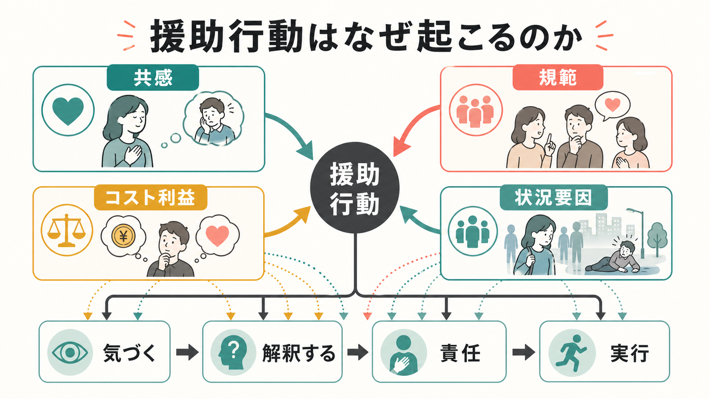
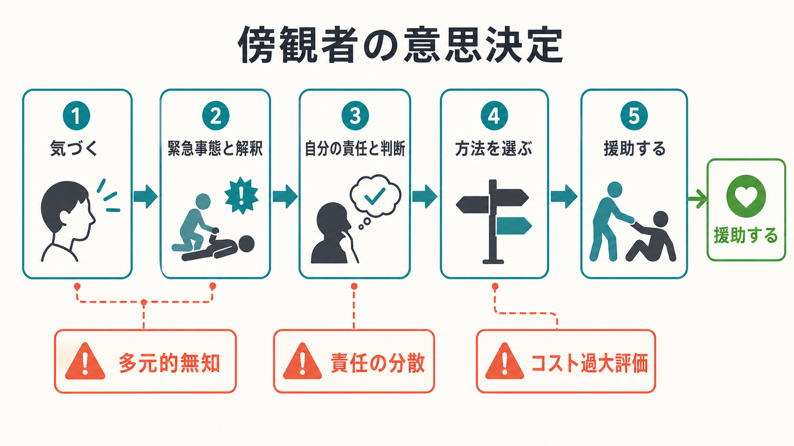

# 援助行動はなぜ起こるのか

## 要点

- 援助行動は「やさしい性格」だけで説明できず、共感、社会規範、コスト利益の見積もり、状況の読み取りが重なって起こる。
- 傍観者が多い場面では、気づく、緊急事態だと解釈する、自分の責任だと判断する、援助方法を選ぶ、実行する、という各段階で行動が止まりうる。
- 援助を増やす介入は、共感を高めるだけでなく、責任の所在、具体的な行動手順、援助のコスト、周囲の規範を設計する必要がある。

## この記事で答える問い

援助行動とは、困っている他者の利益になるように、自分の時間、労力、資源、リスクを使う行動である。典型例は、倒れている人を助ける、寄付をする、友人の相談に乗る、差別的発言に介入する、といった行為である。このノートでは、援助行動を[[社会心理学とは何か|社会心理学]]の観点から、個人内の感情だけでなく、場面、規範、意思決定として整理する。

## まず結論

援助行動は、「相手の苦痛に心が動くこと」と「自分が今ここで行動すべきだと判断すること」が同時に成立したときに起こりやすい。共感は他者の苦痛を自分にとって重要な情報に変える。規範は「助けるべきだ」という方向づけを与える。コスト利益の評価は、直接助ける、誰かを呼ぶ、後で支援する、何もしない、という選択肢を比較する。状況要因は、そもそも緊急性や責任を正しく読めるかを左右する[1][2]。

## 背景

援助行動研究が強調してきたのは、援助の有無は安定した人格特性だけでなく、場面の細部に大きく左右されるという点である。Darley と Latané の古典的研究では、緊急事態を聞いた参加者は、自分だけが聞いていると思うと報告しやすかったが、他にも聞いている人がいると思うと報告が遅れた[3]。この結果は、他者がいるほど安心できるという直感に反して、責任が分散することで援助が抑制される可能性を示した。

同じく Good Samaritan 研究では、神学生が困っている人に遭遇したとき、宗教的態度よりも「急いでいるかどうか」が援助を強く左右した[4]。つまり、援助は道徳的信念や価値観だけでなく、時間圧、注意、場面の曖昧さ、周囲の反応といった条件に依存する。

## 基本概念

### 共感

共感は、他者の状態を理解し、その苦痛や必要性に情動的に反応する働きである。Batson らの共感-利他性仮説では、相手に対する共感的関心が高いと、自分が不快感から逃げられる状況でも援助が起こりやすいとされる[5]。これは、援助が単なる自己の不快感低減だけでは説明できない場合があることを示す。ただし、共感は万能ではない。共感は目の前の特定人物に偏りやすく、遠くの多数者や見えにくい被害には働きにくい。

### 規範

規範は「この場面では何をするのが適切か」という共有された期待である。[[集団規範とは何か|集団規範]]には、他者が実際にしていることを示す記述的規範と、すべきことを示す命令的規範がある。規範は常に行動を動かすわけではなく、その規範に注意が向いているときに影響が強くなる[6]。たとえば「誰かが助けるだろう」という記述的規範が目立つと援助は止まりやすく、「ここでは声をかけるのが当然だ」という命令的規範が目立つと援助は起こりやすい。

### コスト利益

援助には、時間、労力、金銭、恥、危険、責任、対人摩擦などのコストがある。一方で、相手の苦痛が減る、自己評価が保たれる、周囲から信頼される、後悔を避けられる、といった利益もある。援助のコストが低く、援助しないコストが高いとき、直接援助は起こりやすい。直接援助のコストが高い場合でも、通報する、専門家につなぐ、匿名で寄付するなど、間接的な援助が選ばれることがある[1]。

## 仕組み

傍観者介入モデルでは、援助は一回の道徳判断ではなく、連続する意思決定として理解される[2][3]。

1. まず、出来事に気づく。
2. 次に、それを援助が必要な状況だと解釈する。
3. そのうえで、自分に責任があると判断する。
4. 具体的な援助方法を選ぶ。
5. 最後に、実行する。

この連鎖のどこかで止まると、援助は起こらない。周囲の人が落ち着いていると「緊急ではないのかもしれない」と解釈し、多元的無知が生じる。傍観者が多いと「誰かがやるだろう」と考え、責任が分散する。援助方法がわからないと、責任を感じても実行に移れない。これは[[行動変容はどのように起こるのか|行動変容]]と同じく、意図だけでなく、手順、環境、摩擦の小ささが必要である。

## 図解

1枚目の図は、援助行動を共感、規範、コスト利益、状況要因の4領域から整理している。これらは独立した原因ではなく、互いに補強したり打ち消したりする。たとえば共感が強くても、援助方法が不明でコストが高いと行動は止まる。逆に、共感が強くなくても、役割責任や明確な規範があれば援助は起こりうる。

2枚目の図は、傍観者が援助に至るまでの段階を示している。重要なのは、失敗を「冷淡さ」とだけ見ないことである。人は気づいていない、緊急性を読み違えている、自分の責任だと思っていない、方法がわからない、実行コストを高く見積もっている、という別々の理由で止まる。

## 臨床・研究との接続

援助行動の知見は、教育、医療、災害対応、職場の安全、ハラスメント介入、メンタルヘルス支援に応用できる。たとえば、相談窓口を整備するだけでは不十分で、誰が、いつ、どのように声をかけ、どこにつなぐのかを明確にする必要がある。これは[[ナッジとは何か|ナッジ]]にも近く、望ましい行動を個人の善意だけに任せず、摩擦を減らし、責任を見える化する設計である。

臨床・支援場面では、援助者の燃え尽きにも注意が必要である。共感が強いほど援助が起こりやすい一方、共感だけに依存すると、特定の相手への過剰な巻き込まれや疲弊が生じる。支援を持続させるには、個人の共感だけでなく、役割分担、境界設定、スーパービジョン、組織的支援が必要になる。

## よくある誤解

「助けない人は冷たい」という説明は単純すぎる。傍観者効果の研究は、援助しないことが無関心ではなく、状況解釈や責任判断の失敗から生じる場合を示している[2][3]。

「共感が高ければ必ずよい援助になる」という理解も不十分である。共感は援助の強い動因だが、相手の実際のニーズ、専門性、長期的影響を見誤ることがある。援助には[[自己効力感とは何か|自己効力感]]、技能、制度的な支えも必要である。

「報酬があれば援助は増える」とも限らない。外的報酬や評判は援助を促すことがあるが、動機が疑われたり、内発的な意味づけを弱めたりする場合もある[7]。援助を設計するときは、報酬、評価、匿名性、役割責任のバランスを見る必要がある。

## 関連ノート

- [[社会心理学とは何か]]
- [[社会的認知とは何か]]
- [[共感は認知機能としてどう理解できるのか]]
- [[集団規範とは何か]]
- [[同調とは何か]]
- [[ナッジとは何か]]
- [[行動変容はどのように起こるのか]]
- [[自己効力感とは何か]]

## MOC更新候補

- `content/00_MOC/` 配下の社会心理学・認知科学系 MOC に本記事を追加する。
- 「発達・愛着・社会心理」カテゴリ内で、共感、同調、集団規範、偏見・差別、スティグマ関連ノートと相互参照する。

## 関連ノート候補

- 傍観者効果とは何か
- 向社会的行動とは何か
- 利他性とは何か
- 責任の分散とは何か
- 多元的無知とは何か
- 共感疲労とは何か

## 理解チェック

1. 援助行動を、性格だけで説明すると何を見落とすか。
2. 傍観者が多いと援助が減るのは、どの段階で何が起こるからか。
3. 共感、規範、コスト利益、状況要因のうち、あなたの職場や学校で最も介入しやすい要因はどれか。
4. 直接援助が難しい場面で、間接援助を増やす設計には何が必要か。

## 未解決問題

- 実験室の緊急場面研究を、オンライン空間、災害、医療現場、組織不正の通報にどこまで一般化できるか。
- 共感を高める介入が、偏った援助や援助者の疲弊を生まないための条件は何か。
- 評判、報酬、制度的義務をどのように組み合わせると、援助の質と持続性が両立するか。

## 参考文献

[1] Penner, L. A., Dovidio, J. F., Piliavin, J. A., & Schroeder, D. A. (2005). Prosocial behavior: Multilevel perspectives. *Annual Review of Psychology, 56*, 365-392. https://doi.org/10.1146/annurev.psych.56.091103.070141

[2] Latané, B., & Darley, J. M. (1970). *The Unresponsive Bystander: Why Doesn't He Help?* Appleton-Century-Crofts. https://psycnet.apa.org/record/1971-03938-000

[3] Darley, J. M., & Latané, B. (1968). Bystander intervention in emergencies: Diffusion of responsibility. *Journal of Personality and Social Psychology, 8*(4), 377-383. https://doi.org/10.1037/h0025589

[4] Darley, J. M., & Batson, C. D. (1973). "From Jerusalem to Jericho": A study of situational and dispositional variables in helping behavior. *Journal of Personality and Social Psychology, 27*(1), 100-108. https://doi.org/10.1037/h0034449

[5] Batson, C. D., Duncan, B. D., Ackerman, P., Buckley, T., & Birch, K. (1981). Is empathic emotion a source of altruistic motivation? *Journal of Personality and Social Psychology, 40*(2), 290-302. https://doi.org/10.1037/0022-3514.40.2.290

[6] Cialdini, R. B., Reno, R. R., & Kallgren, C. A. (1990). A focus theory of normative conduct: Recycling the concept of norms to reduce littering in public places. *Journal of Personality and Social Psychology, 58*(6), 1015-1026. https://doi.org/10.1037/0022-3514.58.6.1015

[7] Bénabou, R., & Tirole, J. (2006). Incentives and prosocial behavior. *American Economic Review, 96*(5), 1652-1678. https://doi.org/10.1257/aer.96.5.1652
