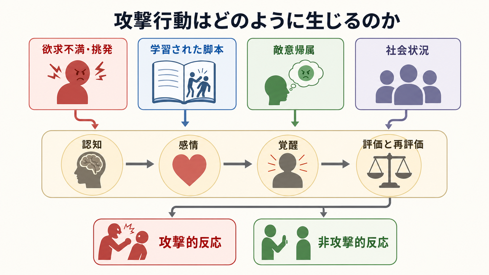
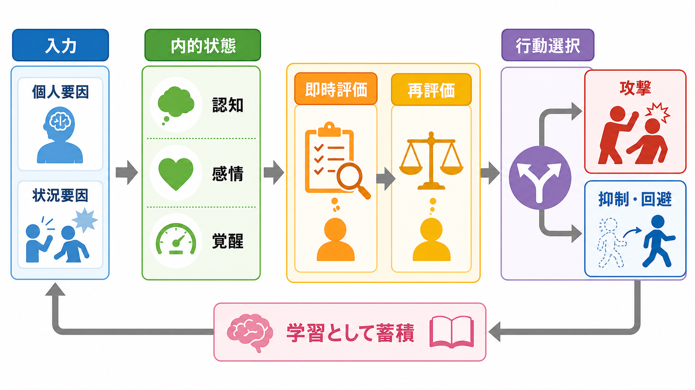

# 攻撃行動はどのように生じるのか

## 要点

- 攻撃行動は、単一の「攻撃的性格」から直線的に生じるのではなく、個人要因、状況要因、感情、認知評価、覚醒、学習史がその場で組み合わさって生じる。
- 欲求不満や挑発は攻撃性を高めうるが、それ自体が必ず攻撃を生むわけではない。怒り、不快感、敵意帰属、再評価の余地が重要になる。
- 攻撃は観察学習、強化、反復経験を通じて「こういう場面ではこう反応する」という行動脚本として蓄積される。
- 予防や介入では、怒りの発散だけでなく、認知的再評価、問題解決、規範づくり、報酬構造と環境調整を見る必要がある。

## この記事で答える問い

攻撃行動はなぜ、ある場面では起こり、別の場面では抑えられるのだろうか。この問いは、[[社会心理学とは何か]]、[[帰属理論とは何か]]、[[集団規範とは何か]]、[[実行機能は子どもでどのように発達するのか]]と接続して考えると理解しやすい。

ここでは、攻撃を「相手に害を与えることを意図した行動」として扱う。ただし、研究上の攻撃行動、学校や家庭での問題行動、犯罪・暴力、臨床的な衝動性は同じではない。本文は教育・研究目的の整理であり、個別の診断や治療指示ではない。

## まず結論

攻撃行動は、「きっかけ」だけで決まらない。一般攻撃モデルでは、個人要因と状況要因が、認知、感情、覚醒という内的状態を変化させ、その後の即時評価と再評価を通じて、攻撃的反応または非攻撃的反応が選ばれると考える[1]。つまり、攻撃性を理解するには、「何が起きたか」だけでなく、「本人がどう解釈したか」「どんな反応の選択肢を学んできたか」「その場で攻撃が報われる構造があるか」を見る必要がある。

## 背景

古典的な欲求不満-攻撃仮説は、目標達成を妨げられることが攻撃を生みやすくするという発想を広めた。その後、Berkowitzはこの考えを修正し、欲求不満は攻撃の直接原因というより、不快感や怒り、攻撃関連思考を活性化する条件の一つだと位置づけた[2]。たとえば、同じ待たされる経験でも、「相手がわざと妨害した」と解釈する場合と、「やむを得ない事情がある」と解釈する場合では、怒りと反応が変わる。

また、攻撃行動は学習される。Banduraらの古典的研究は、子どもが攻撃的なモデルを観察した後、その行動を模倣しうることを示した[3]。この知見は、「攻撃は内側から噴き出す衝動だけではなく、見て覚え、試して、報われることで強まる行動でもある」という視点を与えた。

## 基本概念

**攻撃行動**

攻撃行動とは、一般に「他者に害を与える意図を伴う行動」を指す。ここで重要なのは、結果として傷ついたかどうかだけでなく、害を与える意図があったかどうかである[1]。医療処置の痛みやスポーツ上の接触は、通常この意味での攻撃とは区別される。

**反応的攻撃と能動的攻撃**

反応的攻撃は、挑発、脅威、屈辱、欲求不満に対する怒りや恐怖を伴う、比較的衝動的な攻撃である。能動的攻撃は、報酬、支配、地位、資源獲得などを目的とする、より道具的な攻撃である。Raineらは、思春期男子のデータで反応的攻撃と能動的攻撃が異なる相関をもつことを示し、両者を区別して評価する意義を示した[6]。

**敵意帰属バイアス**

敵意帰属バイアスとは、相手の意図が曖昧な場面で、相手が自分に敵意を向けていると解釈しやすい傾向である。社会的情報処理モデルでは、手がかりの符号化、解釈、目標設定、反応生成、反応評価、実行という流れの中で、敵意帰属や反応候補の偏りが攻撃行動に関わる[4]。これは[[帰属理論とは何か]]の応用例としても読める。

## 仕組み

### 1. 入力: 個人要因と状況要因

個人要因には、過去の学習、攻撃的脚本、衝動性、信念、価値観、実行機能、疲労、物質使用などが含まれる。状況要因には、挑発、侮辱、暑さ、騒音、混雑、集団圧力、匿名性、武器の存在、報酬構造などがある[1]。同じ状況でも、個人の学習史や自己制御資源によって反応は変わるため、[[実行機能は子どもでどのように発達するのか]]や[[思春期の脳と心理はどう変化するのか]]とも接続する。

### 2. 内的状態: 認知・感情・覚醒

攻撃に向かう過程では、認知、感情、覚醒が相互に影響する。認知では「侮辱された」「相手はわざとやった」といった解釈が生じる。感情では怒り、不安、屈辱、恐怖が高まる。覚醒では心拍や緊張が上がり、行動の準備状態が変わる[1]。Berkowitzの認知的新連合理論では、不快な出来事が怒りや攻撃関連記憶を活性化し、攻撃傾向を高めると考える[2]。

### 3. 評価と再評価: ここで分岐が起こる

攻撃が起こるかどうかは、最初の反応だけでは決まらない。一般攻撃モデルでは、即時評価で「攻撃する」「言い返す」「逃げる」などの反応が素早く浮かび、時間や認知資源があれば再評価が起こる[1]。再評価では、「本当に相手は敵意をもっていたのか」「別の説明はあるか」「今ここで攻撃すると後で何が起こるか」を考え直す。ここで[[自己奉仕バイアスとは何か]]や[[同調とは何か]]のような認知・社会的要因も影響しうる。

### 4. 学習として蓄積される

一回の攻撃エピソードは、その場限りでは終わらない。攻撃によって相手が引き下がる、注目を得る、仲間内で地位が上がる、要求が通るといった結果が生じると、その反応は強化される。Huesmannの情報処理モデルでは、幼少期から獲得された攻撃的脚本が、反復を通じて安定し、成人期まで持続しうると説明される[5]。これは[[養育環境は発達にどう影響するのか]]、[[逆境的小児期体験ACEとは何か]]とも関係する。

## 図解

攻撃行動は、少なくとも三つの水準で見ると整理しやすい。

| 水準 | 見るもの | 例 |
|---|---|---|
| 近接要因 | その場のきっかけ | 挑発、侮辱、欲求不満、集団圧力 |
| 心理過程 | 内側で起きる処理 | 怒り、敵意帰属、覚醒、再評価 |
| 学習・環境 | 長期的に蓄積する条件 | 観察学習、強化、規範、報酬構造 |

反応的攻撃と能動的攻撃の区別は、予防方針を考えるときに特に重要である。反応的攻撃では、情動調整、脅威解釈の修正、再評価、タイムアウトが重要になる。能動的攻撃では、攻撃が報われる環境を変えること、非攻撃的な目標達成手段を学ぶこと、集団規範を明確にすることが重要になる。

## 臨床・研究との接続

臨床や教育の現場で重要なのは、「攻撃的な人」とラベルづけすることではなく、どの入力、どの内的状態、どの評価、どの結果が反応を維持しているかを分解することである。たとえば、挑発への過敏さが中心なら敵意帰属や情動調整を扱う。攻撃によって要求が通ることが中心なら、環境の随伴性を変える。集団内で攻撃が地位や承認につながるなら、[[集団規範とは何か]]や[[服従とは何か]]の観点から、集団側のルールと報酬構造を扱う。

WHOの暴力と健康に関する報告書は、暴力を個人だけでなく、関係、コミュニティ、社会構造を含む公衆衛生上の問題として整理している[8]。攻撃行動の理解も同様に、個人の衝動だけでなく、家庭、学校、職場、地域、メディア、制度の水準を含めて考える必要がある。

## よくある誤解

**誤解1: 怒りを発散すれば攻撃性は下がる**

怒りの発散は直感的には有効に見えるが、怒りの相手について反すうしながら発散する方法は、むしろ怒りと攻撃反応を高めることがある。Bushmanの研究では、怒らせた相手を考えながらサンドバッグを叩いた群は、怒りと攻撃反応が高くなった[7]。必要なのは単なる発散ではなく、注意の切り替え、再評価、問題解決、休息、安全確保である。

**誤解2: 攻撃は生得的衝動だけで決まる**

攻撃に生物学的基盤や気質差が関わることはある。しかし、観察学習、強化、脚本、規範、報酬構造も強く関わる[3][5]。したがって、攻撃を「本人の性格だけ」と見ると、介入可能な環境要因を見落とす。

**誤解3: 厳罰化すれば攻撃は必ず減る**

罰は一部の行動を抑えることがあるが、予測可能性、公平性、代替行動の学習、関係性、集団規範が伴わない場合、怒りや回避、隠れた攻撃を強めることがある。攻撃予防では、何を禁止するかだけでなく、どの非攻撃的行動をどう強化するかが重要である。

## 関連ノート

- [[社会心理学とは何か]]
- [[帰属理論とは何か]]
- [[集団規範とは何か]]
- [[同調とは何か]]
- [[服従とは何か]]
- [[実行機能は子どもでどのように発達するのか]]
- [[思春期の脳と心理はどう変化するのか]]
- [[逆境的小児期体験ACEとは何か]]
- [[トラウマは発達にどう影響するのか]]
- [[養育環境は発達にどう影響するのか]]

MOC更新候補: `content/00_MOC/`配下の心理学・社会心理学系MOCに、本記事へのリンクを追加する。

今後の作成候補: 「敵意帰属バイアスとは何か」「一般攻撃モデルとは何か」「反応的攻撃と能動的攻撃の違い」「怒りの反すうとは何か」。

## 理解チェック

1. 欲求不満は、なぜ必ず攻撃につながるわけではないのか。
2. 敵意帰属バイアスは、曖昧な対人場面でどのように攻撃を生みやすくするか。
3. 反応的攻撃と能動的攻撃では、予防の焦点がどう異なるか。
4. 「怒りを発散すればよい」という考えには、どのような限界があるか。
5. 攻撃行動を個人要因だけで説明すると、どのような介入可能性を見落とすか。

## 参考文献

[1] Anderson, C. A., & Bushman, B. J. (2002). Human aggression. *Annual Review of Psychology, 53*, 27-51. https://doi.org/10.1146/annurev.psych.53.100901.135231

[2] Berkowitz, L. (1989). Frustration-aggression hypothesis: Examination and reformulation. *Psychological Bulletin, 106*(1), 59-73. https://doi.org/10.1037/0033-2909.106.1.59

[3] Bandura, A., Ross, D., & Ross, S. A. (1961). Transmission of aggression through imitation of aggressive models. *Journal of Abnormal and Social Psychology, 63*(3), 575-582. https://doi.org/10.1037/h0045925

[4] Crick, N. R., & Dodge, K. A. (1994). A review and reformulation of social information-processing mechanisms in children's social adjustment. *Psychological Bulletin, 115*(1), 74-101. https://doi.org/10.1037/0033-2909.115.1.74

[5] Huesmann, L. R. (1988). An information processing model for the development of aggression. *Aggressive Behavior, 14*(1), 13-24. https://doi.org/10.1002/1098-2337(1988)14:1%3C13::AID-AB2480140104%3E3.0.CO;2-J

[6] Raine, A., Dodge, K., Loeber, R., Gatzke-Kopp, L., Lynam, D., Reynolds, C., Stouthamer-Loeber, M., & Liu, J. (2006). The Reactive-Proactive Aggression Questionnaire: Differential correlates of reactive and proactive aggression in adolescent boys. *Aggressive Behavior, 32*(2), 159-171. https://doi.org/10.1002/ab.20115

[7] Bushman, B. J. (2002). Does venting anger feed or extinguish the flame? Catharsis, rumination, distraction, anger, and aggressive responding. *Personality and Social Psychology Bulletin, 28*(6), 724-731. https://doi.org/10.1177/0146167202289002

[8] Krug, E. G., Dahlberg, L. L., Mercy, J. A., Zwi, A. B., & Lozano, R. (Eds.). (2002). *World report on violence and health*. World Health Organization. https://www.who.int/publications-detail-redirect/9241545615
