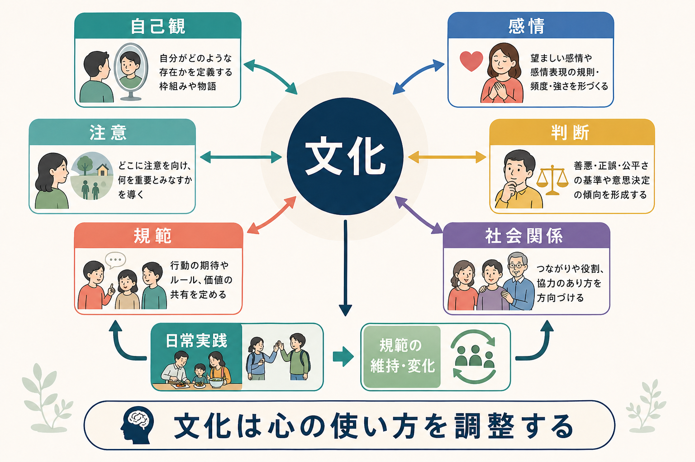
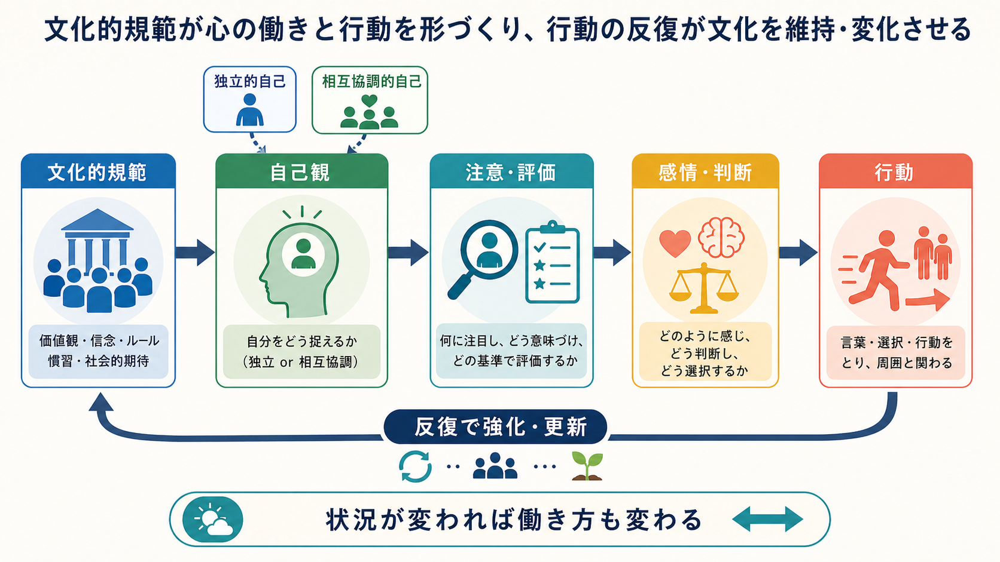
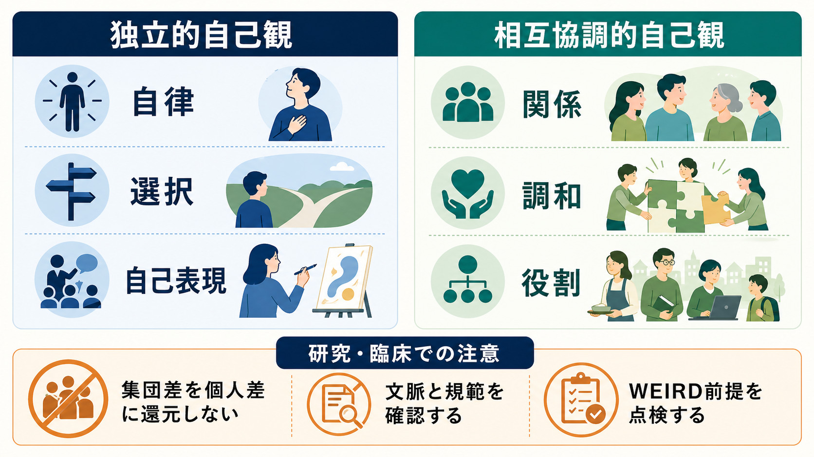

# 文化は自己や認知にどう影響するのか

## 要点

- 文化は、心の「中身」を外から一方的に書き込むものではなく、日常の規範・制度・対人実践を通じて、自己の捉え方、注意の向け方、感情の出し方、判断基準を調整する環境である。
- 文化心理学では、独立的自己観と相互協調的自己観が重要な対比として使われる。ただしこれは国民性の固定分類ではなく、状況・階層・世代・制度・個人経験によって変わる傾向である[1]。
- 認知の文化差は、分析的認知と包括的認知、対象への注意と文脈への注意、特性帰属と状況帰属などとして観察されることがある[2][3]。
- 感情も普遍的な生物反応だけではなく、何を望ましい感情とみなし、いつ表出し、どう調整するかという文化的文脈の中で形づくられる[4]。
- 研究・臨床・教育で重要なのは、文化差を「個人差」や「民族差」に短絡しないことである。WEIRDサンプルに偏った心理学知見を、すべての人間にそのまま一般化できるとは限らない[6]。

## この記事で答える問い

1. 文化は、自己観や認知のどの部分に影響するのか。
2. 個人主義・集団主義、独立的自己観・相互協調的自己観とは何か。
3. 文化的規範は、感情・注意・判断・行動にどのような経路で作用するのか。
4. 文化差を扱うとき、研究や臨床で何に注意すべきか。

## まず結論

文化は「人が何を考えるか」だけでなく、「自分を何者として捉えるか」「何に注意を向けるか」「どの感情を望ましいとみなすか」「何を公正・適切・失礼・恥ずかしいと判断するか」を形づくる。Markus と Kitayama は、欧米で強調されやすい独立的自己観と、東アジアなどで強調されやすい相互協調的自己観を区別し、自己観の違いが認知・感情・動機づけに広く関わると論じた[1]。

ただし、文化は個人の中に固定された属性ではない。文化的規範、制度、家族、学校、職場、言語、メディア、宗教、経済環境などが重なり、特定の状況でどの自己観や判断様式が使われやすいかを変える。したがって「日本人は集団主義」「欧米人は個人主義」といった単純化は、説明として粗すぎる。

## 背景

心理学は長く、実験室で見られた知覚・記憶・判断・感情の仕組みを、人間一般にかなり広く当てはまるものとして扱ってきた。しかし、文化心理学と比較文化研究は、心の働きが社会的文脈から切り離せないことを示してきた。

たとえば、同じ「自己」でも、ある文脈では「他者から区別された一貫した主体」として理解され、別の文脈では「関係・役割・相互依存の中で成り立つ存在」として理解される。これは、[[社会心理学とは何か]]で扱う自己と社会状況の相互作用を、より大きな文化的時間スケールで見たものといえる。

Henrich らは、心理学研究の多くが Western, Educated, Industrialized, Rich, Democratic、すなわち WEIRD な集団に偏っていると指摘した[6]。この批判は「欧米研究は間違い」という意味ではない。むしろ、どの知見が普遍的で、どの知見が特定の社会制度・教育・市場・宗教・家族構造に依存しているのかを、より丁寧に分ける必要があるという問題提起である。

## 基本概念

### 文化

文化とは、共有された意味、価値、規範、慣習、制度、道具、物語、分類の仕方のまとまりである。重要なのは、文化が「頭の中の信念」だけではない点である。挨拶、謝罪、叱責、贈与、試験、評価制度、家族内の役割、職場の意思決定など、反復される実践の中で文化は維持され、変化する。

### 個人主義と集団主義

個人主義は、個人の自律、選択、権利、自己表現を重視する傾向を指す。集団主義は、関係、義務、役割、調和、相互依存を重視する傾向を指す。ただし、これは国単位で人を二分するラベルではない。家庭では相互協調的に振る舞い、職場では個人の達成を重視する、といった混在は普通に起こる。

### 独立的自己観と相互協調的自己観

独立的自己観では、自己は他者から区別され、内的属性、好み、能力、信念によって定義されやすい。相互協調的自己観では、自己は関係や役割の中に位置づけられ、他者との調和、期待への応答、文脈に応じた振る舞いが重視されやすい[1]。

この対比は、[[自己奉仕バイアスとは何か]]や[[帰属理論とは何か]]とも関係する。たとえば、成功や失敗を個人の能力・努力に帰属するか、状況・関係・役割に帰属するかは、文化的に学習された説明様式の影響を受けうる。

### 分析的認知と包括的認知

分析的認知は、対象を背景から切り出し、カテゴリー、ルール、形式論理、対象の内的属性に注目する傾向である。包括的認知は、対象と背景、関係、場全体、変化の循環性、矛盾の共存に注目する傾向である。Nisbett らは、東アジアと欧米の比較研究をもとに、この対比を文化的思考様式として整理した[2]。その後のレビューは、社会的志向性、すなわち独立性・相互依存性が、認知様式の差を媒介する可能性を検討している[3]。

## 仕組み

### 1. 規範が「望ましい自己」を定める

文化的規範は、「どのような人であるべきか」を示す。自分の意見をはっきり言うことが望ましい環境では、自己表現は成熟や誠実さのサインになりやすい。一方、場の調和を乱さず、相手の立場を察することが望ましい環境では、控えめな表現や間接的な調整が有能さのサインになりやすい。

ここでの規範は、[[集団規範とは何か]]で扱うような明示的ルールだけではない。「普通はそうする」「空気を読む」「目上の人にはこうする」といった暗黙の期待も含む。Gelfand らのタイト/ルース文化研究は、規範の強さと逸脱への寛容さが国や地域で異なり、日常状況や心理的傾向と結びつくことを示している[7]。

### 2. 自己観が注意と評価を変える

自己を「自律した個」として捉えやすい場合、人は自分の選択、内的好み、個人の責任、対象そのものに注意を向けやすくなる。自己を「関係の中の存在」として捉えやすい場合、人は周囲の期待、相手との関係、場の文脈、行為が他者に与える影響に注意を向けやすくなる[1][3]。

この違いは、知覚課題、説明課題、分類課題、意思決定課題などで観察されてきた。たとえば、ある出来事の原因を説明するとき、個人の性格や能力を重視するか、状況や関係の圧力を重視するかが変わりうる[2]。これは[[ステレオタイプとは何か]]や[[偏見と差別は何が違うのか]]を考える際にも重要で、個人の判断だけでなく判断を支える文化的分類そのものを点検する必要がある。

### 3. 感情は文脈の中で調整される

感情には生物学的基盤があるが、どの感情を望ましいものとみなすか、どの場面で表出してよいか、怒り・恥・誇り・感謝をどう意味づけるかは文化によって異なる。Mesquita と Boiger は、感情を個人内の反応だけでなく、相互作用と関係の中で生じる社会力学的な過程として捉えるモデルを提案している[4]。

たとえば、怒りは、自己主張や不正への抵抗として評価される場面もあれば、関係調整の失敗や未熟さとして評価される場面もある。恥も、単なる不快感ではなく、関係を修復し、規範への再接続を促すシグナルとして働くことがある。

### 4. 行動の反復が文化を再生産する

文化は人を形づくるが、人の行動も文化を形づくる。ある職場で、全員が会議中に反対意見を控えると、「反対しないこと」が実質的な規範になる。逆に、少数意見を明示的に歓迎する制度や進行法が続けば、「異論を出すこと」が安全な実践として定着する。

この循環は、[[同調とは何か]]や[[内集団バイアスとは何か]]と重なる。人は規範に従うだけでなく、従うことで規範を見えるものにし、他者の予測を変え、次の行動の基準を作る。

## 図解

上の図では、文化的規範が自己観を通じて注意・評価・感情・判断・行動に影響し、行動の反復が再び文化的規範を強めたり更新したりする循環を示した。ポイントは、文化を「外側の背景」としてではなく、心の働きと相互に結びつく環境として見ることである。

もう一つの整理として、独立的自己観と相互協調的自己観を比較すると、次のようになる。

| 観点 | 独立的自己観 | 相互協調的自己観 |
|---|---|---|
| 自己の定義 | 内的属性、選好、信念、能力 | 関係、役割、義務、相互依存 |
| 望ましい行動 | 自己表現、選択、自律 | 調和、配慮、文脈への適応 |
| 注意の向き | 対象、個人、カテゴリー | 関係、背景、状況 |
| 感情の意味 | 個人の内的状態の表現 | 関係調整のシグナル |
| リスク | 個人責任への過度な還元 | 同調圧力や沈黙の見落とし |

## 臨床・研究との接続

### 研究での注意

文化差研究では、平均差を「その文化の全員に当てはまる特徴」と誤読しないことが重要である。集団平均の差は、個人診断の根拠にはならない。むしろ、差が見られる場合でも、教育、都市化、階層、宗教、言語、移民経験、世代、測定方法がどの程度関与しているかを検討する必要がある。

また、心理尺度が文化をまたいで同じ意味を測っているとは限らない。たとえば「自尊感情」「幸福感」「怒り」「抑うつ」「自律性」といった語は、翻訳できても、評価される文脈や望ましさが異なる可能性がある。文化神経科学のレビューも、文化、心、脳の関係を単純な一方向因果ではなく、発達・学習・文脈の相互作用として扱う必要を指摘している[5]。

### 臨床・教育での注意

臨床や教育では、文化を「患者・生徒の属性」として固定的に扱うのではなく、本人がどの規範の中で困っているのかを聞く必要がある。たとえば、自己主張が少ないことは、ある環境では不安や抑うつのサインかもしれないが、別の環境では関係を守る熟練した調整かもしれない。反対に、調和を重視する規範が強い環境では、本人の苦痛や異議申し立てが見えにくくなることもある。

医療・心理支援では、個別診断や治療指示として文化差を決めつけるべきではない。教育・研究目的の理解として、本人の語り、家族や地域の規範、制度的制約、差別やスティグマの影響を合わせて評価する。[[スティグマとは何か]]や[[認知的不協和とは何か]]で扱うように、社会的評価と自己理解のずれは、心理的負担を生むことがある。

## よくある誤解

### 誤解1: 文化差は国民性の違いである

文化差は国境と一致しない。都市と農村、世代、職業、階層、宗教、学校制度、移民経験によっても文化的実践は変わる。国名をラベルとして使う研究は多いが、国が原因そのものとは限らない。

### 誤解2: 個人主義は冷たく、集団主義は温かい

どちらにも利点とリスクがある。個人主義的規範は自己決定と権利を支えうる一方、孤立や自己責任化を強めることがある。集団主義的規範は支援と連帯を支えうる一方、同調圧力や逸脱への不寛容を強めることがある。

### 誤解3: 文化は生物学と対立する

文化は生物学と対立するものではない。人間の脳は、社会的学習、言語、報酬、予測、注意、感情調整を通じて文化的環境に適応する。文化神経科学は、文化的実践が注意や自己関連処理などの神経過程と関係する可能性を検討している[5]。

### 誤解4: 文化差を知れば相手を予測できる

文化差の知識は、相手を決めつけるためではなく、問いを増やすために使う。重要なのは「この人はどの文化に属するか」ではなく、「この人はどの関係、規範、制度、期待の中で行動しているのか」である。

## 関連ノート

- [[社会心理学とは何か]]
- [[集団規範とは何か]]
- [[同調とは何か]]
- [[内集団バイアスとは何か]]
- [[ステレオタイプとは何か]]
- [[偏見と差別は何が違うのか]]
- [[スティグマとは何か]]
- [[帰属理論とは何か]]
- [[自己奉仕バイアスとは何か]]
- [[認知的不協和とは何か]]

## MOC更新候補

- `content/00_MOC/` 内の認知科学・心理学系MOC
- `content/00_MOC/` 内の社会心理学系MOC
- `content/00_MOC/` 内の人文・社会科学系MOC

並列実行時の衝突を避けるため、本記事では MOC ファイル自体は更新しない。

## 理解チェック

1. 独立的自己観と相互協調的自己観は、どのような自己の捉え方の違いを表すか。
2. 分析的認知と包括的認知は、注意・分類・原因帰属にどのような違いをもたらしうるか。
3. 感情を「個人内の反応」だけでなく「相互作用の中で生じる過程」と見ると、何が見えやすくなるか。
4. WEIRD問題は、心理学研究の一般化にどのような注意を促しているか。
5. 文化差を臨床や教育で扱うとき、なぜ個人への決めつけを避ける必要があるか。

## 参考文献

[1] Markus, H. R., & Kitayama, S. (1991). Culture and the self: Implications for cognition, emotion, and motivation. *Psychological Review, 98*(2), 224-253. https://doi.org/10.1037/0033-295X.98.2.224

[2] Nisbett, R. E., Peng, K., Choi, I., & Norenzayan, A. (2001). Culture and systems of thought: Holistic versus analytic cognition. *Psychological Review, 108*(2), 291-310. https://doi.org/10.1037/0033-295X.108.2.291

[3] Varnum, M. E. W., Grossmann, I., Kitayama, S., & Nisbett, R. E. (2010). The origin of cultural differences in cognition: Evidence for the social orientation hypothesis. *Current Directions in Psychological Science, 19*(1), 9-13. https://doi.org/10.1177/0963721409359301

[4] Mesquita, B., & Boiger, M. (2014). Emotions in context: A sociodynamic model of emotions. *Emotion Review, 6*(4), 298-302. https://doi.org/10.1177/1754073914534480

[5] Kitayama, S., & Uskul, A. K. (2011). Culture, mind, and the brain: Current evidence and future directions. *Annual Review of Psychology, 62*, 419-449. https://doi.org/10.1146/annurev-psych-120709-145357

[6] Henrich, J., Heine, S. J., & Norenzayan, A. (2010). The weirdest people in the world? *Behavioral and Brain Sciences, 33*(2-3), 61-83. https://doi.org/10.1017/S0140525X0999152X

[7] Gelfand, M. J., Raver, J. L., Nishii, L., Leslie, L. M., Lun, J., Lim, B. C., Duan, L., Almaliach, A., Ang, S., Arnadottir, J., Aycan, Z., Boehnke, K., Boski, P., Cabecinhas, R., Chan, D., Chhokar, J., D'Amato, A., Ferrer, M., Fischlmayr, I. C., Fischer, R., et al. (2011). Differences between tight and loose cultures: A 33-nation study. *Science, 332*(6033), 1100-1104. https://doi.org/10.1126/science.1197754

## 未解決問題

- 文化差として観察される効果のうち、どの程度が社会的志向性、言語、教育、都市化、経済制度、宗教、歴史的脅威によって説明されるのか。
- 文化的自己観は、オンライン環境や移民経験、多文化的アイデンティティの中でどのように変化するのか。
- 臨床尺度や教育評価を文化横断的に使うとき、測定不変性と当事者の意味づけをどのように両立させるべきか。

