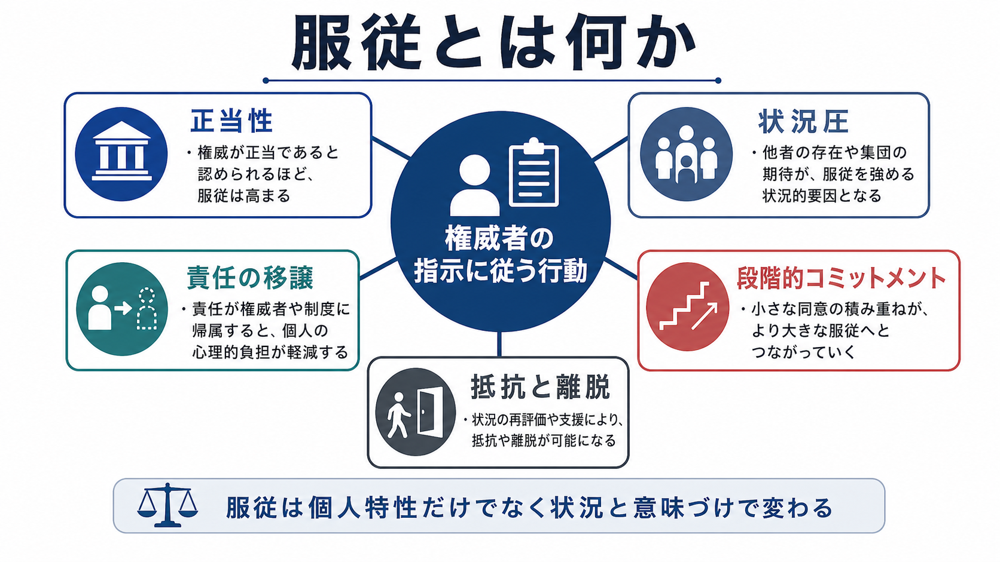
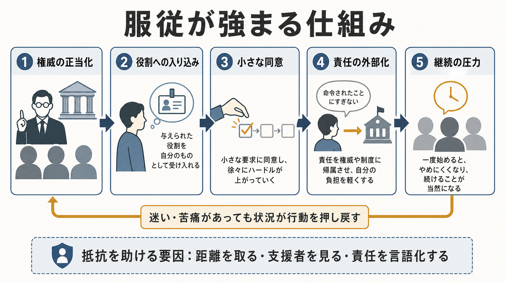
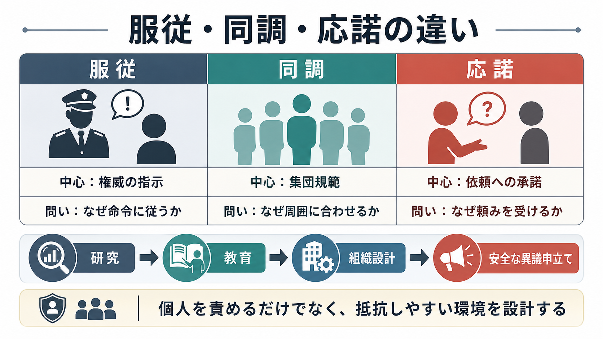

# 服従とは何か

## 要点

- 服従とは、権威をもつ人物・制度・役割からの指示に従って行動する社会的影響の一形態である。
- 古典的には Milgram の実験が有名で、参加者の多数が、実際には演技であった「学習者」への強い電気ショックを続ける設定で、権威の指示に従った[1]。
- ただし、服従は「考えずに命令へ従うこと」だけではない。権威の正当性、研究や組織の目的への同一化、責任の移譲、段階的なコミットメント、離脱しにくい状況設計が重なって生じる[2][3][5]。
- 現代の研究では、古典実験の倫理的限界を踏まえ、軽度の実刺激、相互的役割、事前同意、脱欺瞞的手続きなどを用いて、服従と不服従をより安全に調べる方法が提案されている[8]。
- 臨床・教育・組織場面で重要なのは、「従った個人が弱い」と断じることではなく、異議申立てや離脱を可能にする環境を設計することである。

## この記事で答える問い

1. 服従は、同調や応諾とどう違うのか。
2. 権威者の指示に従う行動は、どのような状況で強まりやすいのか。
3. Milgram 実験から何がわかり、何を過度に一般化してはいけないのか。
4. 研究・臨床・教育・組織設計では、服従をどのように扱うべきか。

## まず結論

服従は、個人の性格だけで説明できる行動ではない。人は、権威が正当であるように見える場面、役割が明確な場面、最初の小さな同意が次の同意を呼ぶ場面、責任が自分ではなく権威者や制度にあるように感じられる場面で、望ましくない行為にも踏み込みやすくなる[1][2][4]。

一方で、人は単なる自動機械でもない。参加者は迷い、抵抗し、交渉し、状況の意味を解釈しながら行動していた。近年の再分析は、Milgram 実験を「盲目的服従の証明」とだけ読むのではなく、権威・科学・役割・目的への同一化が行動を支える過程として読む必要を示している[5][6][7]。

## 背景

服従研究が社会心理学で大きな位置を占めるのは、日常的な規則遵守から、組織内の不正、医療・軍事・教育・職場での権威関係まで、広い現象に関わるからである。権威への従属は、交通ルール、専門職の分業、学校や医療の安全管理を支える。一方で、正当性を装った命令に従うことは、他者への害や責任回避にもつながる。

Milgram の研究は、第二次世界大戦後の「普通の人は、どこまで権威に従うのか」という問いを実験室で扱った。参加者は「教師」として、誤答した「学習者」に電気ショックを与えるよう求められた。実際にはショックは与えられておらず、学習者は協力者だったが、参加者は強い葛藤や緊張を示しながらも、40名中26名が最大レベルまで進んだ[1]。

この知見は強い影響力をもったが、同時に倫理的・方法論的な批判も招いた。欺瞞、心理的苦痛、参加者がどの程度信じていたのか、実験者の促しが「命令」だったのか「説得」だったのか、といった問題は、現在も議論されている[6][7]。

## 基本概念

### 服従

服従とは、権威者または権威を帯びた制度からの指示・命令に従うことである。ここでいう権威は、単に力が強い人ではない。白衣、肩書き、専門知、組織の規則、場の形式、儀礼的な言葉遣いなどによって、「この人には従うべきだ」という正当性が作られる。

### 同調・応諾との違い

同調は、集団の規範や多数派に合わせる行動である。応諾は、依頼や要請を受け入れる行動である。服従は、これらと重なるが、中心にあるのは「権威の指示」である。

| 概念 | 中心にある力 | 典型的な問い |
|---|---|---|
| 服従 | 権威者の指示 | なぜ命令に従うのか |
| 同調 | 集団規範・多数派 | なぜ周囲に合わせるのか |
| 応諾 | 依頼・説得 | なぜ頼みを受けるのか |

この区別は、[[心の理論はどのように発達するのか]]や[[実行機能は子どもでどのように発達するのか]]とも接続する。他者の意図を読む力や、自分の行動を抑制・切り替える力は、権威への反応や抵抗の仕方にも関わる。ただし、服従を個人の認知能力だけに還元してはいけない。服従は、社会的状況の中で生じる行動である。

## 仕組み

### 1. 権威の正当化

服従は、相手が「正当に命令できる立場にある」と見えるほど強まりやすい。Milgram 実験では、大学、実験室、白衣、科学研究という枠組みが、実験者の指示に権威を与えた[1][2]。このような正当化は、命令を単なる個人の要求ではなく、制度や目的に沿ったものとして見せる。

### 2. 役割への入り込み

人は場面の中で「自分は何をする役割か」を理解し、その役割に沿って行動する。教師、部下、研修生、患者、学生、研究参加者といった役割は、どこまで発言してよいか、誰に判断を委ねるかを変える。役割は[[発達とは何か]]や[[愛着とは何か]]で扱う対人関係の学習とも関わるが、服従研究では、特定の場面で一時的に与えられる役割が重視される。

### 3. 段階的コミットメント

小さな行為から始まると、次の少し大きな行為へ進みやすい。Milgram 実験のショック強度は段階的に上がったため、参加者は「いきなり重大な加害を選ぶ」のではなく、「直前の行為より少しだけ進む」判断を繰り返した[1]。この連続性は、途中で「ここから先は違う」と線を引くことを難しくする。

### 4. 責任の移譲

権威者が「続けてください」「実験には必要です」と促すと、行為の責任が自分ではなく実験者や制度にあるように感じられる。Milgram はこの過程を、個人が自分を他者の意思を実行する代理者として見る「代理状態」として説明した[2]。ただし、近年の研究は、この説明だけでは不十分で、参加者が権威や研究目的にどの程度同一化したかも重要だと論じる[5]。

### 5. 抵抗のしにくさ

不服従には、単に「嫌だ」と思う以上の行動が必要である。場を止める、権威者に反論する、周囲の期待を破る、すでに行ったことを否定する、といった社会的コストが伴う。録音記録の再分析は、参加者が実験者と交渉し、促しの言葉を受け止め直しながら継続・拒否を決めていたことを示す[6]。

## 図解

服従は、次のような単線的な反応ではない。

「命令を受ける → 何も考えずに従う」

むしろ、実際には次のような複数の過程が重なる。

| 過程 | 何が起きるか | 抵抗を助ける手がかり |
|---|---|---|
| 権威の正当化 | 指示が「正しい手続き」に見える | 権威の根拠を問い直す |
| 役割への入り込み | 自分の役割を狭く捉える | 役割よりも責任を言語化する |
| 段階的コミットメント | 小さな同意が次の同意を呼ぶ | 事前に停止基準を決める |
| 責任の移譲 | 判断を権威者へ預ける | 「自分が何をしているか」を確認する |
| 孤立 | 異議申立てが難しくなる | 支援者・相談先・複数判断を作る |

## 臨床・研究との接続

服従研究は、個別の診断や治療指示を与えるものではない。むしろ、権威関係がある場面で、本人の意思決定や安全をどう守るかを考えるための教育・研究上の枠組みである。

医療・心理支援・教育では、専門家と利用者の間に知識差と権威差がある。説明と同意、質問しやすい雰囲気、セカンドオピニオン、記録、相談経路は、望ましくない服従を避けるための制度的支えになる。これは、個人の[[内的作業モデルとは何か]]や[[愛着スタイルにはどのような種類があるのか]]が対人場面でどのように働くかを考える際にも、環境側の設計を忘れないために重要である。

研究倫理では、Milgram 型の欺瞞と強い心理的負荷は大きな問題として扱われてきた。近年の方法では、参加者が実際に軽度の刺激を与えるが、相互に役割を交代し、事前同意と倫理審査を行い、脱欺瞞的に不服従を測る設計が提案されている[8]。これは、古典実験の問いを捨てるのではなく、現代の倫理基準に合わせて測定可能にする試みである。

組織場面では、服従を「悪い個人の問題」として処理すると、同じ構造が残りやすい。重要なのは、異議申立ての手順、権限の分散、記録の透明性、心理的安全性、内部通報者の保護、複数者による確認である。服従を生む状況を設計できるなら、抵抗や停止を支える状況も設計できる。

## よくある誤解

### 誤解1: 服従する人は性格が弱い

服従しやすさには個人差もあるが、Milgram 型の知見が示した中心は、状況の力である。権威の正当性、距離、役割、責任の所在、周囲の反応が変わると、行動も変わる[3][4]。

### 誤解2: Milgram 実験は、人間が本質的に残酷だと証明した

この読み方は強すぎる。参加者は苦痛や葛藤を示し、多くは実験者に確認し、継続の意味を交渉していた[1][6]。問題は「残酷な性格」ではなく、権威ある状況がどのように葛藤を押し戻すかである。

### 誤解3: 権威に従うことは常に悪い

服従は社会生活に必要な側面もある。医療、交通、災害対応、教育、研究では、正当な専門性や役割分担に従うことで安全が保たれる。問題は、権威への追随が、害・不正・説明不足・責任回避を覆い隠すときである。

### 誤解4: 不服従は個人の勇気だけで決まる

勇気は重要だが、孤立した個人にすべてを負わせる設計は脆い。相談できる同僚、明確な停止基準、記録、第三者窓口、権威者への質問を許す文化が、不服従を現実的な選択肢にする。

## 関連ノート

- [[発達とは何か]]
- [[心の理論はどのように発達するのか]]
- [[実行機能は子どもでどのように発達するのか]]
- [[愛着とは何か]]
- [[内的作業モデルとは何か]]
- [[愛着スタイルにはどのような種類があるのか]]

### 今後の作成候補

- 同調とは何か
- 応諾とは何か
- 権威主義とは何か
- ミルグラム実験とは何か
- 心理的安全性とは何か

### MOC更新候補

- content/00_MOC/ 配下の認知科学・心理学または社会心理学系 MOC に、バッチ統合時に `[[服従とは何か]]` を追加する。

## 理解チェック

1. 服従・同調・応諾の違いを、それぞれ一文で説明できるか。
2. Milgram 実験で、参加者の行動を支えた状況要因を三つ挙げられるか。
3. 「服従は盲目的で自動的な行動である」という説明の限界を説明できるか。
4. 自分の所属する組織で、望ましくない服従を減らす仕組みを一つ提案できるか。

## 参考文献

[1] Milgram, S. (1963). Behavioral study of obedience. *Journal of Abnormal and Social Psychology, 67*(4), 371-378. https://doi.org/10.1037/h0040525

[2] Milgram, S. (1974). *Obedience to Authority: An Experimental View*. Harper & Row. Google Books: https://books.google.com/books/about/Obedience_to_Authority.html?id=s3S4AAAAIAAJ

[3] Blass, T. (1999). The Milgram paradigm after 35 years: Some things we now know about obedience to authority. *Journal of Applied Social Psychology, 29*(5), 955-978. https://doi.org/10.1111/j.1559-1816.1999.tb00134.x

[4] Burger, J. M. (2009). Replicating Milgram: Would people still obey today? *American Psychologist, 64*(1), 1-11. https://doi.org/10.1037/a0010932

[5] Haslam, S. A., & Reicher, S. D. (2012). Contesting the "nature" of conformity: What Milgram and Zimbardo's studies really show. *PLOS Biology, 10*(11), e1001426. https://doi.org/10.1371/journal.pbio.1001426

[6] Gibson, S. (2019). Obedience without orders: Expanding social psychology's conception of "obedience". *British Journal of Social Psychology, 58*(1), 241-259. https://doi.org/10.1111/bjso.12272

[7] Hollander, M. M., & Turowetz, J. (2017). Normalizing trust: Participants' immediately post-hoc explanations of behaviour in Milgram's "obedience" experiments. *British Journal of Social Psychology, 56*(4), 655-674. https://doi.org/10.1111/bjso.12206

[8] Caspar, E. A. (2021). A novel experimental approach to study disobedience to authority. *Scientific Reports, 11*, 22927. https://doi.org/10.1038/s41598-021-02334-8
