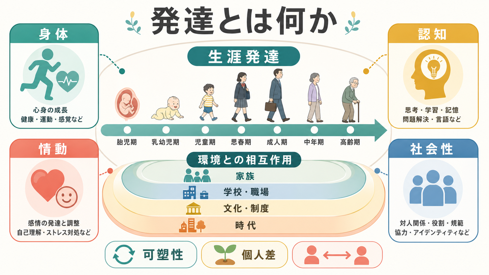
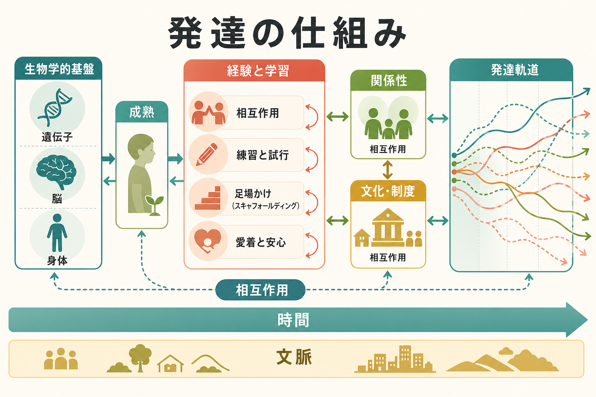
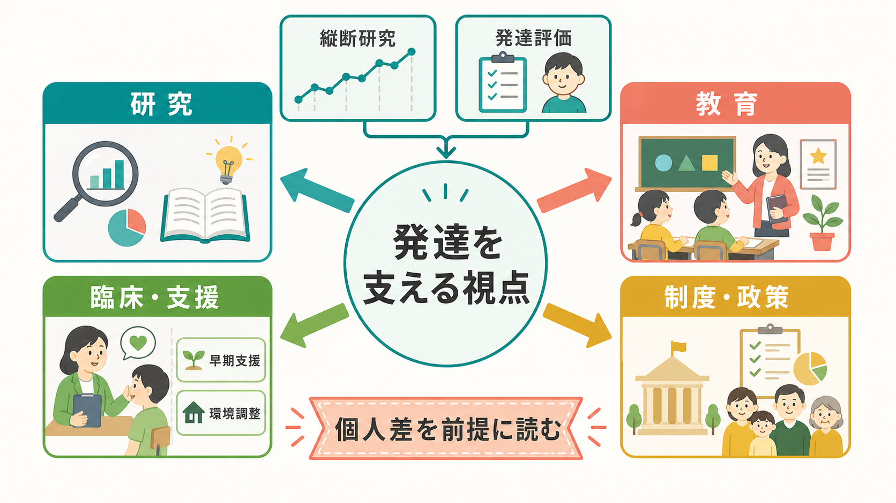

# 発達とは何か

## 要点

- 発達とは、乳幼児期だけでなく、生涯にわたって身体・脳・認知・情動・社会性が変化し続ける過程である。
- 発達は「できることが一直線に増える」過程ではない。獲得、喪失、再編成、代償、環境への適応が同時に起こる [1]。
- 遺伝か環境かではなく、生物学的基盤、経験、関係性、文化、制度、時代が相互作用して発達軌道を作る [2][3]。
- 発達段階は便利な地図だが、個人差、文化差、測定方法、支援環境によって見え方が変わる。
- 臨床・教育・政策で使うときは、発達知識を個人の診断や能力の断定に短絡させず、環境調整と支援設計のための枠組みとして読む。

## この記事で答える問い

1. 発達とは、年齢に沿った成長だけを意味するのか。
2. 身体、[[認知機能検査は何を測っているのか|認知機能]]、情動、社会性はどのように結びついて変化するのか。
3. 発達を「段階」「軌道」「文脈」「可塑性」から見ると何が分かるのか。
4. 発達心理学の知見は、教育・臨床・研究でどのように使えるのか。

## まず結論

発達とは、個体が時間の中で環境と相互作用しながら変化する過程である。ここでいう変化には、身長や運動能力の変化だけでなく、[[注意とは何か|注意]]、[[ワーキングメモリとは何か|ワーキングメモリ]]、[[実行機能とは何か|実行機能]]、言語、自己理解、感情調整、対人関係、価値観、老年期の目標選択までが含まれる。

重要なのは、発達を「子どもが大人へ近づく直線的成長」とだけ見ないことである。生涯発達心理学では、発達は多方向的であり、ある機能が伸びる時期にも別の機能では制約や喪失が生じうると考える [1]。たとえば青年期には抽象的思考や社会的探索が広がる一方で、情動・報酬・自己制御システムの成熟時期のずれが、リスクと機会の両方を生む [4][5]。老年期には処理速度や身体機能の低下が問題になる一方で、時間展望の変化により情動的に意味のある関係や目標を選びやすくなるという見方もある [6]。

## 背景

発達心理学は、もともと乳幼児・児童・青年の変化を理解する学問として発展してきた。しかし現在では、発達を胎児期から老年期までの生涯過程として扱う見方が標準的である。Baltes の生涯発達心理学は、発達を「生涯にわたる行動の恒常性と変化」と捉え、多方向性、可塑性、歴史的文脈、獲得と喪失の同時性を強調した [1]。

この見方では、年齢は重要な手がかりではあるが、原因そのものではない。同じ 10 歳、同じ 40 歳、同じ 80 歳でも、身体状態、教育機会、家族関係、社会制度、文化、時代経験によって、発達の意味は変わる。Bronfenbrenner と Ceci の生態学的・生物生態学的モデルは、発達を個人の内側だけでなく、家庭、学校、地域、文化、制度、歴史的時間との相互作用として理解する [2]。

## 基本概念

### 発達領域

発達は複数の領域に分けて整理できる。

| 領域 | 代表例 | 読むときの注意 |
|---|---|---|
| 身体・運動 | 身長、体重、運動制御、感覚機能、思春期変化、加齢変化 | 身体変化は認知・情動・社会参加にも影響する |
| 認知 | 知覚、注意、記憶、言語、推論、[[実行機能とは何か|実行機能]] | 検査得点だけで能力全体を断定しない |
| 情動 | 感情表出、感情理解、感情調整、ストレス反応 | [[情動と認知は分けられるのか|情動と認知]]は相互に影響する |
| 社会性 | 愛着、共同注意、共感、[[社会的認知とは何か|社会的認知]]、[[心の理論とは何か|心の理論]]、役割取得 | 個人特性だけでなく関係性と文化を含めて見る |

これらは別々に進むのではない。乳幼児期の自己調整は、脳の成熟、養育者との相互作用、睡眠や身体状態、言語発達と結びつく。青年期の意思決定は、認知制御だけでなく、仲間関係、報酬感受性、アイデンティティ探索、社会制度と結びつく [4][5]。

### 発達段階と発達軌道

「段階」は、発達を理解しやすくするための粗い区切りである。たとえば乳幼児期、児童期、青年期、成人期、老年期という区分は、生活課題や研究設計を整理するのに役立つ。しかし段階を固定的な階段として読むと、個人差や文化差を見落とす。

より柔軟な見方が「発達軌道」である。発達軌道とは、ある個人や集団が時間の中でたどる変化のパターンを指す。発達軌道は、早く進む、遅く進む、途中で変わる、環境調整で回復する、別の機能で補う、といった多様な形を取りうる。青年期研究でも、思春期から 20 代半ばにかけて脳・身体・社会的役割が再編されるため、リスクだけでなく回復と成長の機会として捉える必要があるとされる [4]。

### 可塑性と制約

可塑性とは、経験や環境によって変化しうる性質である。[[神経可塑性は発達と学習をどう支えるのか|神経可塑性]]は発達と学習を支えるが、可塑性は「いつでも何でも変えられる」という意味ではない。発達には、遺伝的制約、身体的制約、敏感期、社会的機会、累積した経験が関わる [3]。

発達を考えるうえで大切なのは、「変わりうる部分」と「変わりにくい部分」を分けて見ることである。教育や臨床支援では、本人の努力だけに責任を置くのではなく、課題の難しさ、支援者との関係、フィードバック、睡眠、貧困、差別、制度的障壁なども発達条件として扱う。

## 仕組み

発達は、単一の原因で説明できない。代表的には、次のような仕組みが重なっている。

1. 生物学的成熟  
   神経系、内分泌系、身体構造、感覚運動機能が時間とともに変化する。思春期には身体成熟と脳機能の再編が起こり、情動・報酬・認知制御のバランスが変わる [5]。

2. 経験と[[学習とは何か|学習]]  
   子どもは観察、模倣、試行錯誤、言語的説明、社会的フィードバックを通じて行動を変える。経験は単に外から入力される刺激ではなく、本人が探索し、選択し、意味づける活動でもある。

3. 関係性  
   養育者、きょうだい、友人、教師、同僚、パートナーとの関係は、安心感、探索、自己調整、社会的認知の発達に関わる。愛着研究は、幼児が養育者を安全基地として使い、探索と保護のバランスを取ることを示してきた [7]。

4. 文脈と制度  
   家庭、学校、職場、地域、医療、福祉、文化規範、経済条件は、発達の機会と制約を作る。生物生態学的モデルでは、個人と環境の近接的相互作用が時間を通じて発達を形作る [2]。

5. 時間展望と目標選択  
   成人期・老年期では、残された時間の感覚や人生上の役割が、何を学び、誰と関わり、何を優先するかに影響する。社会情動的選択性理論は、時間展望が社会的目標や情動調整の変化に関わると考える [6]。

## 図解

上の 2 枚の図は、発達を「領域」と「仕組み」から整理している。1 枚目は、身体・認知・情動・社会性が生涯にわたって変化し、それを家庭・学校・職場・文化・制度が取り囲むことを示す。2 枚目は、生物学的基盤、成熟、経験、学習、関係性、文化が相互作用して発達軌道を作ることを示す。

次の図は、発達知識を研究・教育・臨床支援・制度設計へ接続するときの見取り図である。

## 臨床・研究との接続

発達心理学は、研究、教育、臨床、政策のいずれにも関係する。

研究では、横断研究、縦断研究、介入研究、自然実験、神経画像、行動観察、質問紙、発達検査などを組み合わせて、時間変化と個人差を扱う。とくに発達を因果的に理解するには、単に年齢群を比較するだけでなく、同じ人を追跡する縦断研究や、環境条件の違いを慎重に扱う研究デザインが重要になる [3]。

教育では、発達知識は「何歳なら何ができるべきか」を決めつけるためではなく、課題の段階づけ、フィードバック、足場かけ、仲間との協同、失敗から学べる環境を設計するために使う。青年期についても、リスク管理だけでなく、探索、主体性、社会参加、回復可能性を支える制度設計が必要である [4]。

臨床・支援では、発達歴、家族関係、学校・職場環境、身体状態、認知機能、情動調整、社会的支援を総合して見る。ただし、本記事は教育・研究目的の整理であり、個別の診断や治療指示ではない。発達の知識は、個人を固定的に分類するためではなく、困難がどの文脈で生じ、どの支援条件で変わりうるかを考えるための道具である。

## よくある誤解

### 誤解1: 発達は子どもだけの話である

発達は生涯にわたる。成人期にも職業役割、親密な関係、子育て、学び直し、健康変化、老年期の目標選択があり、心理的変化は続く [1][6]。

### 誤解2: 発達は早いほどよい

早い獲得が常に長期的に望ましいとは限らない。ある機能の早期獲得は環境への適応かもしれないし、別の領域の負荷を伴うこともある。発達は速度だけでなく、文脈、安定性、柔軟性、本人の生活上の意味から評価する。

### 誤解3: 発達段階に当てはまらなければ異常である

発達段階は平均的な地図であり、個人差を排除するものではない。発達評価では、複数の情報源、生活文脈、文化的背景、測定誤差を考える必要がある。

### 誤解4: 遺伝か環境かを決めれば説明できる

現代の発達科学では、遺伝と環境を対立させるより、両者がどのように相互作用するかを問う。Bronfenbrenner と Ceci は、近接的過程、個人特性、文脈、時間が組み合わさって発達を形作ると論じた [2]。

### 誤解5: 脳が成熟すれば自然に行動も整う

脳成熟は重要だが、行動は脳だけで決まらない。睡眠、ストレス、仲間関係、学校環境、家庭資源、社会制度、本人の意味づけが、発達上の行動に影響する [3][4]。

## 関連ノート

- [[神経可塑性は発達と学習をどう支えるのか]]
- [[学習とは何か]]
- [[実行機能とは何か]]
- [[認知機能検査は何を測っているのか]]
- [[情動と認知は分けられるのか]]
- [[社会的認知とは何か]]
- [[心の理論とは何か]]
- [[注意とは何か]]

## MOC更新候補

- `content/00_MOC/MOC｜認知科学・心理学.md` の発達・愛着・社会心理周辺に本記事へのリンクを追加する。
- 将来、発達・愛着・社会心理カテゴリの MOC を作る場合、本記事を入口ノートとして配置する。

## 理解チェック

1. 発達を「成長」だけでなく「獲得・喪失・再編成・代償」として見ると、何が説明しやすくなるか。
2. 発達段階と発達軌道は、どのように違うか。
3. 青年期をリスクだけでなく機会として見る根拠は何か。
4. 発達上の困難を、個人特性だけでなく環境・制度との相互作用として見ると、支援の発想はどう変わるか。

## 参考文献

[1] Baltes, P. B. (1987). Theoretical propositions of life-span developmental psychology: On the dynamics between growth and decline. *Developmental Psychology*, 23(5), 611-626. https://doi.org/10.1037/0012-1649.23.5.611

[2] Bronfenbrenner, U., & Ceci, S. J. (1994). Nature-nurture reconceptualized in developmental perspective: A bioecological model. *Psychological Review*, 101(4), 568-586. https://doi.org/10.1037/0033-295X.101.4.568

[3] National Research Council and Institute of Medicine. (2000). *From Neurons to Neighborhoods: The Science of Early Childhood Development*. National Academies Press. https://doi.org/10.17226/9824

[4] National Academies of Sciences, Engineering, and Medicine. (2019). *The Promise of Adolescence: Realizing Opportunity for All Youth*. National Academies Press. https://doi.org/10.17226/25388

[5] Steinberg, L. (2005). Cognitive and affective development in adolescence. *Trends in Cognitive Sciences*, 9(2), 69-74. https://doi.org/10.1016/j.tics.2004.12.005

[6] Carstensen, L. L., Isaacowitz, D. M., & Charles, S. T. (1999). Taking time seriously: A theory of socioemotional selectivity. *American Psychologist*, 54(3), 165-181. https://doi.org/10.1037/0003-066X.54.3.165

[7] Ainsworth, M. D. S., Blehar, M. C., Waters, E., & Wall, S. (1978). *Patterns of Attachment: A Psychological Study of the Strange Situation*. Lawrence Erlbaum Associates. https://lccn.loc.gov/78013303

## 未解決問題

- 発達軌道の個人差を、遺伝、脳、家庭、教育、文化、制度のどの水準でどこまで説明できるか。
- 発達評価を、支援につながる情報として使いながら、ラベリングや過剰診断を避けるにはどうすればよいか。
- デジタル環境、AI、オンラインコミュニケーションは、注意、社会性、自己形成の発達にどのような長期的影響をもつか。
