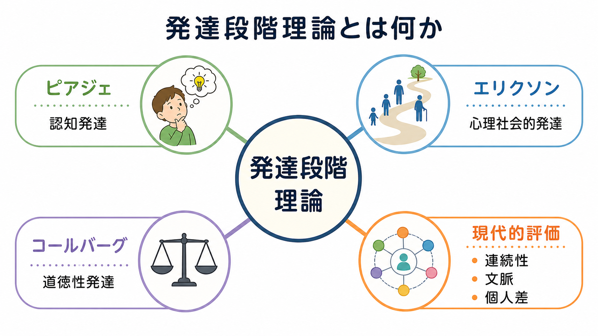
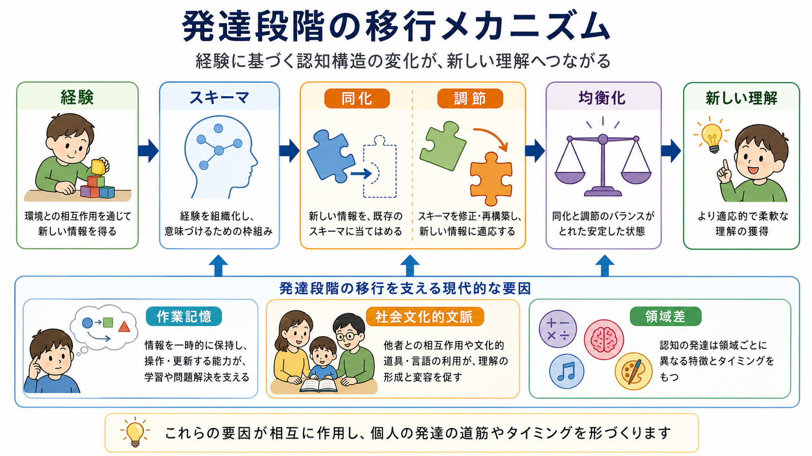
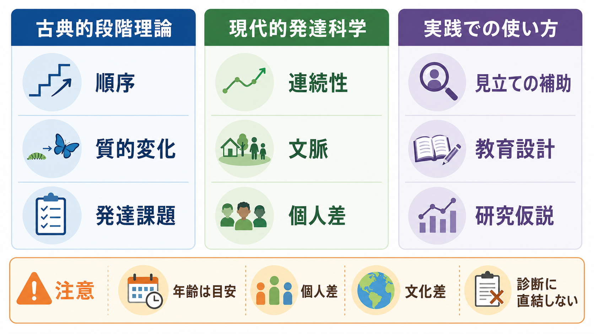

# 発達段階理論とは何か

## 要点

- 発達段階理論は、発達を「量が少しずつ増える過程」だけでなく、「考え方・対人関係・道徳判断の構造が質的に変わる過程」として説明する。
- 代表例には、ピアジェの認知発達段階、エリクソンの心理社会的発達段階、コールバーグの道徳性発達段階がある。
- 現代的には、段階は有用な地図だが、年齢で人を固定的に分類するラベルではない。発達は連続性、領域差、文化、教育、家庭環境、個人差の影響を強く受ける。
- 教育・研究・臨床では、段階理論は「発達課題を考える補助線」として使い、診断や能力評価を単純化しないことが重要である。

## この記事で答える問い

1. 発達段階理論は何を説明しようとしているのか。
2. ピアジェ、エリクソン、コールバーグは何を「段階」と見なしたのか。
3. 現代の発達科学から見て、段階理論はどこまで使えるのか。
4. 教育・研究・臨床で使うとき、どのような誤解を避けるべきか。

## まず結論

発達段階理論とは、人間の発達を、比較的まとまりのある順序をもつ「質的変化」として捉える理論群である。ピアジェは、子どもの世界理解が感覚運動的な行為から、象徴、具体的操作、形式的操作へ移ると考えた[1]。エリクソンは、乳児期から老年期までの生涯を、信頼、 autonomy、identity、generativity などの心理社会的課題の系列として捉えた[3]。コールバーグは、道徳判断が罰や報酬への反応から、社会的規範、さらに普遍的原理へ向かうと考えた[4]。

ただし、現代の評価では、発達は単純な階段ではない。子どもは課題、領域、文脈、言語、文化、教育経験によってかなり異なる能力を示す。したがって段階理論は、個人を固定する分類表ではなく、[[学習とは何か]]、[[実行機能とは何か]]、[[心の理論とは何か]]、[[社会的認知とは何か]]などを接続して考えるための粗い発達地図として読むのがよい。

## 背景

発達段階理論が登場した背景には、「子どもは大人の小型版ではない」という発達心理学の基本的発見がある。幼児は、知識量が少ないだけでなく、世界を分類し、因果を推論し、他者の視点を理解し、道徳的に判断する枠組みそのものが大人と異なる場合がある。ピアジェの理論は、子どもがスキーマを形成し、同化と調節を通じて世界理解を再編するという構成主義的見方を広めた[1][2]。

一方で、発達は認知だけでは完結しない。エリクソンは、個人の心理的成熟を、家族、学校、仕事、親密性、世代継承、老年期の統合といった社会的課題との関係で捉えた[3]。コールバーグは、道徳性を「正しい行為の選択」そのものではなく、「なぜそれを正しいと考えるのか」という理由づけの発達として扱った[4]。これらはいずれも、発達を「時間とともに複雑な構造へ変化する過程」として見る点で共通している。

## 基本概念

### 段階

段階とは、発達上のある時期に比較的まとまって現れる思考・感情・対人関係・判断の組織化パターンである。重要なのは、段階が単なる年齢区分ではないことである。たとえば「7歳だから具体的操作期である」と断定するのではなく、保存課題、分類、系列化、視点取得などでどのような推論を示すかを見て、理解の構造を考える。

### 順序性

多くの段階理論は、段階が一定の順序で現れると考える。ピアジェの感覚運動期から形式的操作期への流れ、エリクソンの乳児期から老年期への流れ、コールバーグの前慣習的・慣習的・後慣習的水準の流れは、その代表である[1][3][4]。ただし、順序性は「全員が同じ年齢で同じように通過する」という意味ではない。

### 質的変化

段階理論の中心は、発達を量的増加だけでなく質的変化として見る点にある。語彙が増える、記憶容量が増える、経験が増えるだけでなく、問題をどう表象するか、他者の立場をどう組み込むか、規則や原理をどう扱うかが変わる。

### 発達課題

エリクソンの理論では、各時期に中心となる心理社会的葛藤がある。たとえば青年期の中心課題はアイデンティティ対役割混乱であり、これは[[アイデンティティとは何か]]と深く関わる[3]。ただし、ある時期に十分解決できなかった課題が、その後に一切扱えなくなるわけではない。ライフイベントや関係性の変化によって、以前の課題は再び問い直される。

## 代表的な段階理論

### ピアジェの認知発達段階

ピアジェは、子どもの認知発達を、感覚運動期、前操作期、具体的操作期、形式的操作期の4段階として整理した[1]。感覚運動期では、子どもは感覚と運動を通じて環境を探索し、対象の永続性や因果性を学ぶ。前操作期では、言語や象徴遊びが発達する一方、自己中心性や保存概念の未成熟が目立つ。具体的操作期では、具体物を使った論理的操作が可能になり、形式的操作期では仮説、抽象、組み合わせを扱う推論が発達する。

この理論の核は、子どもが受動的に知識を受け取るのではなく、行為と経験を通じてスキーマを構成するという点にある。新しい情報を既存のスキーマに当てはめる同化、既存のスキーマを修正する調節、両者のバランスとしての均衡化が、発達的変化を生む[2]。

### エリクソンの心理社会的発達段階

エリクソンは、発達を乳幼児期だけでなく生涯に広がる過程として捉えた。彼の理論では、各段階に「信頼対不信」「自律性対恥・疑惑」「主体性対罪悪感」「勤勉性対劣等感」「アイデンティティ対役割混乱」「親密性対孤立」「世代性対停滞」「統合性対絶望」といった葛藤がある[3]。

この理論は、発達を生物学的成熟だけでなく、社会的期待、関係性、文化的役割との相互作用として扱う点で重要である。たとえば青年期のアイデンティティ形成は、単に内面の問題ではなく、学校、仲間、家族、職業選択、社会的評価のなかで進む。したがってエリクソン理論は、[[自己意識はどのように発達するのか]]や[[共感は認知機能としてどう理解できるのか]]と接続して読むと理解しやすい。

### コールバーグの道徳性発達段階

コールバーグは、道徳発達を、行為の善悪そのものよりも、道徳的判断を支える理由づけの発達として考えた。一般に、前慣習的水準では罰や報酬が中心となり、慣習的水準では対人関係や社会秩序が中心となり、後慣習的水準では社会契約や普遍的原理が問題になる[4]。

この理論は、道徳性を発達的・認知的に分析する強力な枠組みを与えた。一方で、日常の道徳判断は、抽象的な理由づけだけでなく、情動、関係性、状況、文化的規範、直観的判断にも左右される。コールバーグ理論には、実際の道徳的意思決定を十分に説明できないという批判もある[5]。

## 仕組み

段階理論の仕組みを一般化すると、次のように整理できる。

1. 子どもや成人は、現在の理解の枠組みで世界に働きかける。
2. 既存の枠組みで処理できる経験は、同化される。
3. 既存の枠組みではうまく扱えない経験が蓄積すると、調節が必要になる。
4. 認知能力、作業記憶、言語、社会的相互作用、教育経験が、新しい枠組みの形成を支える。
5. 新しい枠組みが安定すると、以前とは異なる問題解決や対人理解が可能になる。

現代的には、この過程を「一つの全体段階が突然切り替わる」と見るより、複数の能力が相互作用しながら領域ごとに変わる過程として捉える。たとえば作業記憶の発達は、複雑な課題を一時的に保持し、操作し、更新する力を支えるため、ピアジェ的課題や流動性知能の発達と関連する[8]。また学習と発達は、文化、言語、家庭、学校、共同活動に埋め込まれており、発達を個体内の成熟だけに還元することはできない[6]。

## 図解

3枚の図は、それぞれ異なる読み方を助ける。

- 1枚目は、古典的段階理論と現代的評価の全体地図である。
- 2枚目は、経験、スキーマ、同化、調節、均衡化を通じた発達的変化の模式図である。
- 3枚目は、古典理論をそのまま診断ラベルにせず、研究・教育・支援の仮説として使うための注意点をまとめている。

## 臨床・研究との接続

発達段階理論は、教育や支援の現場で有用な問いを与える。たとえば、子どもが課題を解けないとき、それは知識不足なのか、言語理解の問題なのか、作業記憶の負荷が高すぎるのか、他者視点を組み込む課題なのかを分けて考えられる。これは[[認知負荷とは何か]]や[[認知機能検査は何を測っているのか]]とも関係する。

臨床的には、段階理論は発達歴や生活史を整理する補助線になる。エリクソン理論は、アイデンティティ、親密性、世代性、老年期の統合感などを検討する枠組みを与える[3]。ただし、これは個別診断や治療指示を直接導くものではない。精神医学や心理臨床では、年齢、発達特性、家庭・学校・職場環境、文化的背景、本人の語りを合わせて評価する必要がある。

研究では、段階理論は仮説生成に役立つ。たとえば、ある年齢で平均的に見られる課題成績の変化が、作業記憶、抑制制御、言語、社会的相互作用、文化的期待のどれに媒介されるのかを検討できる。古典的理論を批判的に更新するネオ・ピアジェ派の議論は、段階という発想を保ちつつ、情報処理能力や領域差を組み込む方向へ展開してきた[7][8]。

## よくある誤解

### 誤解1: 段階は年齢だけで決まる

年齢は目安であって、発達段階そのものではない。同じ年齢でも、言語、数、道徳、対人理解、運動、感情調整は異なる速度で発達する。さらに、課題の出し方や文脈によって、子どもが示す能力は変わる[6]。

### 誤解2: 前の段階の人は後の段階のことをまったく理解できない

段階理論は、ある能力が突然ゼロから一になるという主張ではない。発達には準備状態、部分的理解、支援下での遂行、領域ごとの差がある。教育的支援や共同活動の中で、子どもは単独では難しい推論を部分的に扱えることがある。

### 誤解3: ピアジェ理論は完全に否定された

ピアジェ理論には、年齢設定、課題の人工性、領域一般性の強さなどへの批判がある。一方で、子どもが能動的に知識を構成すること、認知構造が発達的に変化すること、同化・調節・均衡化という考え方は、今も発達研究の重要な参照点である[7]。

### 誤解4: 段階理論は臨床診断にそのまま使える

段階理論は、発達理解の枠組みであり、診断基準ではない。個人の困難を「どの段階にいるか」だけで説明すると、環境要因、学習機会、神経発達特性、情動、対人関係を見落とす。教育・研究・臨床では、段階理論を見立ての一部として限定的に使う必要がある。

## 関連ノート

- [[学習とは何か]]
- [[実行機能とは何か]]
- [[心の理論とは何か]]
- [[社会的認知とは何か]]
- [[アイデンティティとは何か]]
- [[自己意識はどのように発達するのか]]
- [[共感は認知機能としてどう理解できるのか]]
- [[認知負荷とは何か]]
- [[認知機能検査は何を測っているのか]]
- [[神経可塑性は発達と学習をどう支えるのか]]

## 関連ノート候補

- ピアジェの認知発達理論とは何か
- エリクソンの心理社会的発達理論とは何か
- コールバーグの道徳性発達理論とは何か
- ネオ・ピアジェ理論とは何か
- 発達心理学における文化と文脈

## MOC更新候補

- `content/00_MOC/MOC｜認知科学・心理学.md`
- 必要なら、今後の統合ジョブで「発達・愛着・社会心理」系のMOCを新設または追記する。

## 理解チェック

1. 発達段階理論が「量的変化」だけでなく「質的変化」を重視するとは、どういう意味か。
2. ピアジェ理論における同化と調節の違いは何か。
3. エリクソン理論が「生涯発達」の理論と呼ばれる理由は何か。
4. コールバーグ理論は、道徳的行為そのものではなく何に注目したのか。
5. 現代的評価では、段階理論をどのように限定して使うべきか。

## 未解決問題

- 段階の順序性は、どの発達領域でどの程度まで文化を超えて成り立つのか。
- 作業記憶、言語、実行機能、社会的相互作用は、段階的変化をどのように媒介するのか。
- 発達支援や教育設計では、段階という粗い枠組みと、個人差に応じた支援をどう両立させるべきか。
- 道徳判断では、理由づけ、情動、直観、関係性、文化規範をどのように統合して説明できるのか。

## 参考文献

[1] Scott, H. K., & Cogburn, M. (2023). Piaget. *StatPearls*. NCBI Bookshelf. https://www.ncbi.nlm.nih.gov/books/NBK448206/

[2] Malik, F., & Marwaha, R. (2023). Cognitive Development. *StatPearls*. NCBI Bookshelf. https://www.ncbi.nlm.nih.gov/books/NBK537095/

[3] Orenstein, G. A., & Kaur, J. (2026). Erikson's Stages of Psychosocial Development. *StatPearls*. NCBI Bookshelf. https://www.ncbi.nlm.nih.gov/books/NBK556096/

[4] Peens, B. J., & Louw, D. A. (2000). Kohlberg's theory of moral development: insights into rights reasoning. *Medicine and Law, 19*(3), 351-372. https://pubmed.ncbi.nlm.nih.gov/11143871/

[5] Krebs, D. L., & Denton, K. (2005). Toward a more pragmatic approach to morality: a critical evaluation of Kohlberg's model. *Psychological Review, 112*(3), 629-649. https://doi.org/10.1037/0033-295X.112.3.629

[6] National Academies of Sciences, Engineering, and Medicine. (2018). *How People Learn II: Learners, Contexts, and Cultures*. The National Academies Press. https://doi.org/10.17226/24783

[7] Lourenço, O., & Machado, A. (1996). In Defense of Piaget's Theory: A Reply to 10 Common Criticisms. *Psychological Review, 103*(1), 143-164. https://doi.org/10.1037/0033-295X.103.1.143

[8] Cowan, N. (2022). Working Memory Development: A 50-Year Assessment of Research and Underlying Theories. *Cognition, 224*, 105075. https://doi.org/10.1016/j.cognition.2022.105075
