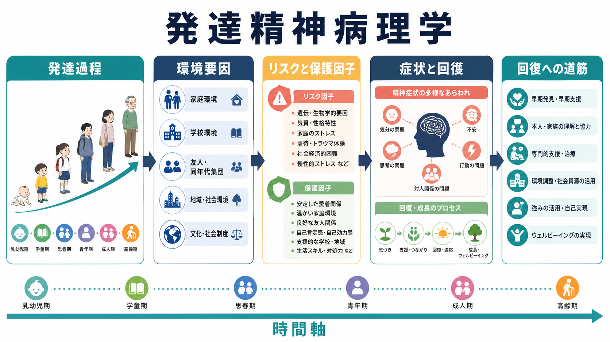
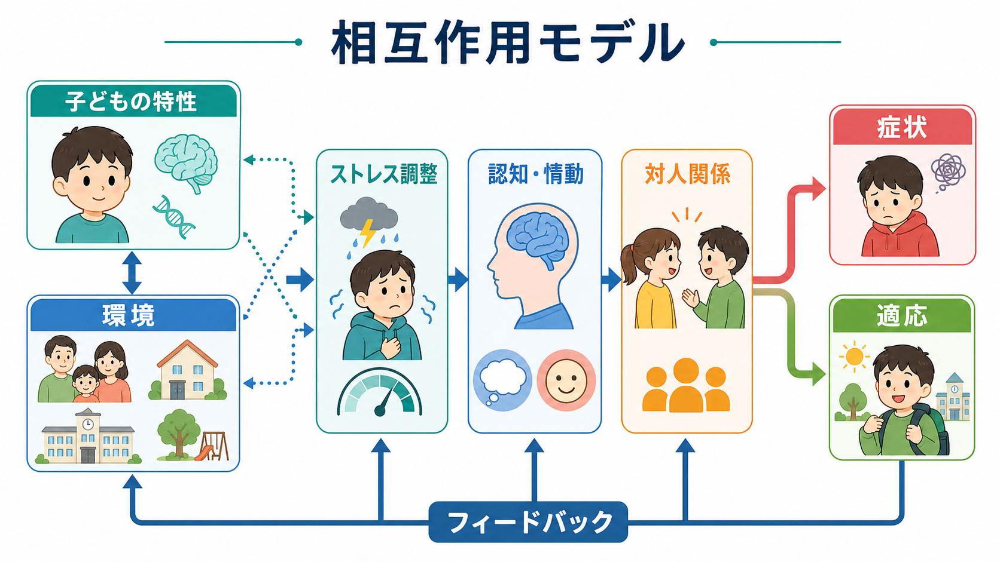
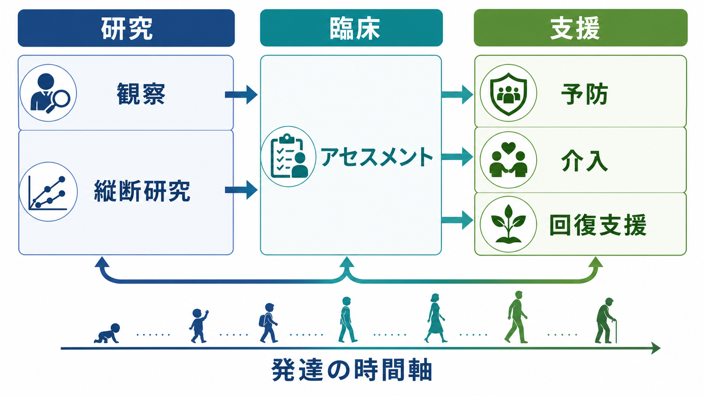

# 発達精神病理学とは何か

## 要点

- 発達精神病理学は、精神症状を「ある時点の異常」だけでなく、発達過程・環境・身体・認知・情動・対人関係が時間の中で組み合わさった結果として理解する枠組みである[1][2]。
- 中心にある問いは、「なぜ同じ逆境から異なる結果が生じるのか」「なぜ異なる経路が似た症状に到達するのか」「どの時点でどの支援が回復経路を開くのか」である[3][5]。
- 症状は固定された本質ではなく、発達課題、養育環境、学校・地域、神経発達、ストレス反応、保護因子との相互作用の中で変化する[4][6]。
- 臨床では、診断名だけでなく、発達歴、家族・学校環境、強み、保護因子、回復の機会を同時に見る視点を与える。
- 本記事は教育・研究目的の整理であり、個別の診断や治療指示を行うものではない。

## この記事で答える問い

1. 発達精神病理学は、通常の発達心理学や精神医学と何が違うのか。
2. リスク、保護因子、レジリエンス、発達経路はどのように関係するのか。
3. 同じ環境要因でも人によって症状や回復が異なるのはなぜか。
4. 研究・臨床・予防支援では、この枠組みをどのように使えるのか。

## まず結論

発達精神病理学とは、[[発達とは何か|発達]]の時間軸に沿って、適応と不適応がどのように生じ、続き、変わり、回復しうるかを調べる学際的な枠組みである。子どもだけを対象にする学問ではなく、乳幼児期から成人期までの発達過程を扱う。ただし、精神症状の多くは早期経験、養育環境、学校経験、社会的支援、神経発達、身体的ストレス反応と深く関係するため、子ども・青年期の研究が特に重要になる[1][2]。

この枠組みでは、精神症状を「脳の問題」「家庭の問題」「本人の性格」のどれか一つに還元しない。むしろ、個人の特性と環境が互いに影響しながら、注意、情動調整、対人予測、自己理解、ストレス反応、学習機会を変えていく過程を見る。したがって、[[逆境的小児期体験ACEとは何か|逆境的小児期体験]]や[[トラウマは発達にどう影響するのか|トラウマ]]があっても、必ず特定の障害になるとは考えない。逆に、目立つ逆境が見えない場合でも、発達課題と環境の不一致から困難が生じることがある。

## 背景

発達精神病理学は、発達心理学、児童精神医学、臨床心理学、精神病理学、神経科学、疫学、家族研究をつなぐ領域として形成された。Sroufe と Rutter は、この領域を、個人の適応と不適応のパターンがどのような起源と経過をたどるかを研究する分野として位置づけた[1]。Rutter と Sroufe はさらに、発達精神病理学の特徴として、因果過程、発達メカニズム、正常発達と精神病理の連続性・非連続性を同時に扱う点を強調した[2]。

この見方が重要なのは、精神症状が単純な直線因果で説明しにくいからである。たとえば、幼少期の不安定な養育は、[[愛着とは何か|愛着]]、[[内的作業モデルとは何か|内的作業モデル]]、情動調整、学校適応に影響しうる。しかし、その影響は年齢、気質、支援者、文化、貧困、差別、学校環境、治療機会によって変わる。発達精神病理学は、この複雑さを「雑音」として捨てるのではなく、まさに理解すべき対象として扱う。

## 基本概念

### 発達経路

発達経路とは、ある人が時間の中でたどる適応・不適応のパターンである。発達精神病理学では、症状の有無だけでなく、いつ、どのような文脈で、どの機能が崩れ、どの機能が保たれているかを見る[4]。

たとえば、幼児期に分離不安が強いことは、それだけで将来の不安障害を決定しない。保護者の応答、生活の安定、園や学校での経験、本人の言語化能力、友人関係によって、その不安は探索を妨げる方向にも、慎重さや安全確認の能力として組み直される方向にも進みうる。

### リスク因子と保護因子

リスク因子は、後の不適応や症状の確率を高める条件である。保護因子は、リスクの影響を弱めたり、回復経路を開いたりする条件である。発達精神病理学では、リスク因子を「原因そのもの」と見なさず、いつ、どの程度、どの保護因子と組み合わさったかを重視する。

代表的なリスクには、慢性的な虐待・ネグレクト、親の重い精神的不調、貧困、差別、学校での孤立、反復する喪失、身体疾患、神経発達上の困難がある。代表的な保護因子には、少なくとも一人の安定した大人、予測可能な生活、心理的安全性、適切な教育支援、仲間関係、自己調整を学ぶ機会がある[7]。

### レジリエンス

[[レジリエンスは発達過程でどう育つのか|レジリエンス]]は、逆境を受けても平気でいられる固定的な性格ではない。Masten は、レジリエンスを特別な能力ではなく、通常の適応システムが比較的よく働くときに生じる発達過程として論じた[7]。つまり、回復力は本人の内面だけでなく、関係、制度、教育、医療、地域資源によって支えられる。

### 多重終結性と等終結性

多重終結性とは、似た出発点から異なる結果が生じることである。たとえば、同じような家庭内ストレスを経験しても、一部の人は不安、一部の人は怒りや反抗、一部の人は目立つ症状を示さず、別の領域で困難を抱えることがある。

等終結性とは、異なる出発点から似た結果に至ることである。たとえば、抑うつ症状は、喪失体験、慢性ストレス、睡眠障害、いじめ、神経発達特性、身体疾患、社会的孤立など、複数の経路から生じうる[5]。この二つの概念は、診断名だけから原因を逆算する危険を避けるために重要である。

## 仕組み

発達精神病理学の仕組みは、個人と環境の相互作用として整理できる。

### 1. 個人特性と環境が相互に変化する

子どもの気質、感覚過敏、注意制御、言語能力、身体状態は、養育者や教師の反応を引き出す。一方で、養育者の応答性、学校の構造、友人関係、地域資源は、子どもの行動や感情調整を変える。この相互作用は一回で終わらず、日々の反復を通じて「自分は助けを求められる」「他者は危険だ」「失敗しても修正できる」といった予測を形づくる。

この意味で、[[安全基地とは何か|安全基地]]や[[養育環境は発達にどう影響するのか|養育環境]]は、単なる背景ではない。子どもが探索し、失敗し、調整し、再挑戦するための発達条件である。

### 2. 発達課題が変わると、同じ脆弱性の意味も変わる

乳幼児期には身体的安全、基本的信頼、感情の共同調整が重要になる。児童期には学校参加、仲間関係、[[実行機能は子どもでどのように発達するのか|実行機能]]、学習の成功体験が重要になる。[[思春期の脳と心理はどう変化するのか|思春期]]には自律性、アイデンティティ、親密な関係、将来展望が前景化する。

そのため、同じ衝動性や不安の強さでも、年齢と文脈によって意味が変わる。幼児期には探索の妨げとして見える特徴が、青年期には対人回避や学業不振として現れることもあれば、支援があれば慎重な判断や危険回避として働くこともある。

### 3. 発達カスケードが生じる

発達カスケードとは、ある領域の変化が別の領域へ波及し、時間をかけて累積的な影響を生む過程である[6]。たとえば、睡眠不足が注意低下を生み、注意低下が学業失敗を増やし、学業失敗が自己効力感と友人関係を損ない、さらに抑うつや不安を強めることがある。

重要なのは、カスケードは悪化だけでなく回復にも働く点である。睡眠の改善、教師との安定した関係、いじめの停止、家庭内の予測可能性、心理療法、学習支援などが一つの領域を改善すると、別の領域にもよい波及が起こりうる。

### 4. 逆境の種類によって影響経路が異なる

小児期逆境を単に「多い・少ない」で見るだけでは、メカニズムを見落とすことがある。McLaughlin らは、脅威と剥奪を区別する次元的モデルを提案し、暴力や危険の経験と、認知的・社会的入力の不足は、発達に異なる影響を及ぼしうると整理した[8]。たとえば、脅威は恐怖学習や警戒、剥奪は言語・認知刺激や社会的学習機会の不足と関連しやすい。

この見方は、[[逆境的小児期体験ACEとは何か|ACE]]を読むときにも役立つ。逆境の数だけでなく、種類、時期、持続、意味づけ、支援の有無を見なければ、実際の発達経路は理解しにくい。

## 図解

この記事では 3 枚の図を使っている。

| 図 | 役割 | 読み方 |
|---|---|---|
| 図1 | 発達精神病理学の概念地図 | 発達過程、環境要因、リスク、保護因子、症状、回復を一つの地図として見る |
| 図2 | 相互作用モデル | 個人特性と環境が、ストレス調整、認知・情動、対人関係を通じて症状や適応へつながる流れを見る |
| 図3 | 研究・臨床・支援への接続 | 縦断研究、アセスメント、予防、介入、回復支援を同じ時間軸で見る |

## 臨床・研究との接続

### 臨床への接続

臨床では、発達精神病理学は「診断名を否定する」枠組みではない。むしろ、診断を発達史と文脈の中に置き直すための視点である。たとえば、抑うつ、不安、反抗、摂食の問題、自傷、学校不適応があるとき、次のような問いを立てる。

- その困難は、いつから、どの発達課題の時期に目立ち始めたか。
- 家庭、学校、友人関係、身体疾患、睡眠、デジタル環境はどう関わっているか。
- 本人の強み、関心、安心できる関係、回復の経験はどこにあるか。
- 症状を維持しているフィードバックは何か。
- どの環境を少し変えると、発達経路が変わりうるか。

この見方は、個人を責める方向にも、家族だけを責める方向にも進みにくい。困難を、本人と環境の相互作用として見直すからである。

### 研究への接続

研究では、横断比較だけでなく縦断研究が重要になる。ある時点の脳画像、質問紙、診断名、行動指標だけでは、症状がどのように生じ、維持され、変化したかは分からない。発達精神病理学では、個人内変化、発達段階、環境変化、支援介入、文化差を含めて追跡する必要がある[2][6]。

また、単一の平均効果だけでなく、誰に、いつ、どの条件で効果があるのかを問う。これは予防・早期支援の設計にも直結する。

### 予防と支援への接続

発達精神病理学は、すでに症状が出た後の説明だけでなく、予防にも関わる。支援の焦点は、リスクを完全に消すことではなく、保護因子を増やし、悪循環を断ち、回復のカスケードを起こしやすくすることである。具体的には、安定した養育関係、学校での居場所、睡眠と生活リズム、学習支援、社会的支援、心理教育、必要に応じた専門的介入が関わる。

## よくある誤解

### 誤解1: 発達精神病理学は子どもの精神疾患だけを扱う

発達精神病理学は子ども・青年期を重視するが、子どもだけの学問ではない。成人期の症状や回復も、発達史、現在の文脈、将来の変化可能性の中で理解する。

### 誤解2: 早期経験がすべてを決める

早期経験は重要だが、すべてを決定しない。発達は可塑的であり、後の関係、学校、治療、社会的支援、本人の学習によって経路が変わる[7]。早期経験を重視することと、決定論に陥ることは違う。

### 誤解3: リスク因子があれば必ず症状が出る

リスク因子は確率を変える条件であって、個人の未来を決めるラベルではない。同じリスクでも、保護因子、文化、時期、支援、本人の意味づけによって結果は異なる。

### 誤解4: 脳の変化が見つかれば原因が確定する

脳の指標は重要だが、原因そのものとは限らない。発達精神病理学では、神経指標を、経験、行動、環境、時間の相互作用の中で読む。脳の差異を個人の固定的欠陥として扱うのは不適切である[4]。

### 誤解5: レジリエンスは本人の努力の問題である

レジリエンスは本人の努力だけでは説明できない。安定した関係、予測可能な環境、支援制度、教育機会があって初めて、本人の調整能力や主体性が働きやすくなる[7]。

## 関連ノート

- [[発達とは何か]]
- [[発達段階理論とは何か]]
- [[愛着とは何か]]
- [[安全基地とは何か]]
- [[内的作業モデルとは何か]]
- [[養育環境は発達にどう影響するのか]]
- [[トラウマは発達にどう影響するのか]]
- [[逆境的小児期体験ACEとは何か]]
- [[レジリエンスは発達過程でどう育つのか]]
- [[実行機能は子どもでどのように発達するのか]]
- [[思春期の脳と心理はどう変化するのか]]

## 理解チェック

1. 発達精神病理学は、精神症状をどのような時間軸で理解するか。
2. 多重終結性と等終結性は、それぞれ何を意味するか。
3. リスク因子と保護因子を区別して考える理由は何か。
4. 発達カスケードは、悪化だけでなく回復にも関わると言えるのはなぜか。
5. ACE やトラウマ経験を、個人の将来を決めるラベルとして使ってはいけない理由は何か。

## 参考文献

[1] Sroufe, L. A., & Rutter, M. (1984). The domain of developmental psychopathology. *Child Development, 55*(1), 17-29. https://pubmed.ncbi.nlm.nih.gov/6705619/

[2] Rutter, M., & Sroufe, L. A. (2000). Developmental psychopathology: Concepts and challenges. *Development and Psychopathology, 12*(3), 265-296. https://doi.org/10.1017/S0954579400003023

[3] Cicchetti, D., & Toth, S. L. (2009). The past achievements and future promises of developmental psychopathology: The coming of age of a discipline. *Journal of Child Psychology and Psychiatry, 50*(1-2), 16-25. https://doi.org/10.1111/j.1469-7610.2008.01979.x

[4] Sroufe, L. A. (2009). The concept of development in developmental psychopathology. *Child Development Perspectives, 3*(3), 178-183. https://doi.org/10.1111/j.1750-8606.2009.00103.x

[5] Cicchetti, D., & Rogosch, F. A. (1996). Equifinality and multifinality in developmental psychopathology. *Development and Psychopathology, 8*(4), 597-600. https://doi.org/10.1017/S0954579400007318

[6] Masten, A. S., & Cicchetti, D. (2010). Developmental cascades. *Development and Psychopathology, 22*(3), 491-495. https://doi.org/10.1017/S0954579410000222

[7] Masten, A. S. (2001). Ordinary magic: Resilience processes in development. *American Psychologist, 56*(3), 227-238. https://doi.org/10.1037/0003-066X.56.3.227

[8] McLaughlin, K. A., Sheridan, M. A., & Lambert, H. K. (2014). Childhood adversity and neural development: Deprivation and threat as distinct dimensions of early experience. *Neuroscience and Biobehavioral Reviews, 47*, 578-591. https://doi.org/10.1016/j.neubiorev.2014.10.012

## MOC更新候補

- `content/00_MOC/` 配下の発達心理学・臨床心理学・精神医学関連 MOC に、統合ジョブで本記事へのリンクを追加する。
- 並列ジョブとの衝突を避けるため、本タスクでは MOC 本体は更新しない。

## 未解決問題

- 発達精神病理学の知見を、日本の学校・地域・医療制度に合わせてどのように実装するか。
- 脳・行動・環境の多層データを、個人のラベリングではなく支援設計に使う方法は何か。
- 文化差、貧困、差別、デジタル環境が発達経路に与える影響を、どのように長期的に測定するか。
