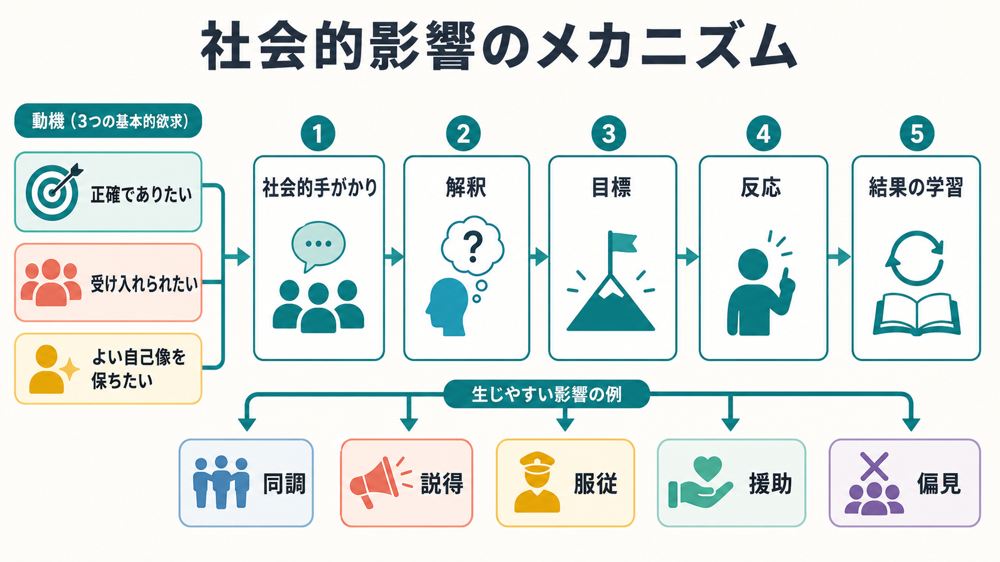
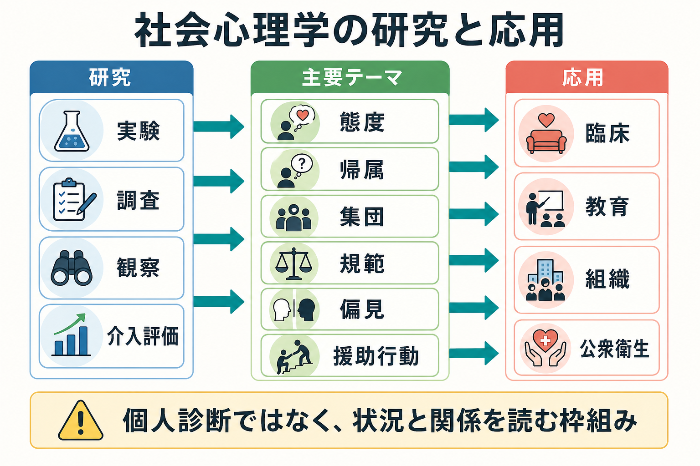

# 社会心理学とは何か

## 要点

- 社会心理学は、個人の思考、感情、行動が、他者の存在、集団、役割、規範、文化、制度からどのように影響を受けるかを研究する分野である[1]。
- 「社会」は、実際に目の前にいる他者だけでなく、想像された評価、内面化された規範、所属集団、制度的文脈としても働く。
- 社会心理学の中心には、状況の知覚、原因帰属、態度、説得、同調、服従、集団間関係、偏見、援助行動などがある[2][3][4]。
- 臨床や教育で使う場合、個人の性格だけで説明せず、役割、関係、場の圧力、選択肢、文化的背景を合わせて読むことが重要である。

## この記事で答える問い

1. 社会心理学は、何を「社会的」と呼ぶのか。
2. 他者や集団は、個人の考え方や行動をどのように変えるのか。
3. 社会心理学の知見は、研究、臨床、教育、組織理解にどう接続するのか。

## まず結論

社会心理学とは、「人は一人で考え、感じ、行動しているように見えても、その判断は他者や社会状況に深く埋め込まれている」と考える心理学である。ここでの社会状況には、目の前の人、集団の人数、権威者の指示、観察されている感覚、役割、評判、規範、文化、制度が含まれる。

重要なのは、社会心理学が「人間は弱い」「集団は危険だ」と言う分野ではないことである。むしろ、人が状況から影響を受けるからこそ、協力、援助、信頼、学習、規範の維持も可能になる。問題は、どのような状況が、どのような解釈と行動を生みやすいかを丁寧に分けて読むことである。

## 背景

社会心理学の古典的な出発点の一つは、他者の存在が個人の遂行を変えるという観察である。Triplett の競争・ペースメーカー研究は、他者と並んで行うことが作業成績に影響しうることを示し、後の社会的促進研究につながった[2]。

その後、Asch の同調実験は、明らかに誤った多数派判断でも、集団内での孤立を避ける圧力によって個人の判断が揺らぐことを示した[3]。Milgram の服従研究は、権威者、役割、実験状況の設計が、個人の道徳判断と行動の距離を広げうることを示した[4]。これらの古典研究は、倫理的基準からは現在そのまま再現できない側面を含むが、個人特性だけでは行動を説明しきれないという問題意識を明確にした。

## 基本概念

### 社会的状況

社会的状況とは、他者の実在だけではない。誰かに見られていると思うこと、所属集団の規範を意識すること、職場や学校での役割を担うこと、SNS 上の反応を予測することも社会的状況である。つまり社会心理学では、環境を単なる背景ではなく、認知と行動を組織する条件として扱う。

### 社会的認知

[[社会的認知とは何か|社会的認知]]は、他者の意図、感情、信念、性格、関係性を推測する働きである。これは[[心の理論とは何か|心の理論]]や[[共感は認知機能としてどう理解できるのか|共感]]と重なるが、社会心理学ではさらに、ステレオタイプ、第一印象、帰属、集団カテゴリー、文化的規範が判断をどう方向づけるかを扱う。

### 態度と説得

態度とは、対象に対する評価的な傾向である。人は、ある政策、人物、集団、行動、商品、治療法について、好ましい、危険だ、正しい、不快だといった評価をもつ。態度は行動を予測することもあるが、常に一致するわけではない。行動は、態度だけでなく、周囲の期待、選択肢、時間的余裕、社会的コスト、自己像によって変わる。

### 帰属

帰属とは、出来事や行動の原因をどこに置くかである。人は他者の行動を見ると、性格や意図のせいだと考えやすい一方で、状況要因を見落とすことがある。Gilbert と Malone は、この傾向を対応バイアスとして整理し、行為者の置かれた制約を十分に補正できないことが原因帰属を歪めると論じた[5]。これは[[認知バイアスとは何か|認知バイアス]]の一例としても読める。

### 集団と社会的アイデンティティ

人は、自分を「個人」としてだけでなく、「ある集団の一員」として理解する。社会的アイデンティティ理論では、所属集団への同一化が、自尊感情、内集団びいき、外集団評価、差別、連帯に関わると考える[6]。これは[[アイデンティティとは何か|アイデンティティ]]の社会的側面であり、個人内の自己理解と集団間関係をつなぐ。

## 仕組み

社会的影響は、単に「周囲に流される」ことではない。多くの場合、次のような過程として働く。

| 過程 | 何が起きるか | 例 |
|---|---|---|
| 社会的手がかり | 他者の表情、人数、地位、反応、沈黙を読む | 会議で誰が賛成しているかを見る |
| 解釈 | その場の意味を推測する | 「これは反対しにくい雰囲気だ」と読む |
| 目標 | 正確さ、所属、自己像、安全を調整する | 間違えたくない、浮きたくない |
| 反応 | 発言、沈黙、同調、抵抗、援助を選ぶ | 多数派に合わせる、質問する |
| 学習 | 結果から次の場面の予測を更新する | 反対しても大丈夫だったと学ぶ |

この過程には少なくとも三つの動機が関わる。第一に、正確でありたいという動機である。他者が有用な情報源に見えると、その判断を参考にする。第二に、受け入れられたいという動機である。所属や評判が重要な場面では、集団規範に合わせやすい。第三に、よい自己像を保ちたいという動機である。自分は公平で、有能で、善良だと思いたい欲求は、態度や説明の仕方に影響する。

## 図解

上の図は、社会心理学を「個人の内面を否定する分野」ではなく、「個人と状況の相互作用を読む分野」として整理している。実験、調査、観察、介入評価は、それぞれ異なる強みをもつ。実験は因果推論に強いが、人工的状況になりやすい。調査は大規模な関連を捉えやすいが、因果方向の解釈には注意が必要である。観察やフィールド研究は自然な文脈を捉えやすいが、交絡要因の統制が難しい。

## 臨床・研究との接続

臨床や教育では、社会心理学は「本人の性格」だけで問題を説明しないための補助線になる。たとえば、対人不安、怒り、回避、孤立、家族内葛藤、職場のハラスメント、差別経験を考えるとき、個人の認知や感情だけでなく、相手の反応、役割、権力差、集団規範、選択肢の少なさを同時に見る必要がある。

ただし、社会心理学の知見を個人診断に直結させてはいけない。Asch や Milgram の古典研究が示したのは、特定の人が「同調しやすい」「服従的だ」と決めつけることではなく、状況の設計が多くの人の行動を変えうるという点である[3][4]。したがって、臨床・教育・組織支援では、「この人はこういう性格だ」と固定するより、「どの状況で、どの選択肢が見えなくなり、どの規範が働いているのか」を問う方が安全である。

研究面では、社会心理学は再現性、文化差、測定方法の問題とも向き合っている。社会的影響や態度変容は、時代、文化、サンプル、課題の細部に左右される。Cialdini と Goldstein のレビューが整理するように、同調、服従、説得、コンプライアンスは一つのメカニズムではなく、正確さ、所属、自己概念など複数の動機から生じる[7]。このため、単一の有名実験だけで人間観を作るのではなく、複数研究の蓄積と限界を合わせて読む必要がある。

## よくある誤解

### 社会心理学は「集団心理」だけを扱う

違う。集団は重要なテーマだが、社会心理学は一対一の対人認知、態度、自己、感情、説得、援助行動、偏見、文化差も扱う。むしろ、個人と状況の接点を広く扱う分野である。

### 人は状況に操られるだけである

これも単純すぎる。人は状況から影響を受けるが、状況を解釈し、抵抗し、作り替えることもできる。[[主体感とは何か|主体感]]や自己制御の研究と接続すると、社会的影響は「自由意志の否定」ではなく、行為が成立する条件の分析として読める。

### 偏見は悪意のある人だけの問題である

偏見には明示的な敵意だけでなく、カテゴリー化、ステレオタイプ、制度的慣行、資源配分の偏りが関わる。ステレオタイプ内容モデルは、集団が「温かさ」と「有能さ」の次元で評価され、その評価が感情や差別的行動に結びつくことを示した[8]。したがって、偏見の理解には、個人の意図だけでなく、制度と文化の水準も必要である。

## 関連ノート

- [[社会的認知とは何か]]
- [[心の理論とは何か]]
- [[共感は認知機能としてどう理解できるのか]]
- [[認知バイアスとは何か]]
- [[アイデンティティとは何か]]
- [[観察学習とは何か]]
- [[ナッジとは何か]]
- [[主体感とは何か]]

### MOC更新候補

- `content/00_MOC/MOC｜認知科学・心理学.md`
- `content/00_MOC/MOC｜認知機能.md`

並列ジョブとの競合を避けるため、本記事では MOC 本体の更新は行わない。

## 理解チェック

1. 社会心理学でいう「社会状況」には、目の前の他者以外に何が含まれるか。
2. 同調は、単に「弱さ」として説明できない。なぜか。
3. 対応バイアスは、他者理解をどのように歪めるか。
4. 社会的アイデンティティは、個人の自己理解と集団間関係をどのようにつなぐか。
5. 臨床・教育で社会心理学を使うとき、個人診断と混同しないために何に注意すべきか。

## 参考文献

[1] American Psychological Association. APA Dictionary of Psychology: Social psychology. https://dictionary.apa.org/social-psychology

[2] Triplett, N. (1898). The dynamogenic factors in pacemaking and competition. *The American Journal of Psychology, 9*(4), 507-533. https://doi.org/10.2307/1412188

[3] Asch, S. E. (1956). Studies of independence and conformity: I. A minority of one against a unanimous majority. *Psychological Monographs: General and Applied, 70*(9), 1-70. https://doi.org/10.1037/h0093718

[4] Milgram, S. (1963). Behavioral study of obedience. *Journal of Abnormal and Social Psychology, 67*(4), 371-378. https://doi.org/10.1037/h0040525

[5] Gilbert, D. T., & Malone, P. S. (1995). The correspondence bias. *Psychological Bulletin, 117*(1), 21-38. https://doi.org/10.1037/0033-2909.117.1.21

[6] Tajfel, H., & Turner, J. C. (1979). An integrative theory of intergroup conflict. In W. G. Austin & S. Worchel (Eds.), *The Social Psychology of Intergroup Relations* (pp. 33-47). https://psycnet.apa.org/record/1980-05651-004

[7] Cialdini, R. B., & Goldstein, N. J. (2004). Social influence: Compliance and conformity. *Annual Review of Psychology, 55*, 591-621. https://doi.org/10.1146/annurev.psych.55.090902.142015

[8] Fiske, S. T., Cuddy, A. J. C., Glick, P., & Xu, J. (2002). A model of stereotype content: Competence and warmth respectively follow from perceived status and competition. *Journal of Personality and Social Psychology, 82*(6), 878-902. https://doi.org/10.1037/0022-3514.82.6.878

## 未解決問題

- 社会心理学の古典的知見は、現代のオンライン環境や多文化環境でどの程度同じ形で働くのか。
- 実験室で測られる同調や偏見の指標は、日常生活の行動をどの程度予測するのか。
- 個人の認知過程、対人相互作用、制度的条件を、同じ研究設計の中でどう統合できるのか。

