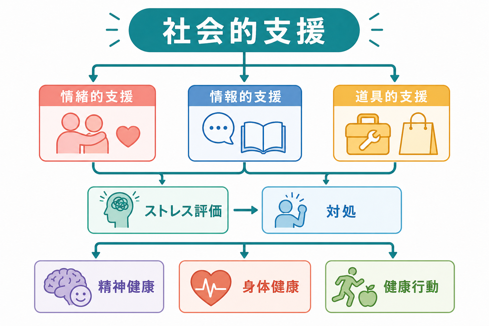
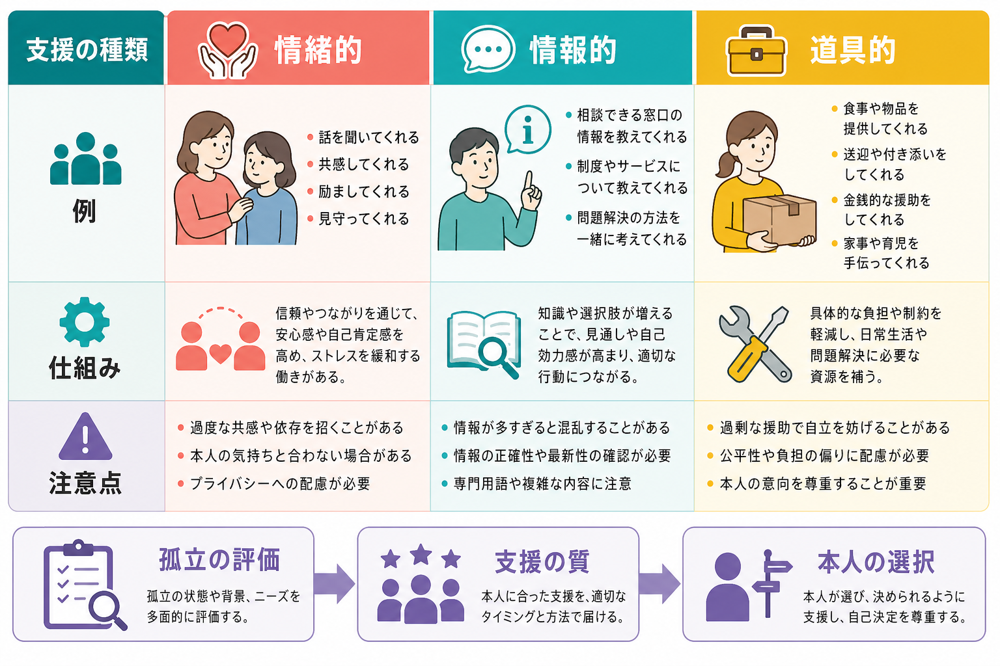
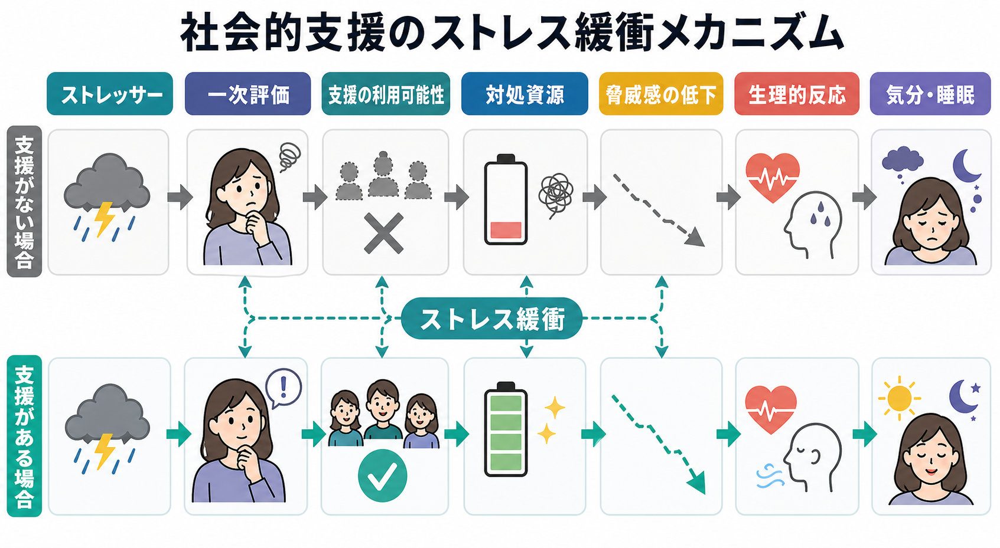

# 社会的支援は健康にどう影響するのか

## 要点

- 社会的支援とは、人間関係がもたらす「機能」のことであり、代表的には情緒的支援、情報的支援、道具的支援に分けられる。
- 健康への影響には、支援がふだんから健康を支える「主効果」と、ストレス時に悪影響を弱める「ストレス緩衝効果」がある [1]。
- 支援は、安心感、所属感、自己効力感、対処の選択肢、健康行動、神経内分泌・免疫・循環器反応などを通じて、精神健康と身体健康の両方に関わる [2][5][6]。
- ただし、支援は「多ければよい」だけではない。本人のニーズ、関係の質、プライバシー、自律性、支援する側の負担を考える必要がある。

## この記事で答える問い

1. 社会的支援とは何か。
2. 情緒的・情報的・道具的支援は、それぞれ何を支えるのか。
3. なぜ社会的支援はストレスや健康に効くのか。
4. 臨床・研究では、社会的支援をどう扱えばよいのか。

## まず結論

社会的支援は、単に「人が周りにいること」ではない。重要なのは、必要なときに頼れると感じられること、実際に適切な助けが届くこと、そしてその関係が本人の尊厳や選択を損なわないことである。

古典的な整理では、社会的支援は健康に二つの経路で影響する。第一に、広い社会的ネットワークや所属は、日常的な意味づけ、役割、健康行動を支える。第二に、ストレスが強い場面では、支援が脅威の評価を下げ、対処資源を増やし、心理・生理的負荷を弱める [1][2]。

## 背景

社会的支援は、[[社会心理学とは何か]]、健康心理学、社会疫学、精神医学で共有される重要概念である。人間関係は、うつ、不安、孤独感、睡眠、健康行動、慢性疾患の経過、死亡リスクなど、多様なアウトカムと関連してきた。

大規模メタ分析では、強い社会的関係をもつ人は生存可能性が高く、社会的関係の影響は古典的な健康リスク因子と比較できる大きさだと報告された [3]。また、社会的孤立や孤独は全死亡リスクや心血管死亡リスクと関連することが、近年の90コホート研究のメタ分析でも示されている [4]。

ただし、これらは多くが観察研究である。社会的支援が健康を「直接」改善する面もあるが、健康状態、社会経済状況、性格、地域資源、文化的規範などが支援の受けやすさと健康の両方に影響する。したがって、記事内では「関連」「影響しうる経路」「介入上の示唆」を区別して読む必要がある。

## 基本概念

### 社会的支援

社会的支援とは、家族、友人、同僚、近隣、専門職、ピアなどから得られる心理的・実践的資源である。社会関係を考えるときは、少なくとも三つを分けるとわかりやすい [2]。

| 概念 | 見ているもの | 例 |
|---|---|---|
| 社会的ネットワーク | 関係の構造 | 家族数、友人数、所属集団、連絡頻度 |
| 社会的統合 | 役割や参加の広がり | 職場、学校、地域、趣味、宗教・市民活動 |
| 社会的支援 | 関係が提供する機能 | 慰め、助言、情報、送迎、家事、金銭的援助 |

### 情緒的支援

情緒的支援は、話を聞く、共感する、励ます、見守る、存在を肯定する支援である。本人が「一人ではない」「理解されている」と感じられると、ストレス状況の脅威性が下がり、感情調整や睡眠にもよい方向に働きうる [1][5]。

[[愛着とは何か]]や[[安全基地とは何か]]で扱うように、頼れる他者の存在は探索や対処を可能にする基盤でもある。成人の社会的支援も、広い意味では「必要時に戻れる安全基地」として働く。

### 情報的支援

情報的支援は、問題理解、選択肢、制度、受診先、対処法、経験知を伝える支援である。情報は、状況の見通しを作り、自己効力感を高め、適切な行動を選びやすくする。

一方で、情報が多すぎる、正確でない、本人の価値観と合わない場合には、かえって混乱や無力感を強めることがある。支援では、情報量だけでなく、タイミングと本人の理解可能性が重要である。

### 道具的支援

道具的支援は、家事、送迎、食事、金銭、書類手続き、育児、介護、受診同行などの具体的な助けである。これはストレス源そのものを減らしたり、回復に必要な時間とエネルギーを確保したりする。

ただし、道具的支援が本人の選択や自立を奪う形になると、支援される側の自己効力感を下げることがある。支援の量だけでなく、本人が「自分で選べている」と感じられる形が大切である。

## 仕組み

### 1. 主効果モデル

主効果モデルでは、社会的関係や支援は、ストレスの有無にかかわらず健康に関わると考える。社会的統合は、生活リズム、役割、所属感、意味、健康行動、受診行動を支える。たとえば、周囲の人が睡眠、運動、服薬、受診を促すことは、健康行動の維持に関わる [2][5]。

この経路は、孤立していない人が「常に守られている」という単純な話ではない。むしろ、社会的関係が日常生活の中に小さなフィードバックを作り、行動と意味づけを持続させると考えると理解しやすい。

### 2. ストレス緩衝モデル

ストレス緩衝モデルでは、支援はストレスが高いときほど効く。Cohen と Wills の古典的レビューは、支援が「主効果」と「緩衝効果」の両方をもちうるが、緩衝効果はとくに、ストレス状況に合った機能的支援を本人が利用可能だと感じる場合に見えやすいと整理した [1]。

ストレスの悪影響は、出来事そのものだけで決まらない。出来事をどれほど脅威と評価するか、自分に対処できる資源があると感じるかが重要である。社会的支援は、この評価過程と対処過程の両方に入る。

### 3. 心理的経路

社会的支援は、所属感、自己肯定感、統制感、役割、意味、共感、類似経験者からの学習などを通じて心理的健康に関わる [5]。ここでいう統制感とは、状況を完全に支配できるという意味ではなく、「何かできることがある」と感じられることに近い。

この点は[[レジリエンスは発達過程でどう育つのか]]とも接続する。レジリエンスは個人の内面だけでなく、頼れる関係、資源へのアクセス、環境調整によって支えられる。

### 4. 生理的経路

社会的支援は、ストレス反応に関連する[[HPA軸は精神疾患にどう関わるのか]]、自律神経、炎症、免疫、循環器反応に影響しうる。Uchino は、知覚された支援と実際に受けた支援を区別しながら、社会的支援と身体健康の関連をライフスパンの中で理解する必要を論じている [6]。

ここでも注意が必要である。生理的経路は「優しい言葉が直接病気を治す」という意味ではない。ストレス反応、健康行動、医療アクセス、生活条件が長期に積み重なることで、健康アウトカムに差が生じうるという理解が妥当である。

## 図解

この記事の図は三つの用途で読むとよい。

| 図 | 読み方 |
|---|---|
| 全体像 | 支援の種類と健康アウトカムの対応を見る |
| ストレス緩衝 | 支援がストレス評価と対処資源に入る位置を見る |
| 種類と注意点 | 支援を設計・評価するときの具体例を見る |

重要なのは、「支援の種類」と「本人の困りごと」を対応させることである。喪失や孤独には情緒的支援が、制度利用には情報的支援が、生活負担には道具的支援が必要になりやすい。ただし、現実の支援はしばしば混ざっている。受診に付き添うことは道具的支援であると同時に、安心をもたらす情緒的支援にもなる。

## 臨床・研究との接続

臨床では、社会的支援を「家族がいるか」だけで評価しない。支援の質、本人が頼れると感じているか、支援が本人の負担になっていないか、危険な関係や支配的関係がないかを確認する必要がある。医療・精神医学の文脈では、ここでの記述は教育・研究目的であり、個別の診断や治療指示ではない。

研究では、少なくとも次の区別が重要である。

| 区別 | 研究上の意味 |
|---|---|
| 客観的孤立と主観的孤独 | 人が少ないことと、孤独を感じることは同じではない |
| 知覚された支援と受けた支援 | 「頼れると思える」ことと「実際に援助を受けた」ことは別の測定概念 |
| 構造と機能 | ネットワークの大きさと、そこから得られる支援は別 |
| 支援の利益とコスト | 支援には安心だけでなく依存、干渉、負担、プライバシー問題もある |

公衆衛生では、社会的孤立と孤独は高齢者に限らず重要な課題である。WHO は、高齢者の社会的孤立・孤独を健康と政策の課題として扱い、地域・医療・デジタル技術・政策を組み合わせた対応の必要性を強調している [7]。

## よくある誤解

### 誤解1: 友人や家族が多ければ健康になる

人数は一部の指標にすぎない。関係の質、頼れる感覚、役割、相互性、葛藤の少なさが重要である。多い関係がすべて支援的とは限らない。

### 誤解2: 支援は弱い人だけに必要である

支援は弱さの補填ではなく、人間が環境に適応するための資源である。専門職、研究者、親、学生、患者、支援者自身も、状況によって支援を必要とする。

### 誤解3: 情緒的支援だけで十分である

話を聞くことは重要だが、制度情報、受診調整、家事・育児・介護の負担軽減が必要な場面も多い。逆に、具体的援助だけで、本人の感情が置き去りになることもある。

### 誤解4: 支援介入は単純に増やせばよい

支援のミスマッチは逆効果になりうる。本人が望まない助言、過剰な監視、過度な共感、支配的な援助は、ストレスを増やす場合がある。

## 関連ノート

- [[社会心理学とは何か]]
- [[愛着とは何か]]
- [[安全基地とは何か]]
- [[レジリエンスは発達過程でどう育つのか]]
- [[トラウマは発達にどう影響するのか]]
- [[HPA軸は精神疾患にどう関わるのか]]
- [[ノルアドレナリンは覚醒とストレスにどう関わるのか]]
- [[レジリエンスは脳内でどう支えられているのか]]

## MOC更新候補

- `content/00_MOC/` 配下の社会心理学・健康心理学・精神医学関連 MOC に、本記事 `[[社会的支援は健康にどう影響するのか]]` を追加する候補。
- 並列生成ジョブとの衝突を避けるため、本ジョブでは MOC 本体は更新しない。

## 理解チェック

1. 社会的ネットワーク、社会的統合、社会的支援はどう違うか。
2. 情緒的支援、情報的支援、道具的支援の例をそれぞれ一つずつ挙げられるか。
3. 主効果モデルとストレス緩衝モデルの違いを説明できるか。
4. なぜ「支援が多いほどよい」とは限らないのか。
5. 臨床や研究で、知覚された支援と実際に受けた支援を分ける理由は何か。

## 参考文献

[1] Cohen, S., & Wills, T. A. (1985). Stress, social support, and the buffering hypothesis. *Psychological Bulletin, 98*(2), 310-357. https://doi.org/10.1037/0033-2909.98.2.310

[2] Berkman, L. F., Glass, T., Brissette, I., & Seeman, T. E. (2000). From social integration to health: Durkheim in the new millennium. *Social Science & Medicine, 51*(6), 843-857. https://doi.org/10.1016/S0277-9536(00)00065-4

[3] Holt-Lunstad, J., Smith, T. B., & Layton, J. B. (2010). Social relationships and mortality risk: A meta-analytic review. *PLOS Medicine, 7*(7), e1000316. https://doi.org/10.1371/journal.pmed.1000316

[4] Wang, F., Gao, Y., Han, Z., et al. (2023). A systematic review and meta-analysis of 90 cohort studies of social isolation, loneliness and mortality. *Nature Human Behaviour, 7*, 1307-1319. https://doi.org/10.1038/s41562-023-01617-6

[5] Thoits, P. A. (2011). Mechanisms linking social ties and support to physical and mental health. *Journal of Health and Social Behavior, 52*(2), 145-161. https://doi.org/10.1177/0022146510395592

[6] Uchino, B. N. (2009). Understanding the links between social support and physical health: A life-span perspective with emphasis on the separability of perceived and received support. *Perspectives on Psychological Science, 4*(3), 236-255. https://doi.org/10.1111/j.1745-6924.2009.01122.x

[7] World Health Organization. (2021). *Social isolation and loneliness among older people: Advocacy brief*. World Health Organization. https://iris.who.int/handle/10665/343206

[8] House, J. S., Landis, K. R., & Umberson, D. (1988). Social relationships and health. *Science, 241*(4865), 540-545. https://doi.org/10.1126/science.3399889

## 未解決問題

- どの種類の支援が、どのライフステージ・疾患・文化圏で最も有効かは、まだ一律には言えない。
- SNSやオンラインコミュニティは、孤独を減らす場合もあれば、比較や過剰情報で負担を増やす場合もある。
- 支援介入では、本人、家族、地域、専門職、制度のどこに働きかけるのが最も効果的かを、文脈ごとに検討する必要がある。
