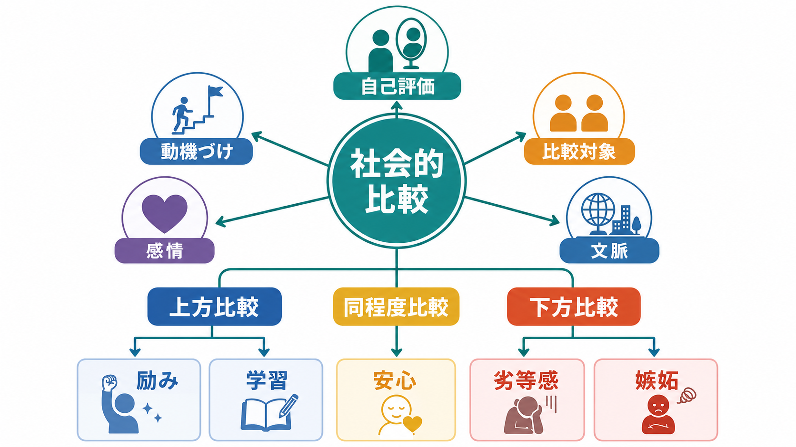
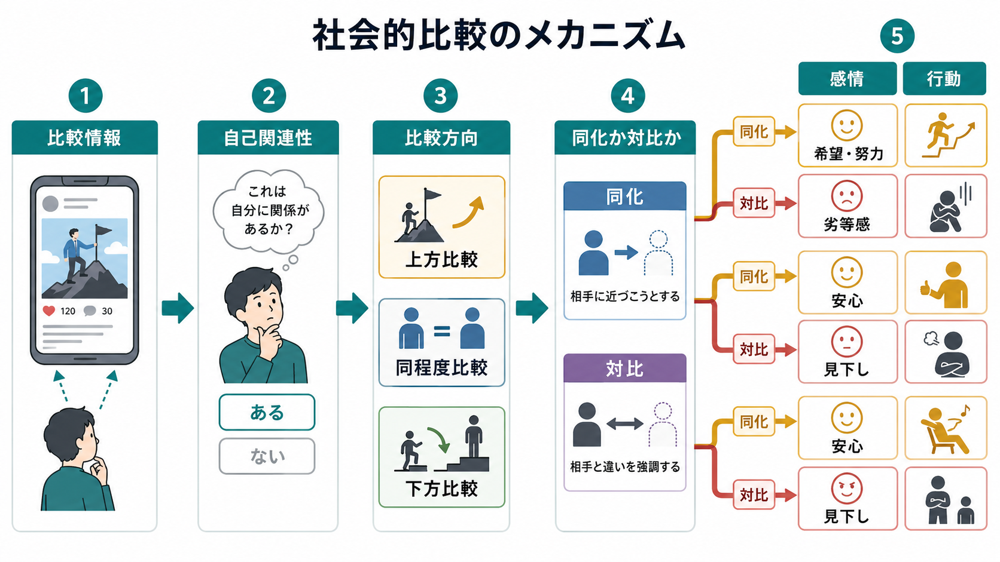
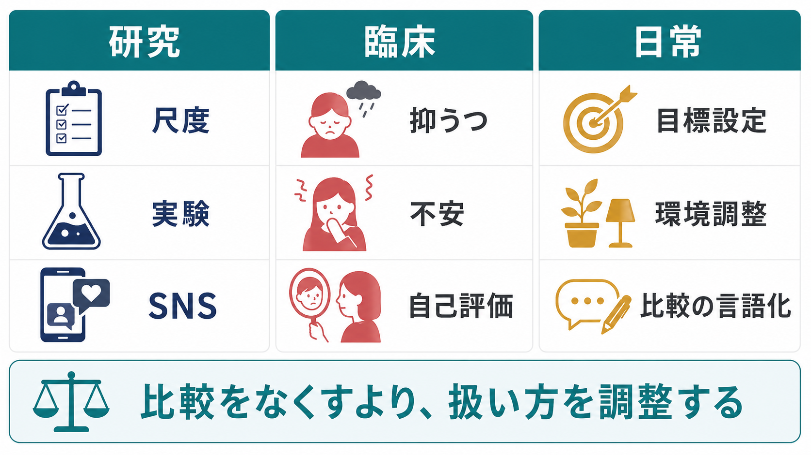

# 社会的比較とは何か

## 要点

- 社会的比較とは、自分の能力、意見、成功、魅力、生活状況、価値を、他者や集団の情報と照らし合わせて理解する心理過程である。
- Festingerの古典理論では、人は客観的な基準が乏しいとき、自分の能力や意見を評価するために他者を参照すると考えられた[1]。
- 比較は「上方比較」「下方比較」「同程度比較」に分けられるが、上方比較が常に悪く、下方比較が常に良いわけではない。結果は、比較対象との距離、同化か対比か、本人の目標、文脈によって変わる[2][3]。
- SNSは、他者の選択的な自己呈示に触れやすく、上方比較・嫉妬・自己評価低下を起こしやすい条件を作ることがある。ただし、因果関係は利用様式や個人差に依存する[7][8]。
- 臨床・教育・支援では、比較を単に「やめさせる」のではなく、比較が何を守り、何を傷つけ、どの行動に結びついているのかを言語化することが重要である[6][8]。

## この記事で答える問い

1. 社会的比較とは、どのような心理過程なのか。
2. 上方比較・下方比較・同程度比較は、自己評価・動機づけ・感情にどう影響するのか。
3. 比較はなぜ、ときに励みになり、ときに劣等感や嫉妬を強めるのか。
4. SNS、抑うつ、不安、教育・臨床支援では、社会的比較をどう扱うべきか。

## まず結論

社会的比較は、単なる「人と比べる悪い癖」ではない。むしろ、人が自分の位置、能力、価値、可能性を理解するための基本的な認知・[[自己評価はどのように形成されるのか|自己評価]]の仕組みである。試験の点数、職場での成果、容姿、友人関係、育児、病気からの回復、SNS上の生活投稿など、客観的な基準が曖昧な領域ほど、他者は「ものさし」になりやすい[1][2]。

ただし、比較の影響は一方向ではない。自分より優れた相手を見る上方比較は、希望や学習を促すこともあれば、劣等感や嫉妬を強めることもある。自分より困難な相手を見る下方比較は、安心や感謝をもたらすこともあれば、見下しや回避を生むこともある[3][4]。重要なのは、比較そのものではなく、「誰と、どの次元で、何のために比べ、その結果をどう解釈するか」である。

## 背景

社会的比較理論の出発点は、Leon Festingerが1954年に提案した「社会的比較過程の理論」である。Festingerは、人には自分の意見や能力を評価したいという動機があり、物理的・客観的な基準が利用できないときには、他者との比較によって自己評価を行うと考えた[1]。

たとえば、身長や体重は数値で測れる。しかし「自分は十分に努力しているのか」「自分の考えは妥当なのか」「この不安は普通なのか」「自分は同年代より遅れているのか」といった問いには、客観的な基準が存在しにくい。このとき、同級生、同僚、友人、家族、同じ診断を持つ人、SNS上の他者が、評価の基準として現れる。

その後の研究は、Festingerの理論を拡張した。Woodは、社会的比較は中立的な自己評価だけでなく、自己高揚、自己改善、情動調整、所属確認など、複数の目的に使われると整理した[2]。BuunkとGibbonsは、社会的比較研究が、下方比較、社会的認知、個人差、健康心理学、組織行動、神経科学的関心へ広がったことをレビューしている[5]。

## 基本概念

### 比較方向

社会的比較で最も基本になるのは、比較対象との相対的位置である。

| 比較方向 | 意味 | 典型的な効果 | 注意点 |
|---|---|---|---|
| 上方比較 | 自分より優れている、恵まれている、進んでいる相手と比べる | 目標、学習、希望、努力 | 距離が遠すぎると劣等感・嫉妬・無力感が強まる |
| 下方比較 | 自分より困難な状況、低い成績、少ない資源の相手と比べる | 安心、感謝、自己防衛 | 見下し、現実回避、偏見に結びつくことがある |
| 同程度比較 | 自分と似た相手と比べる | 妥当性確認、所属感、予測 | 同調圧力や過度な標準化を強めることがある |

下方比較理論では、否定的感情や脅威を経験している人が、自分より不利な相手と比べることで主観的ウェルビーイングを守ることがあるとされた[3]。一方で、TaylorとLobelは、脅威下の人が「自己評価」では下方の相手を参照しつつ、「情報」や「接触」では上方の相手を求めることを示した。つまり、同じ人の中でも、安心したいときと改善の手がかりが欲しいときで、必要な比較対象は異なる[4]。

### 比較次元

比較は一つの軸だけで起こるわけではない。学力、仕事、収入、外見、健康、親密性、子育て、創造性、道徳性、精神的安定など、どの次元を切り出すかによって結論は変わる。

たとえば、同じ友人を見ても、「仕事では自分より先に進んでいる」と感じる一方で、「人間関係では自分の方が安定している」と感じることがある。このように比較は、相手全体ではなく、特定の側面を選択して行われる。ここには[[認知バイアスとは何か|認知バイアス]]や注意の偏りが入りやすい。

### 比較志向

人には、他者と比較しやすい程度の個人差がある。GibbonsとBuunkは、社会的比較志向を測定する尺度としてIowa-Netherlands Comparison Orientation Measureを開発し、比較傾向が比較行動を予測することを示した[6]。比較志向が高い人は、他者情報を自己評価の材料として使いやすい。そのため、目標設定や学習に役立つこともあるが、評価不安や反すうを強める場合もある。

## 仕組み

社会的比較は、次のような流れとして理解しやすい。

1. 他者の情報に触れる。
2. その情報が自分に関係あるかを判断する。
3. 自分より上か、下か、近いかを分類する。
4. 相手に近づけそうだと感じるか、相手との差を強調して感じるかが分かれる。
5. 感情、自己評価、行動が変わる。

この流れで重要なのが、「同化」と「対比」である。同化とは、相手を自分の可能性として取り込み、「自分も近づける」「参考になる」と感じることを指す。対比とは、相手との差が強調され、「自分とは違う」「自分は劣っている」と感じることを指す。上方比較でも同化が起これば希望や努力につながるが、対比が強ければ劣等感や嫉妬につながりやすい。下方比較でも、同化が起これば「自分も悪化するかもしれない」という不安になり、対比が起これば「自分はまだ大丈夫」という安心になる。

比較の結果を左右する条件は少なくとも四つある。

第一に、比較対象との心理的距離である。少し先を行く相手はモデルになりやすいが、あまりに遠い相手は自分との差を強調しやすい。

第二に、比較次元の可変性である。努力や練習で変えられる領域では、上方比較は目標や[[自己効力感とは何か|自己効力感]]を支えやすい。一方、変えにくいと感じている領域では、比較は固定的な劣等感になりやすい。

第三に、本人の現在の状態である。疲労、孤立、失敗直後、抑うつ気分があるときには、同じ比較情報でも脅威として処理されやすい。

第四に、比較が自発的か強制的かである。自分で選んだ比較は学習資源になりやすいが、ランキング、通知、評価制度、SNSのフィードなど、環境から押しつけられる比較は、回避しにくく負荷が高い[2][5]。

## 図解

社会的比較は、研究では尺度・実験・SNSログなどで測定され、臨床では抑うつ、不安、自己評価、嫉妬、恥、反すうなどと結びついて検討される。日常的には、比較を消すよりも、比較の対象、頻度、意味づけ、行動へのつながりを調整する方が実践的である。

| 場面 | 比較が役立つ例 | 比較が苦しくなる例 | 調整の視点 |
|---|---|---|---|
| 学習 | 少し先の人の方法を真似る | 成績順位だけで価値を判断する | 方法・努力・環境に分解する |
| 仕事 | 熟練者の基準を知る | 同僚の成果を自分の無価値さの証拠にする | 比較次元を限定し、行動目標に戻す |
| SNS | 情報収集、つながり、ロールモデル | 選択的自己呈示を現実全体と誤認する | 閲覧時間、対象、感情反応を観察する |
| 臨床 | 患者同士の経験共有で希望を得る | 症状や回復速度を比べて絶望する | 個別の背景・経過・支援資源を確認する |

## 臨床・研究との接続

社会的比較は、抑うつや不安を理解するうえで重要な過程である。McCarthyとMorinaのシステマティックレビュー・メタ分析は、臨床的・亜臨床的サンプルにおける社会的比較と抑うつ・不安の関連を検討し、社会的比較過程が心理的ウェルビーイングや感情の変動を理解する手がかりになると整理している[8]。ただし、これは「比較する人は病気である」という意味ではない。比較は一般的な心理過程であり、問題になるのは、比較が硬直し、自己批判、回避、孤立、反すうに結びつく場合である。

SNS研究では、他者の肯定的な自己呈示に触れることで上方比較が増え、自己評価が低下する可能性が示されている。Vogelらは、Facebook利用と自己評価の関係を調べ、上方比較情報への接触が自己評価低下に関わることを報告した[7]。Appelらのレビューも、SNS上の受動的閲覧、社会的比較、嫉妬、抑うつの関連を整理しているが、同時に因果関係はまだ十分に確立されておらず、利用様式や研究方法の違いを慎重に扱う必要があると述べている[8]。

臨床・支援場面で大切なのは、比較を道徳的に責めないことである。「比べない方がいい」と言われても、本人はすでに比べてしまっていることが多い。むしろ、次のように具体化する方が役に立つ。

- 誰と比べているのか。
- どの次元で比べているのか。
- 比較のあと、どの感情が出るのか。
- その比較は、行動を助けているのか、止めているのか。
- 比較対象は現実の全体像か、選択的に見えている一部か。
- 比較を、自己価値の判定ではなく、情報収集や目標調整に変えられるか。

この観点は、抑うつ、不安、[[青年期のアイデンティティ形成とは何か]]、[[自己概念とは何か]]とも接続する。青年期や若年成人期では、学業、外見、恋愛、SNS、進路、所属集団の比較が[[アイデンティティとは何か|アイデンティティ]]形成に関わりやすい。比較は発達上自然な過程である一方、孤立、いじめ、差別、貧困、慢性疾患などの文脈では、自己責任化されやすいため注意が必要である。

## よくある誤解

### 誤解1: 社会的比較は悪いものなので、なくすべきである

社会的比較は、自己評価、学習、所属確認、危険予測に関わる基本的な認知過程である。問題は比較そのものではなく、比較が自己価値の全体判定になり、柔軟性を失うことである。

### 誤解2: 上方比較は必ず劣等感を生む

上方比較は、相手を到達可能なモデルとして見られるとき、学習や希望を支える。劣等感が強まるのは、相手との差が固定的・絶対的に解釈されるときである[4]。

### 誤解3: 下方比較は必ず安心を生む

下方比較は、安心や自己防衛に役立つことがある[3]。しかし、自分も同じ状況になるかもしれないと感じると不安を強める。また、他者への見下しや偏見を正当化する方向に働くこともある。

### 誤解4: SNSで見える生活は、その人の現実全体である

SNS上の投稿は、生活の一部が選択され、編集され、文脈から切り離されて提示された情報である。そこに自分の日常全体を重ねると、不利な比較が起こりやすい[7][8]。

## 関連ノート

- [[自己評価はどのように形成されるのか]]
- [[自己概念とは何か]]
- [[自己効力感とは何か]]
- [[認知バイアスとは何か]]
- [[青年期のアイデンティティ形成とは何か]]
- [[アイデンティティとは何か]]

今後の作成・接続候補:

- うつ病とは何か
- 不安症群とは何か
- インターネット依存とは何か
- いじめは精神健康にどう影響するのか

## MOC更新候補

- `content/00_MOC/` 配下の認知科学・心理学系MOC、社会心理学系MOC、自己・感情・発達系MOCに `[[社会的比較とは何か]]` を追加する候補。
- 並列生成ジョブとの競合を避けるため、このタスクではMOC本体は更新しない。

## 理解チェック

1. 社会的比較が起こりやすいのは、どのような基準が不足しているときか。
2. 上方比較が希望になる場合と劣等感になる場合の違いは何か。
3. 下方比較は、どのようなときに安心をもたらし、どのようなときに問題になるか。
4. SNS上の比較情報を読むとき、どのような点を割り引いて考える必要があるか。
5. 臨床・教育支援で「比べないで」と言うだけでは不十分なのはなぜか。

## 未解決問題

- 社会的比較が抑うつや不安を悪化させる因果経路は、どの程度、比較方向、比較志向、反すう、嫉妬、社会的孤立によって媒介されるのか。
- SNSのアルゴリズム、通知、ランキング、可視化された評価指標は、比較頻度と感情反応をどの程度増幅するのか。
- 比較を減らす介入と、比較の意味づけを変える介入では、どの対象者にどちらが有効なのか。
- 文化、階層、ジェンダー、障害、慢性疾患、マイノリティ経験は、比較対象の選択と自己評価にどう影響するのか。

## 参考文献

[1] Festinger, L. (1954). A theory of social comparison processes. *Human Relations, 7*(2), 117-140. https://doi.org/10.1177/001872675400700202

[2] Wood, J. V. (1989). Theory and research concerning social comparisons of personal attributes. *Psychological Bulletin, 106*(2), 231-248. https://doi.org/10.1037/0033-2909.106.2.231

[3] Wills, T. A. (1981). Downward comparison principles in social psychology. *Psychological Bulletin, 90*(2), 245-271. https://doi.org/10.1037/0033-2909.90.2.245

[4] Taylor, S. E., & Lobel, M. (1989). Social comparison activity under threat: Downward evaluation and upward contacts. *Psychological Review, 96*(4), 569-575. https://doi.org/10.1037/0033-295X.96.4.569

[5] Buunk, A. P., & Gibbons, F. X. (2007). Social comparison: The end of a theory and the emergence of a field. *Organizational Behavior and Human Decision Processes, 102*(1), 3-21. https://doi.org/10.1016/j.obhdp.2006.09.007

[6] Gibbons, F. X., & Buunk, B. P. (1999). Individual differences in social comparison: Development of a scale of social comparison orientation. *Journal of Personality and Social Psychology, 76*(1), 129-142. https://doi.org/10.1037/0022-3514.76.1.129

[7] Vogel, E. A., Rose, J. P., Roberts, L. R., & Eckles, K. (2014). Social comparison, social media, and self-esteem. *Psychology of Popular Media Culture, 3*(4), 206-222. https://doi.org/10.1037/ppm0000047

[8] McCarthy, P. A., & Morina, N. (2020). Exploring the association of social comparison with depression and anxiety: A systematic review and meta-analysis. *Clinical Psychology & Psychotherapy, 27*(5), 640-671. https://doi.org/10.1002/cpp.2452
