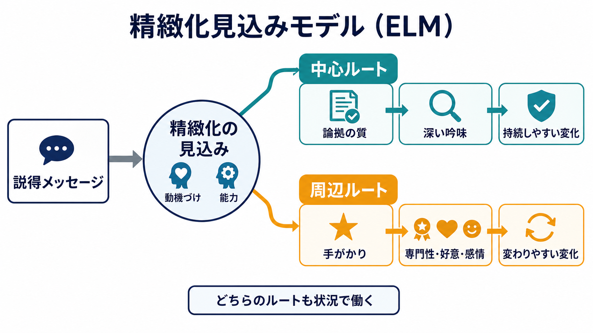
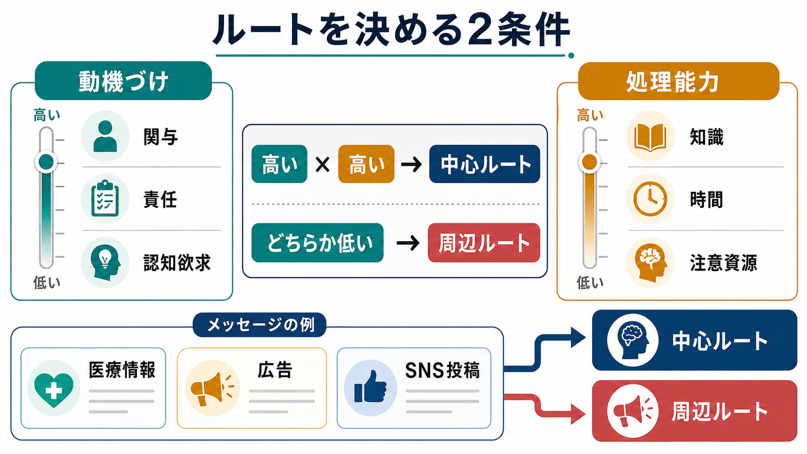
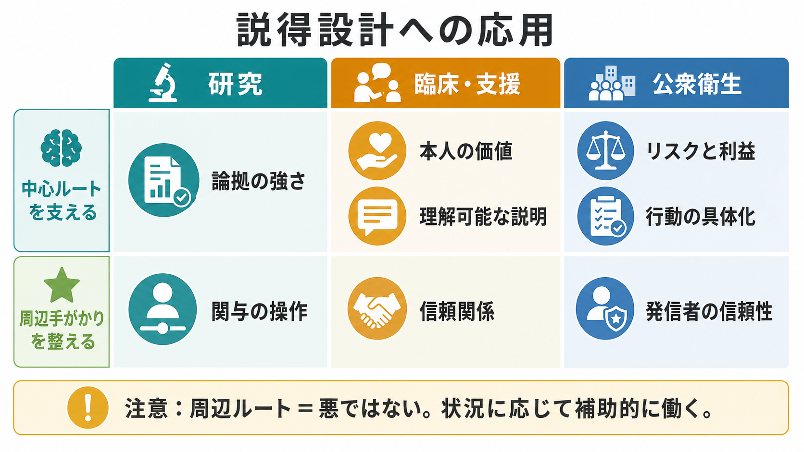

# 精緻化見込みモデルとは何か

## 要点

- 精緻化見込みモデル（elaboration likelihood model; ELM）は、説得メッセージがどれだけ深く吟味されるかによって、態度変容の過程が変わると考える理論である。
- **中心ルート**では、受け手が論拠の質を比較的深く吟味する。態度変化は持続しやすく、反対情報にも抵抗しやすいとされる[1][2]。
- **周辺ルート**では、専門性、好意、魅力、感情、単純な手がかりなどが態度に影響する。短期的には有効でも、変化は文脈に左右されやすい[1][3]。
- どちらのルートが働くかは、主に**動機づけ**と**処理能力**で決まる。関与が高く、時間・知識・注意資源があるほど中心ルートに寄りやすい[1][4]。
- 周辺ルートは「悪い説得」ではない。問題は、受け手が重要な判断を十分に吟味できない状況で、手がかりだけが過剰に態度を支配する場合である。

## この記事で答える問い

1. 精緻化見込みモデルは、説得と態度変容をどう説明するのか。
2. 中心ルートと周辺ルートは何が違うのか。
3. 動機づけ、能力、関与、認知欲求はどのように関わるのか。
4. 研究、臨床・支援、公衆衛生コミュニケーションでは何に注意すべきか。

## まず結論

ELMの中心は、「人はいつも同じ深さで説得メッセージを処理しているわけではない」という点にある。自分に関係があり、考える余裕もあるとき、人は主張の根拠、反証、論理の一貫性を吟味しやすい。これが中心ルートである。一方、関与が低い、時間がない、知識が少ない、疲れているといった条件では、発信者の信頼性、好感度、見た目、雰囲気、繰り返し接触などの周辺手がかりが強く働く[1][2]。

## 背景

態度変容研究では、発信者の専門性、メッセージの強さ、受け手の関与、感情、繰り返し、社会的文脈など、多くの変数が説得に影響することが示されてきた。しかし、それぞれの効果は一貫しないことがある。たとえば、専門家の発言は強く効く場合もあれば、受け手が論拠をよく吟味しているときには、発信者の肩書きよりも論拠の質が重要になることがある[1][3]。

Petty と Cacioppo は、この不一致を「変数がいつも同じ役割をもつわけではない」と整理した。ある変数は、処理量を増やすことも、処理の方向を偏らせることも、単純な手がかりとして働くこともある。ELMは、説得研究を中心ルートと周辺ルートという二分法だけでなく、精緻化の連続体として整理する枠組みである[1][2]。

## 基本概念

### 精緻化

精緻化とは、受け手がメッセージについてどれだけ考え、既有知識と結びつけ、反論や含意を検討するかを指す。精緻化が高いほど、態度は論拠の質に左右されやすい。精緻化が低いほど、単純な手がかりや感情的連合が態度に影響しやすい[1]。

### 中心ルート

中心ルートでは、受け手は主張の中身を吟味する。たとえば「この介入はどの研究で支持されているのか」「利益とリスクの比較は妥当か」「反対証拠はどう扱われているか」と考える。強い論拠は態度を肯定方向へ動かし、弱い論拠は逆に疑念を強める。広告研究では、高関与条件では論拠の強弱が態度を大きく左右し、推薦者の有名さは相対的に弱くなることが示された[3]。

### 周辺ルート

周辺ルートでは、論拠そのものよりも、発信者の魅力、専門性、好意、感情、繰り返し、他者の支持数などの手がかりが働く。これは[[ヒューリスティックとは何か|ヒューリスティック]]に近い処理であり、限られた時間や注意資源の中で判断を進めるためには有用な場合もある。ただし、重要な意思決定で周辺手がかりだけに依存すると、[[認知バイアスとは何か|認知バイアス]]や誤情報への脆弱性につながりうる[5][6]。

## 仕組み

ELMでは、どのルートが優勢になるかを大きく左右する条件として、**動機づけ**と**能力**を考える。

| 条件 | 高いとき | 低いとき |
|---|---|---|
| 個人的関与 | 自分の価値、将来、損得に関係するため吟味しやすい | 「自分には関係ない」と感じ、手がかりに頼りやすい |
| 処理能力 | 知識、時間、注意資源があり論拠を比較できる | 疲労、時間不足、専門知識不足で深い処理が難しい |
| 認知欲求 | 考えること自体を好み、論拠を検討しやすい | 複雑な検討を避け、簡便な判断に寄りやすい |
| メッセージ環境 | 根拠、反証、出典が見える | 短い断片、印象的表現、社会的評価だけが目立つ |

認知欲求（need for cognition）は、努力を要する思考に従事し、それを楽しむ傾向を指す個人差である。Cacioppo と Petty は、この傾向を測定する尺度を開発し、説得研究における受け手側の重要な変数として位置づけた[4]。ただし、認知欲求が高い人でも、疲労、時間制約、専門外の領域では周辺手がかりに頼ることがある。

## 図解

### ELMの読み方

ELMを読むときは、「中心ルートか周辺ルートか」を固定的なタイプ分類にしない方がよい。同じ人でも、医療、政治、食品、学習、SNS投稿など、主題や状況によって精緻化の見込みは変わる。また、同じ変数が複数の役割をもつこともある。たとえば「専門家が言っている」は、低精緻化では単純な信頼性手がかりになるが、高精緻化では「その専門性はこの論点に本当に関係するのか」という吟味の対象にもなる[1][8]。

### 研究・支援への応用

研究では、関与、論拠の強さ、発信者の信頼性、受け手の知識や認知欲求を操作・測定することで、態度変容の過程を分けて検討できる。臨床・支援、公衆衛生、教育では、単に「正しい情報を出す」だけでは不十分である。受け手がその情報を自分の価値や生活課題に結びつけられるか、理解可能な形で提示されているか、質問や反論を扱える余地があるかが重要になる。これは[[行動変容はどのように起こるのか|行動変容]]や[[ナッジとは何か|ナッジ]]の設計とも接続する。

## 臨床・研究との接続

医療・心理支援でELMを使う場合、「患者や利用者を説得する技術」として狭く扱うのは危険である。研究・教育目的でいえば、ELMは、情報提供がなぜ届かないのか、どの条件で深い理解につながるのかを整理する枠組みである。個別の診断や治療方針を、このモデルだけから決めるものではない。

たとえば心理教育では、中心ルートを支えるために、本人にとっての意味、選択肢、根拠、反証可能性、生活上の具体例を示す必要がある。一方で、支援者への信頼、説明のわかりやすさ、場の安全感といった周辺手がかりも、理解へ入る入口として働く。したがって、中心ルートだけを「理性的で正しい」とし、周辺ルートを「非合理で悪い」と切り捨てるのは不正確である[6][7]。

社会心理学では、ELMは[[ステレオタイプとは何か|ステレオタイプ]]、[[偏見と差別は何が違うのか|偏見]]、[[スティグマとは何か|スティグマ]]に関する態度変容研究とも関わる。偏見低減メッセージが持続的に効くには、単なる好印象だけでなく、受け手が自分の価値、制度、行動の結果を吟味できる条件を整える必要がある。

## よくある誤解

### 誤解1: 中心ルートは正しく、周辺ルートは間違いである

中心ルートは、論拠の質を吟味しやすいという強みをもつが、常に正しい結論を保証するわけではない。既存信念が強いと、深い処理がかえって動機づけられた推論になることもある。周辺ルートも、時間が少ない場面では適応的な近道になりうる。

### 誤解2: 人は中心ルート型と周辺ルート型に分かれる

ELMは、人を固定タイプに分類する理論ではない。精緻化の見込みは、主題への関与、知識、時間、疲労、感情、メディア環境によって変動する[1][8]。

### 誤解3: 専門家の信頼性は周辺手がかりにすぎない

専門家の信頼性は、低精緻化では単純な手がかりとして働きやすい。しかし高精緻化では、専門性の範囲、利益相反、根拠の質、反証への応答を吟味する材料にもなる。つまり、同じ変数でも処理水準によって役割が変わる。

### 誤解4: ELMだけで説得のすべてを説明できる

ELMは強力な統合理論だが、態度変容研究にはヒューリスティック・システマティック・モデル、認知的不協和、態度の構成主義的見方、潜在的態度、メタ認知モデルなどもある[5][7]。ELMは、これらと競合するだけでなく、どの水準の処理が働いているかを整理する地図として使うのがよい。

## 関連ノート

- [[ヒューリスティックとは何か]]
- [[認知バイアスとは何か]]
- [[ナッジとは何か]]
- [[行動変容はどのように起こるのか]]
- [[ステレオタイプとは何か]]
- [[偏見と差別は何が違うのか]]
- [[スティグマとは何か]]
- [[帰属理論とは何か]]
- [[服従とは何か]]
- [[自己奉仕バイアスとは何か]]

## MOC更新候補

- バッチ統合時に、`content/00_MOC/MOC｜認知科学・心理学.md` の社会心理学、態度変容、説得、認知バイアス周辺に追加する。
- `content/02_認知科学・心理学/発達・愛着・社会心理/` 内では、[[帰属理論とは何か]]、[[服従とは何か]]、[[ステレオタイプとは何か]] と近接する社会心理学ノートとして扱う。
- 行動変容・ナッジ系の索引が別途作られる場合は、[[行動変容はどのように起こるのか]] と [[ナッジとは何か]] の周辺にも追加候補。

## 理解チェック

1. 中心ルートと周辺ルートの違いを、「何を手がかりに態度が変わるか」という観点から説明できるか。
2. 動機づけと処理能力のどちらか一方が低いと、なぜ周辺ルートに寄りやすいのか。
3. 「専門家が言っている」という情報は、どの条件では周辺手がかりになり、どの条件では中心的な吟味対象になるか。
4. 公衆衛生メッセージを設計するとき、中心ルートを支える工夫と周辺手がかりを整える工夫を一つずつ挙げられるか。

## 未解決問題

- SNSの短文・動画環境では、中心ルートと周辺ルートがどの程度同時に働くのか。
- 感情は、単純な周辺手がかりなのか、論拠の解釈を変える中心的情報なのか。
- 態度変容が短期的な自己報告に留まるのか、長期の行動変化に移るのかをどう測るべきか。
- 説得設計と操作的・搾取的な影響の境界を、研究倫理と実践倫理の両面からどう定義するか。

## 参考文献

[1] Petty, R. E., & Cacioppo, J. T. (1986). The Elaboration Likelihood Model of Persuasion. *Advances in Experimental Social Psychology*, 19, 123-205. https://doi.org/10.1016/S0065-2601(08)60214-2

[2] Petty, R. E., & Cacioppo, J. T. (1986). *Communication and Persuasion: Central and Peripheral Routes to Attitude Change*. Springer. https://doi.org/10.1007/978-1-4612-4964-1

[3] Petty, R. E., Cacioppo, J. T., & Schumann, D. (1983). Central and Peripheral Routes to Advertising Effectiveness: The Moderating Role of Involvement. *Journal of Consumer Research*, 10(2), 135-146. https://doi.org/10.1086/208954

[4] Cacioppo, J. T., & Petty, R. E. (1982). The Need for Cognition. *Journal of Personality and Social Psychology*, 42(1), 116-131. https://doi.org/10.1037/0022-3514.42.1.116

[5] Chaiken, S. (1980). Heuristic versus Systematic Information Processing and the Use of Source versus Message Cues in Persuasion. *Journal of Personality and Social Psychology*, 39(5), 752-766. https://doi.org/10.1037/0022-3514.39.5.752

[6] Petty, R. E., Wegener, D. T., & Fabrigar, L. R. (1997). Attitudes and Attitude Change. *Annual Review of Psychology*, 48, 609-647. https://doi.org/10.1146/annurev.psych.48.1.609

[7] Bohner, G., & Dickel, N. (2011). Attitudes and Attitude Change. *Annual Review of Psychology*, 62, 391-417. https://doi.org/10.1146/annurev.psych.121208.131609

[8] Petty, R. E., & Briñol, P. (2012). The Elaboration Likelihood Model. In P. A. M. Van Lange, A. W. Kruglanski, & E. T. Higgins (Eds.), *Handbook of Theories of Social Psychology* (Vol. 1, pp. 224-245). SAGE. https://doi.org/10.4135/9781446249215.n12
