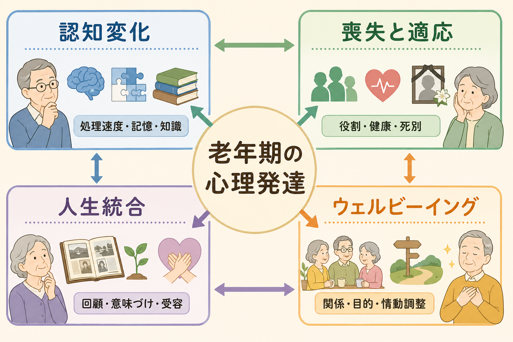
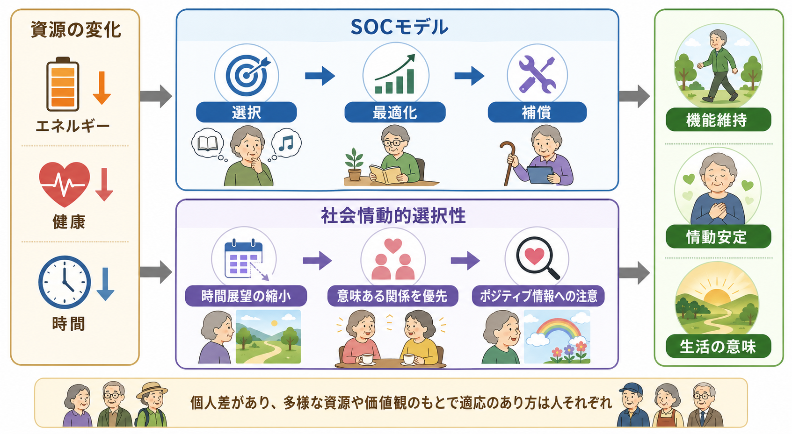
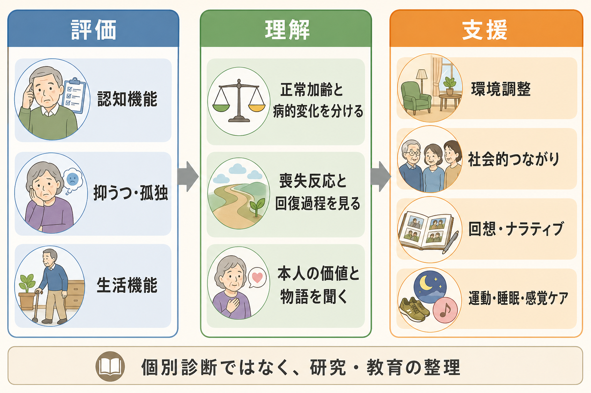

# 老年期の心理発達とは何か

## 要点

- 老年期の心理発達は、「衰える時期」ではなく、身体・認知・社会的役割・時間展望が変わる中で、目標、関係、自己物語、生活の意味を再編する発達過程である。
- 認知面では、処理速度や一部の[[エピソード記憶とは何か|エピソード記憶]]は低下しやすい一方、語彙、一般知識、熟達した判断などの結晶性能力は保たれやすい[1][2]。
- 心理面では、退職、健康問題、死別、役割喪失が課題になるが、社会情動的選択性、選択・最適化・補償、人生回顧によって適応が進むことがある[3][4][5]。
- ウェルビーイングは単純に下がるわけではない。多くの研究は、喪失が増えても情動調整や意味づけが働くため、主観的幸福感が一定程度保たれる「加齢とウェルビーイングの逆説」を示す。ただし、超高齢期、健康喪失、配偶者喪失では低下しうる[6]。

## この記事で答える問い

1. 老年期の心理発達とは、何がどのように発達することなのか。
2. 正常な認知加齢と病的な[[認知機能低下はどのように評価するのか|認知機能低下]]は、どう分けて考えればよいか。
3. 喪失体験は、なぜ発達課題にもなりうるのか。
4. 人生統合、回顧、ウェルビーイングは、研究・臨床でどう扱えるのか。

## まず結論

老年期の心理発達とは、加齢に伴う制約の増加を前提にしながら、残された資源をどう使い、どの関係を大切にし、過去の経験をどう意味づけ、現在の生活をどう支えるかを組み替えていく過程である。

重要なのは、「老年期=能力低下」と一枚岩に見ないことである。加齢に伴って、処理速度、複雑な[[注意とは何か|注意]]、新しい情報の記銘、[[実行機能とは何か|実行機能]]の一部は弱くなりやすい。しかし、[[意味記憶とは何か|意味記憶]]、語彙、専門的知識、対人経験にもとづく判断は比較的保たれやすい[1]。したがって、老年期の心理発達は、低下と維持、喪失と再編、脆弱性と成熟が同時に起こる過程として読む必要がある。

## 背景

発達心理学は長く、乳幼児期、児童期、青年期を中心に発達を考えてきた。しかし、人は成人後も変化し続ける。とくに老年期には、身体機能、感覚機能、認知機能、社会的役割、家族関係、経済状況、死への近さが同時に変わる。これらは単なる背景条件ではなく、自己理解、目標設定、他者との関わり方、生活の意味に直接影響する。

Erikson の心理社会的発達論では、老年期の中心課題は「自我統合 対 絶望」と整理された。自我統合とは、人生を失敗や後悔を含めて一つの物語として受け入れ、有限性の中で意味を見いだす方向である。一方、絶望は、取り返しのつかなさ、孤立、後悔が強まり、人生全体を否定的に感じる方向である[7]。この枠組みは古典的だが、現代的には「人生を単純に肯定できるか」ではなく、喪失、矛盾、未完了感を含む人生をどう統合するかという問題として読み直すと使いやすい。

## 基本概念

### 正常加齢と病的変化

正常な認知加齢では、全ての能力が同じ速度で低下するわけではない。処理速度は早期から低下しやすく、複雑な課題では注意配分や抑制が難しくなる。[[長期記憶とは何か|長期記憶]]のうち、出来事の詳細を新しく覚えるエピソード記憶は影響を受けやすい。一方、語彙、一般知識、慣れた手続き、経験に支えられた判断は保たれやすい[1]。

病的変化を疑うのは、年齢相応の遅さや物忘れを超えて、服薬管理、金銭管理、道具使用、約束、家事、交通安全などの生活機能が変わる場合である。ここでは、本人の努力不足と決めつけず、感覚障害、睡眠、抑うつ、薬剤、せん妄、神経変性疾患、社会的孤立を分けて評価する必要がある[2]。

### 喪失体験

老年期には、配偶者や友人との死別、退職、身体機能の低下、住環境の変化、役割の縮小が起こりやすい。配偶者喪失後には、睡眠、食事、飲酒、体重、身体活動などの生活習慣が変化しうることが系統的レビューで示されている[5]。喪失は情緒的な出来事であると同時に、生活リズム、社会的支援、自己役割を組み替える出来事でもある。

ただし、喪失体験は必ずしも発達停止を意味しない。悲嘆、怒り、空虚感、孤独は自然な反応であり、その後に新しい生活構造、関係、意味づけが少しずつ作られることがある。重要なのは、「早く前向きになる」ことではなく、喪失を現実として扱いながら、生活を支える具体的資源を再配置することである。

### 人生統合

人生統合は、過去の出来事を成功談だけに整えることではない。失敗、後悔、偶然、他者から受けた影響、未完了の課題を含めて、「自分はどのように生きてきたのか」を再構成する過程である。この点で、老年期の心理発達は[[物語的自己とは何か|物語的自己]]や[[アイデンティティとは何か|アイデンティティ]]の再編と深く関わる。

回想法やライフレビューは、この人生統合を支援する方法として研究されてきた。高齢者を対象としたメタ分析では、ライフレビュー介入が抑うつ症状を短期的に軽減する可能性が示されているが、効果の持続や介入形式にはばらつきがある[8]。したがって、万能の技法ではなく、本人のペース、文化、語りたくない経験への配慮を含めて使う必要がある。

## 仕組み

### 1. 資源の変化を見積もる

老年期には、時間、体力、健康、社会的役割、経済資源、移動能力が変わる。心理発達は、これらの資源変化を無視して「以前と同じように頑張る」ことではなく、何を維持し、何を手放し、何を支援で補うかを考える過程として進む。

### 2. 目標を選び直す

社会情動的選択性理論は、年齢そのものよりも「残された時間の見通し」が動機づけを変えると考える。未来が広く感じられる時期には探索、知識獲得、新しい関係が優先されやすい。一方、時間が限られていると感じられると、情緒的に意味のある関係や活動が優先されやすくなる[3]。これは高齢者が消極的になるという意味ではなく、価値のあるものへ注意とエネルギーを集中する適応として理解できる。

### 3. 選択・最適化・補償で生活を組み替える

Baltes らの選択・最適化・補償モデルは、老年期の適応を三つの操作で説明する。選択は、重要な目標を絞ること。最適化は、その目標を達成するために練習、環境調整、支援を使うこと。補償は、失われた機能を道具、他者、別の方略で補うことである[4]。たとえば、長距離運転を控える代わりに近隣活動を増やす、予定管理を紙やスマートフォンで補う、疲れやすい時間帯を避けて面会を組む、といった調整がこれにあたる。

### 4. 感情を調整し、意味を作る

老年期には喪失が増える一方で、平均的には情動の安定性が保たれたり、否定的感情からの回復が速くなったりすることがある。この「加齢と情動的ウェルビーイングの逆説」は、経験による情動調整、価値ある関係の選択、ポジティブ情報への注意、ストレス状況の回避・再解釈などによって説明される[3][6]。

ただし、この逆説を「高齢者は自然に幸せになる」と誤解してはいけない。健康の悪化、痛み、貧困、孤独、介護負担、差別、死別はウェルビーイングを低下させる。発達的適応は、個人の内面だけで完結せず、住環境、医療・福祉制度、地域のつながり、家族関係に支えられる。

## 図解

| 図 | 読み方 | 対応する本文 |
|---|---|---|
| 概念地図 | 老年期の心理発達を、認知変化、喪失と適応、人生統合、ウェルビーイングの相互作用として読む | まず結論、背景 |
| 適応メカニズム | SOCモデルと社会情動的選択性理論を、資源変化から機能維持・情動安定・生活の意味へ向かう経路として読む | 仕組み |
| 研究・臨床接続 | 評価、理解、支援を分け、個別診断ではなく教育・研究の整理として扱う | 臨床・研究との接続 |

## 臨床・研究との接続

臨床や支援では、第一に、正常加齢と疾患・せん妄・抑うつ・薬剤影響を分ける。処理速度の低下や軽い物忘れだけで認知症とは言えない一方、生活機能の変化、急な混乱、人格・行動の変化、幻視、歩行障害などは慎重に評価する必要がある。関連する神経疾患との接続は、[[アセチルコリン系は認知症とどう関わるのか]]、[[レビー小体型認知症は神経回路にどのような影響を与えるのか]]、[[前頭側頭型認知症はなぜ人格や行動を変えるのか]]を参照できる。

第二に、喪失反応を病理化しすぎない。死別後の悲嘆や生活習慣の乱れは、支援が必要なこともあるが、それ自体がただちに疾患を意味するわけではない。睡眠、食事、飲酒、孤立、安全、医療アクセスを確認しつつ、本人が何を失い、何を保ちたいのかを聞くことが重要である[5]。

第三に、本人の価値と物語を中心に置く。老年期の支援は、「能力を若い頃へ戻す」ことだけを目標にすると狭くなる。むしろ、何を大切にしているか、どの関係が支えになるか、どの活動が生活の意味を保つかを確認する。ここでは[[自己効力感とは何か|自己効力感]]、[[レジリエンスは発達過程でどう育つのか|レジリエンス]]、[[社会的認知とは何か|社会的認知]]の視点も役立つ。

## よくある誤解

### 誤解1: 老年期は発達ではなく衰退である

老年期には衰退がある。しかし、発達とは能力が直線的に増えることだけではない。制約の中で目標を選び直し、関係を深め、人生を意味づけ、支援を使って生活を組み替えることも発達である。

### 誤解2: 物忘れはすべて認知症の始まりである

加齢に伴う物忘れは珍しくない。問題は、忘れ方の質、手がかりで思い出せるか、日常生活にどれだけ影響するか、変化が急か緩徐かである。本人や家族が困っている場合は、自己判断ではなく専門的評価につなぐ。

### 誤解3: 高齢者は自然に穏やかになる

情動調整がうまくなる人はいるが、それはすべての人に自動的に起こるわけではない。痛み、孤立、貧困、虐待、介護負担、感覚障害、うつ病、認知症は情動安定を大きく妨げる。環境と支援を含めて考える必要がある。

### 誤解4: 人生統合とは、過去を肯定的に語ることである

人生統合は、過去を美化することではない。矛盾や後悔を含めて、自分の人生を現在の生活と結び直すことである。語り直しが助けになる場合もあれば、語りたくない経験を尊重することが支援になる場合もある。

## 関連ノート

- [[青年期のアイデンティティ形成とは何か]]
- [[アイデンティティとは何か]]
- [[物語的自己とは何か]]
- [[エピソード記憶とは何か]]
- [[意味記憶とは何か]]
- [[実行機能とは何か]]
- [[認知機能低下はどのように評価するのか]]
- [[レジリエンスは発達過程でどう育つのか]]
- [[自己効力感とは何か]]
- [[MOC｜認知科学・心理学]]

## 理解チェック

1. 老年期の心理発達を、「衰退」ではなく「再編」として説明できるか。
2. 処理速度、エピソード記憶、意味記憶は、加齢でどのように変わりやすいか。
3. 社会情動的選択性理論は、老年期の対人関係の変化をどう説明するか。
4. SOCモデルの「選択」「最適化」「補償」を、日常生活の例で説明できるか。
5. 人生統合と単なるポジティブ思考は、どこが違うか。

## MOC更新候補

- `content/00_MOC/MOC｜認知科学・心理学.md`
- 将来、発達・愛着・社会心理カテゴリ専用のMOCを作る場合は、本記事を「成人発達・老年期」項目に追加する。

## 未解決問題

- 老年期のウェルビーイングは、若年高齢者、後期高齢者、超高齢者で同じように変化するのか。
- 認知機能の低下と人生統合の深まりは、どの条件で両立し、どの条件で妨げ合うのか。
- 死別、退職、介護、慢性疾患など複数の喪失が重なったとき、どの支援が最も効果的か。
- ライフレビューや回想法は、文化、世代、トラウマ歴、認知機能の違いに応じてどのように調整すべきか。

## 参考文献

[1] Harada, C. N., Natelson Love, M. C., & Triebel, K. L. (2013). Normal cognitive aging. *Clinics in Geriatric Medicine, 29*(4), 737-752. https://doi.org/10.1016/j.cger.2013.07.002

[2] National Institute on Aging. (2024). Cognitive health and older adults. https://www.nia.nih.gov/health/brain-health/cognitive-health-and-older-adults

[3] Carstensen, L. L. (2021). Socioemotional selectivity theory: The role of perceived endings in human motivation. *The Gerontologist, 61*(8), 1188-1196. https://doi.org/10.1093/geront/gnab116

[4] Baltes, P. B., & Baltes, M. M. (1990). Psychological perspectives on successful aging: The model of selective optimization with compensation. In *Successful Aging: Perspectives from the Behavioral Sciences* (pp. 1-34). Cambridge University Press. https://doi.org/10.1017/CBO9780511665684

[5] Stahl, S. T., & Schulz, R. (2014). Changes in routine health behaviors following late-life bereavement: A systematic review. *Journal of Behavioral Medicine, 37*(4), 736-755. https://doi.org/10.1007/s10865-013-9524-7

[6] Nashiro, K., Sakaki, M., & Mather, M. (2012). Age differences in brain activity during emotion processing: Reflections of age-related decline or increased emotion regulation? *Gerontology, 58*(2), 156-163. https://doi.org/10.1159/000328465

[7] Erikson, E. H., & Erikson, J. M. (1998). *The Life Cycle Completed: Extended Version*. W. W. Norton. https://books.google.com/books/about/Life_Cycle_Completed.html?id=4MOp6p8bKP4C

[8] Al-Ghafri, B. R., Al-Mahrezi, A., & Chan, M. F. (2021). Effectiveness of life review on depression among elderly: A systematic review and meta-analysis. *Pan African Medical Journal, 40*, 168. https://doi.org/10.11604/pamj.2021.40.168.30040
