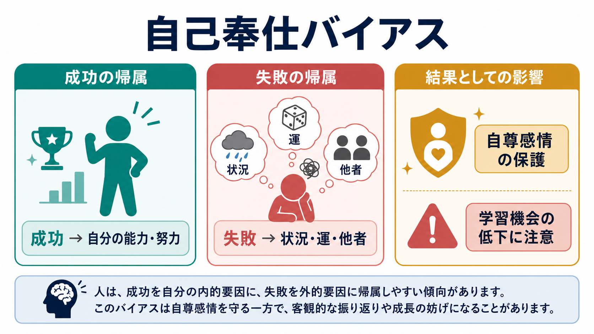
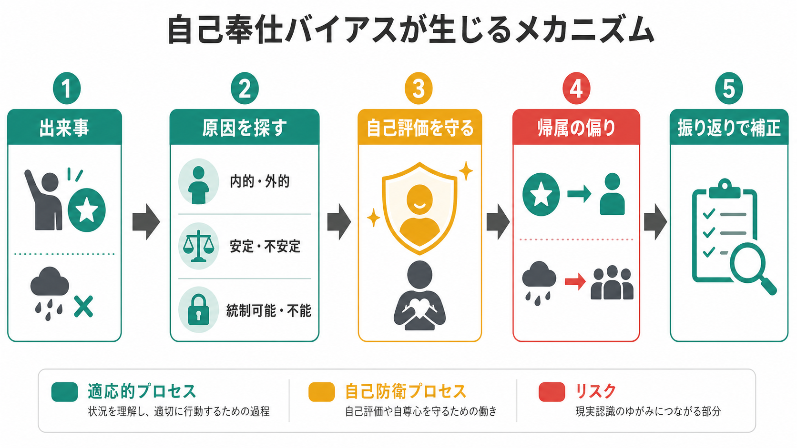
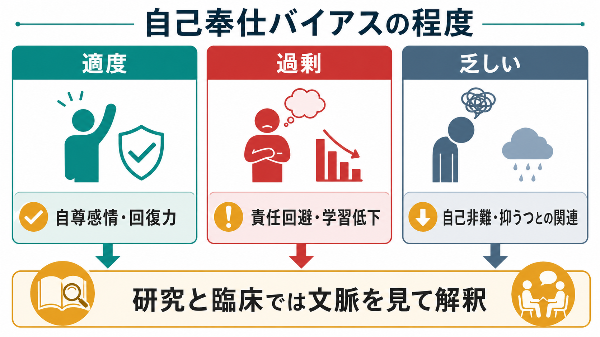

# 自己奉仕バイアスとは何か

## 要点

- 自己奉仕バイアスとは、成功を自分の能力・努力に、失敗を状況・運・他者などの外的要因に帰属しやすい傾向である。
- これは単なる「言い訳」ではなく、出来事の原因をどう説明するかという[[社会的認知とは何か|社会的認知]]と[[認知バイアスとは何か|認知バイアス]]の問題である。
- メタ分析では、肯定的出来事を否定的出来事よりも内的・安定的・全般的に帰属する傾向が広く観察されるが、文化・発達段階・抑うつ傾向などで強さは変わる[1]。
- 適度な自己奉仕的帰属は自尊感情や回復力を支えることがある一方、過剰になると責任回避、対人摩擦、学習機会の低下につながる。
- 臨床・教育・組織場面では、バイアスを「悪いもの」と断定するより、どの文脈で、どの程度、どの結果を生んでいるかを見る必要がある。

## この記事で答える問い

1. 自己奉仕バイアスは、どのような帰属の偏りなのか。
2. なぜ成功と失敗で原因説明が変わるのか。
3. このバイアスは適応的なのか、それとも問題なのか。
4. 抑うつ、学習、対人関係、研究ではどのように扱われるのか。

## まず結論

自己奉仕バイアスは、「良い結果は自分のおかげ、悪い結果は外部のせい」と説明しやすい傾向である。典型例は、試験で良い点を取ると「自分が努力したから」と考え、悪い点を取ると「問題が悪かった」「採点が厳しかった」「体調が悪かった」と考えるような場合である。

ただし、この傾向はすべてが非合理な歪みとは限らない。Miller と Ross は、初期研究のレビューで、成功時の自己高揚的帰属には一定の支持がある一方、失敗時の自己防衛的帰属は文脈依存であり、期待・共変関係の読み取り・課題理解などの認知的要因も関わると論じた[2]。つまり、自己奉仕バイアスには「自尊感情を守りたい」という動機づけだけでなく、「自分の行動と結果の関係をどう推論するか」という[[意思決定とは何か|判断]]の問題も含まれる。

## 背景

自己奉仕バイアスは、帰属理論の文脈で理解しやすい。帰属とは、出来事や行動の原因を説明する心的過程である。Weiner の達成動機づけと感情の帰属理論では、成功や失敗の原因は少なくとも「原因の所在」「安定性」「統制可能性」という次元で整理される[3]。

たとえば、成功を「能力」に帰属すれば、原因は内的で比較的安定している。成功を「努力」に帰属すれば、内的だが統制可能で変えやすい。失敗を「運が悪かった」に帰属すれば、外的で不安定な原因になる。自己奉仕バイアスは、この帰属の選び方が自己評価に都合よく傾く現象である。

メタ分析では、人は一般に、肯定的出来事を否定的出来事よりも内的・安定的・全般的に説明しやすいことが示されている[1]。ただし、これは「すべての人に同じ強さで起こる」という意味ではない。年齢、文化的自己観、自己評価、抑うつ傾向、出来事の重要度、他者の前で説明するかどうかによって変化する。

## 基本概念

### 内的帰属と外的帰属

内的帰属は、原因を自分の能力、努力、性格、選択に置く説明である。外的帰属は、原因を環境、課題の難しさ、運、他者、制度に置く説明である。自己奉仕バイアスでは、成功時には内的帰属が増え、失敗時には外的帰属が増えやすい。

| 結果 | 自己奉仕的な帰属 | 例 |
|---|---|---|
| 成功 | 内的帰属 | 「自分の能力が高い」「努力が実った」 |
| 失敗 | 外的帰属 | 「問題が悪い」「運が悪い」「相手が不公平だった」 |

### 安定性と統制可能性

成功を「能力」に帰属すると、次も成功できるという期待が強まりやすい。成功を「努力」に帰属すると、努力を続ければ再現できると考えやすい。失敗を「運」や「状況」に帰属すると、自尊感情への損傷は弱まるが、改善すべき自分の行動が見えにくくなることがある[3]。

このため、教育や職場では「失敗をすべて自分の能力不足にする」のも、「すべて外部のせいにする」のも望ましくない。重要なのは、失敗の中から統制可能な要素を取り出し、次の行動に変換することである。

## 仕組み

### 1. 自己評価を守る

自己奉仕バイアスの中心には、自己評価を保ちたいという動機づけがある。自己への脅威が強まると自己奉仕バイアスが大きくなることを示したメタ分析は、このバイアスが自己防衛的機能をもつことを支持している[4]。たとえば、失敗が本人の能力や価値に直結するように感じられる場面では、外的帰属が強まりやすい。

Taylor と Brown は、やや肯定的な自己評価や統制感が、通常の精神的健康や動機づけと関連する可能性を論じた[5]。この議論は、自己奉仕バイアスが常に病理的・非適応的だという見方を相対化する。ただし、肯定的錯覚が周囲への責任転嫁や現実検討の低下を生む場合には問題になる。

### 2. 動機づけられた推論

人は結論を先に決めてから証拠を探すことがある。Kunda の動機づけられた推論の枠組みでは、望ましい結論に到達したい場合でも、完全に自由に信じるのではなく、利用可能な記憶・知識・説明を使って「もっともらしい」理由を構成する[6]。自己奉仕バイアスでも、成功時には自分の努力を思い出しやすく、失敗時には邪魔になった状況を思い出しやすくなる。

### 3. 帰属次元が感情と期待を変える

帰属は感情にも影響する。成功を内的原因に帰属すれば誇りが生じやすく、失敗を内的・安定的・全般的な原因に帰属すれば恥や無力感が強まりやすい。Abramson、Seligman、Teasdale の学習性無力感の再定式化では、悪い出来事を内的・安定的・全般的に帰属する傾向が、無力感や抑うつの理解に関わるとされた[7]。

## 図解

上の2枚の図は、自己奉仕バイアスを次の二層で整理している。

1. 全体像: 成功は能力・努力へ、失敗は状況・運・他者へ帰属されやすい。
2. 仕組み: 出来事を経験したあと、人は原因を探し、その原因を内的・外的、安定・不安定、統制可能・不能の次元で解釈する。

3枚目の図は、自己奉仕バイアスを「適度」「過剰」「乏しい」の連続体として見るための補助図である。適度な自己防衛は回復力を支えることがあるが、過剰な自己防衛は学習と責任の検討を妨げる。一方、自己奉仕的帰属が乏しすぎる場合には、成功を自分の力として受け取れず、失敗を過度に自己非難する方向へ傾くことがある。

## 臨床・研究との接続

### 抑うつとの対照

自己奉仕バイアスは、抑うつや低い自己評価を考えるときに重要な対照になる。抑うつ傾向がある人では、否定的出来事を自分の内的・安定的・全般的原因に帰属し、肯定的出来事を外的・不安定な原因に帰属しやすいことが議論されてきた[7]。これは自己奉仕バイアスとは逆方向の帰属パターンである。

Alloy と Abramson の「depressive realism」研究は、抑うつ傾向のある人が特定条件で随伴性判断をより正確に行う可能性を示し、精神的健康と現実認識の関係を単純化できないことを示した[8]。ただし、この知見は「抑うつのほうが常に現実的」という意味ではない。課題条件、測定方法、症状の程度によって解釈は変わる。

### 学習とフィードバック

学習場面では、自己奉仕バイアスは短期的には落ち込みを防ぐが、長期的には改善点を見落とすことがある。試験の失敗をすべて「問題が悪い」と説明すれば、勉強方法、時間配分、理解不足を検討しにくい。一方で、失敗をすべて「自分には能力がない」と説明すれば、次に挑戦する意欲が下がる。

実践的には、失敗を次のように分解するとよい。

| 観点 | 問い |
|---|---|
| 内的で統制可能 | 次に変えられる行動は何か |
| 外的で統制不能 | 今回だけの条件は何か |
| 安定的 | 繰り返し起きているパターンは何か |
| 不安定 | 一時的な体調・時間・環境要因は何か |

この分解は、[[メタ認知とは何か|メタ認知]]やフィードバック活用とも関係する。自分を責めるためではなく、帰属を点検し、次の行動へつなぐための手続きである。

### 対人関係と組織

対人関係では、自己奉仕バイアスは葛藤を拡大させることがある。共同作業が成功したときに自分の貢献を大きく見積もり、失敗したときに相手や制度のせいにすると、信頼が損なわれる。組織では、評価面談、医療安全、研究不正予防、チーム学習などで、失敗の帰属が個人攻撃かシステム改善かを左右する。

ただし、すべてを個人責任に戻すのも不適切である。失敗の原因には、技能、注意、疲労、役割設計、情報共有、制度的制約が混ざる。自己奉仕バイアスを扱う目的は、責任を誰かに固定することではなく、改善可能な原因を見つけることである。

## よくある誤解

### 誤解1: 自己奉仕バイアスは性格が悪い人だけに起こる

自己奉仕バイアスは、特定の性格だけで説明できるものではない。自己評価、文化、課題の重要度、他者からの評価可能性、成功・失敗の曖昧さによって変わる一般的な帰属傾向である[1][4]。

### 誤解2: 自分に厳しければバイアスはない

自己批判が強い人でも、別の領域では自己奉仕的帰属をすることがある。また、自己奉仕的帰属が弱いこと自体が常に良いわけではない。成功を自分の努力として受け取れない場合、[[レジリエンスは発達過程でどう育つのか|回復力]]や次の挑戦が弱まることがある。

### 誤解3: 正確な人ほど精神的に健康である

精神的健康と現実認識の関係は単純ではない。やや肯定的な自己評価は適応に役立つ場合がある一方、強すぎる肯定的錯覚は対人問題や学習機会の低下を招く[5]。重要なのは、正確さ、希望、責任、改善可能性のバランスである。

### 誤解4: 失敗を外的要因に帰属してはいけない

外的帰属が妥当な場合もある。課題設計が不公平だった、情報が足りなかった、体調が悪かった、制度的制約があった、という説明が実際に正しいこともある。問題は、外的帰属を常に優先し、統制可能な要素を検討しなくなる場合である。

## 関連ノート

- [[認知バイアスとは何か]]
- [[社会的認知とは何か]]
- [[意思決定とは何か]]
- [[メタ認知とは何か]]
- [[レジリエンスは発達過程でどう育つのか]]

## 関連ノート候補

- 帰属理論とは何か
- 原因帰属とは何か
- 動機づけられた推論とは何か
- 自尊感情とは何か
- 学習性無力感とは何か
- 抑うつにおける認知バイアスとは何か

## MOC更新候補

- `content/00_MOC/` 配下の認知科学・心理学系 MOC に、社会心理・認知バイアス・帰属理論の入門ノートとして追加する。
- 並列ジョブとの衝突を避けるため、本タスクでは MOC 本体は更新しない。

## 理解チェック

1. 自己奉仕バイアスでは、成功と失敗の原因帰属がどのように変わるか。
2. 「内的・外的」「安定・不安定」「統制可能・不能」の3次元で、試験失敗の原因を分けるとどうなるか。
3. 自己奉仕バイアスが適応的に働く場合と、学習を妨げる場合をそれぞれ説明できるか。
4. 抑うつ傾向にみられる帰属パターンは、典型的な自己奉仕バイアスとどの点で異なるか。

## 未解決問題

- 自己奉仕バイアスの文化差は、個人主義・集団主義だけでどこまで説明できるのか。
- 実験室で測定された帰属バイアスは、学校・職場・家庭での実際の行動をどの程度予測するのか。
- 自尊感情を守りながら、失敗から学ぶフィードバック設計はどのように作れるのか。
- 臨床場面で、自己批判の低減と責任の適切な引き受けをどう両立させるのか。

## 参考文献

[1] Mezulis, A. H., Abramson, L. Y., Hyde, J. S., & Hankin, B. L. (2004). Is there a universal positivity bias in attributions? A meta-analytic review of individual, developmental, and cultural differences in the self-serving attributional bias. *Psychological Bulletin, 130*(5), 711-747. https://doi.org/10.1037/0033-2909.130.5.711

[2] Miller, D. T., & Ross, M. (1975). Self-serving biases in the attribution of causality: Fact or fiction? *Psychological Bulletin, 82*(2), 213-225. https://doi.org/10.1037/h0076486

[3] Weiner, B. (1985). An attributional theory of achievement motivation and emotion. *Psychological Review, 92*(4), 548-573. https://doi.org/10.1037/0033-295X.92.4.548

[4] Campbell, W. K., & Sedikides, C. (1999). Self-threat magnifies the self-serving bias: A meta-analytic integration. *Review of General Psychology, 3*(1), 23-43. https://doi.org/10.1037/1089-2680.3.1.23

[5] Taylor, S. E., & Brown, J. D. (1988). Illusion and well-being: A social psychological perspective on mental health. *Psychological Bulletin, 103*(2), 193-210. https://doi.org/10.1037/0033-2909.103.2.193

[6] Kunda, Z. (1990). The case for motivated reasoning. *Psychological Bulletin, 108*(3), 480-498. https://doi.org/10.1037/0033-2909.108.3.480

[7] Abramson, L. Y., Seligman, M. E. P., & Teasdale, J. D. (1978). Learned helplessness in humans: Critique and reformulation. *Journal of Abnormal Psychology, 87*(1), 49-74. https://doi.org/10.1037/0021-843X.87.1.49

[8] Alloy, L. B., & Abramson, L. Y. (1979). Judgment of contingency in depressed and nondepressed students: Sadder but wiser? *Journal of Experimental Psychology: General, 108*(4), 441-485. https://doi.org/10.1037/0096-3445.108.4.441
