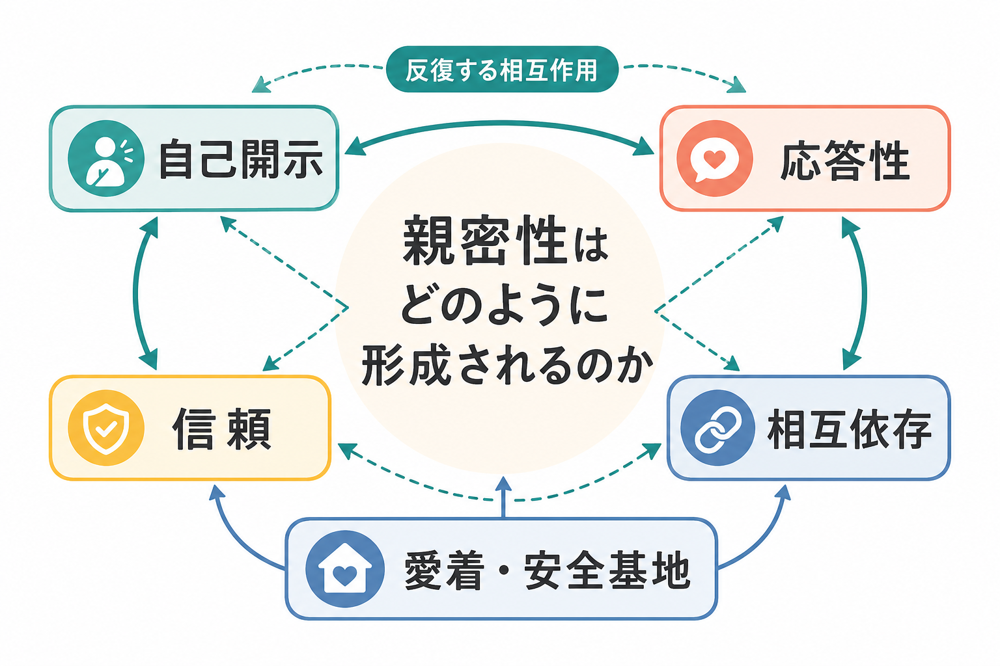
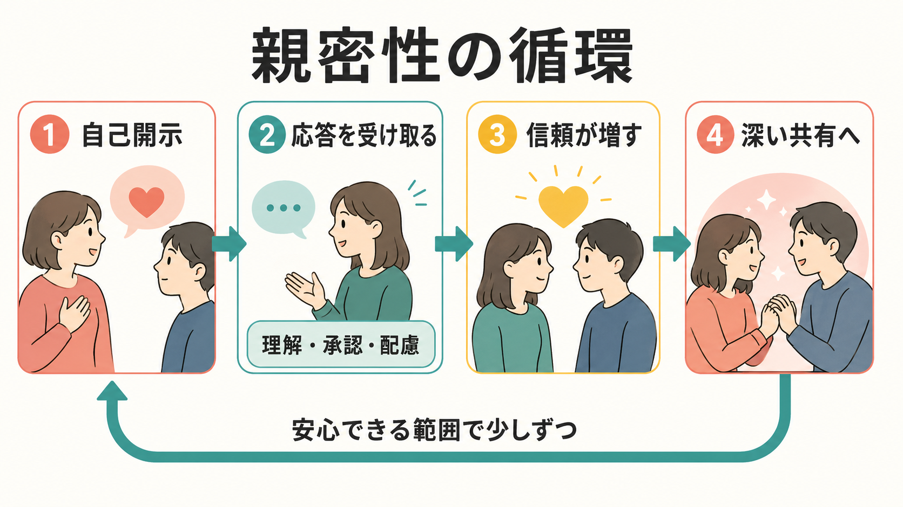
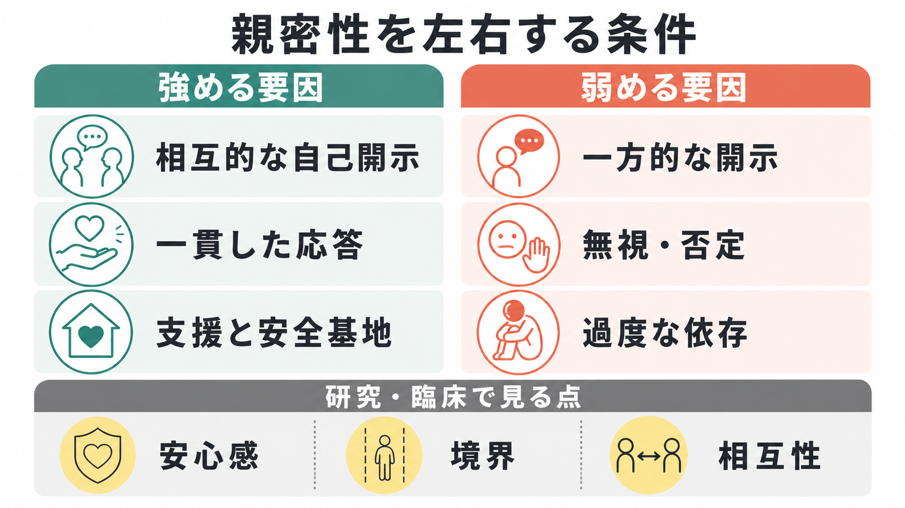

# 親密性はどのように形成されるのか

## 要点

- 親密性は「距離が近いこと」だけではなく、自分にとって重要な感情・価値・弱さが相手に理解され、尊重され、必要なときに支えられるという経験から形成される。
- 主要な循環は、自己開示、相手の応答、応答の解釈、信頼の増加、より深い共有である。開示だけでも、好意だけでも、親密性は十分には説明できない。
- 信頼は、一貫した行動から予測可能性と頼りやすさが高まり、最後には「この人は自分の重要な部分を粗末に扱わない」という期待へ発達する。
- 相互依存は、二人の行動・感情・生活選択が互いに影響し合う状態である。親密性は、相互依存が「支配」ではなく「相互的な配慮」として経験されるときに安定しやすい。
- 愛着は、親密な関係における安心感、近づき方、距離の取り方、支援の求め方に影響する。ただし愛着スタイルは固定的な性格判定ではなく、関係経験によって変化しうる。

## この記事で答える問い

1. 親密性はどのような心理過程として定義できるのか。
2. 自己開示は、なぜ親密性を生みやすいのか。
3. 信頼と相互依存は、親密な関係の中でどのように育つのか。
4. 愛着や安全基地の概念は、成人の親密な関係をどう説明するのか。
5. 研究・臨床・教育で親密性を扱うとき、どのような誤解を避けるべきか。

## まず結論

親密性は、単発の告白や劇的な出来事ではなく、反復する相互作用の中で形成される。ある人が少し自己開示をし、相手がそれを理解・承認・配慮を伴って受け止める。その応答が「この人には話しても大丈夫だ」という信頼を作り、次の開示や協力を可能にする。この循環が何度も起こると、二人は互いの内面、行動、日常の選択に影響し合うようになり、関係は相互依存を帯びる。

このとき重要なのは、開示の量ではなく「開示がどう扱われたか」である。親密性の対人過程モデルでは、親密さは、本人の開示、相手の応答、そしてその応答を本人が理解・承認・ケアとして知覚することから生じると考える[1]。したがって、親密性は一方が心を開けば自動的に生まれるものではない。開示に対して、相手が無視する、評価する、利用する、急いで解決する、境界を越えて侵入するなら、むしろ親密性は弱まる。

## 背景

親密性は、恋愛、友情、家族、ケア関係、治療関係、学習共同体など、多くの関係に関わる。社会心理学では、親密性は個人の内面だけでなく、二者間の相互作用として扱われる。つまり「私は相手を好きか」だけではなく、「相手は私の重要な部分にどう応答するか」「私はその応答をどう解釈するか」「二人の行動がどの程度互いに影響するか」が問題になる。

自己開示研究では、親密な開示をする人は好意を持たれやすく、人は好意を持つ相手により開示しやすく、開示した相手をより好きになりやすいという、複数の方向の関連が報告されている[2]。Aron らの「対人的親密性を実験的に生成する手続き」では、互いに段階的に深い質問に答える条件が、雑談条件よりも相互の親密感を高めることが示された[3]。ただし、これは「36個の質問をすれば必ず恋愛が生まれる」という話ではない。研究上のポイントは、自己開示が段階的で相互的であり、相手の応答がある場面では、親密感を操作可能な変数として研究できるという点にある。

## 基本概念

### 自己開示

自己開示とは、自分の感情、経験、価値観、恐れ、願い、失敗、身体状態、関係への期待などを相手に伝えることである。親密性に関わる自己開示には、少なくとも二つの側面がある。一つは「幅」であり、どの領域まで共有するかである。もう一つは「深さ」であり、どれほど個人的で意味のある内容まで共有するかである。

深い自己開示は親密性を促しやすいが、いつでも深ければよいわけではない。関係の段階、相手の準備、文脈、相互性、境界が合っていないと、開示は負担や圧力として経験される。親密性を作る開示は、相手に「処理させる」ための情報投下ではなく、相手が応答できる範囲で自分の一部を差し出す行為である。

### 応答性

応答性とは、相手の開示や必要に対して、理解、承認、配慮を伴って反応することである。Reis, Clark, Holmes は、知覚されたパートナーの応答性を、親密な関係を組織する中心的概念として位置づけた[4]。ここでいう応答性は、単に優しい言葉を言うことではない。相手が何を大切にしているかを理解し、その価値を認め、必要に応じて支えることを含む。

応答性には、現実の行動と、それを本人がどう受け取るかの両方が関わる。相手は支えたつもりでも、本人には評価や介入として感じられることがある。逆に、短い言葉でも「理解されている」と感じられる場合がある。親密性は、行動そのものだけでなく、関係内での意味づけによって形成される。

### 信頼

信頼は、相手の未来の行動を安心して予測できるという期待である。Rempel, Holmes, Zanna は、親密な関係の信頼を、予測可能性、頼りやすさ、信念・確信の発達として整理した[5]。初期には、相手が約束を守る、急に態度を変えない、秘密を不用意に広げないといった観察可能な行動が重要になる。関係が進むと、相手の動機や善意への期待が強まり、「この人は自分を大切に扱うだろう」という信念に近づく。

信頼は、盲目的に疑わないことではない。むしろ、相手の行動に一貫性があり、問題が起きたときに修復が可能で、境界が尊重されるという経験が積み重なることで、徐々に形成される。

### 相互依存

相互依存とは、二人の結果、感情、行動、選択が互いに影響し合う状態である。投資モデルでは、関係へのコミットメントは満足度、代替選択肢の質、関係への投資量などに支えられると整理される[6]。親密な関係では、時間、記憶、役割、共通の友人、生活習慣、将来計画などが共有されるため、相手の選択が自分の生活にも影響する。

ただし、相互依存は過度な依存と同じではない。健康的な相互依存では、相手が重要であると同時に、個人の境界、選択、外部の支援資源も保たれる。親密性が安定するには、「近いこと」と「分かれていられること」の両方が必要である。

### 愛着

愛着は、危険、不安、疲労、分離に直面したとき、安心できる対象に近づき、そこから回復して探索へ戻るシステムである。成人の恋愛や親密な関係も、愛着過程として理解できることが示されてきた[7]。安全な愛着は、必要なときに助けを求め、落ち着いたら自分で探索するという柔軟な往復を支える。一方、不安が高い場合は見捨てられへの警戒が強まりやすく、回避が高い場合は近さや依存を脅威として扱いやすい。

この話題は、[[愛着とは何か]]、[[愛着スタイルにはどのような種類があるのか]]、[[内的作業モデルとは何か]]、[[安全基地とは何か]] と接続して理解できる。

## 仕組み

### 1. 小さな開示から始まる

親密性の形成は、多くの場合、低リスクの開示から始まる。好きなもの、最近困っていること、仕事や学習での小さな失敗、家族や将来への不安などが共有される。相手がそれを軽く扱わず、かといって過剰に介入しないとき、本人は「もう少し話してもよい」と感じる。

この段階では、深い内容を急ぐよりも、相手がどのように応答するかを観察することが重要である。開示は関係のテストでもある。秘密を守るか、話を奪わないか、評価で返さないか、必要なときに具体的に支えるかが、次の開示の条件になる。

### 2. 応答が意味づけられる

開示への応答は、相手の内面で解釈される。たとえば、同じ「大変だったね」という言葉でも、文脈によっては理解として受け取られ、別の文脈では形式的な返事として受け取られる。重要なのは、相手が「自分の中心的な特徴や必要が見られ、価値づけられ、支えられた」と感じるかである[4]。

この循環は、よい応答が一度あれば完成するものではない。人は、複数の場面で相手の反応を見ながら、関係の予測を更新する。嬉しい出来事を共有したときに一緒に喜んでくれるか、弱さを見せたときに見下さないか、意見が違うときに人格攻撃へ進まないか、といった多様な場面が親密性の材料になる。

### 3. 信頼が形成される

信頼は、相手の行動が時間を越えて一貫しているときに育つ。約束を守る、必要なときに応答する、境界を尊重する、対立後に修復する、相手の不在時にも関係を裏切らない。これらの反復が、相手の予測可能性と頼りやすさを高める。

信頼が増すと、自己開示はさらに深くなる。深い開示は相手の理解を増やし、応答の精度を上げる。応答の精度が上がると、さらに信頼が増える。この循環が、親密性の中核である。

### 4. 相互依存が安定する

関係が深まると、二人は互いの予定、選択、感情、将来像に影響し合うようになる。これは親密性の自然な側面である。ただし、相互依存が安定するには、支え合いと境界の両方が必要である。相手が重要になるほど、相手を失う不安や、相手に飲み込まれる不安も生じやすい。

投資モデルやコミットメント研究は、関係が続く理由を、満足度だけでなく、投資、代替選択肢、コミットメント、親関係的行動の循環として説明する[6]。また、コミットメント、相手のための行動、信頼は相互に強め合うことが報告されている[8]。親密性は、感情だけでなく、行動上の選択と生活上の構造にも支えられる。

### 5. 愛着が近づき方を調整する

愛着は、親密性の形成速度や距離の取り方に影響する。安全な愛着が優勢な人は、必要なときに近づき、相手に支えられたあとで自律的に行動しやすい。不安が高い人は、応答の遅れや曖昧な表情を拒絶として読みやすい。回避が高い人は、開示や依存を負担として感じやすく、距離を取ることで自己調整しようとする。

ただし、愛着スタイルは運命ではない。成人の愛着研究は、安定性と変化の両方を扱う。関係の中で繰り返し応答性が経験されると、内的作業モデルは更新されうる。逆に、不安定で境界を尊重しない関係では、安心感が弱まりやすい。

## 図解

| 図 | 何を見るか | 本文での対応 |
|---|---|---|
| 概念地図 | 自己開示、応答性、信頼、相互依存、愛着・安全基地の関係 | 要点、まず結論、基本概念 |
| 親密性の循環 | 開示から応答、信頼、深い共有へ進む反復過程 | 仕組み |
| 条件比較 | 親密性を強める条件と弱める条件、研究・臨床で見る観点 | よくある誤解、臨床・研究との接続 |

## 臨床・研究との接続

研究では、親密性を単なる主観的好意としてではなく、開示、応答性、信頼、相互依存、愛着、コミットメントなどの複数概念から測定する。たとえば実験では、段階的な自己開示課題を用いて短期的な親密感を操作できる[3]。日誌研究やカップル研究では、日々の応答性や支援、感情共有が、関係満足や親密感にどう関わるかを検討する。

臨床・教育場面では、親密性の知見は「もっと自己開示しなさい」という指示として使うべきではない。むしろ、本人が安心できる範囲、相手の応答性、境界、相互性、関係の安全性を評価するための枠組みとして使うのがよい。とくにトラウマ、虐待、支配的関係、ストーカー行為、強制的な開示が関わる場合、親密性の形成を「心を開けない本人の問題」として単純化してはならない。

治療関係でも、親密性に似た過程は重要である。話す、受け止められる、理解される、境界が守られる、修復されるという反復が、安心感と協働を支える。ただし治療関係は私的な親密関係とは異なり、専門的境界と倫理によって守られる関係である。

## よくある誤解

### 誤解1: 深い自己開示をすれば親密になる

自己開示は親密性を促すが、単独では十分ではない。開示が相互的でない、相手に負担をかける、相手の境界を越える、応答が無視や評価に偏る場合、親密性は形成されにくい。親密性を作るのは、開示と応答の循環である。

### 誤解2: 信頼とは疑わないことである

信頼は、疑問や不安を消すことではない。相手の行動が一貫し、問題が起きたときに話し合いと修復が可能で、境界が尊重されるという経験から形成される。疑問を言えない関係は、信頼というより緊張や服従で維持されている場合がある。

### 誤解3: 親密性は依存である

親密性には相互依存が含まれるが、過度な依存とは異なる。健康的な親密性では、支援を求めることと、自分の境界や選択を保つことが両立する。相手がいなければ何もできない状態や、相手の選択を支配する状態は、親密性ではなく関係の硬直化として捉える必要がある。

### 誤解4: 愛着スタイルで関係のすべてが決まる

愛着スタイルは、近づき方や支援の求め方を理解する手がかりになる。しかし、関係の質は、現在の相手、生活環境、ストレス、文化、学習経験、治療的支援によって変わる。愛着スタイルを人格ラベルや診断名のように使うと、関係の変化可能性を見落とす。

## 関連ノート

- [[社会心理学とは何か]]
- [[愛着とは何か]]
- [[愛着スタイルにはどのような種類があるのか]]
- [[内的作業モデルとは何か]]
- [[安全基地とは何か]]
- [[共同注意とは何か]]
- [[青年期のアイデンティティ形成とは何か]]

## MOC更新候補

- 並列生成ジョブとの競合を避けるため、本タスクでは MOC ファイルは更新しない。
- 統合時に `content/00_MOC/` 配下の認知科学・心理学系 MOC または発達・愛着・社会心理系 MOC に、`[[親密性はどのように形成されるのか]]` を「社会心理学」「愛着」「対人関係」「自己開示」の入口として追加する候補。

## 理解チェック

1. 親密性の形成を「自己開示」だけで説明すると、何が抜け落ちるか。
2. 知覚された応答性は、なぜ親密性の中心概念になるのか。
3. 信頼の形成において、予測可能性、頼りやすさ、信念はどのように異なるか。
4. 相互依存と過度な依存を分ける観点は何か。
5. 愛着スタイルを固定的なラベルとして使うと、どのような誤解が生じるか。

## 未解決問題

- オンライン上の親密性では、非言語的応答が少ないなかで、応答性や信頼がどのように補われるのか。
- 文化差、ジェンダー規範、家族構造、職場や学校の制度は、自己開示の許容範囲や親密性の表現をどのように変えるのか。
- 親密性を高める介入は、どの条件では有益で、どの条件では境界侵害や依存の強化につながるのか。
- 愛着の安定性と変化可能性を、自己報告、行動観察、生理指標、長期縦断データでどのように統合できるのか。

## 参考文献

[1] Reis, H. T., & Shaver, P. (1988). Intimacy as an interpersonal process. In S. Duck (Ed.), *Handbook of Personal Relationships: Theory, Research and Interventions* (pp. 367-389). Wiley. https://psycnet.apa.org/record/1988-98451-015

[2] Collins, N. L., & Miller, L. C. (1994). Self-disclosure and liking: A meta-analytic review. *Psychological Bulletin, 116*(3), 457-475. https://doi.org/10.1037/0033-2909.116.3.457

[3] Aron, A., Melinat, E., Aron, E. N., Vallone, R. D., & Bator, R. J. (1997). The experimental generation of interpersonal closeness: A procedure and some preliminary findings. *Personality and Social Psychology Bulletin, 23*(4), 363-377. https://doi.org/10.1177/0146167297234003

[4] Reis, H. T., Clark, M. S., & Holmes, J. G. (2004). Perceived partner responsiveness as an organizing construct in the study of intimacy and closeness. In D. Mashek & A. Aron (Eds.), *Handbook of Closeness and Intimacy* (pp. 201-225). Lawrence Erlbaum. https://sas.rochester.edu/psy/people/faculty/reis_harry/assets/pdf/ReisClarkHolmes_2004.pdf

[5] Rempel, J. K., Holmes, J. G., & Zanna, M. P. (1985). Trust in close relationships. *Journal of Personality and Social Psychology, 49*(1), 95-112. https://doi.org/10.1037/0022-3514.49.1.95

[6] Rusbult, C. E., Martz, J. M., & Agnew, C. R. (1998). The investment model scale: Measuring commitment level, satisfaction level, quality of alternatives, and investment size. *Personal Relationships, 5*(4), 357-391. https://doi.org/10.1111/j.1475-6811.1998.tb00177.x

[7] Hazan, C., & Shaver, P. R. (1987). Romantic love conceptualized as an attachment process. *Journal of Personality and Social Psychology, 52*(3), 511-524. https://doi.org/10.1037/0022-3514.52.3.511

[8] Wieselquist, J., Rusbult, C. E., Foster, C. A., & Agnew, C. R. (1999). Commitment, pro-relationship behavior, and trust in close relationships. *Journal of Personality and Social Psychology, 77*(5), 942-966. https://doi.org/10.1037/0022-3514.77.5.942
