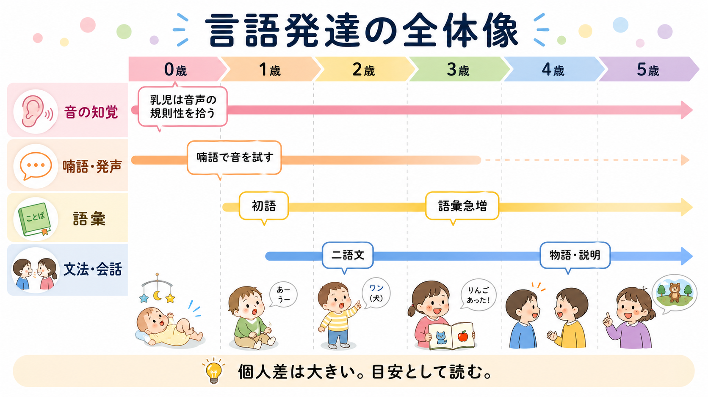
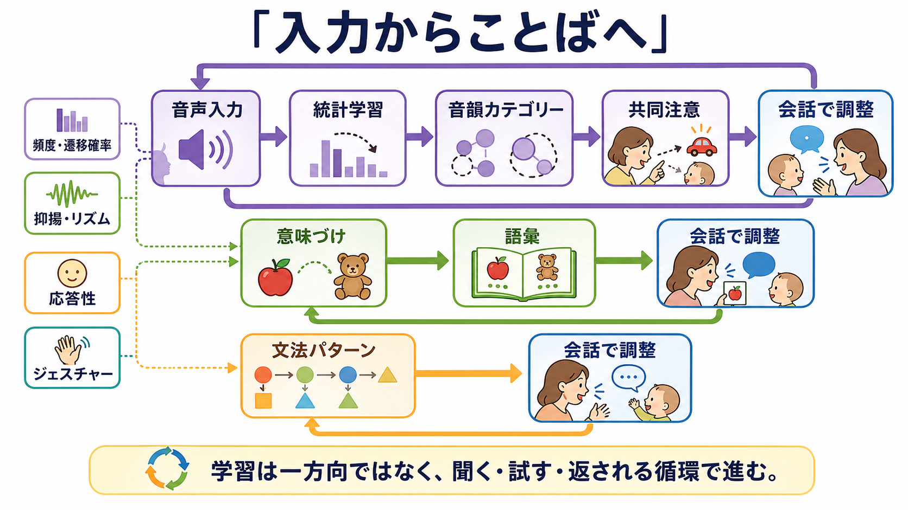
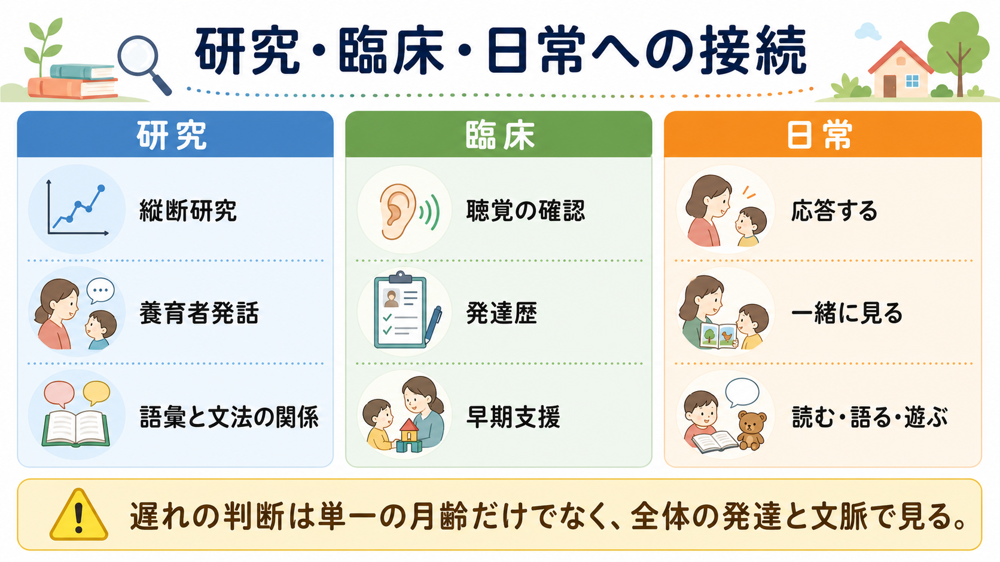

# 言語発達はどのように進むのか

## 要点

- 言語発達は「聞く」「声を出す」「意味を結ぶ」「文を組み立てる」「会話で調整する」が重なりながら進む過程である。
- 乳児は生後早期から音声のリズムや音の並びの規則性を拾い、母語に合った音韻カテゴリーへ知覚を再編成していく[1][2]。
- 喃語は単なる練習音ではなく、聞いた音、口や舌の運動、周囲からの応答が結びつく発声学習の場である[1]。
- 語彙が増えると、語と語の組み合わせが増え、文法は語彙から切り離された別装置というより、語彙・意味・使用場面とともに発達する[4][5]。
- 社会的相互作用、共同注意、養育者の応答性、子どもに向けられた発話の量と質は、言語発達の速度と個人差に関わる[6][7][8]。

## この記事で答える問い

1. 喃語、初語、語彙急増、二語文はどのような順序で現れやすいのか。
2. 乳児は、連続した音声からどのように音・語・意味を取り出すのか。
3. 語彙獲得と文法発達は、どのように結びついているのか。
4. 社会的相互作用は、言語発達のどの部分を支えているのか。
5. 言語発達の遅れを考えるとき、どのような点に注意すべきか。

## まず結論

言語発達は、決まった月齢に決まった技能が機械的に出現する過程ではない。むしろ、乳児が周囲の音声から統計的・韻律的な規則を学び、喃語や身振りで試し、養育者との共同注意や応答を通じて意味を結び、語彙の増加とともに文法パターンを作っていく循環である[1][2][6]。

発達の目安としては、乳児期に音への反応やクーイング、7-9か月頃に長い喃語、10-12か月頃に指さしや物を見せる行動、1歳台に初語と語彙増加、2歳前後に二語以上の組み合わせが見られやすい。ASHAの発達マイルストーンも、これらを診断基準ではなく、専門職や医師に相談するための目安として位置づけている[1]。

## 背景

人間の言語は、音声知覚、発声運動、記憶、注意、社会的認知、意味理解、文法処理が組み合わさった能力である。したがって、言語発達は[[言語理解はどのように行われるのか]]や[[言語産出はどのように行われるのか]]の発達版として読めるが、乳幼児期には大人の言語処理とは異なる特徴がある。

第一に、乳児は「まだ言葉を話せない」時期から、すでに言語入力を分析している。音声の頻度分布、音節間のつながりやすさ、抑揚、リズムなどを利用し、どの音のまとまりが母語で意味を持ちうるかを少しずつ学ぶ[2][3]。

第二に、言語発達は個人差が大きい。MacArthur-Bates Communicative Development Inventoriesの大規模データは、8-30か月のコミュニケーション発達に広いばらつきがあることを示した[4]。そのため、単一の月齢だけで「正常」「異常」と断定するより、聴覚、理解、表出、身振り、対人相互作用、全体の発達歴を合わせて見る必要がある。

## 基本概念

### 喃語

喃語は、乳児が「ばばば」「だだだ」のような反復的・音節的な発声を行う段階である。これは、発声器官の運動練習であると同時に、周囲の音声を聞き、自分の声を聞き返し、養育者から応答を受ける相互作用的な学習である。喃語の発達は、音韻知覚と発声運動が結びつく入口にあたる[1][2]。

### 語彙獲得

語彙獲得とは、音のまとまりを対象・行為・性質・関係と結びつけることである。子どもは、単語を辞書のように孤立して覚えるのではなく、共同注意、指さし、反復される場面、養育者の視線や応答、既に知っている語との関係を使って意味を推測する[6][8]。

### 文法発達

文法発達は、語と語を組み合わせて、誰が、何を、どうしたのかを表す力が増す過程である。初期には「ママ きた」「もっと みず」のような二語文が中心だが、語彙が増えるにつれて、語順、助詞、動詞の使い方、時制、修飾、物語の構成へ広がる。語彙と文法は独立に発達するというより、互いに支え合う[5]。

### 社会的相互作用

社会的相互作用とは、子どもと他者が視線、表情、声、身振り、物への注意を共有しながらやりとりすることである。特に共同注意は、同じ対象を見ながら「これが何か」「いま何をしているか」を共有する場を作る。これは[[社会的認知とは何か]]や[[心の理論とは何か]]ともつながる。

## 仕組み

### 1. 音声から規則を拾う

乳児は、連続した音声をただ受動的に聞いているわけではない。母語でよく使われる音の分布、音節のつながりやすさ、強勢や抑揚を利用して、音韻カテゴリーや語の境界を学ぶ[2]。Saffranらの研究は、8か月児が短時間の人工言語入力から音節間の遷移確率を利用して語らしいまとまりを切り出せることを示した[3]。

この段階は、のちの[[読字は脳内でどのように処理されるのか]]にもつながる。音韻を細かく扱う力は、話し言葉だけでなく、後の文字学習や音読にも関係する。

### 2. 喃語で「聞く」と「出す」を結ぶ

喃語が現れると、乳児は自分の発声を聞き返しながら、口、舌、唇、呼吸の制御を調整する。周囲が発声に応答すると、乳児の発声は単なる運動から、相手に働きかけるコミュニケーションへ近づく。ここでは[[模倣学習はなぜ重要なのか]]や[[観察学習とは何か]]に近い学習も働く。

重要なのは、喃語が「意味のない音」ではないことである。大人の発話をまねる、声を交互に出す、笑顔や視線が返ってくると発声が増える、といった経験を通じて、乳児は声が社会的な道具であることを学ぶ。

### 3. 共同注意で音と意味を結ぶ

語の意味を学ぶには、音声だけでなく「いま何について話しているのか」が必要である。養育者が子どもの見ている対象に合わせて「りんごだね」「赤いね」と応答すると、子どもは音のまとまりと対象・性質を結びつけやすくなる。母親の応答性が、初語、50語到達、語の組み合わせなどのマイルストーンの時期を予測したという縦断研究もある[6]。

これは、語彙学習が「教え込み」だけで進むわけではないことを示す。子どもの興味に大人が入っていく、子どもの発声や身振りに意味を返す、一緒に見る対象を作る、といった細かな相互作用が、語の意味づけを支える。

### 4. 語彙の増加が文法を押し広げる

初期の文法発達は、語彙獲得と強く結びつく。BatesとGoodmanは、通常発達、失語、リアルタイム処理の証拠を整理し、文法の出現が語彙サイズに強く依存することを論じた[5]。語が増えるほど、「名詞 + 動詞」「もっと + 名詞」「形容詞 + 名詞」のような組み合わせを試せるようになり、文法パターンが蓄積する。

使用基盤的な見方では、子どもは抽象的な文法規則を最初から完全に持つのではなく、よく聞く表現、反復される場面、自分で使って成功した言い方から、少しずつ一般化を作る[8]。この過程は[[学習とは何か]]や[[神経可塑性は発達と学習をどう支えるのか]]とも接続できる。

### 5. 入力の量と質が個人差を作る

子どもに向けられた発話は、単に多ければよいわけではない。Roweの縦断研究では、18、30、42か月時点の養育者発話を調べ、発達時期によって語数、多様な語彙、脱文脈的な説明など、後の語彙力に効きやすい入力の側面が異なることが示された[7]。

つまり、乳児期には反応しやすい声かけや共同注意、幼児期には多様な語彙、さらに成長すると理由、過去、未来、物語を語るような脱文脈的会話が重要になる。これは家庭の責任を単純に強調するためではなく、子どもが利用できる言語経験の質を具体的に見るための視点である。

## 図解

図1は、0-5歳頃までの言語発達を、音の知覚、喃語・発声、語彙、文法・会話の4つの流れとして示している。実際の発達では各流れが並行し、個人差も大きい。

図2は、音声入力、統計学習、音韻カテゴリー、共同注意、意味づけ、語彙、文法パターン、会話調整が循環的に働くことを示している。言語学習は一方向の入力ではなく、聞く、試す、返される、修正するというループで進む。

図3は、研究、臨床、日常支援への接続をまとめている。言語発達の遅れを考えるときは、単一の月齢ではなく、聴覚、発達歴、相互作用、語彙理解、表出、生活文脈を合わせて見る。

## 臨床・研究との接続

言語発達の研究では、親報告、観察、語彙チェックリスト、音声知覚実験、縦断研究が組み合わされる。CDIのような親報告尺度は、語彙、身振り、文法発達の個人差を把握するうえで有用である[4]。

臨床的には、言語の遅れを見たとき、まず聴覚、全体的な発達、社会的相互作用、理解と表出の差、家庭や保育環境での言語経験を確認する。ASHAのマイルストーンも、子どもが多くの項目を満たさない場合に、聴覚専門職や言語聴覚士などに相談する目安として使うことを勧めている[1]。

ただし、この記事は教育・研究目的の整理であり、個別の診断や治療指示ではない。気になる遅れがある場合は、月齢表だけで判断せず、医師、言語聴覚士、心理職、保健師などの専門職に相談することが望ましい。

## よくある誤解

### 誤解1: 言葉は、話し始めてから発達する

実際には、言語発達は発話以前から始まっている。音への反応、声のやりとり、喃語、指さし、共同注意は、後の語彙や文法の土台になる[1][2]。

### 誤解2: 語彙と文法は別々に発達する

語彙と文法は分けて説明できるが、発達上は密接に結びつく。語彙が増えることで文法的な組み合わせの材料が増え、文法パターンを使うことで語の意味も細かくなる[5]。

### 誤解3: たくさん聞かせれば、それだけで十分である

入力の量は重要だが、質や相互作用も重要である。子どもの注意に合わせる、応答する、語彙を広げる、少し先の内容を話すといった特徴が発達時期ごとに異なる役割を持つ[6][7]。

### 誤解4: 二語文が遅いだけで、すぐに障害と判断できる

言語発達には大きな個人差がある[4]。一方で、聴覚、理解、共同注意、発声、身振り、社会的関心など複数の領域で気になる点が続く場合は、早めに専門職に相談する意味がある[1]。

## 関連ノート

- [[言語理解はどのように行われるのか]]
- [[言語産出はどのように行われるのか]]
- [[社会的認知とは何か]]
- [[心の理論とは何か]]
- [[模倣学習はなぜ重要なのか]]
- [[観察学習とは何か]]
- [[学習とは何か]]
- [[神経可塑性は発達と学習をどう支えるのか]]

### MOC更新候補

- `content/00_MOC/MOC｜認知科学・心理学.md`
- 発達・愛着・社会心理カテゴリの索引がある場合は、本記事を「言語発達」「社会的相互作用」「発達心理学」の項目に追加する。

## 理解チェック

1. 喃語は、なぜ単なる「意味のない音」ではないのか。
2. 統計学習は、連続音声から語を切り出すときにどのように役立つか。
3. 語彙の増加は、文法発達にどのような影響を与えるか。
4. 共同注意や養育者の応答性は、語の意味づけをどのように支えるか。
5. 言語発達の遅れを考えるとき、単一の月齢だけで判断しない理由は何か。

## 未解決問題

- 乳児がどの手がかりを、どの発達段階で、どの程度重みづけして使うのかは、言語や環境によって異なる可能性がある。
- 養育者発話の「質」を、文化差や多言語環境を含めてどう測定するかには課題が残る。
- 早期支援の効果を、子どもの特性、家庭環境、保育環境、聴覚や神経発達の要因と切り分けて評価することは難しい。
- AIやデジタルメディアとの相互作用が、乳幼児の言語発達にどのような長期的影響を持つかは、今後の検討課題である。

## 参考文献

[1] American Speech-Language-Hearing Association. ASHA's Developmental Milestones: Birth to 5 Years. https://www.asha.org/public/developmental-milestones/

[2] Kuhl, P. K. (2004). Early language acquisition: Cracking the speech code. *Nature Reviews Neuroscience*, 5, 831-843. https://doi.org/10.1038/nrn1533

[3] Saffran, J. R., Aslin, R. N., & Newport, E. L. (1996). Statistical learning by 8-month-old infants. *Science*, 274(5294), 1926-1928. https://doi.org/10.1126/science.274.5294.1926

[4] Fenson, L., Dale, P. S., Reznick, J. S., Bates, E., Thal, D. J., Pethick, S. J., Tomasello, M., Mervis, C. B., & Stiles, J. (1994). Variability in early communicative development. *Monographs of the Society for Research in Child Development*, 59(5), i-185. https://doi.org/10.2307/1166093

[5] Bates, E., & Goodman, J. C. (1997). On the inseparability of grammar and the lexicon: Evidence from acquisition, aphasia and real-time processing. *Language and Cognitive Processes*, 12(5-6), 507-584. https://doi.org/10.1080/016909697386628

[6] Tamis-LeMonda, C. S., Bornstein, M. H., & Baumwell, L. (2001). Maternal responsiveness and children's achievement of language milestones. *Child Development*, 72(3), 748-767. https://doi.org/10.1111/1467-8624.00313

[7] Rowe, M. L. (2012). A longitudinal investigation of the role of quantity and quality of child-directed speech in vocabulary development. *Child Development*, 83(5), 1762-1774. https://doi.org/10.1111/j.1467-8624.2012.01805.x

[8] Hoff, E. (2006). How social contexts support and shape language development. *Developmental Review*, 26(1), 55-88. https://doi.org/10.1016/j.dr.2005.11.002
