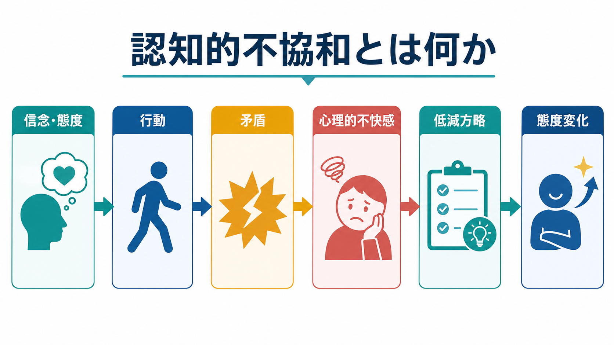
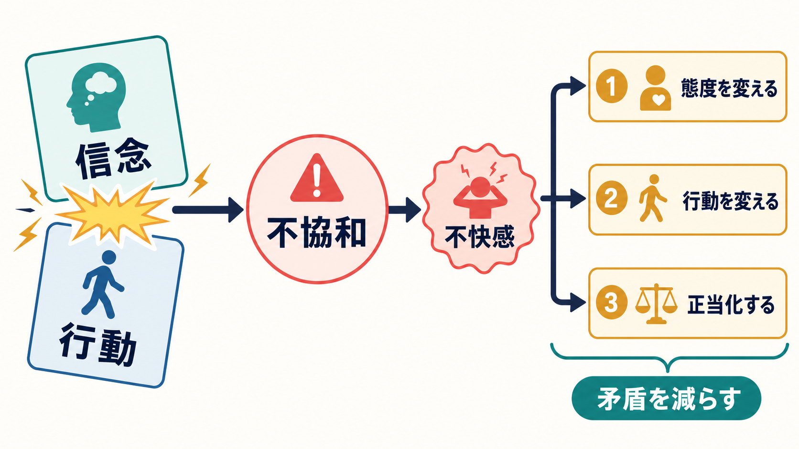
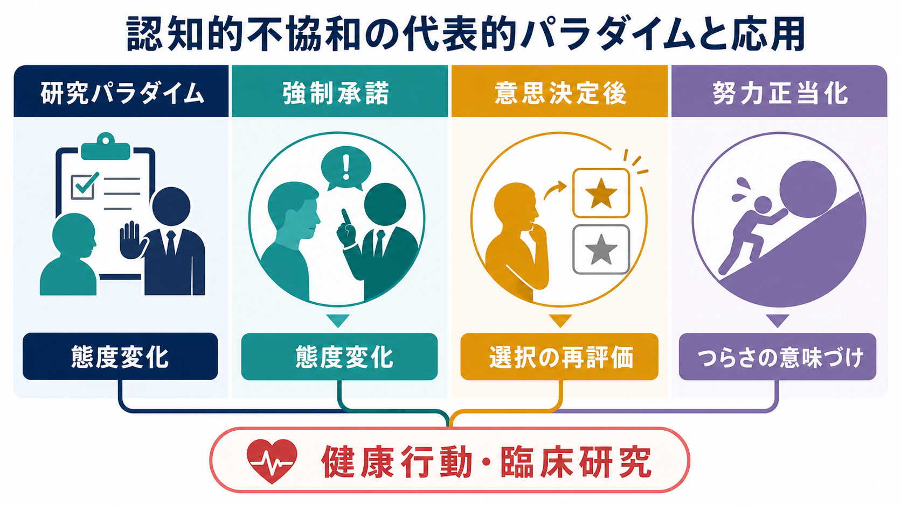

# 認知的不協和とは何か

## 要点

- 認知的不協和とは、信念・態度・価値観と、実際の行動や選択が矛盾したときに生じる心理的不快感である[1][5]。
- 人はその不快感を下げるために、態度を変える、行動を変える、新しい理由を足す、矛盾する情報を避ける、といった調整を行う[1][4]。
- 古典的な強制承諾実験では、十分な外的報酬がないときほど、自分の行動を説明するために態度が変わりやすいことが示された[3]。
- 意思決定後には、選んだ選択肢をよりよく、捨てた選択肢をより悪く評価し直すことがある[2]。
- 近年の神経科学研究では、前部帯状皮質、前部島皮質、背外側前頭前野、線条体などが、不協和・葛藤・選好変化と関係する候補領域として調べられている[7][8]。

## この記事で答える問い

1. 認知的不協和は、単なる「気まずさ」や「言い訳」と何が違うのか。
2. なぜ、行動が先に起こったあとで信念や態度が変わることがあるのか。
3. 研究・教育・健康行動・臨床実践で、この概念をどう使い、どう使いすぎないべきか。

## まず結論

認知的不協和は、「信念が先にあり、行動はそれに従う」という単純な見方を揺さぶる概念である。人は、自分の行動と信念が食い違ったとき、その矛盾を放置しにくい。そこで、行動を変えるだけでなく、行動に合うように態度や記憶、理由づけを変えることがある[1][3]。

たとえば「環境に配慮したい」と思っている人が、便利さのために過剰な消費を続けたとする。このとき人は、買い物を控えるかもしれない。あるいは「今回は必要だった」「他の場面で十分に貢献している」と正当化するかもしれない。どちらも、矛盾による不快感を下げる働きとして理解できる。

ただし、認知的不協和は「人は必ず自己正当化する」という決めつけではない。矛盾の重要度、本人の選択感、責任感、社会的文脈、代替行動のしやすさによって反応は変わる[4][6]。

## 背景

Festinger は 1957 年の著書で、認知要素どうしが不一致であるとき、人はその不一致を減らそうと動機づけられると論じた[1]。ここでいう認知要素には、事実についての知識、自己についての考え、価値観、態度、行動についての認識が含まれる。

この理論が重要だったのは、態度が行動を生むだけでなく、**行動が態度を作り替える**ことを説明した点にある。Brehm の意思決定後研究では、選択後に選んだものの魅力が上がり、選ばなかったものの魅力が下がる「選択誘発性の選好変化」が報告された[2]。Festinger と Carlsmith の強制承諾実験では、退屈な課題を「面白かった」と他者に伝えた参加者のうち、少額報酬群のほうが後に課題を好意的に評価しやすかった[3]。

この流れは、[[社会心理学とは何か|社会心理学]]、[[帰属理論とは何か|帰属理論]]、[[意思決定とは何か|意思決定]]、[[認知バイアスとは何か|認知バイアス]]の研究と深くつながる。

## 基本概念

### 認知要素

認知要素とは、「私は健康を大切にしている」「この行動は危険だ」「私は自分で選んだ」「周囲はこれを期待している」といった、本人が保持している意味づけの単位である。認知的不協和は、これらが互いに矛盾するときに生じる。

### 不協和

不協和は、単に情報が食い違うことではない。本人にとって重要で、自己像や価値観、選択責任と関わる矛盾ほど、不快感や態度変化を引き起こしやすい[4][5]。そのため、不協和は[[自己概念とは何か|自己概念]]や[[自己効力感とは何か|自己効力感]]とも接続する。

### 低減方略

不協和を下げる方法は大きく分けて四つある。

| 方略 | 何を変えるか | 例 |
|---|---|---|
| 態度を変える | 行動に合うように考えを変える | 「案外この選択でよかった」 |
| 行動を変える | 信念に合うように行動を変える | 「次からは別の選択をする」 |
| 新しい認知を加える | 矛盾を弱める理由を足す | 「今回は例外的な事情があった」 |
| 情報を選ぶ | 不協和を強める情報を避ける | 「反対意見の記事を読まない」 |

## 仕組み

認知的不協和の中心は、矛盾、不快感、低減行動の循環である。まず、信念や態度と行動が衝突する。次に、その衝突が「自分にとって重要な矛盾」として評価される。すると心理的不快感が生じる。この不快感は、単なる感情反応ではなく、矛盾を減らす方向へ認知や行動を押す動機づけとして働く[5]。

Cooper と Fazio は、不協和が生じる条件として、望ましくない結果、個人的責任、選択の自由、予測可能性などを重視する「新しい見方」を提示した[4]。この視点では、単なる矛盾だけでなく、「自分がそれを選び、その結果に関与した」という評価が重要になる。

一方で、Harmon-Jones と Mills は、認知的不協和理論には複数の解釈があり、古典理論、自己概念を重視する立場、責任と嫌悪的結果を重視する立場、行動を支える認知整合性を重視する立場が並存していると整理している[6]。したがって、研究では「どの条件で、どの低減方略が起こるのか」を具体的に分けて考える必要がある。

## 図解

| 図 | 主題 | 読み方 |
|---|---|---|
| 図1 | 概念地図 | 信念・行動・矛盾・不快感・態度変化の全体像を見る |
| 図2 | 中心メカニズム | 不協和がどのように低減方略へつながるかを見る |
| 図3 | 研究と応用 | 代表的パラダイムと応用領域の違いを見る |

## 臨床・研究との接続

認知的不協和は、健康行動、依存、服薬、リハビリテーション、心理教育、差別や偏見、消費行動、組織行動などの理解に使える。たとえば「健康に悪いと知っているが続けている」という状態では、行動を変えるだけでなく、「自分はまだ大丈夫」「ストレス解消には必要」といった正当化が生じることがある。この点は[[行動変容はどのように起こるのか|行動変容]]の設計とも関係する。

ただし、臨床や支援場面では、認知的不協和を個人の弱さとして扱ってはいけない。行動には、身体症状、依存性、貧困、対人関係、職場環境、家族役割、文化的規範、利用可能な支援が関わる。教育・研究目的で「矛盾をどう低減しているか」を見ることは有用だが、個別の診断や治療指示として「あなたは不協和を正当化している」と断定するのは避けるべきである。

神経科学研究では、dACC と前部島皮質が行動と態度の衝突や不快感に関わり、その活動が後の態度変化を予測する可能性が示された[7]。また、選択誘発性の選好変化では、前部帯状皮質や背外側前頭前野が不協和の程度を追跡し、線条体活動が選好変化と関係することが報告されている[8]。ただし、これらは個人の態度変化を単一脳領域で説明できるという意味ではない。

## よくある誤解

### 誤解1：認知的不協和は「嘘をつくこと」と同じである

認知的不協和は、意図的な虚偽とは限らない。むしろ本人が自分の行動を理解可能にしようとする過程で、態度や評価が本当に変わることがある[3][8]。

### 誤解2：不協和があれば必ず態度が変わる

態度変化は一つの低減方略にすぎない。行動変更、情報探索、合理化、社会的支持の探索、問題の重要度を下げることもある[1][6]。

### 誤解3：外的報酬が大きいほど態度変化も大きい

強制承諾実験の核心は、むしろ「外的理由が少ないとき、自分の行動を内的に説明しやすくなる」という点にある[3]。十分な報酬や強制があれば、「報酬のために言った」と説明できるため、態度を変える必要が弱くなる。

### 誤解4：認知的不協和はいつも悪い

不協和は不快だが、自己理解や行動修正の契機にもなる。矛盾に気づくことは、健康行動、倫理的判断、学習、対人関係の改善につながる場合がある。一方で、強すぎる不協和は防衛的な正当化や情報回避を促すこともある。

## 関連ノート

- [[社会心理学とは何か]]
- [[帰属理論とは何か]]
- [[意思決定とは何か]]
- [[認知バイアスとは何か]]
- [[行動変容はどのように起こるのか]]
- [[自己概念とは何か]]
- [[自己効力感とは何か]]

### 関連ノート候補

- 態度変化とは何か
- 選択誘発性選好変化とは何か
- 努力正当化とは何か
- 自己正当化バイアスとは何か
- 確証バイアスと認知的不協和はどう違うのか

### MOC更新候補

- `content/00_MOC/MOC｜認知科学・心理学.md`
- `content/00_MOC/MOC｜認知機能.md`
- 社会心理学・態度変化系の MOC がある場合、認知的不協和の入口ノートとして追加する。

並列ジョブとの競合を避けるため、本タスクでは MOC 本体は更新しない。

## 理解チェック

1. 認知的不協和は、信念と行動のどのような関係から生じるか。
2. 強制承諾実験で、少額報酬群の態度変化が大きくなりやすいのはなぜか。
3. 意思決定後に、選んだものの評価が上がりやすいのはどのような低減方略と考えられるか。
4. 認知的不協和を臨床・支援場面で扱うとき、個人責任に還元しないために何を確認すべきか。
5. 神経科学研究の知見を、単一脳領域による態度変化の説明として読みすぎてはいけない理由は何か。

## 未解決問題

- 不協和の強さを、主観報告、行動指標、生理指標、神経指標のどれで測るのが最も妥当か。
- 態度変化、行動変化、情報回避、正当化のどれが選ばれるかを予測する条件は何か。
- 文化差、集団規範、オンライン環境が、不協和低減の仕方をどのように変えるか。
- 選択誘発性選好変化の研究では、測定手続きや統計的アーティファクトをどのように統制すべきか。

## 参考文献

[1] Festinger, L. (1957). *A Theory of Cognitive Dissonance*. Stanford University Press. https://www.sup.org/books/sociology/theory-cognitive-dissonance

[2] Brehm, J. W. (1956). Postdecision changes in the desirability of alternatives. *The Journal of Abnormal and Social Psychology, 52*(3), 384-389. https://doi.org/10.1037/h0041006

[3] Festinger, L., & Carlsmith, J. M. (1959). Cognitive consequences of forced compliance. *The Journal of Abnormal and Social Psychology, 58*(2), 203-210. https://doi.org/10.1037/h0041593

[4] Cooper, J., & Fazio, R. H. (1984). A new look at dissonance theory. *Advances in Experimental Social Psychology, 17*, 229-266. https://doi.org/10.1016/S0065-2601(08)60121-5

[5] Elliot, A. J., & Devine, P. G. (1994). On the motivational nature of cognitive dissonance: Dissonance as psychological discomfort. *Journal of Personality and Social Psychology, 67*(3), 382-394. https://doi.org/10.1037/0022-3514.67.3.382

[6] Harmon-Jones, E., & Mills, J. (2019). An introduction to cognitive dissonance theory and an overview of current perspectives on the theory. In E. Harmon-Jones (Ed.), *Cognitive Dissonance: Reexamining a Pivotal Theory in Psychology* (2nd ed., pp. 3-24). American Psychological Association. https://doi.org/10.1037/0000135-001

[7] van Veen, V., Krug, M. K., Schooler, J. W., & Carter, C. S. (2009). Neural activity predicts attitude change in cognitive dissonance. *Nature Neuroscience, 12*, 1469-1474. https://doi.org/10.1038/nn.2413

[8] Izuma, K., Matsumoto, M., Murayama, K., Samejima, K., Sadato, N., & Matsumoto, K. (2010). Neural correlates of cognitive dissonance and choice-induced preference change. *Proceedings of the National Academy of Sciences, 107*(51), 22014-22019. https://doi.org/10.1073/pnas.1011879108
