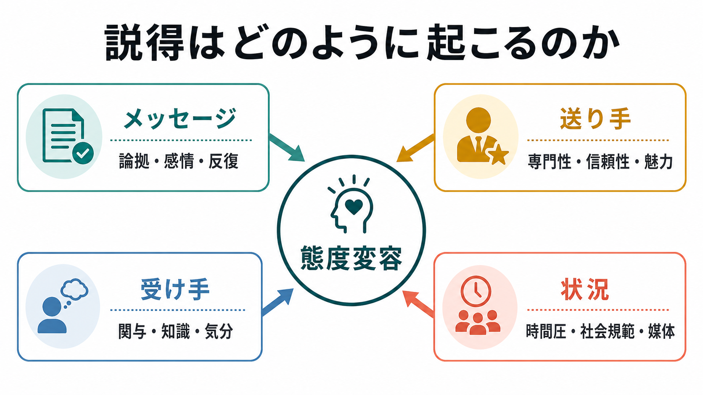
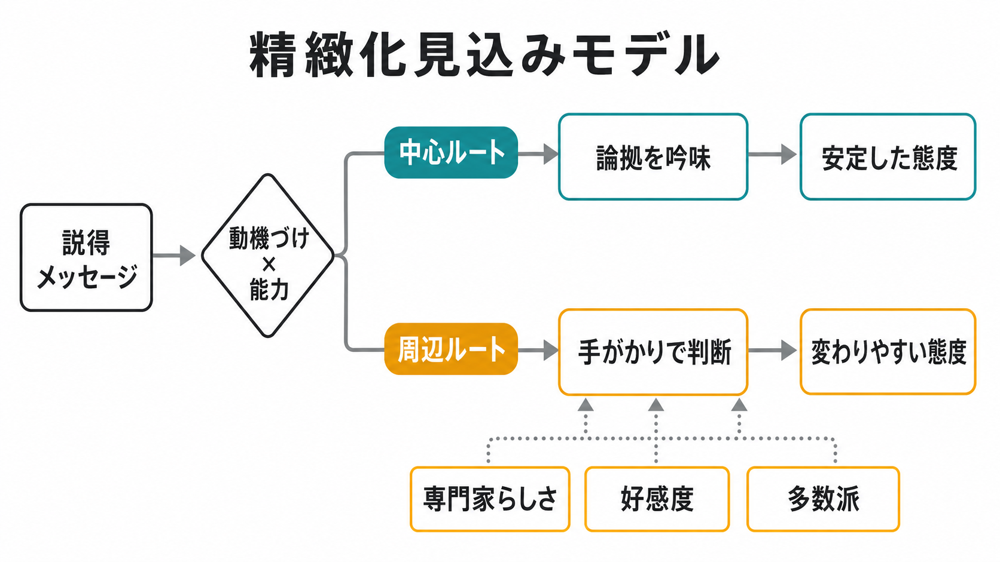
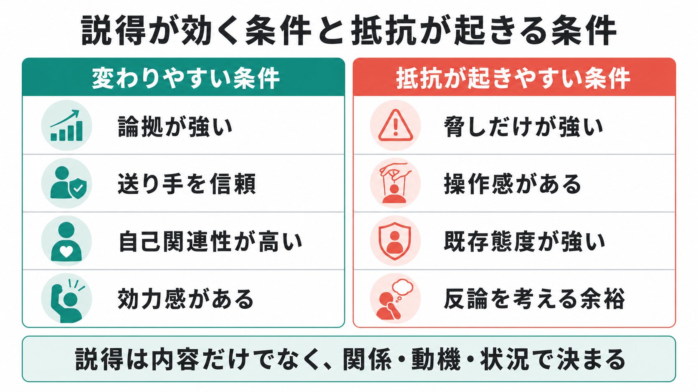

# 説得はどのように起こるのか

## 要点

- 説得とは、メッセージを通じて、受け手の態度、信念、意図、行動傾向が変わる過程である。
- 古典的には「誰が、何を、誰に、どのような状況で伝えるか」という枠組みで、送り手、メッセージ、受け手、媒体・文脈が検討されてきた[1]。
- 説得は、いつも丁寧な熟慮によって起こるわけではない。関与や理解能力が高いと論拠の質が重要になり、低いと専門性、好感度、多数派らしさなどの手がかりが効きやすい[3][4]。
- 送り手の信頼性や専門性は説得を左右するが、その効果は時間経過、受け手の関与、メッセージ内容との一致によって変わる[2][3]。
- 恐怖や不安に訴えるメッセージは、危険の重大さだけでなく「自分に何ができるか」という効力感を同時に示すと有効になりやすい[8]。

## この記事で答える問い

1. 説得は、単に「よい理由」を示せば起こるのか。
2. メッセージ、送り手、受け手、状況は、それぞれ態度変容にどう関わるのか。
3. 中心ルートと周辺ルート、体系的処理とヒューリスティック処理は何を説明しているのか。
4. 臨床・教育・公衆衛生で説得を扱うとき、どこに倫理的注意が必要か。

## まず結論

説得は、「強いメッセージを一方的に送ること」ではなく、受け手がその情報をどの程度注意し、理解し、既存の態度や自己像と照合し、行動可能性まで見積もるかによって起こる。したがって、同じ内容でも、信頼できる相手から届くか、自分に関係があると感じるか、考える余裕があるか、周囲の規範がどう見えるかで効果は変わる。

重要なのは、説得を「相手を操作する技術」としてではなく、態度変容が起こる条件を分析する枠組みとして使うことである。とくに医療・教育・支援の文脈では、情報を理解しやすくし、選択肢とリスクを明確にし、本人の自律性を保つことが中心になる。説得が強すぎると、納得ではなく抵抗、反発、表面的同意を生む。

## 背景

説得研究の古典的出発点の一つは、Hovland、Janis、Kelley による Yale 学派の研究である。彼らは、説得を「送り手」「メッセージ」「受け手」「反応」という構成要素に分け、誰が何を誰に伝えるかによって意見変化がどう変わるかを検討した[1]。これは現在でも、健康コミュニケーション、教育、広告、政治的コミュニケーション、[[ナッジとは何か|ナッジ]]、[[行動変容はどのように起こるのか|行動変容]]を考える基礎になる。

その後の研究は、単に「どの要素が効くか」だけでなく、「受け手がどのように処理するか」に焦点を移した。精緻化見込みモデル（elaboration likelihood model; ELM）は、説得には、論拠をよく吟味する中心ルートと、周辺的手がかりに基づく周辺ルートがあると整理した[3]。ヒューリスティック・システマティックモデル（heuristic-systematic model; HSM）も、努力を要する体系的処理と、単純な判断規則によるヒューリスティック処理を区別した[4]。

この流れは、[[直感と熟慮はどう違うのか|直感と熟慮]]、[[ヒューリスティックとは何か|ヒューリスティック]]、[[認知バイアスとは何か|認知バイアス]]と接続する。ただし、説得研究における二重過程は、「熟慮は正しく、直感は誤り」という単純な区別ではない。受け手の関与、知識、時間、感情、社会的関係によって、どちらの処理が使われやすいか、どちらがより安定した態度につながるかが変わる。

## 基本概念

### 説得

説得とは、メッセージを通じて、対象への評価、信念、意図、行動傾向を変える過程である。ここでいう態度は、「好き・嫌い」だけではなく、ある政策を支持するか、治療を受けたいと思うか、学習方法を試すか、他者の主張を信頼するかといった評価的構えを含む。

### 態度変容

態度変容とは、対象への評価が変化することである。態度は安定した性質として扱われることもあるが、近年のレビューでは、文脈の中で構成される側面、明示的態度と潜在的態度、連合的過程と命題的過程が区別される[6]。そのため、質問紙で変わった態度が、長期的な行動変化や実生活での選択にそのままつながるとは限らない。

### メッセージ

メッセージには、論拠の強さ、証拠の質、感情訴求、反復、具体例、片面提示か両面提示か、といった特徴がある。関与が高い受け手では、論拠の質が態度変容を左右しやすい[3]。一方で、関与が低い場合や処理資源が限られる場合は、単純さ、印象のよさ、記憶しやすさが大きくなる。

### 送り手

送り手には、専門性、信頼性、好感度、魅力、所属集団、利害関係がある。Hovland と Weiss は、同じ内容でも信頼できる情報源からの提示のほうが説得的に受け取られやすいことを示し、時間が経つと情報源と内容の結びつきが弱まりうることも示した[2]。ただし、送り手効果は万能ではない。受け手がよく考える場面では、送り手の肩書きより論拠の質が重視されやすい[3][4]。

### 受け手

受け手側には、関与、事前知識、既存態度、自己関連性、認知的余裕、気分、反論のしやすさ、集団同一性がある。既存態度が強い場合、受け手は反対情報を精査し、支持情報を受け入れやすくなることがある。これは[[帰属理論とは何か|帰属]]、[[自己奉仕バイアスとは何か|自己奉仕バイアス]]、動機づけられた推論とも接続する。

### 状況

状況には、時間圧、媒体、対面かオンラインか、周囲の規範、権威関係、選択肢の見え方が含まれる。社会的影響研究では、人は正確に世界を理解したい、他者とよい関係を保ちたい、望ましい自己像を保ちたいという複数の動機の中で影響を受けると整理される[7]。説得は個人内の情報処理だけでなく、社会的関係の中で起こる。

## 仕組み

### 1. 注意が向く

説得は、まずメッセージが受け手の注意に入らなければ始まらない。目立つ表現、タイミング、個人的関連性、送り手への関心は、注意を向ける入口になる。ただし、目立つだけのメッセージは、短期的な注目を集めても、論拠の吟味や信頼の形成につながらないことがある。

### 2. 内容が理解される

受け手は、メッセージを自分の知識や経験と照合する。専門用語が多すぎる、論点が多すぎる、行動の選択肢が曖昧である場合、理解は進みにくい。教育や公衆衛生では、情報の正確さだけでなく、受け手が実際に読める粒度にすることが重要である。

### 3. 中心ルートか周辺ルートで処理される

ELM では、受け手に動機づけと能力があるとき、中心ルートが働きやすい。中心ルートでは、論拠の強さ、証拠の妥当性、反論への応答が重視され、そこで形成された態度は比較的持続し、抵抗に強く、行動を予測しやすい[3]。

一方、動機づけや能力が低いときには、周辺ルートが働きやすい。周辺ルートでは、「専門家が言っている」「好感が持てる」「多くの人が支持している」「見たことがある」といった手がかりが判断を支える。これは怠惰な処理というより、限られた時間と注意の中で判断するための方略である。

### 4. 感情と効力感が行動可能性を変える

感情は説得を強めることも弱めることもある。恐怖訴求のメタ分析では、恐怖を喚起するメッセージは態度、意図、行動に影響しうるが、効果は「脅威を示すこと」だけでは決まらない[8]。とくに健康行動では、危険の重大さと同時に、具体的に実行できる対処法、実行できるという効力感、支援へのアクセスを示す必要がある。脅しだけが強いと、回避、否認、反発を招く。

### 5. 社会的関係の中で受け止められる

説得は孤立した個人に届くのではなく、家族、友人、職場、学校、専門職、オンライン共同体の中で受け止められる。社会的影響のレビューは、正確性、関係維持、自己概念という複数の動機が、同調、応諾、規範への反応を生むと整理している[7]。そのため、正しい情報を示しても、それが本人の所属集団や自己像を脅かす形で提示されると、抵抗が起きやすい。

## 図解

説得は、メッセージの質だけで決まるわけではない。下の図のように、論拠の強さ、送り手への信頼、自己関連性、効力感は態度変容を支えやすい。一方で、脅しだけが強い、操作されていると感じる、既存態度が強い、反論を考える余裕があるといった条件では、抵抗が起こりやすい。

## 臨床・研究との接続

臨床や心理支援では、説得は診断や治療方針を押し付ける技法ではない。むしろ、本人が理解できる情報を提供し、選択肢の利益と不利益を整理し、本人の価値や生活文脈に照らして意思決定を支えるための知識である。たとえば[[モチベーション面接は行動変容をどう支えるのか|モチベーション面接]]は、相手を説得で押すより、本人の変化理由を本人の言葉として引き出すことを重視する。

教育では、学習方略や生活習慣を変えるメッセージが、単なる「正論」になりやすい。効果的な支援では、学習者がなぜその方略を使うのか、いつ使えるのか、実行できたときに何が変わるのかを具体化する。これは[[自己効力感とは何か|自己効力感]]や[[フィードバックは学習をどう促進するのか|フィードバック]]とも関係する。

研究では、態度変容を測るだけでは不十分である。短期的な自己報告、持続する態度、反論への抵抗、実際の行動、社会的望ましさ、測定タイミングを分けて設計する必要がある[5][6]。また、オンライン環境では、送り手の可視性、アルゴリズムによる反復、集団規範の見え方が説得過程を変えるため、古典的モデルをそのまま当てはめるだけでは足りない。

## よくある誤解

### 誤解1: 説得は論理だけで決まる

論理は重要だが、受け手が論拠を吟味する動機づけと能力をもっている場合に強く効きやすい。関与が低い場面では、送り手の信頼性、好感度、規範、感情的手がかりが大きくなる[3][4]。

### 誤解2: 有名人や専門家を出せば説得できる

専門性や信頼性は効くことがあるが、論点との関連、利害関係、受け手の関与によって効果は変わる。高関与の受け手は、肩書きよりも論拠の質を見やすい[3]。

### 誤解3: 強く怖がらせるほど行動が変わる

恐怖訴求は有効な場合があるが、危険だけを強調して対処可能性を示さないと、防衛的回避や反発が起こりやすい。恐怖と効力感をセットで扱う必要がある[8]。

### 誤解4: 説得された態度はすぐ行動に変わる

態度が変わっても、技能、機会、習慣、社会的制約がなければ行動は変わらない。行動変容を考えるときは、説得だけでなく、環境設計、練習、支援、フィードバックが必要である。

### 誤解5: 説得研究は操作術である

説得研究は、態度変容の条件を分析する科学であり、操作を正当化するものではない。実践では、透明性、自律性、撤回可能性、不利益を受けやすい集団への配慮が不可欠である。

## 関連ノート

- [[ヒューリスティックとは何か]]
- [[認知バイアスとは何か]]
- [[直感と熟慮はどう違うのか]]
- [[意思決定とは何か]]
- [[ナッジとは何か]]
- [[行動変容はどのように起こるのか]]
- [[モチベーション面接は行動変容をどう支えるのか]]
- [[服従とは何か]]
- [[帰属理論とは何か]]
- [[自己効力感とは何か]]

### 今後の作成候補

- 態度とは何か
- 社会的影響とは何か
- 同調とは何か
- 応諾とは何か
- 認知的不協和とは何か
- 動機づけられた推論とは何か
- 精緻化見込みモデルとは何か

### MOC更新候補

- `content/00_MOC/` 配下の認知科学・心理学系 MOC または社会心理学系 MOC に、バッチ統合時に `[[説得はどのように起こるのか]]` を追加する。
- 並列ジョブとの衝突を避けるため、この作業では MOC 本体は更新していない。

## 理解チェック

1. 中心ルートと周辺ルートの違いを、受け手の関与と処理能力の観点から説明できるか。
2. 同じメッセージでも、送り手の信頼性によって受け取られ方が変わる理由を説明できるか。
3. 恐怖訴求が有効になりやすい条件と、抵抗を生みやすい条件を区別できるか。
4. 説得と行動変容の違いを、態度、技能、機会、習慣の観点から説明できるか。
5. 臨床・教育で説得を使うとき、透明性と自律性がなぜ重要かを説明できるか。

## 参考文献

[1] Hovland, C. I., Janis, I. L., & Kelley, H. H. (1953). *Communication and Persuasion: Psychological Studies of Opinion Change*. Yale University Press. https://discover.library.unt.edu/catalog/b1828877

[2] Hovland, C. I., & Weiss, W. (1951). The influence of source credibility on communication effectiveness. *Public Opinion Quarterly, 15*(4), 635-650. https://doi.org/10.1086/266350

[3] Petty, R. E., & Cacioppo, J. T. (1986). The elaboration likelihood model of persuasion. *Advances in Experimental Social Psychology, 19*, 123-205. https://doi.org/10.1016/S0065-2601(08)60214-2

[4] Chaiken, S. (1980). Heuristic versus systematic information processing and the use of source versus message cues in persuasion. *Journal of Personality and Social Psychology, 39*(5), 752-766. https://doi.org/10.1037/0022-3514.39.5.752

[5] Wood, W. (2000). Attitude change: Persuasion and social influence. *Annual Review of Psychology, 51*, 539-570. https://doi.org/10.1146/annurev.psych.51.1.539

[6] Bohner, G., & Dickel, N. (2011). Attitudes and attitude change. *Annual Review of Psychology, 62*, 391-417. https://doi.org/10.1146/annurev.psych.121208.131609

[7] Cialdini, R. B., & Goldstein, N. J. (2004). Social influence: Compliance and conformity. *Annual Review of Psychology, 55*, 591-621. https://doi.org/10.1146/annurev.psych.55.090902.142015

[8] Tannenbaum, M. B., Hepler, J., Zimmerman, R. S., Saul, L., Jacobs, S., Wilson, K., & Albarracin, D. (2015). Appealing to fear: A meta-analysis of fear appeal effectiveness and theories. *Psychological Bulletin, 141*(6), 1178-1204. https://doi.org/10.1037/a0039729

## 未解決問題

- オンライン環境で、アルゴリズムによる反復接触、社会的規範の可視化、送り手の匿名性は説得過程をどの程度変えるのか。
- 明示的態度が変わったとき、それが潜在的態度、習慣、実際の選択にどのくらい持続的につながるのか。
- 説得的メッセージと選択環境設計を組み合わせるとき、どこからが不当な操作やダークパターンになるのか。
- 臨床・教育・公衆衛生で、受け手の自律性を保ちながら、リスク情報と効力感をどう両立させるのか。
