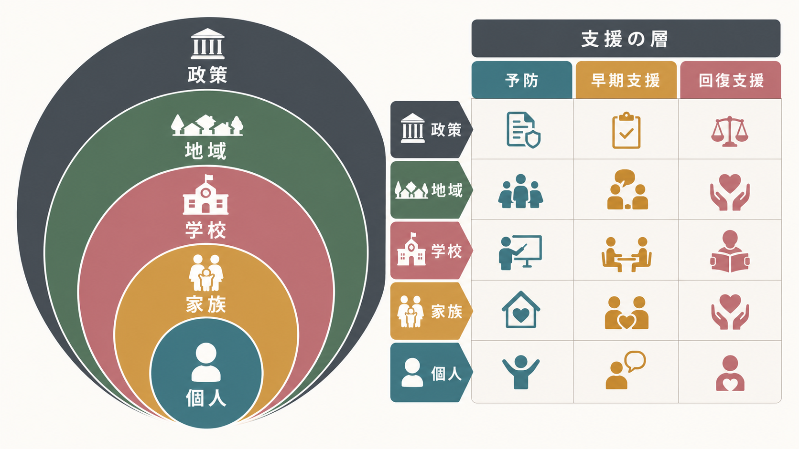
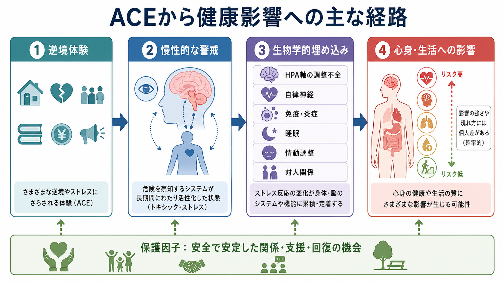

# 逆境的小児期体験ACEとは何か

## 要点

- 逆境的小児期体験ACE（Adverse Childhood Experiences）は、18歳未満に経験される虐待、ネグレクト、家庭機能不全など、強いまたは反復的なストレス源を指す公衆衛生上の概念である[1][2]。
- ACE研究の重要性は、単一の出来事ではなく、逆境の累積と成人期の心身の健康、健康リスク行動、社会経済的困難との関連を示した点にある[3][4]。
- 主要な経路は、慢性的な警戒、HPA軸や自律神経、免疫・炎症、睡眠、情動調整、対人関係への影響を通じた「発達中のシステムへの負荷」として理解できる[5]。
- ACEスコアは人口集団レベルのリスク指標として有用だが、個人の将来を決定する診断名ではない。保護因子、時期、期間、文化、社会的支援を合わせて読む必要がある[7][8]。

## この記事で答える問い

1. ACEとはどのような体験を指すのか。
2. ACEはなぜ成人期のメンタルヘルス、身体疾患、社会的困難と関連するのか。
3. ACEスコアをどこまで使えるのか、どこから誤用になるのか。
4. 研究・臨床・教育・支援では、ACEをどのように扱うべきか。

## まず結論

ACEは「子ども時代のつらい出来事リスト」ではなく、発達期に安全感、予測可能性、養育関係、社会的資源が損なわれる経験を、公衆衛生と発達科学の言葉で捉えるための枠組みである。典型的には、身体的・性的・心理的虐待、身体的・情緒的ネグレクト、家庭内暴力、養育者の物質使用、精神疾患、収監、離別・離婚などが含まれる[1][3]。WHOのACE-IQでは、いじめ、地域暴力、集団暴力など、家庭外の逆境も含めて国際比較できるよう設計されている[2]。

ただし、ACEの意義は「高スコアなら将来必ず病気になる」と言うことではない。ACEはリスクを高めるが、影響は確率的で、[[愛着とは何か|安定した関係]]、支援、治療、教育機会、地域資源、本人の回復経験によって変わる[7]。

## 背景

ACEという概念が広く知られる契機になったのは、Felitti、Andaらによる1998年のACE Studyである。この研究は、米国の医療保険加入者17,000人以上を対象に、小児期の虐待・家庭機能不全と成人期の健康状態・健康リスク行動との関連を調べた[3]。結果は、ACEが喫煙、物質使用、抑うつ、自殺企図、心血管疾患、慢性肺疾患など、多くの健康アウトカムと用量反応的に関連することを示した[3]。

その後の系統的レビューとメタ分析も、複数のACEを経験した人ほど、メンタルヘルス問題、物質使用、対人暴力、性健康リスク、慢性疾患などのリスクが高い傾向を報告している[4]。CDCのMMWR報告では、ACEが成人期の健康問題や健康リスク行動、社会経済的困難と関連し、予防可能な公衆衛生課題として位置づけられている[6]。

## 基本概念

### ACEに含まれる主な領域

| 領域 | 例 | 読み方の注意 |
|---|---|---|
| 虐待 | 身体的虐待、性的虐待、心理的虐待 | 出来事の有無だけでなく、反復性、脅威、逃げ場のなさが重要になる。 |
| ネグレクト | 身体的ネグレクト、情緒的ネグレクト | 「何かが起きた」だけでなく「必要な保護・応答がなかった」ことも発達に影響する。 |
| 家庭機能不全 | 家庭内暴力、養育者の物質使用、精神疾患、収監、離別 | 子ども本人への直接被害だけでなく、安全基地の不安定化として働く。 |
| 家庭外の逆境 | いじめ、地域暴力、集団暴力、差別、貧困関連ストレス | WHO ACE-IQでは国際比較のため、家庭外の暴力や集団的逆境も扱う[2]。 |

ACEは[[発達とは何か|発達]]の問題でもある。子どもは脳、身体、情動、認知、対人関係を同時に発達させているため、同じ出来事でも、乳幼児期、学童期、思春期で意味が変わる。たとえば乳幼児期の慢性的な応答不足は、愛着、情動調整、探索行動に影響しやすい。一方、思春期の逆境は、仲間関係、自己概念、リスク行動、将来計画に強く関わることがある。

### ACEスコアとは何か

ACEスコアは、経験したACEカテゴリーの数を合計する単純な指標である。元のACE Studyでは、各カテゴリーを「ある・ない」で数え、合計数と成人期アウトカムの関連を調べた[3]。この単純さにより、公衆衛生研究や啓発では非常に使いやすい。

一方で、スコアは次の情報を失う。

- 逆境の重症度、頻度、期間
- 逆境が起きた発達時期
- 加害者・養育者・支援者との関係
- 保護因子や回復経験
- 貧困、差別、地域資源などの構造的条件

そのため、ACEスコアは「人口集団でリスクがどう分布するか」を見る道具としては有用だが、個人の疾患発症や将来を高精度に予測する道具ではない。Baldwinらは、ACEスクリーニングは集団レベルのリスク把握には役立つ一方、個人レベルの予測性能には限界があることを示している[8]。

## 仕組み

ACEが長期的影響を持つのは、子ども時代の体験が「記憶」だけでなく、ストレス反応、睡眠、注意、情動調整、対人予測、身体の炎症反応、健康行動の形成に埋め込まれるためである[5]。この考え方は、しばしば毒性ストレス（toxic stress）や生物学的埋め込みとして説明される。

### 1. 慢性的な警戒

家庭や地域が予測不能で危険な環境になると、子どもは周囲の表情、声色、音、身体感覚に過敏になりやすい。これは適応的な反応でもある。危険を早く察知しなければならない環境では、警戒システムが強く働くことに意味がある。

しかし、その状態が長く続くと、学校や友人関係のような比較的安全な場面でも、注意が脅威探索に偏り、学習、睡眠、情動調整、[[心の理論はどのように発達するのか|他者理解]]に負荷がかかる。

### 2. HPA軸・自律神経・免疫

ストレス反応には、視床下部-下垂体-副腎皮質系（HPA軸）、交感神経・副交感神経、免疫・炎症系が関わる。強いストレスが一過性で、信頼できる大人に支えられるなら、反応は回復しやすい。ところが、脅威が長期化し、緩衝する関係が乏しい場合、ストレス反応の調整が難しくなり、身体システムに慢性的な負荷がかかる[5]。

### 3. 行動と社会的機会

ACEの影響は生物学だけで完結しない。睡眠不足、衝動性、過覚醒、抑うつ、不安、対人不信は、学業、就労、対人関係、医療アクセス、健康行動に影響しうる。逆に、経済的困難、差別、孤立、支援の乏しさは、ACEの影響を増幅しうる。つまり、ACEは個人の脳内だけでなく、家庭、学校、地域、制度の中で理解する必要がある。

## 図解

この記事の図は2枚作成した。

| 図 | 位置づけ | 読み方 |
|---|---|---|
| 図1「ACEをめぐる支援の層」 | 個人、家族、学校、地域、政策という支援の層 | ACEは個人だけで解決する問題ではなく、多層的な予防・早期支援・回復支援が関わる。 |
| 図2「ACEから健康影響への主な経路」 | 逆境体験から慢性的警戒、生物学的埋め込み、心身・生活への影響までの経路 | メカニズムは単線的ではなく、保護因子により影響が変わる。 |

## 臨床・研究との接続

臨床・教育・福祉では、ACEを「過去の詮索」ではなく、現在の困りごとを理解し、支援環境を整えるためのレンズとして使う必要がある。たとえば、不眠、過覚醒、集中困難、怒りっぽさ、回避、身体症状、対人不信は、単なる意志の弱さではなく、長期的な警戒状態や調整困難として理解できる場合がある。

研究では、ACEの累積数だけでなく、逆境の種類、タイミング、慢性度、主観的意味、遺伝的脆弱性、社会経済的条件、保護因子を分けて扱う方向へ進んでいる。特に、ポジティブな小児期体験（Positive Childhood Experiences: PCEs）は、ACEを経験していても成人期のメンタルヘルスや関係性の良好さと関連することが示されており、リスクだけでなく強みと資源を同時に見る重要性を示している[7]。

医療・精神医学に関わる場合、本記事は教育・研究目的の整理であり、個別診断や治療指示ではない。実際の支援では、本人の安全、同意、現在の症状、生活状況、地域資源、文化的背景を踏まえ、必要に応じて専門職や公的支援につなぐ。

## よくある誤解

### 誤解1: ACEスコアが高いと将来は決まっている

決まっていない。ACEはリスクの上昇と関連するが、個人の未来を決定しない。保護的な関係、学校・地域の支援、治療、本人の回復経験、社会政策によって経路は変わる[7][8]。

### 誤解2: ACEは家庭だけの問題である

家庭は重要だが、ACEは家庭内だけに閉じない。WHO ACE-IQは、いじめ、地域暴力、集団暴力なども含めている[2]。貧困、差別、住環境、学校環境、医療アクセスなどの構造的条件も、逆境の発生と回復可能性に関わる。

### 誤解3: ACEを聞けば支援になる

聞くこと自体が支援になるとは限らない。安全な場、説明、同意、話した後の支援先、本人が話さない権利が必要である。ACEスクリーニングを行うなら、単なる点数化ではなく、現在の安全、症状、保護因子、支援資源を合わせて評価する必要がある[8]。

### 誤解4: ACEは個人の弱さを説明する概念である

ACEはむしろ、個人の問題に見える困難を、発達環境、ストレス生理、社会的機会の観点から捉え直す概念である。責任を個人に戻すためではなく、予防と支援の設計に使うべきである。

## 関連ノート

- [[愛着とは何か]]: 安全基地、応答性、保護因子としての養育関係を理解するための基礎。
- [[発達とは何か]]: ACEを発達期の環境と可塑性の観点から読むための基礎。
- [[心の理論はどのように発達するのか]]: 逆境が他者理解、対人予測、社会的認知に及ぼす影響を考える接点。
- [[言語発達はどのように進むのか]]: ネグレクトや応答的会話の不足が学習環境に及ぼす影響を考える接点。

## 理解チェック

1. ACEの三つの典型カテゴリは何か。
2. ACEスコアが個人の未来を決定しない理由は何か。
3. 毒性ストレスと通常のストレス反応は何が違うのか。
4. ACEの影響を弱める保護因子にはどのようなものがあるか。
5. ACEを臨床や教育で扱うとき、なぜ「聞けばよい」だけでは不十分なのか。

## 関連ノート候補

- 毒性ストレスとは何か
- トラウマインフォームドケアとは何か
- ポジティブ小児期体験PCEとは何か
- 子どものレジリエンスとは何か
- 生物学的埋め込みとは何か

## MOC更新候補

- `content/00_MOC/MOC｜認知科学・心理学.md`
- 発達・愛着・社会心理に関するMOCが統合ジョブで整備される場合、本記事を「発達」「愛着」「トラウマ」「公衆衛生」の交差領域として追加する。

## 未解決問題

- ACEの種類、時期、期間、主観的意味をどのように重みづけるべきか。
- ACEスクリーニングを、再トラウマ化やラベリングを避けながら実装する条件は何か。
- PCEや地域資源が、どの程度ACE関連リスクを緩衝するのか。
- 日本の文化・制度・家族構造に即したACE測定と支援モデルをどう設計するか。

## 参考文献

[1] Centers for Disease Control and Prevention. (2025). *About Adverse Childhood Experiences*. https://www.cdc.gov/violenceprevention/aces/index.html

[2] World Health Organization. (2020). *Adverse Childhood Experiences International Questionnaire (ACE-IQ)*. https://www.who.int/publications/m/item/adverse-childhood-experiences-international-questionnaire-%28ace-iq%29

[3] Felitti, V. J., Anda, R. F., Nordenberg, D., Williamson, D. F., Spitz, A. M., Edwards, V., Koss, M. P., & Marks, J. S. (1998). Relationship of childhood abuse and household dysfunction to many of the leading causes of death in adults: The Adverse Childhood Experiences Study. *American Journal of Preventive Medicine, 14*(4), 245-258. https://doi.org/10.1016/S0749-3797(98)00017-8

[4] Hughes, K., Bellis, M. A., Hardcastle, K. A., Sethi, D., Butchart, A., Mikton, C., Jones, L., & Dunne, M. P. (2017). The effect of multiple adverse childhood experiences on health: A systematic review and meta-analysis. *The Lancet Public Health, 2*(8), e356-e366. https://doi.org/10.1016/S2468-2667(17)30118-4

[5] Shonkoff, J. P., Garner, A. S., et al. (2012). The lifelong effects of early childhood adversity and toxic stress. *Pediatrics, 129*(1), e232-e246. https://doi.org/10.1542/peds.2011-2663

[6] Merrick, M. T., Ford, D. C., Ports, K. A., et al. (2019). Vital Signs: Estimated proportion of adult health problems attributable to adverse childhood experiences and implications for prevention - 25 states, 2015-2017. *MMWR Morbidity and Mortality Weekly Report, 68*(44), 999-1005. https://doi.org/10.15585/mmwr.mm6844e1

[7] Bethell, C., Jones, J., Gombojav, N., Linkenbach, J., & Sege, R. (2019). Positive childhood experiences and adult mental and relational health in a statewide sample: Associations across adverse childhood experiences levels. *JAMA Pediatrics, 173*(11), e193007. https://doi.org/10.1001/jamapediatrics.2019.3007

[8] Baldwin, J. R., Caspi, A., Meehan, A. J., et al. (2021). Population vs individual prediction of poor health from results of adverse childhood experiences screening. *JAMA Pediatrics, 175*(4), 385-393. https://doi.org/10.1001/jamapediatrics.2020.5602
