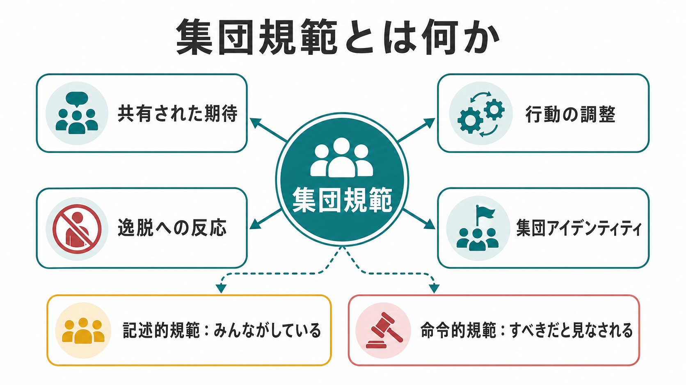
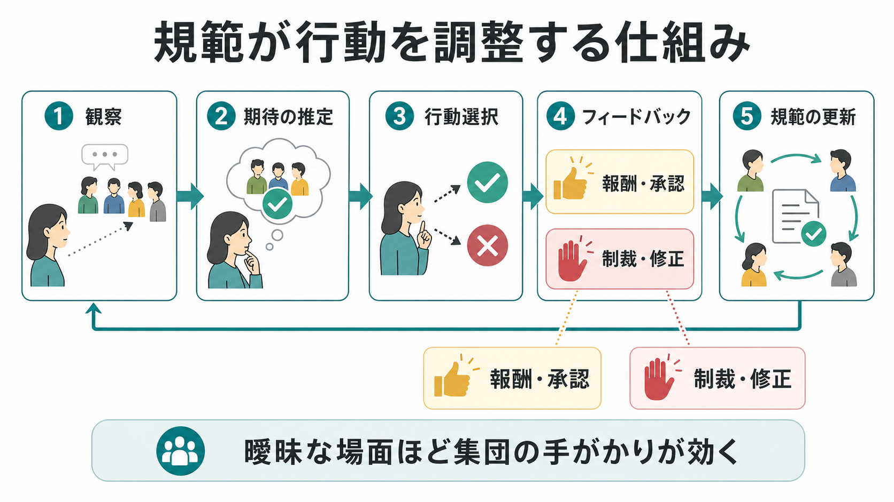
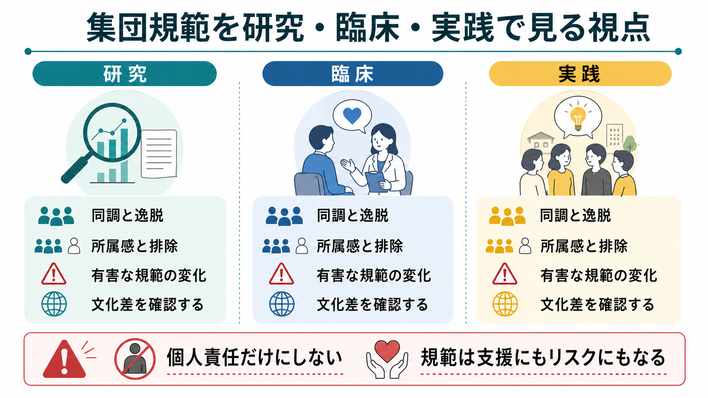

# 集団規範とは何か

## 要点

- 集団規範とは、ある集団の中で「多くの人がそうしている」「そうすべきだと見なされている」と共有される期待やルールである[1][2]。
- 規範は、明文化された規則だけでなく、挨拶、服装、発言の仕方、沈黙の使い方、助け合い、排除の基準のような暗黙の行動パターンにも現れる[1][5]。
- Cialdini らは、実際に多くの人がしているという記述的規範と、承認・非難の基準になる命令的規範を区別した[2]。
- 人は、受け入れられたいという規範的影響と、集団が正しい情報を持つかもしれないという情報的影響の両方によって同調する[3][4]。
- 集団規範は協力と予測可能性を支える一方で、排除、ハラスメント、沈黙の強制、有害な慣行の維持にもつながりうる[1][7]。

## この記事で答える問い

1. 集団規範は、単なるルールや習慣と何が違うのか。
2. 記述的規範と命令的規範は、行動にどう違った影響を与えるのか。
3. 人はなぜ、内心では違和感があっても集団に合わせるのか。
4. 発達、臨床、組織、教育の場面で、集団規範をどう見ればよいのか。

## まず結論

集団規範は、集団の中で行動をそろえるための「共有された期待」である。たとえば、会議で誰が最初に話すか、授業中に質問してよい雰囲気があるか、病棟や職場で助けを求めてもよいか、SNSでどの意見が称賛されどの意見が攻撃されるかは、すべて集団規範に左右される。

重要なのは、規範が「外から押しつけられた命令」だけではない点である。人は周囲の行動を観察し、何が普通で、何が期待され、何をすると承認または非難されるかを推定する。その推定に基づいて自分の行動を調整し、その行動がまた他者の期待を更新する[1][2]。この循環によって、規範は維持される。

集団規範は、[[社会的認知とは何か|社会的認知]]、[[心の理論とは何か|心の理論]]、[[社会の中の自己はどのように形成されるのか|社会の中の自己]]と深く関わる。なぜなら、規範に従うには、他者が何を期待しているか、自分がどう見られるか、どの集団に属しているかを読む必要があるからである。

## 背景

社会心理学では、集団規範は古くから「個人の判断が集団状況でどのように変わるか」という問題として研究されてきた。Sherif は自動運動現象を用いた古典的研究で、曖昧な判断課題では、個人の判断が集団内で次第に共有された基準へ収束することを示した[5]。これは、規範が明確な命令なしに、相互観察と調整から生まれることを示す出発点になった。

Asch の同調実験は、答えが明らかに見える線分判断課題でも、全員一致の多数派が誤答すると、参加者がその判断に合わせる場合があることを示した[4]。ここでは、集団が情報源になるだけでなく、逸脱者として見られる不安や、場の圧力が判断に影響する。

Deutsch と Gerard は、この同調を情報的社会的影響と規範的社会的影響に分けた[3]。情報的影響とは「他者が正しいかもしれない」と考えて従う影響であり、規範的影響とは「受け入れられたい、拒絶されたくない」と考えて従う影響である。実際の集団では、この二つはしばしば重なって働く。

## 基本概念

### 集団規範の定義

集団規範は、集団の成員が共有する行動基準であり、次の三つを含む。

| 側面 | 内容 | 例 |
|---|---|---|
| 期待 | 他の人はこうするだろうという予測 | 新人は最初の会議であまり発言しない |
| 評価 | こうするのが望ましいという判断 | 困っている同僚を助けるべきだ |
| 反応 | 逸脱への承認、非難、修正 | 発言しすぎる人を冷たく扱う |

Bicchieri の整理では、社会規範は単なる行動頻度ではなく、他者が同じ行動をするという経験的期待と、他者が自分にもその行動を期待しているという規範的期待に支えられる[1]。したがって、「多くの人がしている」だけでは習慣に近く、「そうしないと非難される」「そうすることが集団の一員らしい」と感じられると規範性が強くなる。

### 記述的規範と命令的規範

Cialdini らは、規範を記述的規範と命令的規範に分けて考えた[2]。

| 区分 | 意味 | 行動への影響 |
|---|---|---|
| 記述的規範 | 多くの人が実際にしていること | 「みんながしているなら、自分もそうする」 |
| 命令的規範 | 多くの人が承認または非難すること | 「そうするべきだ、そうしないと悪く見られる」 |

たとえば、職場で「残業する人が多い」は記述的規範である。一方、「早く帰る人はやる気がないと見なされる」は命令的規範である。この二つが一致すると規範は強く働きやすい。反対に、「皆が残業しているが、本当は早く帰るべきだと考えている」ように二つがずれると、集団内に緊張が生まれる。

## 仕組み

集団規範は、次の循環で行動を調整する。

1. 観察する  
   人は、誰が発言するか、誰が沈黙するか、何が笑われるか、何が注意されるかを観察する。

2. 期待を推定する  
   観察された行動から、「この場では何が普通か」「何が望まれているか」を推定する[1][2]。

3. 行動を選ぶ  
   受け入れられたい、失敗したくない、集団の情報を利用したいという理由で、行動を調整する[3][4]。

4. フィードバックを受ける  
   承認、笑い、沈黙、注意、排除、昇進、評価などが、行動の結果として返ってくる。

5. 規範が更新される  
   多くの人が同じ行動を続けると、それが「この集団ではこうするものだ」という基準になる[5][7]。

この仕組みは、曖昧な場面ほど強く働く。正解が明確でないとき、人は自分だけで判断するより、他者の行動を手がかりにしやすい。Sherif の研究は、このような曖昧な知覚判断で集団基準が形成されることを示した[5]。一方、Asch の研究は、正解が比較的明確でも、多数派の一致が強いと同調が生じることを示した[4]。

### 所属とアイデンティティ

集団規範は、外的な圧力だけではなく、「自分はこの集団の一員である」という自己理解にも関わる。Terry と Hogg の研究では、行動に関連する参照集団への同一化が強い人ほど、その集団の規範が行動意図に影響しやすいことが示された[8]。つまり、規範は「周囲が怖いから従う」だけでなく、「自分たちらしい行動だから従う」という形でも働く。

この点は、[[自己意識はどのように発達するのか|自己意識]]や[[社会の中の自己はどのように形成されるのか|社会の中の自己]]と接続する。個人は、孤立した判断主体ではなく、家族、学校、職場、専門職、地域、オンライン共同体など複数の集団に属し、それぞれの規範を切り替えながら行動している。

## 図解

図1は、集団規範を「共有された期待」「行動の調整」「逸脱への反応」「集団アイデンティティ」の結びつきとして示している。規範は一つの命令ではなく、期待、評価、反応、所属感のネットワークである。

図2は、規範が行動に作用する過程を示している。観察から期待が生まれ、期待が行動選択に影響し、承認や制裁が規範をさらに更新する。

図3は、研究、臨床、実践で集団規範を見る視点をまとめている。集団規範は、協力や支援を生むこともあれば、排除や沈黙を生むこともある。そのため、個人の性格だけでなく、場のルール、評価制度、暗黙の期待を合わせて見る必要がある。

## 臨床・研究との接続

### 発達研究との接続

子どもは、単に大人の指示に従うだけでなく、比較的早い時期から「これはこうするものだ」という規範性を理解し、他者の違反に反応する。Schmidt と Tomasello は、幼児が社会規範を学び、しばしば一般的な規範語を用いて他者に違反を指摘することを整理している[6]。

これは、[[発達とは何か|発達]]や[[心の理論はどのように発達するのか|心の理論の発達]]と関係する。規範を理解するには、他者が何を知っているか、どの集団に属しているか、どの場面でどのルールが適用されるかを区別する必要がある。共同遊びやごっこ遊びでは、子どもは「この遊びではこうする」というローカルな規範を共有し、それを使って相互作用を安定させる。

### 臨床・支援との接続

臨床や支援の場面では、問題を個人の特性だけに帰すと、集団規範の影響を見落としやすい。たとえば、学校で助けを求めない子ども、職場で休めない人、病棟で弱音を吐けない患者は、個人の性格だけでなく、「ここではそうするべきではない」という場の期待に適応している可能性がある。

また、集団規範は症状や困難の表れ方にも関わる。恥、沈黙、過剰適応、同調、逸脱への恐れは、[[社会的認知とは何か|社会的認知]]や[[実行機能は子どもでどのように発達するのか|実行機能]]だけでなく、集団内で何が承認されるかによって変わる。医療・心理支援では、個別診断や治療指示として断定するのではなく、教育・研究目的の概念として、環境側の規範を評価する視点が必要である。

### 組織・教育・公衆衛生との接続

規範は、行動変容の介入でも重要である。Cialdini らの研究は、記述的規範と命令的規範を混同すると、意図せず望ましくない行動を「みんながしている」と強調してしまう危険を示した[2]。たとえば「多くの人がルールを破っている」と伝えるだけでは、違反行動を普通の行動として見せてしまう場合がある。

Bicchieri は、社会規範を変えるには、単に正しい知識を与えるだけでなく、他者が何をしているか、何を期待しているか、どのような制裁や承認があるかを測定し、文脈に合った介入を設計する必要があると論じた[1]。有害な規範を変えるには、個人を責めるだけでなく、複数人が同時に行動を変えられる条件、代替行動が承認される条件、逸脱しても守られる条件を作る必要がある。

## よくある誤解

### 誤解1: 集団規範は明文化されたルールのことである

明文化された規則は規範の一部だが、集団規範の多くは暗黙である。誰が話してよいか、どの冗談が許されるか、助けを求めてよいか、失敗を報告してよいかは、公式ルールよりも日々の反応で学ばれる。

### 誤解2: 規範に従う人は自分で考えていない

同調は、単なる思考停止ではない。曖昧な場面では他者の行動が有用な情報になるし、集団で協力するには一定の予測可能性が必要である[3][5]。問題は、同調そのものではなく、反対意見や安全な逸脱が封じられることである。

### 誤解3: 規範は悪いものだから壊せばよい

規範は、信頼、順番待ち、約束、ケア、共同作業を支える。すべての規範をなくすことはできないし、望ましくもない。必要なのは、協力を支える規範と、排除や沈黙を生む規範を見分けることである[1][7]。

### 誤解4: 規範を変えるには個人の意識を変えれば十分である

個人が内心で変化を望んでいても、「他の人は変わらない」「逸脱すると罰せられる」と思えば行動は変わりにくい。規範変化には、期待の共有、集団内の可視的な変化、保護された試行、リーダーや多数派の行動変化が必要になる[1][2]。

## 関連ノート

- [[社会的認知とは何か]]
- [[心の理論とは何か]]
- [[心の理論はどのように発達するのか]]
- [[共同注意とは何か]]
- [[発達とは何か]]
- [[実行機能は子どもでどのように発達するのか]]
- [[自己意識はどのように発達するのか]]
- [[社会の中の自己はどのように形成されるのか]]
- [[青年期のアイデンティティ形成とは何か]]
- [[愛着とは何か]]

## MOC更新候補

- `content/00_MOC/MOC｜認知科学・心理学.md` がある場合は、社会心理学、社会的認知、発達の項目に本記事へのリンクを追加する。
- `content/00_MOC/MOC｜倫理・哲学・社会.md` では、規範、協力、制度、集団行動の補助リンクとして追加候補になる。

## 理解チェック

1. 集団規範は、単なる習慣や明文化された規則と何が違うか。
2. 記述的規範と命令的規範は、それぞれどのような期待を表すか。
3. 情報的社会的影響と規範的社会的影響は、どのように違うか。
4. 集団への同一化が強いと、なぜ集団規範が行動に影響しやすいのか。
5. 有害な規範を変えるとき、個人の意識改革だけでは不十分な理由は何か。

## 未解決問題

- オンライン共同体では、いいね、拡散、炎上、ブロックがどのように規範の形成と逸脱制裁を変えているのか。
- 文化差や世代差を考慮したとき、同じ行動を「配慮」「同調圧力」「専門職倫理」のどれとして理解すべきか。
- 臨床・教育現場で、個人の困難と集団規範の影響をどのように分けて評価できるか。
- 有害な規範を変える介入で、誰が最初に逸脱しても安全かをどう設計できるか。

## 参考文献

[1] Bicchieri, C. (2017). *Norms in the Wild: How to Diagnose, Measure, and Change Social Norms*. Oxford University Press. https://doi.org/10.1093/acprof:oso/9780190622046.001.0001

[2] Cialdini, R. B., Reno, R. R., & Kallgren, C. A. (1990). A focus theory of normative conduct: Recycling the concept of norms to reduce littering in public places. *Journal of Personality and Social Psychology, 58*(6), 1015-1026. https://doi.org/10.1037/0022-3514.58.6.1015

[3] Deutsch, M., & Gerard, H. B. (1955). A study of normative and informational social influences upon individual judgment. *The Journal of Abnormal and Social Psychology, 51*(3), 629-636. https://doi.org/10.1037/h0046408

[4] Asch, S. E. (1956). Studies of independence and conformity: I. A minority of one against a unanimous majority. *Psychological Monographs: General and Applied, 70*(9), 1-70. https://doi.org/10.1037/h0093718

[5] Sherif, M. (1936). *The Psychology of Social Norms*. Harper & Brothers. https://books.google.com/books/about/The_Psychology_of_Social_Norms.html?id=sgjTAAAAMAAJ

[6] Schmidt, M. F. H., & Tomasello, M. (2012). Young children enforce social norms. *Current Directions in Psychological Science, 21*(4), 232-236. https://doi.org/10.1177/0963721412448659

[7] Chudek, M., & Henrich, J. (2011). Culture-gene coevolution, norm-psychology and the emergence of human prosociality. *Trends in Cognitive Sciences, 15*(5), 218-226. https://doi.org/10.1016/j.tics.2011.03.003

[8] Terry, D. J., & Hogg, M. A. (1996). Group norms and the attitude-behavior relationship: A role for group identification. *Personality and Social Psychology Bulletin, 22*(8), 776-793. https://doi.org/10.1177/0146167296228002
