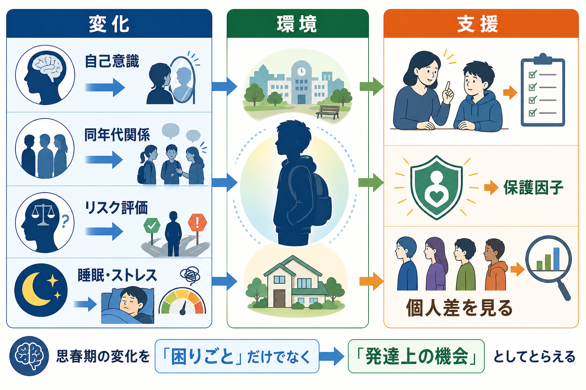
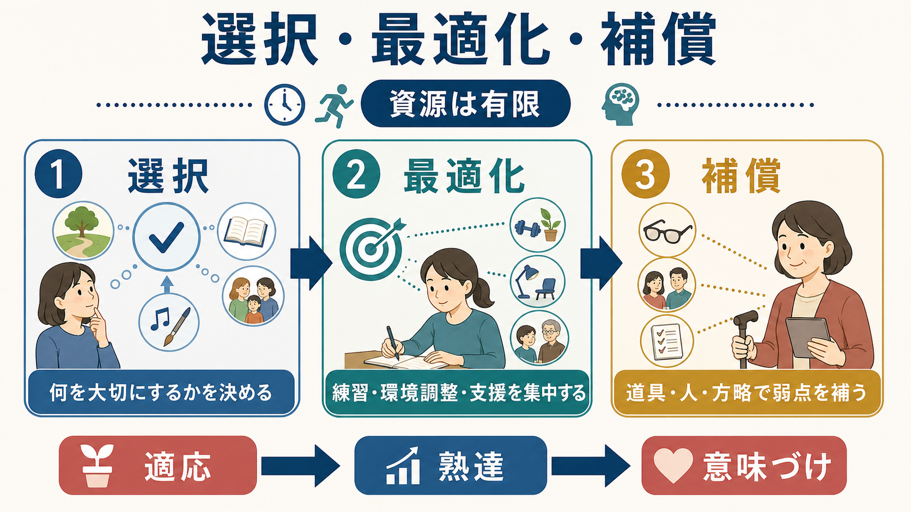
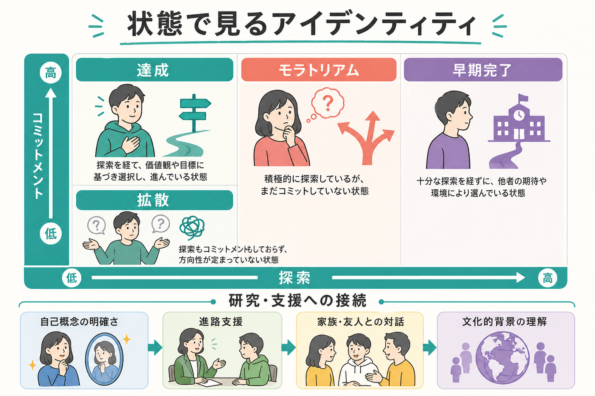

# 青年期のアイデンティティ形成とは何か

## 要点

- 青年期のアイデンティティ形成とは、「自分は何者か」「何を大切にするか」「どの方向へ進みたいか」「誰とどのような関係を結ぶか」を、試行錯誤しながら統合していく発達過程である。
- 古典的には Erikson が青年期の中心課題を「アイデンティティ対役割混乱」として位置づけ、Marcia はそれを「探索」と「コミットメント」の組み合わせとして研究可能な形にした [1][2]。
- 現代研究では、探索は単なる迷いではなく、現在の選択を深める探索、別の選択肢を考える再考、反すう的に抜け出せない探索などに分けて扱われる [4][5]。
- アイデンティティは個人の内面だけで完結しない。家族、友人、学校、文化、社会制度、差別経験、進路機会が、選択肢の幅と語り方を形づくる [7][8]。

## この記事で答える問い

1. 青年期のアイデンティティ形成は、単なる「自分探し」と何が違うのか。
2. 探索、コミットメント、再考はどのように循環するのか。
3. 進路、価値観、対人関係、文化的背景はどのように統合されるのか。
4. 研究・教育・臨床支援では、どの点に注意して読むべきか。

## まず結論

青年期のアイデンティティ形成は、自己理解・価値観・進路・対人関係を、一つの「変わらない本当の自分」に固定する作業ではない。むしろ、複数の可能性に出会い、試し、他者に語り、違和感を見直し、暫定的な選択へコミットしながら、「今の自分にとって筋の通る生き方」を更新していく過程である [1][3]。

この過程では、探索とコミットメントが対立するわけではない。探索がまったくないと、親・学校・周囲の期待をそのまま引き受ける「早期完了」に近づくことがある。一方、コミットメントがまったくない探索は、選択肢を広げても生活上の足場になりにくい。成熟したアイデンティティは、選択肢を試す柔軟性と、当面の方向へ責任を持つ安定性の両方から成り立つ [2][4]。

## 背景

青年期は、身体的成熟、抽象的思考、友人関係の広がり、進学・就職選択、親からの心理的分離、社会的役割の変化が重なる時期である。[[発達とは何か]]で扱うように、発達は年齢だけで自動的に進むものではなく、身体・認知・感情・社会環境の相互作用として進む。青年期のアイデンティティ形成も同じで、内面の決意だけでは説明できない。

Erikson は、青年期の発達課題を「アイデンティティ対役割混乱」として整理した。ここでいうアイデンティティは、単なる自己紹介のラベルではなく、自分の連続性、他者から見られる自分、社会の中で担いうる役割が重なって生じる感覚である [1]。その後 Marcia は、アイデンティティを「探索」と「コミットメント」の二軸で捉え、達成、モラトリアム、早期完了、拡散という四つの状態を示した [2]。

ただし、これらの状態は人を固定分類するためのラベルではない。メタ分析では、青年期から成人初期にかけてアイデンティティ達成は増える傾向がある一方、多くの人が安定・進展・後退を経験し、若年成人になっても全員が「達成」に至るわけではないことが示されている [3]。

## 基本概念

### 探索

探索とは、進路、価値観、信念、人間関係、文化的所属について、選択肢を知り、試し、比較し、他者と話し合うことである。探索は「迷っているから悪い」のではなく、選択肢を自分の経験に照らして評価する働きを持つ。

現代のモデルでは、探索はさらに分けられる。広い探索は複数の選択肢を比べる動きであり、深い探索はすでに選んだ方向を詳しく調べ、意味を確かめる動きである。反すう的探索は、考えても考えても決められず不安だけが増える探索で、支援上は区別して扱う必要がある [5]。

### コミットメント

コミットメントとは、暫定的であっても「自分はこの方向で進む」と選び、その選択を生活の中で実行することである。強いコミットメントは、自己概念の明確さ、進路行動、対人関係上の一貫性を支える。一方で、探索を伴わないコミットメントは、周囲の期待をそのまま内面化しただけの場合もある [2][4]。

### アイデンティティの状態

Marcia の枠組みでは、探索とコミットメントの組み合わせから四つの状態を考える [2]。

| 状態 | 探索 | コミットメント | 読み方 |
|---|---:|---:|---|
| 達成 | 高い | 高い | 試行錯誤を経て、暫定的な方向を選んでいる |
| モラトリアム | 高い | 低い | 選択肢を探しているが、まだ決めきれていない |
| 早期完了 | 低い | 高い | 十分な探索なしに、既存の期待や役割へ強く同一化している |
| 拡散 | 低い | 低い | 探索も選択も弱く、方向づけが生じにくい |

この分類は便利だが、個人の人格や価値を決めるものではない。同じ人でも、進路ではモラトリアム、家族観では早期完了、友人関係では達成に近い、というように領域ごとに異なることがある。

## 仕組み

アイデンティティ形成は、次の循環として理解しやすい。

1. 選択肢に出会う。
2. 試す、語る、比較する。
3. 経験に意味を与える。
4. 暫定的に選ぶ。
5. 違和感や新しい経験に応じて見直す。

この循環を支えるのは、[[愛着とは何か]]で扱うような安全な関係、[[心の理論はどのように発達するのか]]に関わる他者理解、そして自分の経験を語り直す力である。ナラティヴ・アイデンティティ研究では、人は出来事をただ記録するのではなく、「あの経験は自分にとって何だったのか」という物語を通じて自己を安定させ、同時に変化させると考える [6]。

重要なのは、アイデンティティが「内面の答えを発見する」だけでなく、「語れる形にする」過程でもある点である。友人、家族、教師、支援者との対話は、自分の経験を言語化し、矛盾を整理し、選択肢の意味を再評価する場になる。

## 図解

図のように、アイデンティティ形成は「達成が良く、他は悪い」と単純に読むものではない。モラトリアムは不安定に見えるが、十分な探索の時期として意味を持つことがある。早期完了は安定して見えるが、環境変化や新しい価値観との接触で再探索が必要になる場合がある。拡散はリスクのサインになることがあるが、選択肢の不足、貧困、差別、学校不適応、家庭内ストレスなど、環境側の制約も同時に見る必要がある [3][8]。

## 臨床・研究との接続

研究では、アイデンティティ形成を横断研究だけでなく、縦断研究で追うことが重要である。ある時点での状態は、その後も固定されるとは限らない。五波の縦断研究では、コミットメント、深い探索、コミットメントの再考という次元から、青年のアイデンティティ状態の軌跡を検討している [4]。

教育や進路支援では、早く決めさせることだけが支援ではない。選択肢を知る、試す、失敗から学ぶ、他者に語る、情報を比較する、選んだ後に見直せる余地を残すことが重要である。青年期はリスクだけでなく、学習・関係・社会参加の可能性が大きく広がる時期でもある [8]。

臨床的には、アイデンティティの不安定さをすぐ病理化しないことが大切である。進路や対人関係で迷うことは発達上ありうる。一方で、反すう的探索、強い孤立、持続する抑うつ、不登校、自傷、摂食問題、家庭内暴力、差別や排除経験が重なる場合には、個人の「未熟さ」とせず、心理的苦痛と環境要因を含めて評価する必要がある。この記事は教育・研究目的の整理であり、個別の診断や治療方針を示すものではない。

## よくある誤解

### 誤解1: アイデンティティは一度見つけたら変わらない

アイデンティティは、進学、就職、親密な関係、文化的経験、健康問題、喪失、社会変化によって再編されうる。青年期は重要な時期だが、形成は成人期にも続く [3]。

### 誤解2: 迷っている青年は発達が遅れている

探索は発達上の重要な働きである。問題は「迷うこと」そのものではなく、情報や支援がないまま反すうに閉じ込められること、選択肢が極端に制限されること、失敗を許されない環境に置かれることである [5][8]。

### 誤解3: 進路が決まればアイデンティティも決まる

進路は重要な領域だが、価値観、対人関係、文化的所属、身体感覚、性別・性的指向、将来像、社会的役割も関わる。進路選択だけを見ても、青年の自己理解全体は分からない [7]。

### 誤解4: アイデンティティは完全に個人の問題である

文化的背景やエスニック／人種的アイデンティティは、青年期の自己理解に深く関わる。とくにマイノリティの青年では、自分の所属をどう理解し、社会からどう見られるかが発達課題の一部になる [7]。

## 関連ノート

- [[発達とは何か]]
- [[発達段階理論とは何か]]
- [[愛着とは何か]]
- [[安全基地とは何か]]
- [[心の理論はどのように発達するのか]]
- 今後の作成候補: エリクソンの心理社会的発達理論とは何か
- 今後の作成候補: Marciaのアイデンティティ・ステイタスとは何か
- 今後の作成候補: ナラティヴ・アイデンティティとは何か
- 今後の作成候補: 進路選択と青年期発達

## MOC更新候補

- `content/00_MOC/` 配下の認知科学・心理学または発達・社会心理系MOCに、本記事 `[[青年期のアイデンティティ形成とは何か]]` を追加する。
- 並列生成ジョブとの衝突を避けるため、この作業ではMOC本体は更新しない。

## 理解チェック

1. 「探索」と「コミットメント」は、それぞれ何を指すか。
2. モラトリアムと拡散は、どちらもコミットメントが低いが、何が違うか。
3. アイデンティティ形成を「個人の内面」だけで説明すると、何を見落とすか。
4. 進路支援で「早く決める」だけを目標にすると、どのようなリスクがあるか。

## 未解決問題

- デジタル環境やSNS上の自己提示は、青年期の探索とコミットメントをどのように変えているのか。
- 文化、階層、移民経験、ジェンダー、障害、地域差は、アイデンティティ形成の軌跡にどのように交差するのか。
- 反すう的探索を減らし、柔軟な探索と現実的なコミットメントを支える介入は、どの条件で有効なのか。

## 参考文献

[1] Erikson, E. H. (1968). *Identity: Youth and Crisis*. W. W. Norton. https://books.google.com/books/about/Identity_Youth_and_Crisis.html?id=v3XWH2PDLewC

[2] Marcia, J. E. (1966). Development and validation of ego-identity status. *Journal of Personality and Social Psychology*, 3(5), 551-558. https://doi.org/10.1037/h0023281

[3] Kroger, J., Martinussen, M., & Marcia, J. E. (2010). Identity status change during adolescence and young adulthood: A meta-analysis. *Journal of Adolescence*, 33(5), 683-698. https://doi.org/10.1016/j.adolescence.2009.11.002

[4] Meeus, W., van de Schoot, R., Keijsers, L., Schwartz, S. J., & Branje, S. (2012). Identity statuses as developmental trajectories: A five-wave longitudinal study in early-to-middle and middle-to-late adolescents. *Journal of Youth and Adolescence*, 41, 1008-1021. https://doi.org/10.1007/s10964-011-9730-y

[5] Luyckx, K., Goossens, L., Soenens, B., & Beyers, W. (2006). Unpacking commitment and exploration: Preliminary validation of an integrative model of late adolescent identity formation. *Journal of Adolescence*, 29(3), 361-378. https://doi.org/10.1016/j.adolescence.2005.03.008

[6] McLean, K. C., Pasupathi, M., & Pals, J. L. (2007). Selves creating stories creating selves: A process model of self-development. *Personality and Social Psychology Review*, 11(3), 262-278. https://doi.org/10.1177/1088868307301034

[7] Umaña-Taylor, A. J., Quintana, S. M., Lee, R. M., Cross, W. E., Rivas-Drake, D., Schwartz, S. J., Syed, M., Yip, T., & Seaton, E. (2014). Ethnic and racial identity during adolescence and into young adulthood: An integrated conceptualization. *Child Development*, 85(1), 21-39. https://doi.org/10.1111/cdev.12196

[8] National Academies of Sciences, Engineering, and Medicine. (2019). *The Promise of Adolescence: Realizing Opportunity for All Youth*. National Academies Press. https://doi.org/10.17226/25388
