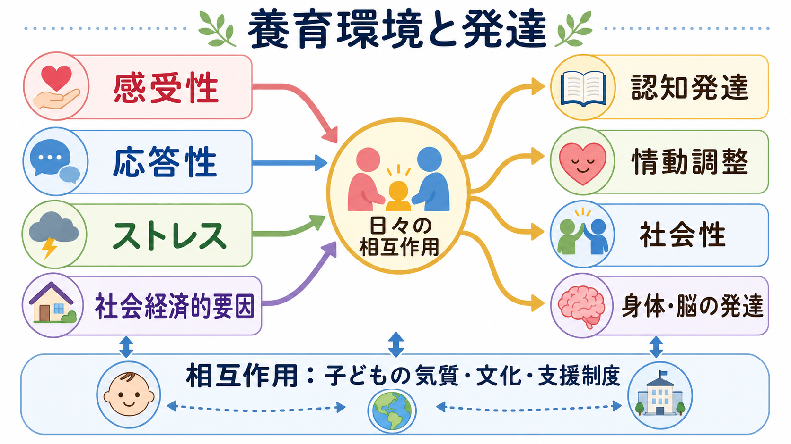
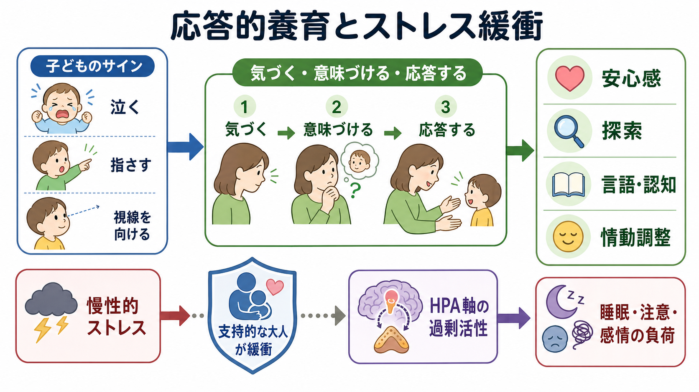
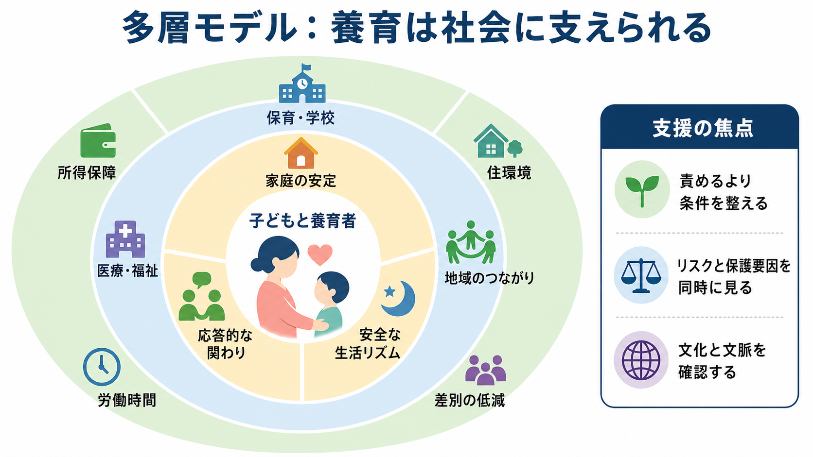

# 養育環境は発達にどう影響するのか

## 要点

- 養育環境は、親だけの態度ではなく、家庭の安定、養育者の心身の余裕、保育・学校・地域、経済条件、文化的文脈を含む多層的な環境である。
- 子どもの発達に特に重要なのは、子どものサインに気づく「感受性」と、タイミングよく適切に返す「応答性」である。これらは愛着、探索、言語、情動調整の土台になる [1][2]。
- 慢性的な強いストレスは、睡眠、注意、感情調整、学習に負荷をかける。ただし、支持的な大人との関係はストレス反応を緩衝しうる [3]。
- 社会経済的要因は、単に「所得が低いから発達が悪くなる」という話ではない。栄養、住環境、時間、保育、教育資源、親のストレス、地域安全性を通じて発達条件を変える [4][5]。
- 支援の焦点は、養育者を責めることではなく、子どもと養育者が応答的に関われる条件を増やすことである [6][7]。

## この記事で答える問い

1. 養育環境とは何を指すのか。
2. 感受性・応答性は、なぜ発達に重要なのか。
3. ストレスは、脳・身体・認知・情動の発達にどう影響するのか。
4. 社会経済的要因は、家庭内の養育とどのように絡み合うのか。
5. 研究・臨床・教育支援では、どのような見方が役に立つのか。

## まず結論

養育環境の影響は、「よい親か悪い親か」という単純な評価では捉えられない。子どもは、泣く、見る、指さす、近づく、離れる、話す、黙るといったサインを通じて環境に働きかける。養育者がそのサインに気づき、子どもの状態を推測し、過不足なく返すと、子どもは安心して探索し、失敗から戻り、言語や[[社会的認知とは何か|社会的認知]]を発達させやすくなる [1][2]。

一方で、養育者自身が慢性的ストレス、貧困、孤立、暴力、差別、長時間労働、睡眠不足にさらされていると、応答的に関わる余裕は削られる。したがって、養育環境を考えるとは、家庭内の関わりだけでなく、家庭を支える社会条件まで含めて見ることである [4][6][7]。

## 背景

発達は、遺伝的素因が環境の中でそのまま展開する過程でも、環境だけが子どもを形づくる過程でもない。[[発達とは何か|発達]]は、身体、脳、認知、情動、対人関係、文化、制度が時間の中で相互作用する過程である。初期発達を扱う公的レビューは、乳幼児期の経験が脳の配線、言語、自己調整、対人関係に関わることを示す一方で、単純な決定論を避ける必要も強調している [6]。

養育環境の研究が重要なのは、子どもの困難を個人の性格や能力だけに還元しない視点を与えるからである。注意が続かない、感情が爆発しやすい、言葉が伸びにくい、対人場面で固まりやすいといった現象は、子どもの神経発達特性だけでなく、睡眠、安心感、予測可能性、対話量、養育者のストレス、保育・学校の応答性にも影響される。

## 基本概念

### 養育環境

養育環境とは、主たる養育者の行動だけではなく、子どもが日々経験する関係と条件の束である。家庭内の言葉かけ、食事、睡眠、遊び、安全、しつけ、感情の扱いに加えて、保育・学校、地域、医療・福祉、所得、住環境、労働条件、文化的期待も含まれる [4][6][7]。

### 感受性

感受性とは、子どものサインに気づき、それを子どもの状態や欲求として読み取る力である。乳児が顔をそむける、幼児が同じ遊びを繰り返す、学童が急に怒る、といった行動を、単なるわがままではなく「疲れ」「過負荷」「助けを求める試み」として読む視点が含まれる。感受性と愛着安定性の関連はメタ分析で確認されているが、効果は一枚岩ではなく、測定方法や文脈によって変わる [1]。

### 応答性

応答性とは、子どものサインに対して、タイミングよく、発達段階に合った形で返すことである。乳幼児期には、視線、声、抱く、待つ、まねる、言葉にする、といった「サーブ・アンド・リターン」の相互作用が重要になる。これは[[言語理解はどのように行われるのか|言語理解]]や[[言語産出はどのように行われるのか|言語産出]]だけでなく、注意、情動調整、他者理解にも関わる [2][7]。

### ストレス

ストレスはすべて有害ではない。新しい場面への挑戦や短時間の緊張は、支えがあれば学習の一部になる。問題になりやすいのは、強く、長く、予測しにくく、支えてくれる大人が少ないストレスである。こうしたストレスは、[[HPA軸は精神疾患にどう関わるのか|HPA軸]]や自律神経系を介して、睡眠、注意、記憶、感情調整に影響しうる [3]。

### 社会経済的要因

社会経済的要因には、所得、親の教育歴、職業、住環境、地域資源、保育アクセス、医療アクセス、差別経験などが含まれる。SES は子どもの健康、認知、学業、情緒、社会性と関連するが、その関連は「家庭の努力不足」を意味しない。多くの場合、物質的資源、時間資源、社会的支援、慢性的ストレスへの曝露が媒介する [4][5]。

## 仕組み

### 1. 応答的な相互作用が安心と探索を支える

子どもは、安心できる関係を足場にして探索する。泣いたときに落ち着かせてもらう、興味を示したものに大人が言葉を添える、怖くなったときに戻れる相手がいる、という経験は、世界を「試してよい場所」として学ぶ条件になる。感受性と応答性を高める介入は、親の行動だけでなく、子どもの愛着安定性にも小から中程度の改善を示す [2]。

### 2. ストレス反応は支えがあると調整される

慢性的な逆境は、子どものストレス反応を長く高い状態に保ちやすい。これはストレス回路、睡眠、身体症状、注意制御、衝動性に波及しうる。ただし、ストレスの影響は固定的ではない。安全で予測可能な関係、安定した生活リズム、相談できる大人、保育・学校での支えは、負荷を緩衝する [3][7]。

### 3. 社会経済的条件は発達の入力を変える

社会経済的条件は、子どもに届く経験の量と質を変える。たとえば、安定した住居、栄養、静かな睡眠環境、通院しやすさ、保育の質、読み聞かせの時間、親の休息、地域の安全性は、どれも発達に関わる。SES と脳発達の関連を扱うレビューは、言語や実行機能に関わる神経システムが社会経済的文脈の影響を受けやすい可能性を整理している [5]。

### 4. 子どもの気質と環境は双方向に影響する

養育環境は子どもに一方的に作用するだけではない。よく泣く、刺激に敏感、切り替えが苦手、人見知りが強い、活動量が高いといった子どもの特徴は、養育者の反応を変える。養育者の反応はさらに子どもの行動を変える。この双方向性を無視すると、「親が原因」または「子どもが原因」という単純な説明になりやすい。

### 5. 神経可塑性は希望であり、万能ではない

[[神経可塑性は発達と学習をどう支えるのか|神経可塑性]]は、経験によって脳と行動が変わりうることを示す。しかし、可塑性は「いつでも何でも取り戻せる」という意味ではない。発達には敏感期、累積効果、文脈依存性がある。早期支援は重要だが、遅すぎると決めつける必要もない。回復には、安定した関係、反復される経験、環境調整が必要になる [6][7]。

## 図解

本記事の図は、養育環境を三つの層で整理している。第一に、感受性・応答性・ストレス・社会経済的要因が発達に関わる全体地図。第二に、子どものサインに対する応答がストレスを緩衝し、安心感、探索、言語・認知、情動調整につながるメカニズム。第三に、家庭だけでなく地域・制度・政策が養育を支える多層モデルである。

## 臨床・研究との接続

臨床や教育相談では、養育環境を評価するときに「誰が悪いか」を探すよりも、「どの条件が応答性を下げているか」「どの保護要因が残っているか」を見る方が実用的である。確認すべき点は、睡眠、食事、生活リズム、安全、養育者の抑うつ・不安・疲労、家族内暴力、経済困難、保育・学校との関係、子どもの発達特性、相談先の有無である。

研究では、横断研究だけでは因果を決めにくい。養育行動、子どもの気質、遺伝的傾向、家庭の資源、文化的文脈は相互に絡むため、縦断研究、介入研究、自然実験、測定の多方法化が必要になる。たとえば、感受性向上介入が愛着にも影響するという知見は、単なる相関よりも因果に近い手がかりを与える [2]。

公衆衛生では、支援の単位を親個人だけに置かないことが重要である。WHO・UNICEF・World Bank の Nurturing Care Framework は、健康、栄養、安全と安心、応答的養育、早期学習の機会を、子どもの発達を支える統合的条件として整理している [7][8]。これは、発達支援を医療、保育、教育、福祉、所得保障、住宅政策の接点で考える視点を与える。

## よくある誤解

### 誤解1: 養育環境の話は親を責める話である

養育環境の研究は、親を責めるためのものではない。むしろ、養育者が応答的に関われる条件を何が支え、何が妨げるのかを明らかにするためのものである。支援の焦点は、責任追及ではなく、孤立を減らし、休息を確保し、相談経路を作り、子どもとの相互作用が起こりやすい環境を整えることにある [6][7]。

### 誤解2: 乳幼児期で将来は決まる

乳幼児期は重要だが、そこで将来が完全に決まるわけではない。発達は累積的であると同時に可変的であり、後の関係、学校経験、治療、地域支援、本人の主体性によって変化しうる。ただし、早期の安定した支援は、その後の困難を減らす可能性があるため、軽視すべきではない [3][6]。

### 誤解3: ストレスはすべて避けるべきである

発達に必要なのは、ストレスのない環境ではなく、挑戦と支えのバランスである。短時間の緊張や失敗は、支えてくれる大人がいれば学習になる。問題は、逃げ場がなく、意味づけを助ける人もおらず、長く続く強いストレスである [3]。

### 誤解4: 社会経済的要因は家庭の努力で解決できる

家庭の工夫は重要だが、所得、住居、雇用、保育、医療、差別、地域安全性は個人努力だけでは変えにくい。社会経済的要因を発達の文脈として見ることは、家庭の責任を免除することではなく、支援の設計単位を現実に合わせることである [4][5]。

### 誤解5: 応答的養育とは、子どもの要求をすべて聞くことである

応答的であることは、何でも許すことではない。子どものサインを読み取り、必要な安心を与え、発達段階に合った境界を示すことである。予測可能なルール、穏やかな修正、待つ力を支える関わりも、応答的養育に含まれる。

## 関連ノート

- [[発達とは何か]]
- [[心の理論はどのように発達するのか]]
- [[社会的認知とは何か]]
- [[言語理解はどのように行われるのか]]
- [[言語産出はどのように行われるのか]]
- [[神経可塑性は発達と学習をどう支えるのか]]
- [[神経回路の発達はどのように進むのか]]
- [[HPA軸は精神疾患にどう関わるのか]]

今後の作成候補:

- ストレス回路は脳ネットワークをどう変えるのか

## MOC更新候補

- `content/00_MOC/` 配下の認知科学・心理学系 MOC に、本記事を「発達・愛着・社会心理」の入口ノートとして追加する。
- 今回は並列ジョブとの衝突を避けるため、MOC 本体は更新しない。

## 理解チェック

1. 感受性と応答性は、どのように違うか。
2. 慢性的ストレスが発達に影響する経路を、身体・脳・行動の三つに分けて説明できるか。
3. 社会経済的要因を「親の努力不足」として読まないためには、どの媒介要因を見る必要があるか。
4. 子どもの気質と養育者の反応が双方向に影響する例を一つ挙げられるか。
5. 支援を設計するとき、家庭内の関わり以外にどの環境条件を調整できるか。

## 参考文献

[1] De Wolff, M. S., & van IJzendoorn, M. H. (1997). Sensitivity and attachment: A meta-analysis on parental antecedents of infant attachment. *Child Development*, 68(4), 571-591. https://doi.org/10.1111/j.1467-8624.1997.tb04218.x

[2] Bakermans-Kranenburg, M. J., van IJzendoorn, M. H., & Juffer, F. (2003). Less is more: Meta-analyses of sensitivity and attachment interventions in early childhood. *Psychological Bulletin*, 129(2), 195-215. https://doi.org/10.1037/0033-2909.129.2.195

[3] Shonkoff, J. P., Garner, A. S., et al. (2012). The lifelong effects of early childhood adversity and toxic stress. *Pediatrics*, 129(1), e232-e246. https://doi.org/10.1542/peds.2011-2663

[4] Bradley, R. H., & Corwyn, R. F. (2002). Socioeconomic status and child development. *Annual Review of Psychology*, 53, 371-399. https://doi.org/10.1146/annurev.psych.53.100901.135233

[5] Hackman, D. A., Farah, M. J., & Meaney, M. J. (2010). Socioeconomic status and the brain: Mechanistic insights from human and animal research. *Nature Reviews Neuroscience*, 11(9), 651-659. https://doi.org/10.1038/nrn2897

[6] National Academies of Sciences, Engineering, and Medicine. (2016). *Parenting Matters: Supporting Parents of Children Ages 0-8*. The National Academies Press. https://doi.org/10.17226/21868

[7] World Health Organization, United Nations Children's Fund, & World Bank Group. (2018). *Nurturing care for early childhood development: A framework for helping children survive and thrive to transform health and human potential*. World Health Organization. https://iris.who.int/handle/10665/272603

[8] Britto, P. R., Lye, S. J., Proulx, K., et al. (2017). Nurturing care: Promoting early childhood development. *The Lancet*, 389(10064), 91-102. https://doi.org/10.1016/S0140-6736(16)31390-3

## 未解決問題

- 応答的養育の効果は、子どもの気質、神経発達特性、文化的養育観によってどの程度変わるのか。
- 貧困、差別、住環境、保育アクセスの改善が、どの発達指標にどの時間スケールで影響するのか。
- デジタル環境、長時間労働、孤立した育児は、応答性と子どもの注意・睡眠・情動調整にどう影響するのか。
- 養育者支援を、医療・保育・学校・福祉・地域政策の間でどのように連携させると実装しやすいのか。
