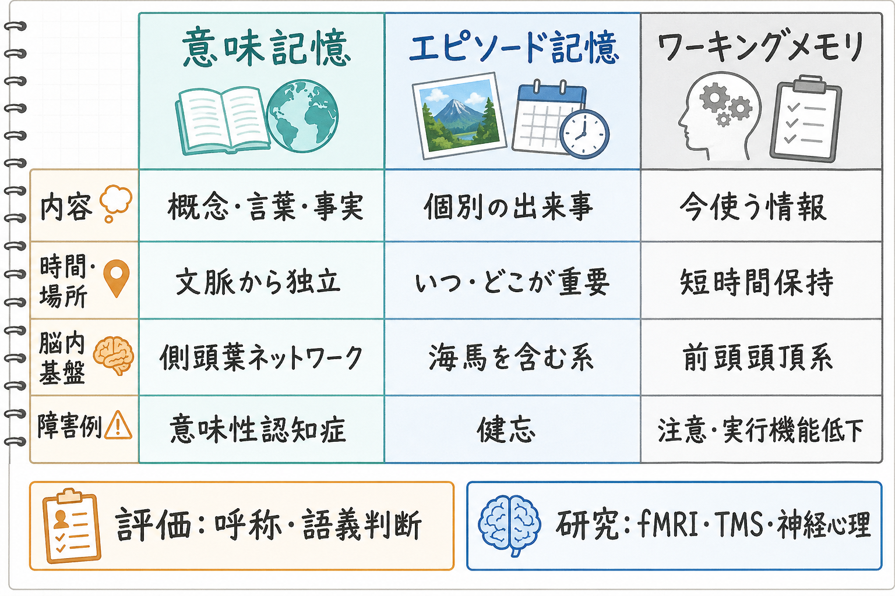
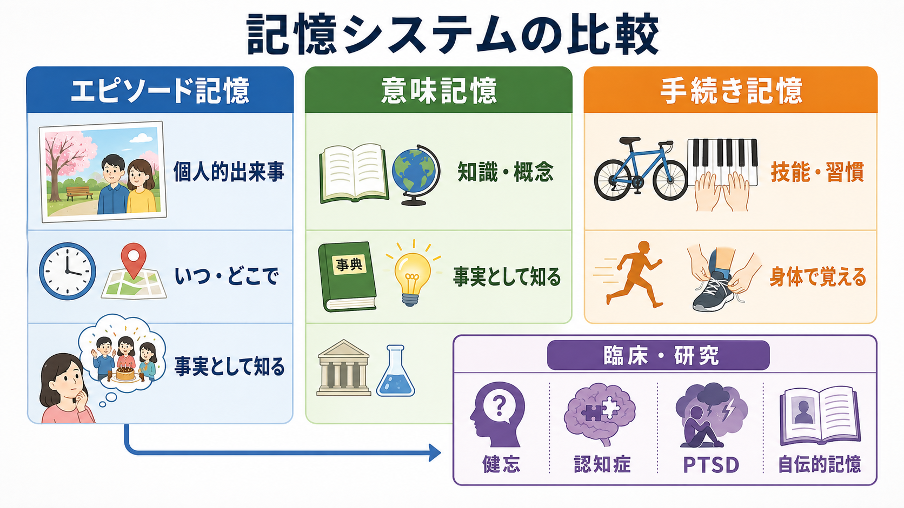

# エピソード記憶とは何か

## 要点

- エピソード記憶は、「いつ・どこで・何が起きたか」を、自己の過去の経験として思い出す記憶である。
- 単なる事実知識である意味記憶とは異なり、主観的時間、文脈、自己との結びつき、想起時の「思い出している感じ」を伴う。
- 海馬を含む内側側頭葉は、出来事の要素を一時的に結びつけ、あとで手がかりから再構成できるようにする中心的な仕組みである。
- 想起は録画の再生ではなく、手がかり、現在の目標、自己知識、感情状態に影響される再構成過程である。
- 健忘、認知症、PTSD、自伝的記憶、将来想像の研究では、エピソード記憶が臨床と認知神経科学をつなぐ重要概念になる。

## この記事で答える問い

1. エピソード記憶は、どのような記憶を指すのか。
2. 意味記憶や手続き記憶とは何が違うのか。
3. 海馬、内側側頭葉、前頭前野はどのように関わるのか。
4. なぜエピソード記憶は「正確な再生」ではなく「再構成」なのか。
5. 健忘、認知症、PTSD、自伝的記憶研究では、どのように役立つのか。

## まず結論

エピソード記憶とは、個人的に経験した出来事を、時間、場所、関わった人や物、感情、身体感覚、状況の文脈とともに思い出す記憶である。たとえば「昨日の夕方、駅前の店で友人と会い、雨の音を聞きながら近況を話した」という記憶は、単に「駅前に店がある」という知識ではなく、自分がその出来事を経験したという感覚を伴う。この自己の過去へ戻るような主観的経験は、Tulving がエピソード記憶を他の記憶システムから区別する中心的特徴として整理した点である[1]。

ただし、エピソード記憶は脳内に保存された動画ファイルをそのまま再生する仕組みではない。想起時には、手がかり、現在の関心、自己についての知識、感情、言語化の仕方が組み合わさり、過去の出来事が再構成される。したがって、エピソード記憶は生き生きしていても誤りうるし、曖昧でも本人にとって重要な意味を持ちうる。

## 背景

記憶はひとまとまりの能力ではない。神経心理学、認知心理学、認知神経科学では、記憶を複数のシステムや過程として考える。代表的には、事実や概念に関する意味記憶、技能や習慣に関する手続き記憶、短時間の保持と操作に関するワーキングメモリ、そして個人的出来事に関するエピソード記憶が区別される。

この区別が強く意識されるようになった背景には、内側側頭葉損傷後の健忘研究がある。Scoville と Milner は、両側の海馬および海馬傍回を含む切除後に、知能や人格が比較的保たれていても新しい出来事を長期記憶として保持しにくくなる症例を報告した[2]。この知見は、記憶が全般的に弱くなるだけではなく、特定の神経構造と特定の記憶機能が対応しうることを示した。

その後の研究では、海馬を含む内側側頭葉が宣言的記憶、すなわち意識的に言語化・報告できる事実や出来事の記憶に重要であることが整理された[3]。本記事では、その中でも「出来事を自己の過去として思い出す」エピソード記憶に焦点を当てる。

## 基本概念

### エピソード記憶の中核

エピソード記憶の中核は、出来事の内容だけではなく、その出来事が起きた時間、場所、文脈、自分との関係を一緒に思い出す点にある。ここで重要なのは、記憶の対象が「個別の出来事」であることと、想起に主観的な時間感覚が伴うことである[1]。

たとえば「海馬は記憶に関わる」という知識は意味記憶である。一方、「大学の講義で初めて海馬の話を聞き、スライドの図を見て驚いた」という記憶はエピソード記憶である。両者はしばしば結びつくが、同じではない。

### 意味記憶との違い

意味記憶は、世界についての一般的な知識である。「パリはフランスの首都である」「海馬は内側側頭葉にある」「エピソード記憶という用語は Tulving と関係が深い」といった知識は、いつどこで学んだかを思い出せなくても保持される。

エピソード記憶は、情報の内容に加えて、学習・経験した場面の文脈を伴う。エピソード記憶から意味記憶が抽出されることもある。たとえば、何度も診察場面を経験することで「この患者は緊張すると言葉が少なくなる」という一般化された知識が形成される場合、個々の診察エピソードと意味的知識は相互に支え合う。

### 手続き記憶との違い

手続き記憶は、技能や習慣の記憶である。自転車に乗る、キーボードを打つ、楽器を演奏する、臨床面接で自然に相づちを打つ、といった能力は、必ずしも「いつ学んだか」を思い出せなくても発揮される。内側側頭葉損傷例で新しい出来事の記憶が障害されても、一部の技能学習が保たれることは、記憶システムの分化を考える上で重要である[2]。

## 仕組み

### 1. 符号化: 出来事を記憶可能な形にする

符号化とは、経験中の情報が後で思い出せる形に変換される過程である。エピソード記憶では、対象、場所、時間、感情、身体状態、会話内容、目標などが同時に処理される。注意を向けた情報、意味づけされた情報、感情的に重要な情報は、後で想起されやすくなる。

このとき、海馬は情報を単独で保存する箱ではなく、皮質各領域に分散して表現された情報を結びつけるハブとして働く。視覚情報、聴覚情報、空間文脈、意味情報、情動情報が、出来事として束ねられることで、あとから一部の手がかりをもとに全体を再構成しやすくなる[3]。

### 2. 結合: 海馬が「何・どこ・いつ」を束ねる

エピソード記憶において海馬が重要なのは、出来事の要素間の関係を結びつけるためである。たとえば「誰と会ったか」「どの部屋だったか」「何を話したか」「どんな気分だったか」は、それぞれ異なる神経表現を持つ。それらが一つの出来事として結びつくことで、「あのときの場面」として想起できる。

内側側頭葉の中でも、海馬、海馬傍皮質、嗅周皮質などは一様な役割を持つわけではない。画像研究と理論モデルでは、海馬や後方海馬傍領域が文脈を伴う想起に、より前方の領域が親近性や項目情報に関わる可能性が議論されている[4]。ただし、この分業は単純な一対一対応ではなく、課題や測定法によって解釈が変わる。

### 3. 固定化: 時間とともに記憶の支え方が変わる

経験直後の記憶は脆弱であり、睡眠、再活性化、反復想起、意味づけを通じて安定化していく。古典的なシステム固定化の考え方では、内側側頭葉は新しい宣言的記憶の形成と保持に重要であり、時間が経つにつれて新皮質ネットワークの寄与が増すとされる[3]。

一方、エピソード記憶の詳細な再体験には、遠い過去の記憶であっても海馬が関わり続けるという見方もある。Moscovitch らは、エピソード記憶を固定された痕跡ではなく、生涯にわたって変容しうる動的な過程として整理している[6]。この観点では、記憶は保存されるだけでなく、想起されるたびに現在の自己や文脈と相互作用する。

### 4. 想起: 手がかりから再構成する

想起は、過去の経験をそのまま再生する過程ではない。匂い、場所、写真、会話の一節、身体感覚などの手がかりが、海馬と皮質ネットワークを通じて出来事の要素を再結合させる。前頭前野は、どの手がかりを使うか、どの情報を採用するか、矛盾する情報をどう抑えるかに関わる。

Ranganath と Ritchey は、内側側頭葉だけでなく、海馬傍皮質、後部帯状皮質、脳梁膨大後皮質などを含む文脈処理ネットワークが、空間的・エピソード的文脈の想起に関わることを整理している[5]。このため、エピソード記憶は海馬単独ではなく、広いネットワークとして理解する必要がある。関連する神経回路の詳しい説明は、[[海馬回路は記憶をどう形成するのか]]、[[前頭頭頂ネットワークは認知制御をどう支えるのか]]、[[シータリズムは記憶とナビゲーションをどう支えるのか]]も参照できる。

## 図解

| 観点 | エピソード記憶 | 意味記憶 | 手続き記憶 |
|---|---|---|---|
| 主な内容 | 個人的出来事 | 事実・概念・語彙 | 技能・習慣・手順 |
| 典型例 | 昨日の会話を思い出す | 「海馬は記憶に関わる」と知る | 自転車に乗る |
| 文脈 | 時間・場所・自己との結びつきが重要 | 学習文脈は必須ではない | 文脈より反復実行が重要 |
| 意識経験 | 「思い出している感じ」が強い | 「知っている感じ」が中心 | 実行できるが説明しにくいことがある |
| 主な神経基盤 | 海馬、内側側頭葉、前頭前野、文脈ネットワーク | 側頭葉・連合皮質など広い意味ネットワーク | 基底核、小脳、運動系など |

## 臨床・研究との接続

### 健忘

健忘研究は、エピソード記憶の神経基盤を考える出発点である。両側内側側頭葉損傷では、新しい出来事を記憶として定着させにくい前向性健忘が生じうる[2]。一方で、知能、言語、注意、技能学習が一部保たれることもあるため、「記憶が悪い」という一語ではなく、どの記憶過程が障害されているのかを分けて考える必要がある。

### 認知症

アルツハイマー病などでは、初期からエピソード記憶の障害が目立つことが多い。これは海馬・内側側頭葉系が病理の影響を受けやすいことと関係する。臨床的には、単なる物忘れの量だけでなく、出来事の文脈をどれだけ保てるか、手がかりで想起が改善するか、意味知識や注意の障害がどの程度混ざるかを評価することが重要になる。関連する神経化学的背景は [[アセチルコリンは注意や記憶にどう関わるのか]]、認知症との接続は [[アセチルコリン系は認知症とどう関わるのか]] が参考になる。

### PTSD と自伝的記憶

PTSD では、恐怖や脅威に関わる記憶が、断片的で侵入的な形で想起されることがある。これは「エピソード記憶が強すぎる」と単純化できる現象ではなく、文脈化、感情調整、自己物語への統合、回避、注意バイアスなどが絡む。恐怖記憶ネットワークとの関係は [[PTSDでは恐怖記憶ネットワークに何が起きているのか]] と接続して理解するとよい。

自伝的記憶研究では、個々のエピソードが、人生の時期、自己概念、現在の目標と結びついて構成されると考えられる。Conway と Pleydell-Pearce は、自伝的記憶を固定された記録ではなく、自己記憶システムの中で一時的に構成される記憶としてモデル化した[7]。この視点は、心理療法、ナラティブ、アイデンティティ研究とも接続しやすい。

### 将来想像

エピソード記憶は過去だけの機能ではない。過去の経験を組み合わせて、将来起こりうる出来事をシミュレートする機能とも深く関係する。Schacter らは、過去を思い出すことと未来を想像することが重なる神経機構を持つことから、「将来を予測する脳」という観点を提案した[8]。これは、エピソード記憶が単なる保存機能ではなく、意思決定、計画、社会的理解に関わることを示している。

## よくある誤解

### 誤解1: エピソード記憶は過去の録画である

エピソード記憶は録画ではない。想起は、断片的な手がかりと現在の文脈から過去を再構成する過程である。そのため、記憶が鮮明であることと、客観的に正確であることは同じではない。

### 誤解2: 海馬がすべての記憶を保存している

海馬は重要だが、すべての記憶が海馬内に保管されているわけではない。視覚、聴覚、意味、感情、運動などの情報は広い皮質・皮質下ネットワークに分散しており、海馬はそれらを出来事として結びつける役割を担う。

### 誤解3: エピソード記憶と意味記憶は完全に分離している

概念上は区別できるが、日常の記憶では相互に混ざる。個人的経験から一般知識が形成されることもあれば、意味知識がエピソード想起の手がかりになることもある。

### 誤解4: 忘れることは常に失敗である

忘却は単なる欠陥ではない。重要でない詳細を薄め、意味や規則性を抽出し、現在の課題に必要な情報へアクセスしやすくする側面もある。エピソード記憶は詳細を保つ機能と、経験を一般化する機能の間で揺れ動く。

## 関連ノート

- [[海馬回路は記憶をどう形成するのか]]
- [[シータリズムは記憶とナビゲーションをどう支えるのか]]
- [[アセチルコリンは注意や記憶にどう関わるのか]]
- [[アセチルコリン系は認知症とどう関わるのか]]
- [[PTSDでは恐怖記憶ネットワークに何が起きているのか]]
- [[前頭頭頂ネットワークは認知制御をどう支えるのか]]
- [[神経可塑性は発達と学習をどう支えるのか]]

## MOC更新候補

- `content/00_MOC/MOC｜認知科学・心理学.md`
- `content/00_MOC/MOC｜脳・神経科学.md`

## 理解チェック

1. エピソード記憶と意味記憶の違いを、自分の経験例で説明できるか。
2. 海馬は「保存箱」ではなく「結合と再構成のハブ」と説明できるか。
3. 鮮明な記憶が必ずしも正確とは限らない理由を説明できるか。
4. 健忘や認知症で、どのような記憶過程が障害されやすいかを区別できるか。
5. 過去の記憶と未来の想像がなぜ関係するのかを説明できるか。

## 未解決問題

- エピソード記憶が時間とともにどの程度海馬依存性を保つのかは、理論間で見解が分かれる。
- 親近性、想起、文脈、意味処理を、内側側頭葉の下位領域にどこまで対応づけられるかは、課題設計や測定法に依存する。
- 自伝的記憶、トラウマ記憶、将来想像を同じ枠組みで扱うとき、主観的経験と客観的正確性をどのように分けて測るかが課題である。

## 参考文献

[1] Tulving, E. (2002). Episodic memory: From mind to brain. *Annual Review of Psychology*, 53, 1-25. https://doi.org/10.1146/annurev.psych.53.100901.135114

[2] Scoville, W. B., & Milner, B. (1957). Loss of recent memory after bilateral hippocampal lesions. *Journal of Neurology, Neurosurgery, and Psychiatry*, 20(1), 11-21. https://doi.org/10.1136/jnnp.20.1.11

[3] Squire, L. R., Stark, C. E. L., & Clark, R. E. (2004). The medial temporal lobe. *Annual Review of Neuroscience*, 27, 279-306. https://doi.org/10.1146/annurev.neuro.27.070203.144130

[4] Diana, R. A., Yonelinas, A. P., & Ranganath, C. (2007). Imaging recollection and familiarity in the medial temporal lobe: A three-component model. *Trends in Cognitive Sciences*, 11(9), 379-386. https://doi.org/10.1016/j.tics.2007.08.001

[5] Ranganath, C., & Ritchey, M. (2012). Two cortical systems for memory-guided behaviour. *Nature Reviews Neuroscience*, 13, 713-726. https://doi.org/10.1038/nrn3338

[6] Moscovitch, M., Cabeza, R., Winocur, G., & Nadel, L. (2016). Episodic memory and beyond: The hippocampus and neocortex in transformation. *Annual Review of Psychology*, 67, 105-134. https://doi.org/10.1146/annurev-psych-113011-143733

[7] Conway, M. A., & Pleydell-Pearce, C. W. (2000). The construction of autobiographical memories in the self-memory system. *Psychological Review*, 107(2), 261-288. https://doi.org/10.1037/0033-295X.107.2.261

[8] Schacter, D. L., Addis, D. R., & Buckner, R. L. (2007). Remembering the past to imagine the future: The prospective brain. *Nature Reviews Neuroscience*, 8, 657-661. https://doi.org/10.1038/nrn2213
