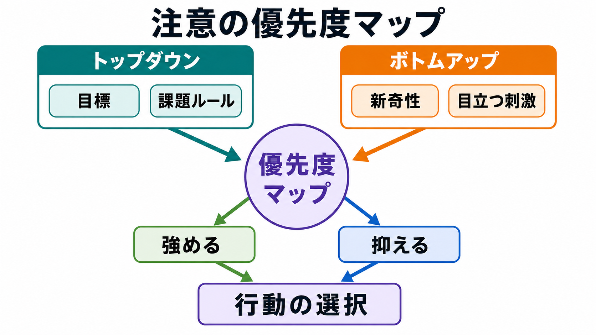
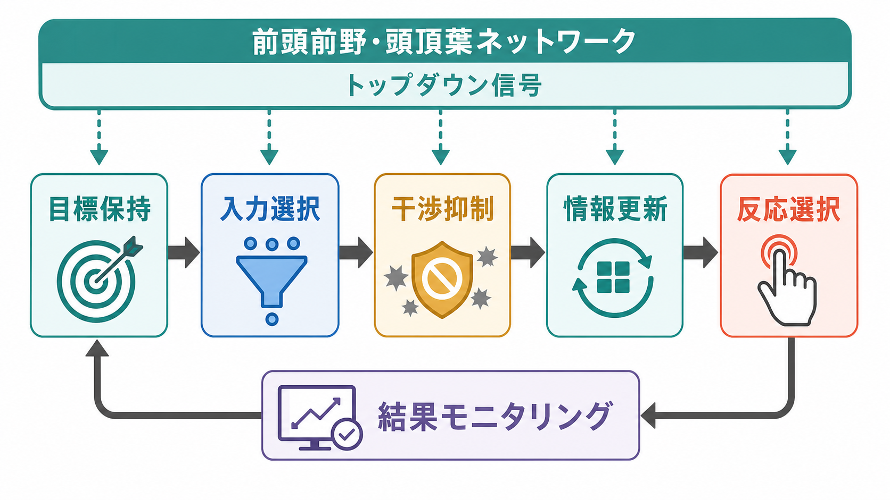
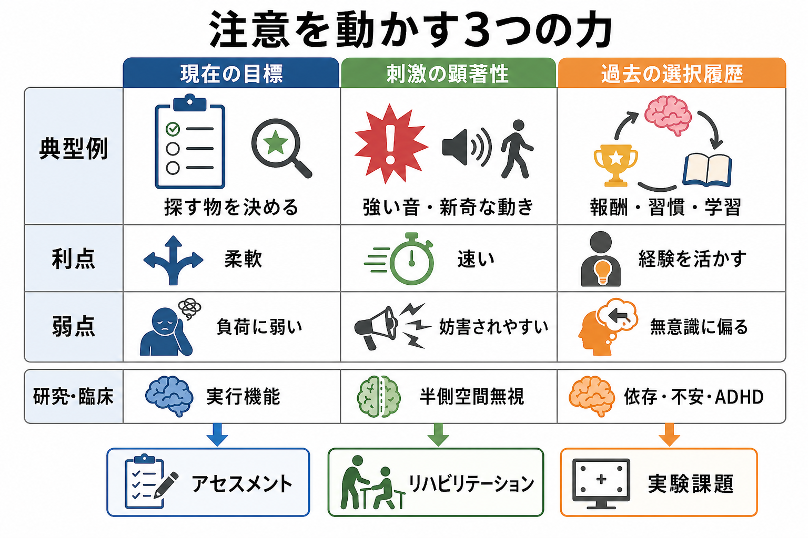

# トップダウン注意とボトムアップ注意は何が違うのか

## 要点

- **トップダウン注意**は、目標・課題・期待・ルールに基づいて、いま処理すべき情報を選ぶ注意である。
- **ボトムアップ注意**は、明るい光、突然の音、新奇な動きのように、刺激そのものの顕著性によって注意が引き寄せられる現象である。
- ただし、両者は完全に別系統ではない。実際の注意配分は、目標、刺激の顕著性、過去の選択履歴が「優先度」を作り、互いに競合・協調して決まる[1][2]。
- 神経基盤としては、背側前頭頭頂ネットワークが目標に沿った選択を、腹側前頭頭頂ネットワークが予期しない刺激への再定位を支える、という整理が有用である[3][4]。

## この記事で答える問い

日常では、探し物をしているときの「赤い物を探す」注意と、突然の大きな音に振り向く注意は、どちらも「注意」と呼ばれる。しかし、前者は目標から感覚処理を絞り込む働きであり、後者は刺激側から現在の処理を割り込ませる働きである。このノートでは、両者の違いを、心理学実験、神経ネットワーク、研究・臨床との接続から整理する。

## まず結論

トップダウン注意とボトムアップ注意の違いは、「注意を動かす原因」が内側の目標にあるか、外側の刺激にあるかである。

トップダウン注意では、課題目標が先にある。たとえば「青い標識を探す」と決めると、視覚系は青色、標識らしい形、道路上の位置を優先しやすくなる。これは[[ワーキングメモリ容量はなぜ限られているのか|ワーキングメモリ]]や課題ルールが、感覚処理をバイアスする過程である[5]。

ボトムアップ注意では、刺激の側が先にある。たとえば静かな部屋で急にガラスが割れる音がすれば、目標と関係なく注意がそちらへ向く。視覚では、強いコントラスト、急な出現、動き、新奇性などが、初期の選択を左右する[6][7]。

## 背景

注意研究では、限られた処理資源をどの情報に割り当てるかが中心問題になる。古典的には、入力刺激の物理的特徴によって自動的に選ばれる過程と、課題目標によって制御される過程が区別されてきた。視覚探索研究やサリエンシー・モデルは、色、明るさ、方向、動きなどの特徴が初期選択にどう寄与するかを明らかにしてきた[8]。

一方で、現在の研究では「トップダウンかボトムアップか」という二分法だけでは不十分だと考えられている。たとえば、ある刺激が目立っていても、現在の課題とまったく関係がなければ捕捉されにくい場合がある。逆に、過去に報酬と結びついた刺激は、現在の目標に反しても注意を引きやすい。Awh らは、目標、刺激顕著性、選択履歴という少なくとも三つの要因が、注意の優先度を作ると整理している[2]。

## 基本概念

### トップダウン注意

トップダウン注意は、内的な目標から感覚入力を選択する働きである。実験では、手がかり刺激によって「左に注意せよ」「赤い刺激を探せ」と指示すると、その場所や特徴に対する反応が速くなったり、知覚感度が上がったりする。このような効果は、注意が単に反応段階を変えるだけでなく、感覚表象そのものを増幅・選択することを示す[5][7]。

トップダウン注意は、[[持続的注意とは何か|持続的注意]]、作業記憶、課題セット、実行機能と関係する。目的に沿って不要な刺激を抑え、必要な刺激を優先するため、複雑な読解、運転、診察、実験課題の遂行に不可欠である。

### ボトムアップ注意

ボトムアップ注意は、刺激の顕著性によって生じる注意捕捉である。典型例は、突然現れる物体、急な音、強いコントラスト、周囲と異なる色、予期しない動きである。これらは、目標に関係なく現在の処理を中断し、環境内の重要な変化へ向き直らせる。

ただし、ボトムアップ注意は「完全に自動的」とは限らない。Folk らの contingent capture 研究では、刺激が注意を捕捉するかどうかは、その刺激特徴が現在の探索セットと合っているかに左右されることが示された[6]。つまり、刺激駆動性の注意捕捉も、目標設定から独立しているわけではない。

## 仕組み

### 優先度マップとして考える

実際の脳は、目標と刺激を別々に処理してから最後に足し合わせるだけではない。視覚空間内のどこを処理すべきか、どの特徴を優先すべきかを表す「優先度マップ」が形成され、そこに複数の信号が流れ込むと考えると理解しやすい[1][7]。

優先度を上げる信号には、少なくとも三つがある。

| 注意を動かす力 | 典型例 | 強み | 弱点 |
|---|---|---|---|
| 現在の目標 | 赤い本を探す、特定の音を聞く | 柔軟で文脈に合う | 認知負荷や疲労に弱い |
| 刺激の顕著性 | 突然の音、強い光、急な動き | 速く危険検出に役立つ | 妨害刺激に引き込まれやすい |
| 選択履歴 | 以前に報酬を得た刺激、習慣化した手がかり | 経験を利用できる | 現在の目標に反する偏りを生む |

### 背側系と腹側系

神経科学では、トップダウン注意とボトムアップ注意を、背側・腹側の前頭頭頂ネットワークとして整理することが多い。背側前頭頭頂ネットワークは、前頭眼野や頭頂間溝を含み、目標に沿った空間・特徴選択を支える。これは[[前頭頭頂ネットワークは認知制御をどう支えるのか]]や[[中央実行ネットワークとは何か]]と接続しやすい。

一方、腹側前頭頭頂ネットワークは、右半球優位の側頭頭頂接合部や腹側前頭皮質を含み、予期しないが行動上重要な刺激へ注意を再定位する働きに関わる[3][4]。ただし、背側系と腹側系は独立したスイッチではなく、課題状態、覚醒、顕著性、予測誤差に応じて協調する。

## 図解

上の図では、トップダウン信号が目標保持、入力選択、干渉抑制、情報更新、反応選択へ流れる過程を示している。これは「注意を向ける」だけでなく、「不要なものを抑える」「いまの課題に合わせて表象を更新する」ことを含む。

次の図は、注意を動かす要因を三つに分けた整理である。現代的には、トップダウンとボトムアップの二分法に加えて、報酬、習慣、経験による選択履歴を入れると、臨床・研究の現象を説明しやすくなる[2]。

## 臨床・研究との接続

注意の区別は、実験心理学だけでなく、脳損傷、発達特性、精神症状の理解にも関係する。

脳損傷研究では、右側頭頭頂接合部や腹側前頭皮質を含むネットワークの損傷が、左側空間への再定位の困難と関連し、半側空間無視の理解に重要である[3][4]。これは単に「見えていない」のではなく、どの刺激を行動上優先するかの障害として捉えられる。

ADHD 研究では、目標維持、干渉抑制、報酬への感受性、刺激への捕捉されやすさが複合的に関係する。したがって、[[ADHDは前頭線条体回路の障害として説明できるのか]]と接続する場合も、「トップダウン制御が弱い」という単純化だけでなく、刺激顕著性や選択履歴、報酬学習の偏りを含めて考える必要がある。

不安や依存の研究では、脅威刺激や報酬関連刺激が注意を引きやすいことが問題になる。これは「意思が弱い」という説明ではなく、過去の学習、覚醒状態、サリエンス処理、目標制御の相互作用として理解できる。[[サリエンスネットワークとは何か]]や[[脳ネットワークの破綻は精神疾患をどう説明するのか]]と関連する。

## よくある誤解

### 誤解1: トップダウン注意は意識的で、ボトムアップ注意は無意識的である

おおむね対応することは多いが、完全には一致しない。目標に基づくバイアスが意識されないまま働くこともあれば、目立つ刺激に気づいてから意図的に注意を向け続けることもある。

### 誤解2: ボトムアップ注意は常に強い

顕著な刺激でも、課題目標と合わない場合には捕捉が弱くなることがある[6]。逆に、目立ち方が弱くても、現在の探索目標や過去の報酬と一致すれば優先される。

### 誤解3: トップダウン注意は「良い注意」、ボトムアップ注意は「悪い注意」である

どちらも適応的である。トップダウン注意は課題遂行に必要だが、固着すると予期しない重要情報を見落とす。ボトムアップ注意は危険検出に有用だが、過剰だと妨害刺激に振り回される。

### 誤解4: 片方だけを測れば注意能力がわかる

注意課題は、空間定位、特徴選択、反応抑制、覚醒、作業記憶、報酬学習を含みやすい。課題成績を解釈するときは、どの成分を測っているのかを分ける必要がある。[[課題fMRIでは何を比較しているのか]]や[[fMRIは神経活動を直接測っているのか]]を読むと、脳画像研究での注意課題の解釈がしやすい。

## 関連ノート

- [[持続的注意とは何か]]
- [[ワーキングメモリ容量はなぜ限られているのか]]
- [[前頭頭頂ネットワークは認知制御をどう支えるのか]]
- [[中央実行ネットワークとは何か]]
- [[サリエンスネットワークとは何か]]
- [[視覚ネットワークはどのように階層的に情報処理するのか]]
- [[皮質視床ループは意識や注意にどう関わるのか]]
- [[ADHDは前頭線条体回路の障害として説明できるのか]]

## MOC更新候補

- `content/00_MOC/MOC｜認知科学・心理学.md`
- `content/00_MOC/` 配下に注意・実行機能系の MOC が作成される場合、その下位項目候補

並列ジョブとの競合を避けるため、このノートから MOC への直接更新は行っていない。

## 理解チェック

1. 赤い封筒を探しているとき、赤い看板に目が向きやすくなるのは、主にトップダウン注意とボトムアップ注意のどちらで説明できるか。
2. 突然の大きな音に振り向くことは、なぜ適応的なのか。
3. 目立つ刺激が常に注意を捕捉するわけではない、という主張はどのような実験事実と関係するか。
4. 目標、刺激顕著性、選択履歴の三要因で考えると、依存や不安における注意バイアスはどのように説明できるか。

## 未解決問題

- 「顕著性」が低次視覚特徴だけでなく、意味、情動価、社会的手がかりをどこまで含むのかは、課題設計によって解釈が変わる。
- トップダウン制御と選択履歴を、行動データだけから分離するのは難しい。眼球運動、反応時間、脳画像、計算モデルの統合が必要である。
- 臨床群で観察される注意バイアスを、原因、維持要因、代償過程のどれとして解釈するかは慎重に扱う必要がある。

## 参考文献

[1] Theeuwes, J. (2010). Top-down and bottom-up control of visual selection. *Acta Psychologica*, 135(2), 77-99. https://doi.org/10.1016/j.actpsy.2010.02.003

[2] Awh, E., Belopolsky, A. V., & Theeuwes, J. (2012). Top-down versus bottom-up attentional control: A failed theoretical dichotomy. *Trends in Cognitive Sciences*, 16(8), 437-443. https://doi.org/10.1016/j.tics.2012.06.010

[3] Corbetta, M., & Shulman, G. L. (2002). Control of goal-directed and stimulus-driven attention in the brain. *Nature Reviews Neuroscience*, 3, 201-215. https://doi.org/10.1038/nrn755

[4] Vossel, S., Geng, J. J., & Fink, G. R. (2014). Dorsal and ventral attention systems: Distinct neural circuits but collaborative roles. *The Neuroscientist*, 20(2), 150-159. https://doi.org/10.1177/1073858413494269

[5] Desimone, R., & Duncan, J. (1995). Neural mechanisms of selective visual attention. *Annual Review of Neuroscience*, 18, 193-222. https://doi.org/10.1146/annurev.ne.18.030195.001205

[6] Folk, C. L., Remington, R. W., & Johnston, J. C. (1992). Involuntary covert orienting is contingent on attentional control settings. *Journal of Experimental Psychology: Human Perception and Performance*, 18(4), 1030-1044. https://doi.org/10.1037/0096-1523.18.4.1030

[7] Carrasco, M. (2011). Visual attention: The past 25 years. *Vision Research*, 51(13), 1484-1525. https://doi.org/10.1016/j.visres.2011.04.012

[8] Itti, L., Koch, C., & Niebur, E. (1998). A model of saliency-based visual attention for rapid scene analysis. *IEEE Transactions on Pattern Analysis and Machine Intelligence*, 20(11), 1254-1259. https://doi.org/10.1109/34.730558
