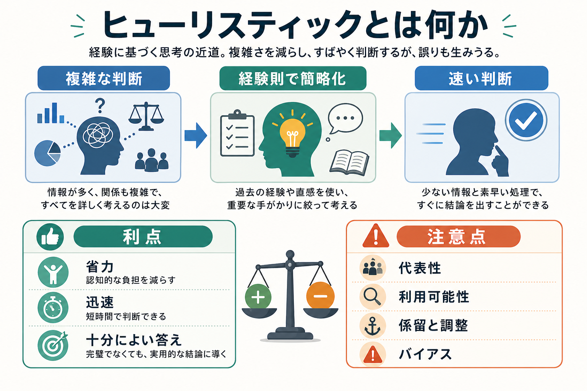
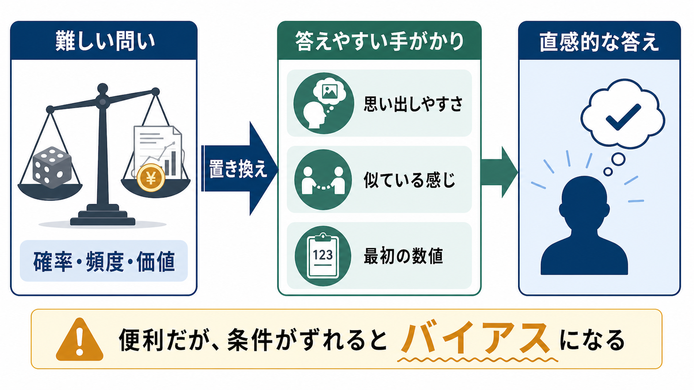

# ヒューリスティックとは何か

## 要点

- ヒューリスティックとは、複雑な判断をすべて計算せず、少数の手がかりや経験則で素早く答えを出す認知方略である。
- 代表的には、代表性ヒューリスティック、利用可能性ヒューリスティック、係留と調整がある[1]。
- 省力的で速く、日常場面では十分に役立つ一方、条件がずれると認知バイアスとして系統的な誤りを生む[1][2]。
- 「いつも悪い近道」ではなく、環境・目的・情報構造に合えば、厳密な計算よりよい判断を支える場合もある[3][4]。

## この記事で答える問い

- ヒューリスティックは何を簡略化しているのか。
- なぜ便利なのに誤りやすいのか。
- 代表性、利用可能性、係留と調整はどのように働くのか。
- 研究や臨床でこの概念をどう扱えばよいのか。

## まず結論

ヒューリスティックは、[[意思決定とは何か|意思決定]]や判断において、すべての情報を集めて厳密に比較する代わりに、「似ている」「思い出しやすい」「最初に示された数値に近い」といった手がかりで答えを作る仕組みである。これは[[注意とは何か|注意]]、[[長期記憶とは何か|記憶]]、[[実行機能とは何か|実行機能]]の限界の中で判断を進めるための適応的な工夫でもある。

ただし、簡略化された問いに答えているのに、本人は元の難しい問いに答えたつもりになることがある。Kahneman と Frederick は、このような直感的判断を「属性置換」として整理した[5]。たとえば「この人が専門職Aである確率はどのくらいか」という難しい問いが、「この人は専門職Aらしく見えるか」という答えやすい問いに置き換わる。

## 背景

古典的な合理的判断モデルでは、人は利用可能な情報を広く集め、確率や価値を一貫した規則で統合すると仮定されやすい。しかし現実の判断では、時間、知識、計算資源、[[ワーキングメモリとは何か|ワーキングメモリ]]容量が限られている。そのため、人はしばしば「十分に速く、十分によい」判断を選ぶ。

Tversky と Kahneman は、不確実性下の判断で人が代表性、利用可能性、係留と調整を用いることを示し、これらは経済的で有効な一方、予測可能な誤りを生むと論じた[1]。この流れは、ヒューリスティックを「バイアスの原因」として見る研究を大きく発展させた。

一方で、Gigerenzer らの研究は、ヒューリスティックを単なる欠陥ではなく、限られた情報からうまく判断する「高速で倹約的な」方略として捉える[3][4]。重要なのは、ヒューリスティックが正しいか悪いかを一般論で決めることではなく、「どの環境で、どの手がかりを、何の目的で使っているか」を見ることである。

## 基本概念

### ヒューリスティック

ヒューリスティックとは、複雑な探索・計算・比較を省略し、少数の手がかりで判断を作る方略である。Shah と Oppenheimer は、ヒューリスティックの中心機能を「努力の削減」として整理し、手がかり探索の削減、情報統合の単純化、選択肢の削減などの観点から分類できると論じた[2]。

### バイアス

バイアスとは、ある条件で繰り返し生じる判断の偏りである。ヒューリスティックはバイアスの一因になりうるが、両者は同じではない。ヒューリスティックは判断方略であり、バイアスはその方略が特定条件で生む偏りである。

### 限定合理性

限定合理性とは、人間の合理性が情報、時間、計算能力の制約を受けるという考え方である。ヒューリスティックは、この制約下で判断を可能にする道具として理解できる。Kahneman は行動経済学との接続の中で、直感的判断、限定合理性、選好や意思決定の心理学的制約を整理している[6]。

## 仕組み

ヒューリスティックの中核は、「本来答えるべき難しい問い」を「答えやすい問い」に変えることにある。たとえば、ある出来事の実際の頻度を推定する代わりに、その出来事の例をどれだけ容易に思い出せるかを使う。これは日常では有用だが、メディアで目立つ出来事、最近経験した出来事、感情的に強い出来事を過大評価しやすい。

### 代表性ヒューリスティック

代表性ヒューリスティックでは、対象があるカテゴリーの典型像にどれだけ似ているかを手がかりにする。たとえば、人物記述が「研究者らしい」と感じられると、その人が研究者である確率を高く見積もりやすい。しかし、基準率やサンプルサイズを無視すると誤りが生じる[1]。

この仕組みは、連言錯誤でも問題になる。Tversky と Kahneman は、ある具体的で典型的な記述が与えられると、単独事象よりも複合事象の方をもっともらしいと判断してしまう場合があることを示した[7]。

### 利用可能性ヒューリスティック

利用可能性ヒューリスティックでは、思い出しやすさ、想像しやすさ、検索しやすさが頻度や確率の推定に影響する[1]。これは[[想起は記憶を変えるのか|想起]]と密接に関係する。印象的な事件をすぐ思い出せると、その事件が実際より多いように感じられる。

### 係留と調整

係留と調整では、最初に与えられた数値や基準が判断の出発点になり、そこから調整しても十分に離れられない。価格交渉、リスク推定、検査値の解釈、研究での事前予想など、数値を扱う場面で起こりやすい[1]。

## 図解

| 観点 | ヒューリスティックがしていること | 役に立つ場面 | 誤りやすい場面 |
|---|---|---|---|
| 代表性 | 典型像との類似で判断する | パターン認識、初期仮説の形成 | 基準率を無視するとき |
| 利用可能性 | 思い出しやすさで頻度を推定する | 経験に基づく素早いリスク感覚 | 目立つ例だけが記憶に残るとき |
| 係留と調整 | 最初の値を基準にする | 不確実な数値推定の出発点 | 最初の値が恣意的なとき |
| 高速倹約方略 | 手がかりを少数に絞る | 情報が少なく時間がないとき | 手がかりと正解の対応が崩れるとき |

## 臨床・研究との接続

臨床や教育の文脈では、ヒューリスティックは「専門家が使う直感」と「判断エラー」の両方に関係する。経験豊富な実践者は、症状、表情、経過、文脈から素早く仮説を立てる。この初期仮説は実務上重要だが、初期印象に引きずられると、後から得られる反証的情報を軽視しやすい。

研究では、ヒューリスティックを測るときに、単に「誤答したか」だけでなく、どの情報を見たか、どの手がかりを無視したか、反応時間や自信がどう変化したかを見る必要がある。高速で倹約的な方略の研究は、単純な規範モデルとのズレだけでなく、環境に対する適合性を評価する方向を示している[3][4]。

精神医学・心理臨床に接続するときは注意が必要である。ヒューリスティックは診断名や個別治療方針を直接決める概念ではない。むしろ、面接、心理検査、リスク評価、ケースフォーミュレーションにおいて、どの初期印象が役に立ち、どの初期印象が確認バイアスや係留を強めるかを点検するための概念である。

## よくある誤解

### 誤解1: ヒューリスティックはいつも非合理である

ヒューリスティックは厳密計算からの逸脱である場合もあるが、現実の判断では厳密計算そのものが不可能なことが多い。環境内の手がかりが安定していて、判断目的に合っていれば、少数の手がかりに絞ることは合理的になりうる[3][4]。

### 誤解2: バイアスを知ればバイアスは消える

概念を知ることは点検の助けになるが、それだけで直感的判断が完全に消えるわけではない。特に時間圧、疲労、感情的負荷、強い初期印象がある場面では、ヒューリスティックに頼りやすい。

### 誤解3: 専門家はヒューリスティックを使わない

専門家もヒューリスティックを使う。違いは、使う手がかりが経験によって洗練されている場合があること、また判断を検証する手続きやフィードバックを持っている場合があることである。専門性は直感の排除ではなく、直感と検証の組み合わせとして見る方が実用的である。

## 関連ノート

- [[意思決定とは何か]]
- [[実行機能とは何か]]
- [[注意とは何か]]
- [[ワーキングメモリとは何か]]
- [[想起は記憶を変えるのか]]
- [[認知的柔軟性とは何か]]

MOC更新候補: `content/00_MOC/MOC｜認知科学・心理学.md` に本記事を追加。

今後の作成候補: 「認知バイアスとは何か」「代表性ヒューリスティックとは何か」「利用可能性ヒューリスティックとは何か」「係留効果とは何か」「二重過程理論とは何か」。

## 理解チェック

1. ヒューリスティックとバイアスはどのように違うか。
2. 「頻度の推定」が「思い出しやすさ」に置き換わると、どのような誤りが生じやすいか。
3. 臨床や研究で初期印象を使うとき、どのような検証手続きが必要か。

## 未解決問題

- ヒューリスティックが有効になる環境条件を、個人差や文化差を含めてどう特定するか。
- 直感的判断を抑制するのではなく、適切に検証する訓練をどのように設計するか。
- AI支援の判断環境で、人間のヒューリスティックと機械の推定をどう組み合わせるか。

## 参考文献

[1] Tversky, A., & Kahneman, D. (1974). Judgment under uncertainty: Heuristics and biases. *Science*, 185(4157), 1124-1131. https://doi.org/10.1126/science.185.4157.1124

[2] Shah, A. K., & Oppenheimer, D. M. (2008). Heuristics made easy: An effort-reduction framework. *Psychological Bulletin*, 134(2), 207-222. https://doi.org/10.1037/0033-2909.134.2.207

[3] Gigerenzer, G., & Goldstein, D. G. (1996). Reasoning the fast and frugal way: Models of bounded rationality. *Psychological Review*, 103(4), 650-669. https://doi.org/10.1037/0033-295X.103.4.650

[4] Gigerenzer, G., & Gaissmaier, W. (2011). Heuristic decision making. *Annual Review of Psychology*, 62, 451-482. https://doi.org/10.1146/annurev-psych-120709-145346

[5] Kahneman, D., & Frederick, S. (2002). Representativeness revisited: Attribute substitution in intuitive judgment. In T. Gilovich, D. Griffin, & D. Kahneman (Eds.), *Heuristics and Biases: The Psychology of Intuitive Judgment* (pp. 49-81). Cambridge University Press. https://doi.org/10.1017/CBO9780511808098.004

[6] Kahneman, D. (2003). Maps of bounded rationality: Psychology for behavioral economics. *American Economic Review*, 93(5), 1449-1475. https://doi.org/10.1257/000282803322655392

[7] Tversky, A., & Kahneman, D. (1983). Extensional versus intuitive reasoning: The conjunction fallacy in probability judgment. *Psychological Review*, 90(4), 293-315. https://doi.org/10.1037/0033-295X.90.4.293
