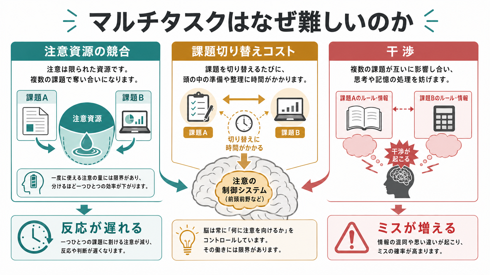
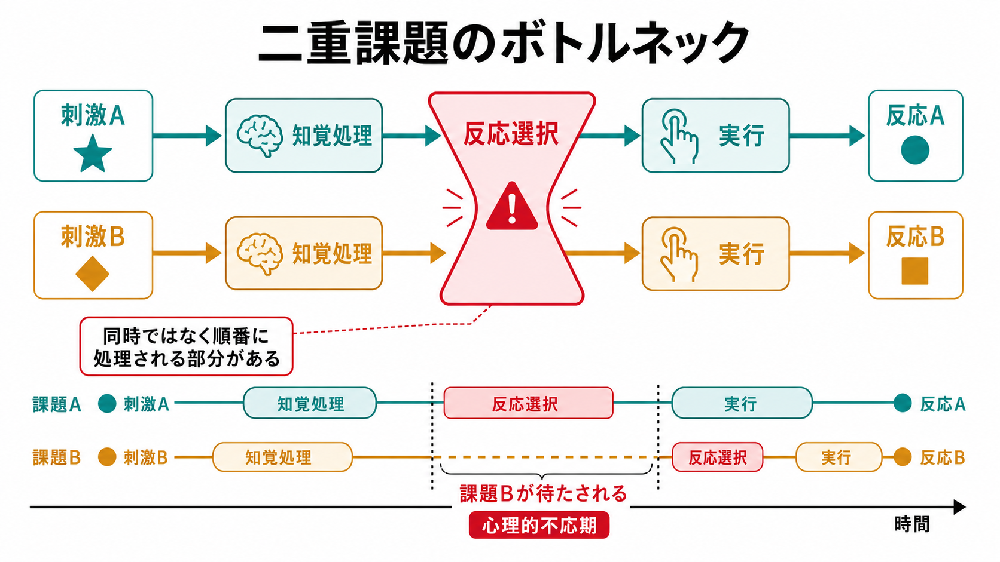
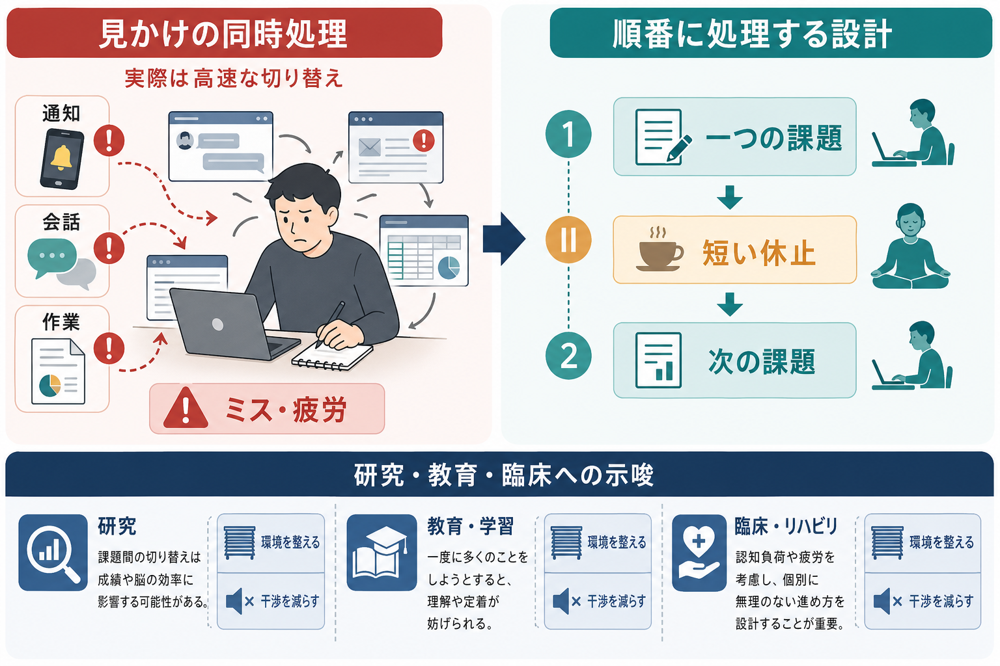

# マルチタスクはなぜ難しいのか

## 要点

- マルチタスクの多くは、厳密な同時処理ではなく、[[注意とは何か|注意]]の配分と課題セットの高速な切り替えで成り立つ。
- 2つの課題が同じ処理段階、同じ感覚・反応様式、同じ[[ワーキングメモリとは何か|ワーキングメモリ]]を使うほど、反応遅延とエラーが増えやすい。
- 課題を切り替えるだけでも、準備、前課題の抑制、現在課題のルール再設定が必要になり、切り替えコストが残る。
- 「慣れれば完全に同時にできる」というより、よく練習された一部の処理が自動化し、制御資源の競合が減る、と考える方が正確である。

## この記事で答える問い

1. なぜ、メールを見ながら文章を書くと遅くなるのか。
2. なぜ、簡単な課題同士でも同時に行うと干渉が起こるのか。
3. 課題切り替えコストは、準備すれば消えるのか。
4. 学習・研究・臨床場面では、マルチタスクをどう扱うべきか。

## まず結論

マルチタスクが難しい主な理由は、脳がすべての処理を完全に並列実行できるわけではないからである。感覚入力や運動実行の一部は並列的に進むが、「何に注意を向けるか」「どのルールで判断するか」「どの反応を選ぶか」といった制御過程には、順番待ちや競合が生じる。心理的不応期の研究は、2つの課題が近い時間に提示されると、第2課題の反応選択が遅れやすいことを示してきた[1]。

## 背景

日常語の「マルチタスク」は、複数の活動を同時にしている状態を広く指す。たとえば、会議を聞きながらチャットを返す、講義を聞きながら別サイトを見る、運転しながら会話する、といった場面である。しかし認知心理学では、少なくとも次の3種類を区別すると理解しやすい。

| 種類 | 例 | 主な問題 |
|---|---|---|
| 二重課題 | 音を聞いてボタンを押しながら、画面の文字にも反応する | 中央ボトルネック、反応選択の遅延 |
| 課題切り替え | 文書作成とメール返信を交互に行う | 課題セットの再設定、前課題からの残留干渉 |
| 割り込み | 通知で作業が中断される | 目標の再構築、文脈復帰の負荷 |

この区別が重要なのは、「同時にできない」の理由が1つではないからである。処理資源の総量が足りない場合もあれば、2つの課題が同じ処理段階に集中する場合もあり、あるいは切り替えそのものが余分な仕事になる場合もある。

## 基本概念

### 注意資源

注意資源とは、処理に使える心的容量を説明するための概念である。古典的には、注意は一つの貯水池のような有限資源として説明されることが多かった。しかし現在は、単一の資源だけでなく、視覚・聴覚、空間・言語、知覚・反応など、複数の次元で資源が分かれると考える複数資源モデルも使われる[4]。そのため、すべての組み合わせが同じように悪いわけではない。視覚課題同士、言語課題同士、同じ手で反応する課題同士は、互いに競合しやすい。

### 課題セット

課題セットとは、「今は何を手がかりにし、どのルールで判断し、どの反応を出すか」という一時的な設定である。たとえば同じ数字の「7」を見ても、奇数・偶数判断をしているときと、大きい・小さい判断をしているときでは、使うルールが違う。課題を切り替えるには、この設定を変える必要がある。

課題切り替え研究では、切り替え直後の反応は、同じ課題を繰り返す場合より遅く、誤りも増えやすい。準備時間があると切り替えコストは減るが、完全には消えにくい[2]。これは、再設定に時間がかかるだけでなく、直前の課題セットの活性や抑制が残るためである[3]。

### 干渉

干渉とは、ある課題に必要な処理が、別の課題に必要な処理を妨げることである。干渉は刺激段階、意味処理段階、記憶検索段階、反応選択段階、運動実行段階のどこでも起こりうる。特に反応選択や記憶検索のような中央処理は、二重課題で順番待ちになりやすい[1]。

### ワーキングメモリの限界

複数課題では、現在の目標、途中結果、次に行う操作、抑制すべき情報を一時的に保つ必要がある。[[ワーキングメモリ容量はなぜ限られているのか|ワーキングメモリ容量]]は大きくないため、課題が増えるほど保持すべき項目と更新すべき項目が増え、混同が起こりやすくなる。短期保持の中心容量はおおむね少数のチャンクに限られるという議論は、マルチタスクの脆弱性を理解する基礎になる[5]。

## 仕組み

### 1. 中央ボトルネック

心理的不応期の実験では、第1刺激に反応する直後に第2刺激が出ると、第2反応が大きく遅れる。これは、第2課題の知覚処理がある程度進んでも、反応選択などの中央段階が第1課題の処理終了を待つためだと解釈される[1]。

重要なのは、「脳は何も並列処理できない」という意味ではない点である。視覚入力、聴覚入力、運動準備などはある程度並列に進む。しかし、現在の目標に合わせて反応を選ぶ制御段階では、同時進行が難しい部分がある。

### 2. 切り替えコスト

文書作成からメール返信へ移るとき、単に画面を切り替えるだけではない。脳内では、文章の構成目標を一時停止し、メールの相手・文脈・返答方針を読み込み、適切な語調と操作へ切り替える必要がある。この再設定にかかる時間と、前課題の影響が残ることが切り替えコストである。

課題切り替えのレビューは、切り替えコストが課題セット再構成、前課題からの残留活性、抑制の持ち越し、手がかり処理などの複数要因から成ることを整理している[2][3]。したがって「気合いで速く切り替える」だけでは限界がある。

### 3. 資源競合

2つの課題が同じ資源を使うほど干渉は強くなる。たとえば、画面を読みながら別の画面の細かい変化を探す作業は、どちらも視覚的注意を要求する。文章を書きながら会話を聞く作業は、言語処理と目標保持を競合させる。複数資源モデルは、課題の入力様式、処理コード、反応様式が重なるほど負荷が高まり、設計上の工夫で干渉を下げられる可能性を示す[4]。

### 4. 目標管理の負荷

マルチタスクでは、課題そのものに加えて「今どちらを優先するか」「中断前にどこまで進んだか」「次に戻るべき場所はどこか」を管理しなければならない。この管理は[[中央実行系とは何か|中央実行系]]や[[計画能力とは何か|計画能力]]に近い機能を使う。課題数が増えるほど、作業そのものではなく作業管理に注意が消費される。

## 図解

図のポイントは、マルチタスクが「能力の問題」だけではなく「課題設計の問題」でもあることにある。通知を減らす、課題をまとまりに分ける、切り替え前にメモを残す、同じ資源を使う課題を重ねない、といった工夫は、注意資源の総量を増やすわけではないが、干渉と復帰コストを下げる。

## 臨床・研究との接続

研究では、マルチタスク課題は[[分割注意はどこまで可能なのか|分割注意]]、[[選択的注意はどのように働くのか|選択的注意]]、実行機能、ワーキングメモリ、処理速度を評価する入口になる。二重課題パラダイムは、どの処理段階が詰まっているのかを推定する方法として使われる[1]。課題切り替えパラダイムは、柔軟性と干渉制御を調べるために使われる[3]。

教育場面では、講義中のノート作成と無関係なブラウジングを同時に行うと、本人だけでなく近くの学習者の理解にも悪影響が出る可能性がある。Sanaらの実験では、講義中にラップトップで別課題を行った参加者は理解テスト成績が低く、近くでその画面を見える位置にいた参加者にも影響が及んだ[8]。

メディア・マルチタスクについては、重いメディア・マルチタスカーほど妨害刺激に弱いという報告がある[6]。ただし、その後の再現研究とメタ分析では、効果の一貫性には限界があるとされ、因果関係も単純には断定できない[7]。したがって、「マルチタスクをする人は必ず注意力が低い」と結論するのではなく、課題、測定法、個人差、生活文脈を分けて読む必要がある。

臨床やリハビリテーションに接続する場合も、この記事の内容は個別の診断や治療指示ではなく、教育・研究目的の理解枠組みである。疲労、睡眠不足、不安、疼痛、神経疾患、精神疾患などは、注意制御やワーキングメモリの余裕に影響しうるため、複数課題の失敗を単なる努力不足として扱わないことが重要である。

## よくある誤解

### 誤解1: マルチタスクが得意な人は、複数のことを完全に同時処理している

多くの場合、得意に見える人は、切り替えが速い、片方の課題が自動化している、課題同士の干渉が少ない、外部メモや環境設計を使っている、という条件を満たしている。完全な同時処理とは限らない。

### 誤解2: 簡単な課題なら干渉しない

簡単な課題でも、反応選択や記憶検索のタイミングが重なると干渉は起こる。二重課題干渉の古典的研究が扱ってきたのは、むしろ単純な刺激反応課題である[1]。

### 誤解3: 準備すれば切り替えコストはゼロになる

準備時間があると切り替えコストは減る。しかし、課題セットの残留、抑制の持ち越し、手がかり処理などのため、完全には消えにくい[2][3]。

### 誤解4: マルチタスク訓練をすれば、一般的な注意能力が広く高まる

特定課題への熟練は起こりうるが、それがあらゆる課題に広く転移するとは限らない。メディア・マルチタスク研究でも、関連は報告されている一方、再現性や因果方向には注意が必要である[6][7]。

## 関連ノート

- [[注意とは何か]]
- [[分割注意はどこまで可能なのか]]
- [[選択的注意はどのように働くのか]]
- [[持続的注意とは何か]]
- [[ワーキングメモリとは何か]]
- [[ワーキングメモリ容量はなぜ限られているのか]]
- [[中央実行系とは何か]]
- [[計画能力とは何か]]

### 関連ノート候補

- 認知制御とは何か
- 課題切り替えコストとは何か
- 二重課題干渉とは何か
- 心理的不応期とは何か
- 割り込みは作業記憶に何をするのか

### MOC更新候補

- `content/00_MOC/` 配下の認知科学・心理学系 MOC に、本記事へのリンクを追加する。
- 既存の「注意」「実行機能」「ワーキングメモリ」系 MOC がある場合は、二重課題・課題切り替えの接続ノートとして配置する。

## 理解チェック

1. 「マルチタスク」と「課題切り替え」はどう違うか。
2. 心理的不応期は、どの処理段階の限界を示す証拠として使われるか。
3. 視覚課題同士を重ねると干渉が強くなりやすい理由は何か。
4. 講義中のラップトップ・マルチタスクが、本人以外にも影響しうるのはなぜか。
5. 「マルチタスクが苦手」を努力不足だけで説明することの問題は何か。

## 参考文献

[1] Pashler, H. (1994). Dual-task interference in simple tasks: Data and theory. *Psychological Bulletin, 116*(2), 220-244. https://doi.org/10.1037/0033-2909.116.2.220

[2] Monsell, S. (2003). Task switching. *Trends in Cognitive Sciences, 7*(3), 134-140. https://doi.org/10.1016/S1364-6613(03)00028-7

[3] Kiesel, A., Steinhauser, M., Wendt, M., Falkenstein, M., Jost, K., Philipp, A. M., & Koch, I. (2010). Control and interference in task switching: A review. *Psychological Bulletin, 136*(5), 849-874. https://doi.org/10.1037/a0019842

[4] Wickens, C. D. (2008). Multiple resources and mental workload. *Human Factors, 50*(3), 449-455. https://doi.org/10.1518/001872008X288394

[5] Cowan, N. (2001). The magical number 4 in short-term memory: A reconsideration of mental storage capacity. *Behavioral and Brain Sciences, 24*(1), 87-114. https://doi.org/10.1017/S0140525X01003922

[6] Ophir, E., Nass, C., & Wagner, A. D. (2009). Cognitive control in media multitaskers. *Proceedings of the National Academy of Sciences, 106*(37), 15583-15587. https://doi.org/10.1073/pnas.0903620106

[7] Wiradhany, W., & Nieuwenstein, M. R. (2017). Cognitive control in media multitaskers: Two replication studies and a meta-analysis. *Attention, Perception, & Psychophysics, 79*, 2620-2641. https://doi.org/10.3758/s13414-017-1408-4

[8] Sana, F., Weston, T., & Cepeda, N. J. (2013). Laptop multitasking hinders classroom learning for both users and nearby peers. *Computers & Education, 62*, 24-31. https://doi.org/10.1016/j.compedu.2012.10.003

## 未解決問題

- マルチタスク経験が注意制御を変えるのか、もともとの個人差がマルチタスク行動を選ばせるのかは、まだ単純に結論できない。
- 課題切り替え訓練の効果が、日常生活の広い実行機能へどの程度転移するかは、課題と対象者によって異なる可能性がある。
- AI、通知、複数画面環境が増えるなかで、どの設計が干渉を下げ、どの設計が注意を細切れにするのかは、継続的な研究課題である。
