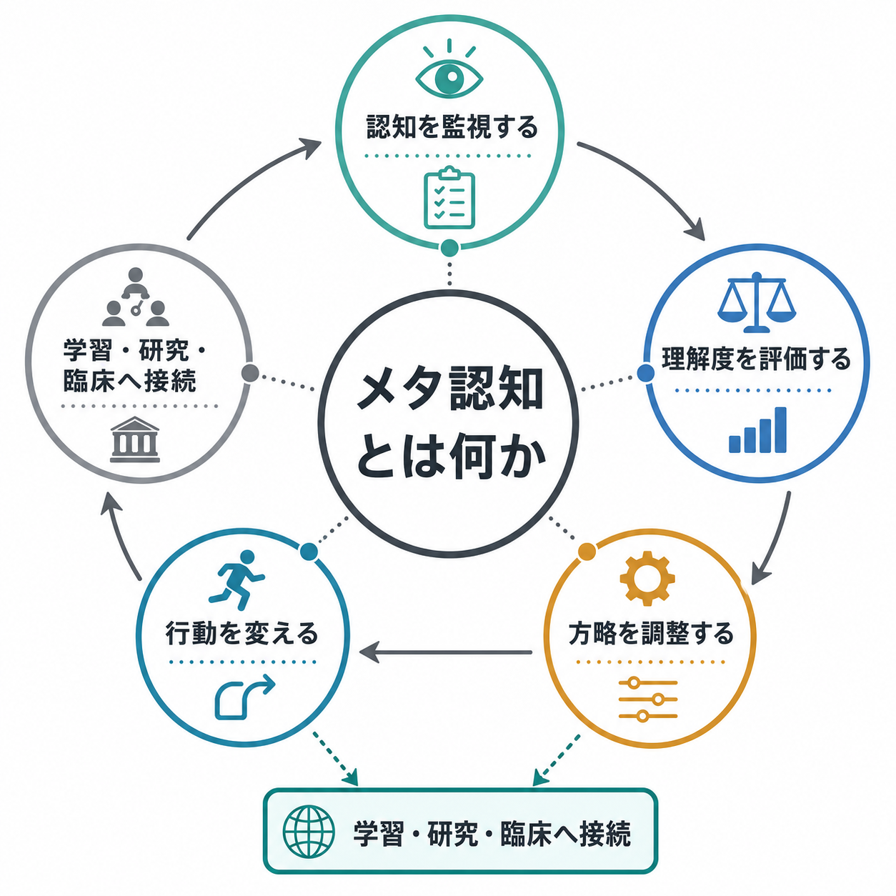
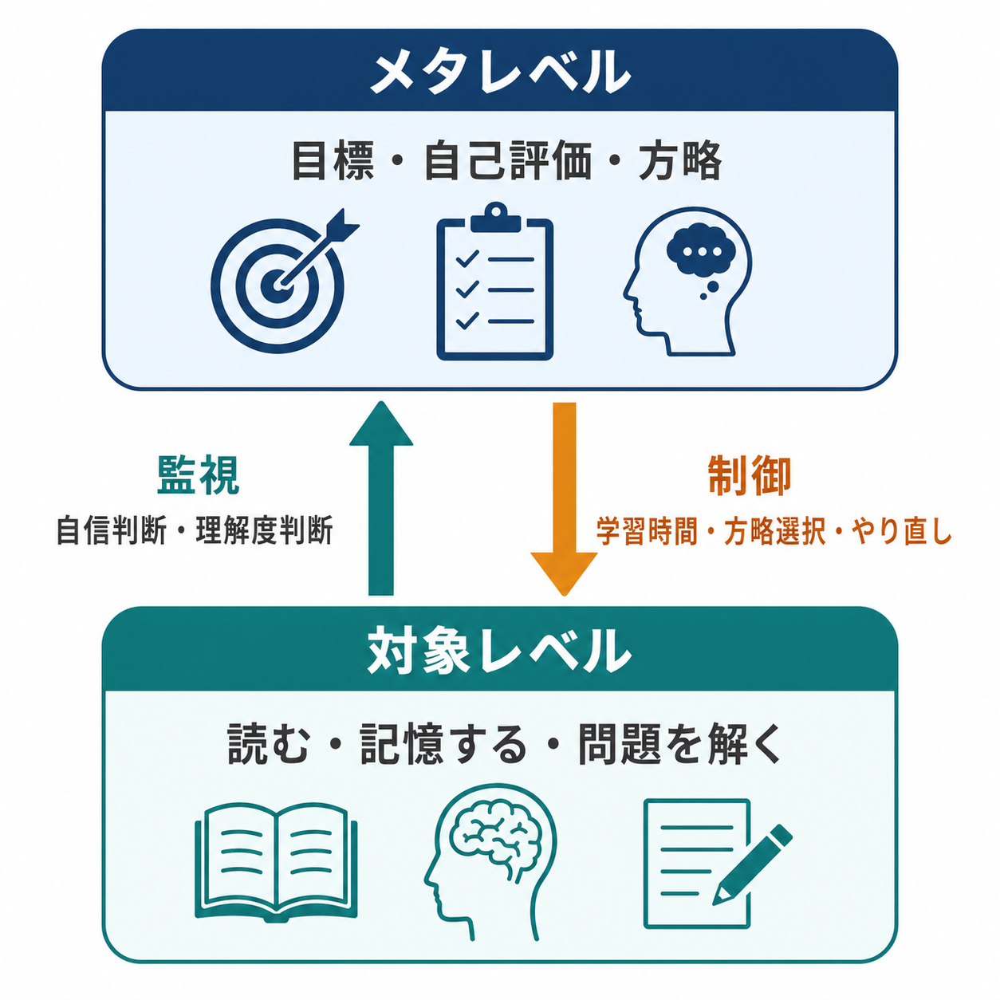
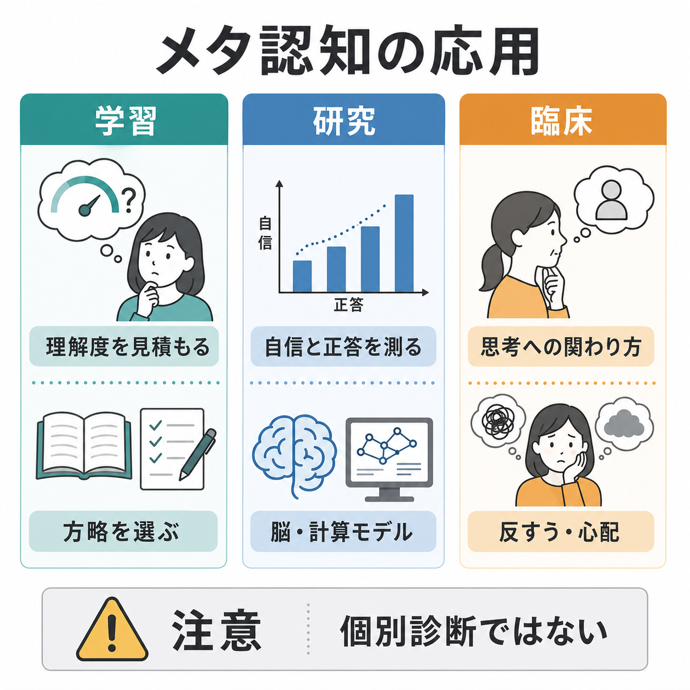

# メタ認知とは何か

## 要点

- メタ認知とは、自分の記憶、理解、注意、判断、学習方略などを「対象として見る」能力である。単なる内省ではなく、認知状態を監視し、必要に応じて行動や方略を調整する仕組みを含む[1][2]。
- 古典的には「対象レベル」と「メタレベル」の関係として整理できる。対象レベルでは読む、覚える、判断する、問題を解くといった処理が進み、メタレベルはその状態を監視し、学習時間や方略選択を制御する[2]。
- メタ認知は「自信があるか」だけでは測れない。正答・誤答と自信判断の対応、過信・過小評価、課題成績から独立したメタ認知感度などを分けて考える必要がある[4][5]。
- 学習では、理解度の見積もり、想起練習、間隔反復、やり直しの判断などに関わる。ただし「自分を振り返る」だけで学習が改善するとは限らず、具体的な課題と方略に結びつける必要がある[6]。
- 臨床では、反すう、心配、思考への関わり方、自己理解の困難などと接続するが、メタ認知の低さだけで個別診断や治療方針を決めることはできない[8]。

## この記事で答える問い

1. メタ認知は、普通の「考えること」と何が違うのか。
2. 監視と制御は、どのように学習や判断を変えるのか。
3. メタ認知はどのように測定され、どのような限界があるのか。
4. 研究・教育・臨床では、どこまで有用で、どこから慎重に扱うべきなのか。

## まず結論

メタ認知とは、「自分はいま何を理解しているのか」「どの程度確信できるのか」「この方略を続けるべきか、変えるべきか」を扱う二次的な認知である。たとえば、文章を読んでいるときの一次的な認知は、単語を認識し、文の意味を作り、内容を[[ワーキングメモリとは何か]]の中で保持する処理である。メタ認知は、その処理を外側から監視し、「この段落は分かったつもりだが説明できない」「ここは再読する」「問題演習に切り替える」といった調整を行う。

重要なのは、メタ認知が「正しい自己理解」と同義ではないことである。人はしばしば、分かっていないのに分かった気になるし、逆に十分できているのに不安を強く感じる。したがって、メタ認知を考えるときは、主観的な自信、実際の成績、方略の選択、行動の修正を分けて見る必要がある[5]。

## 背景

メタ認知という語は、Flavell による発達心理学・認知発達研究の中で広く知られるようになった。Flavell は、子どもが自分の記憶や理解の状態をどのように知り、課題に応じてそれを使うのかを「認知についての認知」として整理した[1]。この考え方は、記憶研究、学習研究、意識研究、判断と意思決定、精神医学・心理療法へ広がっている。

記憶研究では、メタ認知はとくに「メタ記憶」として研究されてきた。たとえば、ある名前を思い出せないが「見れば分かる気がする」と感じる、学習後に「これはテストで答えられそうだ」と予測する、といった現象である。Nelson と Narens は、この種の現象を対象レベルとメタレベルの関係として定式化し、監視と制御の区別を明確にした[2]。

この区別は、[[エピソード記憶とは何か]]や[[意味記憶とは何か]]を考えるときにも役立つ。記憶内容そのものを保持・想起する過程と、「それを思い出せるか」「どの程度確かか」「もう一度学習すべきか」を判断する過程は重なるが、同じではない。

## 基本概念

### メタ認知的知識

メタ認知的知識とは、自分の認知や課題、方略についての知識である。たとえば、「自分は名前より顔を覚えやすい」「抽象的な定義は例を作ると理解しやすい」「長い文章は一度で覚えられない」といった知識が含まれる[1][3]。

この知識は便利だが、固定的な自己評価になりすぎると学習を妨げる。「自分は記憶力が悪い」と一般化するより、「専門用語は例を作ると覚えやすいが、丸暗記だけでは忘れやすい」と課題と方略に分解した方が調整しやすい。

### メタ認知的監視

監視とは、自分の現在の認知状態を評価する働きである。代表例には、学習判断、理解度判断、既知感、確信度判断がある[2][5]。文章を読んで「分かった」と感じる、問題を解いて「この答えは怪しい」と感じる、名前が出ないのに「もう少しで出そう」と感じる、といった判断である。

監視は完全ではない。流暢に読める文章は理解したように感じやすいが、実際には説明や応用ができないことがある。逆に、難しい問題に時間をかけて取り組むと不安が増えるが、その努力が長期記憶には有利な場合もある。したがって、監視は主観的手がかりに依存する推定であり、成績そのものではない。

### メタ認知的制御

制御とは、監視結果に基づいて認知活動を変える働きである。再読する、問題演習に移る、休憩する、メモを取る、別の説明を探す、復習間隔を変える、といった行動が含まれる[2][6]。

制御がうまく働くには、監視がある程度正確であることに加え、使える方略の選択肢が必要である。「分からない」と気づいても、何をすればよいかが分からなければ制御にはつながらない。メタ認知は、自己観察だけでなく、具体的な方略のレパートリーと組み合わせて考える必要がある。

## 仕組み

Nelson と Narens の枠組みでは、認知システムは少なくとも二つの水準に分けて考えられる。対象レベルでは、読む、記憶する、知覚する、問題を解くなどの一次的処理が進む。メタレベルでは、その処理に関するモデルが作られ、対象レベルの状態を推定する[2]。

二つの水準のあいだには、主に二つの流れがある。

| 流れ | 向き | 役割 | 例 |
|---|---|---|---|
| 監視 | 対象レベルからメタレベルへ | 現在の処理状態を推定する | 「この説明は理解できていない」「この答えは自信が低い」 |
| 制御 | メタレベルから対象レベルへ | 処理方略や行動を変える | 再読する、想起練習をする、解法を変える |

この枠組みは、[[注意とは何か]]や[[中央実行系とは何か]]と接続して理解しやすい。注意は、どの情報を処理資源に入れるかを変える。中央実行系は、課題目標、抑制、切り替え、更新に関わる。メタ認知は、それらの処理を「自分はいま適切に使えているか」という観点から評価し、必要に応じて調整する。

ただし、メタ認知を「頭の中の司令官」と考えすぎると誤解になる。メタレベルは万能の観察者ではなく、手がかりから自己状態を推定する仕組みである。流暢性、反応時間、記憶の鮮明さ、身体感覚、課題の難しさ、過去経験などが手がかりになるが、それらはしばしば偏る[7]。

## 図解

図1は、メタ認知を「監視」「理解度評価」「方略調整」「行動変更」の連鎖としてまとめている。日常的には、勉強中、読書中、会議中、診察場面、研究データの解釈など、幅広い場面で同じ構造が現れる。

図2は、対象レベルとメタレベルの相互作用である。ポイントは、監視だけでは不十分で、制御までつながって初めて学習や行動が変わることである。

図3は、応用領域を比較している。教育では学習方略、研究では測定モデル、臨床では思考への関わり方として現れるが、それぞれで扱う「メタ認知」は完全に同じものではない。

## 臨床・研究との接続

### 研究での測定

研究では、メタ認知はしばしば「自信判断が実際の正誤をどの程度よく追跡しているか」として測られる。たとえば知覚判断課題で、参加者が答えたあとに自信を報告し、正答時と誤答時で自信がどの程度分かれるかを見る[5]。

ここで重要なのは、課題成績とメタ認知感度を分けることである。正答率が高い人が必ずしも自分の正誤をよく見分けられるとは限らない。Fleming と Dolan は、メタ認知能力が課題成績からある程度独立し、前頭前野を含む神経基盤と関連する可能性を整理している[4]。ただし、脳領域名だけで「メタ認知の場所」を一対一に決めるのは単純化しすぎである。

### 学習支援

教育・学習では、メタ認知は「自分に合った勉強法を選ぶ力」として語られやすい。しかし、実際には直感的に好まれる学習法と、長期保持に有効な学習法はずれることがある。Dunlosky らのレビューでは、想起練習や分散学習などは有望である一方、単なる再読やハイライトは効果が限定的になりやすいと整理されている[6]。

この点で、メタ認知は[[記銘・保持・想起は何が違うのか]]と深く関係する。学習者は、読んでいるときの分かりやすさではなく、あとで想起できるか、別の問題に使えるかを手がかりにする必要がある。理解度を測るには、説明してみる、白紙に再構成する、時間を置いて問題を解く、といった外部化が有効である。

### 臨床との接続

臨床心理学では、メタ認知は「思考の内容」だけでなく「思考への関わり方」を扱う概念として重要である。たとえば、心配や反すうが問題になる場合、何を心配しているかだけでなく、「心配し続けることは役に立つ」「考えを止められない」といったメタ認知的信念が維持要因になることがある。メタ認知療法に関するメタ分析では、不安や抑うつなどへの有効性が検討されている[8]。

ただし、この記事は教育・研究目的の整理であり、個別の診断や治療指示を行うものではない。臨床場面では、症状、生活機能、身体疾患、薬物、睡眠、発達歴、環境要因を含めた包括的評価が必要である。

## よくある誤解

### 誤解1: メタ認知は「自分を客観視する力」だけである

客観視は一部だが、それだけではない。メタ認知には、理解度の監視、確信度の評価、課題方略の選択、学習時間の配分、行動の修正が含まれる。観察して終わるのではなく、制御につながる点が重要である[2]。

### 誤解2: 自信が高いほどメタ認知が高い

自信の高さとメタ認知の正確さは別である。過信している人は自信が高くても、正誤を見分ける力は低いかもしれない。逆に、全体に自信が低い人でも、正しいときと誤っているときの違いをよく見分けられる場合がある[5]。

### 誤解3: 振り返れば必ず学習が良くなる

振り返りは、具体的な課題、証拠、次の行動に結びつくと有効になりやすい。「分からなかった」と書くだけでは弱い。「どの問いに答えられなかったか」「どの手がかりで分かったつもりになったか」「次は想起練習に変えるか」といった形にする必要がある[6]。

### 誤解4: メタ認知は純粋に高次で理性的な機能である

メタ認知判断は、反応の流暢さ、感情、身体感覚、過去経験、課題環境に影響される。つまり、理性的な自己評価だけでなく、直感的な手がかりにも依存する[7]。このため、自己評価は記録、テスト、他者フィードバックなどで補正するとよい。

## 関連ノート

- [[注意とは何か]]
- [[ワーキングメモリとは何か]]
- [[中央実行系とは何か]]
- [[エピソード記憶とは何か]]
- [[意味記憶とは何か]]
- [[記銘・保持・想起は何が違うのか]]
- [[知覚とは何か]]

## MOC更新候補

- `content/00_MOC/` 配下の認知科学・心理学系 MOC に、本記事を「認知機能」「学習」「自己制御」周辺の項目として追加する候補。
- 並列ジョブとの衝突を避けるため、本タスクでは MOC 本体は更新していない。

## 理解チェック

1. メタ認知を「認知についての認知」と説明するだけでは不足する理由は何か。
2. 対象レベルとメタレベルを、読書や試験勉強の例で説明できるか。
3. 「監視」と「制御」の違いを、具体的な行動例で区別できるか。
4. 自信判断、課題成績、メタ認知感度はどのように違うか。
5. 学習支援や臨床応用で、メタ認知概念を使うときに注意すべき過剰一般化は何か。

## 未解決問題

- メタ認知は領域一般的な能力なのか、それとも記憶、知覚、社会的判断、情動調整ごとにかなり異なる能力なのか。
- メタ認知判断に使われる手がかりのうち、どれが学習や臨床的改善に本当に役立つのか。
- 脳活動、行動指標、主観報告をどのように統合すれば、課題成績から独立したメタ認知を安定して測れるのか。
- 教育・臨床でメタ認知を高める介入は、どの条件で日常生活に転移するのか。

## 参考文献

[1] Flavell, J. H. (1979). Metacognition and cognitive monitoring: A new area of cognitive-developmental inquiry. *American Psychologist, 34*(10), 906-911. https://doi.org/10.1037/0003-066X.34.10.906

[2] Nelson, T. O., & Narens, L. (1990). Metamemory: A theoretical framework and new findings. *Psychology of Learning and Motivation, 26*, 125-173. https://doi.org/10.1016/S0079-7421(08)60053-5

[3] Metcalfe, J., & Shimamura, A. P. (Eds.). (1994). *Metacognition: Knowing about Knowing*. MIT Press. https://doi.org/10.7551/mitpress/4561.001.0001

[4] Fleming, S. M., & Dolan, R. J. (2012). The neural basis of metacognitive ability. *Philosophical Transactions of the Royal Society B: Biological Sciences, 367*(1594), 1338-1349. https://doi.org/10.1098/rstb.2011.0417

[5] Fleming, S. M., & Lau, H. C. (2014). How to measure metacognition. *Frontiers in Human Neuroscience, 8*, 443. https://doi.org/10.3389/fnhum.2014.00443

[6] Dunlosky, J., Rawson, K. A., Marsh, E. J., Nathan, M. J., & Willingham, D. T. (2013). Improving students' learning with effective learning techniques: Promising directions from cognitive and educational psychology. *Psychological Science in the Public Interest, 14*(1), 4-58. https://doi.org/10.1177/1529100612453266

[7] Koriat, A. (2007). Metacognition and consciousness. In P. D. Zelazo, M. Moscovitch, & E. Thompson (Eds.), *The Cambridge Handbook of Consciousness*. Cambridge University Press. https://doi.org/10.1017/CBO9780511816789.012

[8] Normann, N., & Morina, N. (2018). The efficacy of metacognitive therapy: A systematic review and meta-analysis. *Frontiers in Psychology, 9*, 2211. https://doi.org/10.3389/fpsyg.2018.02211
