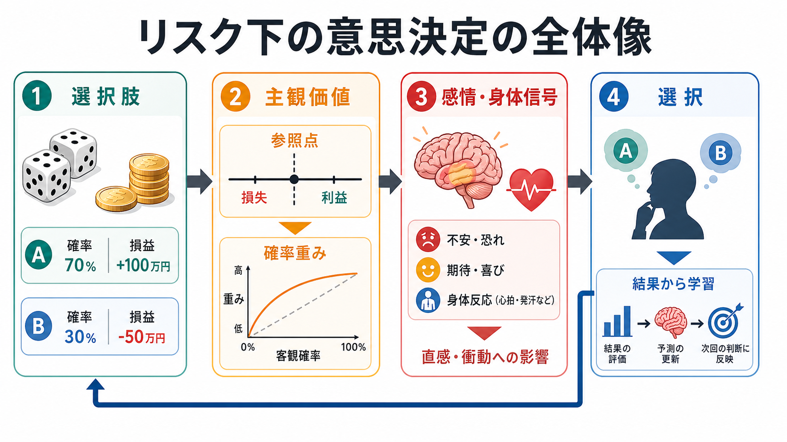
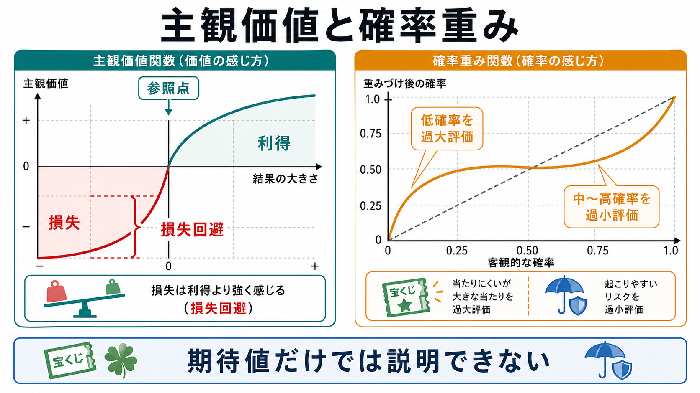
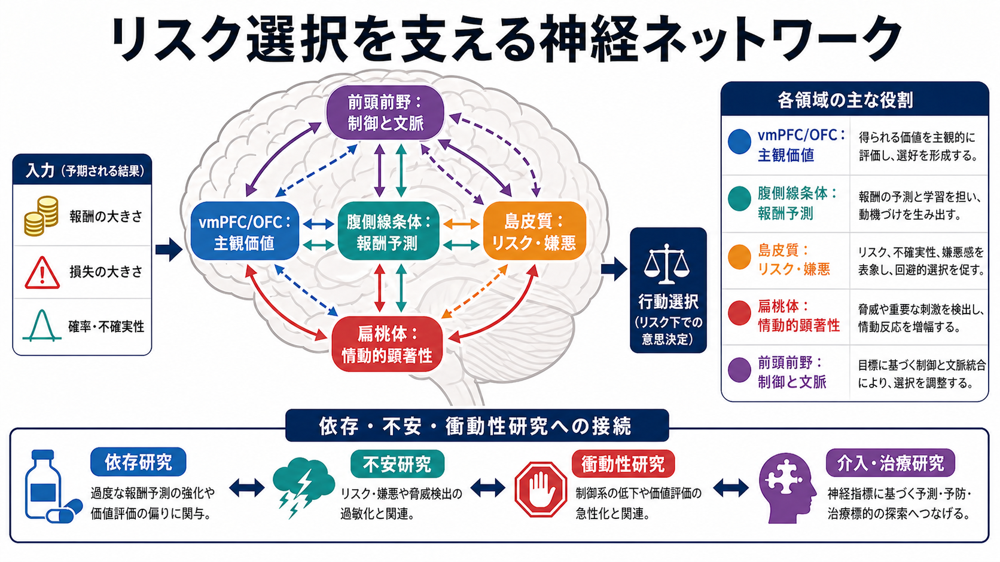

# リスク下の意思決定はどのように行われるのか

## 要点

- リスク下の意思決定とは、結果が確率的にしか決まらず、利得や損失を伴う選択である。
- 人は期待値を機械的に最大化するだけでなく、参照点、損失回避、確率重み、フレーミング、情動反応の影響を受ける。
- 神経基盤としては、vmPFC/OFC、腹側線条体、島皮質、扁桃体、前頭前野の相互作用が重要である。
- これらの知見は、依存、ギャンブル、衝動性、不安、臨床的意思決定の研究に接続するが、単一の脳領域だけで個人の選択を診断することはできない。

## この記事で答える問い

この記事では、確率と損益を伴う選択で、なぜ人が「合理的な期待値計算」から外れることがあるのかを説明する。特に、プロスペクト理論が示した認知バイアスと、価値評価・報酬予測・リスク嫌悪に関わる神経ネットワークをつなげて整理する。

## まず結論

リスク下の意思決定は、単純な期待値計算ではなく、次のような複数過程の統合として理解すると見通しがよい。第一に、選択肢の利得・損失・確率を知覚し、現在の状態や目標から参照点を作る。第二に、利得と損失を主観価値へ変換し、低確率を大きく感じたり、中から高確率を小さく感じたりする。第三に、情動・身体反応がリスクへの接近や回避を調整する。第四に、選択後の結果から価値予測を更新する[1][2][3][4]。

## 背景

リスクは「どの結果が起こるかは不確実だが、結果ごとの確率をある程度表せる」状況を指す。たとえば、70%で1万円を得る選択、30%で5万円を失う選択、治療効果と副作用の確率を比較する選択などである。古典的な期待効用理論では、各結果の効用を確率で重みづけて比較するが、実際の人間の選択はしばしばこの形式からずれる。

Kahneman と Tversky のプロスペクト理論は、このずれを記述する代表的枠組みである。重要なのは、人が最終的な富の水準そのものではなく、参照点から見た利得と損失に敏感であり、同じ大きさの利得よりも損失を強く感じやすいという点である[1]。後の累積プロスペクト理論では、確率の扱いも洗練され、結果の順位や累積確率を使って不確実な選択を表すようになった[2]。

## 基本概念

### リスクと不確実性

リスク下の意思決定では、少なくとも近似的に確率を置ける。これに対して、確率そのものがよく分からない場合は曖昧性や不確実性の問題になる。実験課題ではリスクと曖昧性を分けられるが、日常生活では混ざっていることが多い。

### 期待値と期待効用

期待値は、各結果に確率を掛けて足し合わせた平均的見込みである。しかし、人間は金額を線形に感じるとは限らない。たとえば、1万円から2万円への増加と、101万円から102万円への増加は、同じ1万円でも主観的な意味が異なる。このため、結果を主観的な効用や価値に変換する必要がある。

### 参照点

参照点とは、「ここから増えたら利得、減ったら損失」と感じる基準である。現在の所持金、期待、目標、過去の経験、提示のされ方が参照点を変える。参照点が変わると、同じ客観的結果でも利得にも損失にも見える。

### 損失回避

損失回避とは、同じ大きさの利得よりも損失を強く評価する傾向である。プロスペクト理論では、価値関数が損失側でより急になることとして表される[1][2]。このため、期待値がわずかに有利な賭けでも、損失可能性が目立つと避けられることがある。

### 確率重み

確率重みとは、客観確率をそのまま使わず、主観的な重みへ変換することを指す。典型的には、低確率の大きな当たりは過大評価されやすく、中から高確率の出来事は過小評価されやすい[2][3]。宝くじと保険がどちらも魅力的に見えるのは、この確率重みの考え方で説明しやすい。

## 仕組み

リスク下の意思決定は、少なくとも5つの段階に分けられる。これは価値ベース意思決定の神経科学でよく使われる整理とも対応する[4]。

| 段階 | 何が行われるか | 関連する認知過程 |
|---|---|---|
| 表象 | 選択肢、確率、損益、文脈を把握する | [[注意とは何か]]、[[ワーキングメモリとは何か]] |
| 価値評価 | 結果を主観価値へ変換する | 参照点、損失回避、確率重み |
| 選択 | 複数の行動価値を比較する | [[中央実行系とは何か]]、抑制、葛藤解決 |
| 結果評価 | 実際の結果を利得・損失として評価する | 報酬予測誤差、情動反応 |
| 学習 | 次回の予測や方略を更新する | 強化学習、習慣化、目標志向制御 |

### 1. 選択肢の表象

人はまず、どの選択肢があり、それぞれにどのような確率と結果が付いているかを表象する。この段階は、[[選択的注意はどのように働くのか]] や [[トップダウン注意とボトムアップ注意は何が違うのか]] と関係する。目立つ損失、最近経験した失敗、説明文の言い回しは、注意の配分を変え、以後の価値評価を偏らせる。

### 2. 主観価値への変換

客観的な金額や確率は、そのまま選択に使われるわけではない。利得・損失は参照点からの変化として評価され、確率は心理的な重みに変換される[1][2][3]。この変換により、期待値が同じ選択肢でも、確実な小利得を好む、低確率の大利得を好む、損失を取り戻すために危険な賭けへ向かう、といった行動が生じる。

### 3. 情動・身体信号の関与

リスクは冷静な計算だけでなく、予期的な興奮、不安、嫌悪、身体反応を伴う。金融リスク課題では、側坐核を含む報酬関連活動がリスク選好やリスク追求的誤りに先行し、前部島皮質の活動がリスク回避的選択やリスク回避的誤りに先行することが報告されている[5]。これは、情動が「邪魔」なだけでなく、将来の結果を身体的に予期する信号として選択を方向づける可能性を示す。

### 4. フレーミングと文脈

同じ内容でも、「200人が助かる」と表すか「400人が死亡する」と表すかで選択は変わる。フレーミング効果の fMRI 研究では、提示のされ方に影響される選択と扁桃体活動の関連が示され、フレームに抵抗する選択では前頭前野系の関与が示唆された[6]。これは、リスク判断が言語的・社会的文脈に埋め込まれていることを意味する。

### 5. 学習と更新

選択後には、実際に得られた結果と予測との差が評価される。予測より良い結果は次回の接近を促し、予測より悪い結果は回避を促す。ただし、学習は常に正確ではない。まれな大当たり、強い損失経験、直近の成功は、確率の推定や価値づけを過度に変えることがある。

## 図解

リスク下の意思決定は、価値評価系、報酬予測系、嫌悪・身体信号系、制御系のネットワークとして見ると理解しやすい。vmPFC/OFC は選択肢の主観価値を共通尺度として表す候補領域であり、腹側線条体は報酬予測や動機づけに、島皮質はリスク・不確実性・嫌悪感に、扁桃体は情動的顕著性や脅威信号に関わる[4][5][7][8]。

ただし、これらの領域は一対一対応の「ボタン」ではない。たとえば島皮質は単にリスク嫌悪だけを表すのではなく、内受容感覚、嫌悪、予測誤差、顕著性にも関与する。扁桃体も恐怖だけでなく、価値や顕著性の学習に広く関わる。したがって、脳画像の活動差は、行動データや課題構造と合わせて慎重に解釈する必要がある。

## 臨床・研究との接続

リスク下の意思決定研究は、依存、ギャンブル障害、衝動性、不安、うつ、強迫、摂食行動、医療意思決定などに接続する。たとえば依存では、即時報酬や報酬予測への過敏性、将来損失の過小評価、行動制御の弱さが問題になることがある。ギャンブルでは、低確率の大きな利得を過大評価する傾向や、損失を取り戻そうとする追跡行動が重要になる。

研究面では、行動課題、計算モデル、fMRI、EEG、眼球運動、皮膚電気反応、心拍などを組み合わせることで、どの段階で選択が偏るのかを分解できる。たとえば、損失回避が強いのか、確率重みが歪んでいるのか、報酬予測が過敏なのか、制御過程が弱いのかは、同じ「リスクを取りすぎる」行動でも異なる説明を持つ。

医療・精神医学への応用では、個人の診断や治療指示として単純化しないことが重要である。リスク選択課題は、あくまで研究・教育・仮説生成の道具であり、臨床判断には本人の生活史、症状、環境、機能障害、治療目標を統合する必要がある。

## よくある誤解

### 誤解1：リスクを取る人は非合理である

リスクを取ること自体は非合理ではない。期待値、目的、資源、時間軸、損失許容度によって、合理的なリスク選択は変わる。問題は、本人の長期目標に反して、確率や損失を系統的に見誤る場合である。

### 誤解2：期待値を計算すれば正しい選択が分かる

期待値は重要な基準だが、十分ではない。損失の影響、結果の分散、破産リスク、時間的制約、心理的負担、倫理的制約がある。実生活の選択では、期待値最大化と安全域の確保を同時に考える必要がある。

### 誤解3：感情は意思決定を乱すだけである

感情はバイアスを生むこともあるが、危険の予期、後悔の回避、価値の優先順位づけにも関わる。問題は感情の有無ではなく、情動信号が課題の情報とどの程度整合しているかである。

### 誤解4：脳活動を見ればその人の選択が分かる

神経活動は選択を理解する手がかりだが、個人の行動を単独で高精度に読むものではない。課題、解析、個人差、文脈、再現性を考慮する必要がある。

## 関連ノート

- [[注意とは何か]]
- [[選択的注意はどのように働くのか]]
- [[トップダウン注意とボトムアップ注意は何が違うのか]]
- [[ワーキングメモリとは何か]]
- [[中央実行系とは何か]]

### 関連ノート候補

- 報酬予測誤差とは何か
- プロスペクト理論とは何か
- 損失回避とは何か
- フレーミング効果とは何か
- 神経経済学とは何か
- 島皮質は意思決定にどう関わるのか

### MOC更新候補

- `content/00_MOC/` 配下の認知科学・心理学系 MOC に、本記事へのリンクを追加する。
- 計算論的精神医学・神経経済学系の MOC がある場合、リスク選択・価値ベース意思決定の入口ノートとして追加する。

## 理解チェック

1. 期待値と主観価値は何が違うか。
2. 参照点が変わると、同じ結果の評価はどのように変わるか。
3. 損失回避と確率重みは、宝くじや保険の選択をどのように説明するか。
4. vmPFC/OFC、腹側線条体、島皮質、扁桃体は、それぞれリスク選択のどの側面に関わると考えられるか。
5. 脳画像研究の結果を、個人の診断や治療判断へ直接当てはめるべきでない理由は何か。

## 未解決問題

- 損失回避や確率重みが、個人内でどの程度安定した特性なのか、状況依存的な状態なのかはまだ議論がある。
- 実験室の単純な金銭課題が、医療、対人関係、職業選択などの複雑な現実場面へどこまで一般化できるかは慎重に検討する必要がある。
- vmPFC/OFC や島皮質の活動が、価値、注意、顕著性、内受容感覚、課題難度のどれを反映しているのかは、課題設計と計算モデルによって分解する必要がある。

## 参考文献

[1] Kahneman, D., & Tversky, A. (1979). Prospect Theory: An Analysis of Decision under Risk. *Econometrica*, 47(2), 263-292. https://doi.org/10.2307/1914185

[2] Tversky, A., & Kahneman, D. (1992). Advances in Prospect Theory: Cumulative Representation of Uncertainty. *Journal of Risk and Uncertainty*, 5, 297-323. https://doi.org/10.1007/BF00122574

[3] Prelec, D. (1998). The Probability Weighting Function. *Econometrica*, 66(3), 497-527. https://doi.org/10.2307/2998573

[4] Rangel, A., Camerer, C., & Montague, P. R. (2008). A framework for studying the neurobiology of value-based decision making. *Nature Reviews Neuroscience*, 9, 545-556. https://doi.org/10.1038/nrn2357

[5] Kuhnen, C. M., & Knutson, B. (2005). The neural basis of financial risk taking. *Neuron*, 47(5), 763-770. https://doi.org/10.1016/j.neuron.2005.08.008

[6] De Martino, B., Kumaran, D., Seymour, B., & Dolan, R. J. (2006). Frames, Biases, and Rational Decision-Making in the Human Brain. *Science*, 313(5787), 684-687. https://doi.org/10.1126/science.1128356

[7] Tom, S. M., Fox, C. R., Trepel, C., & Poldrack, R. A. (2007). The Neural Basis of Loss Aversion in Decision-Making Under Risk. *Science*, 315(5811), 515-518. https://doi.org/10.1126/science.1134239

[8] Levy, D. J., & Glimcher, P. W. (2012). The root of all value: a neural common currency for choice. *Current Opinion in Neurobiology*, 22(6), 1027-1038. https://doi.org/10.1016/j.conb.2012.06.001
