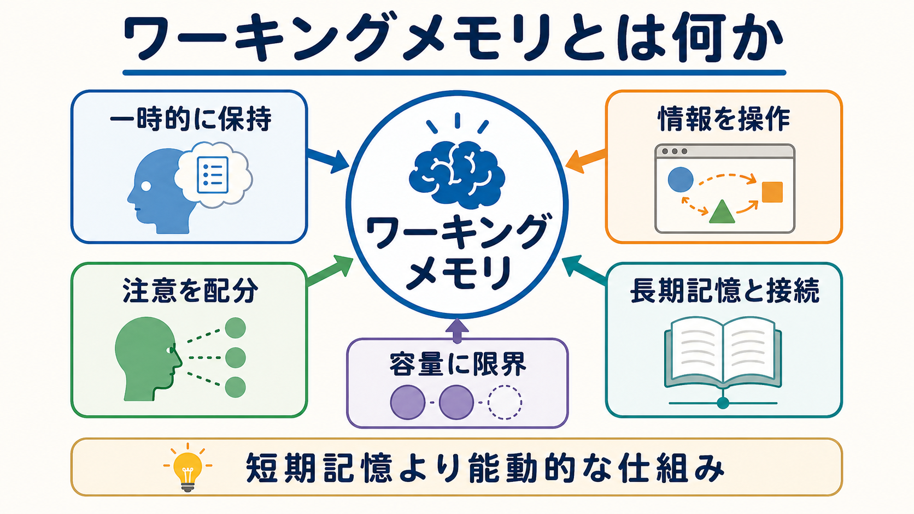
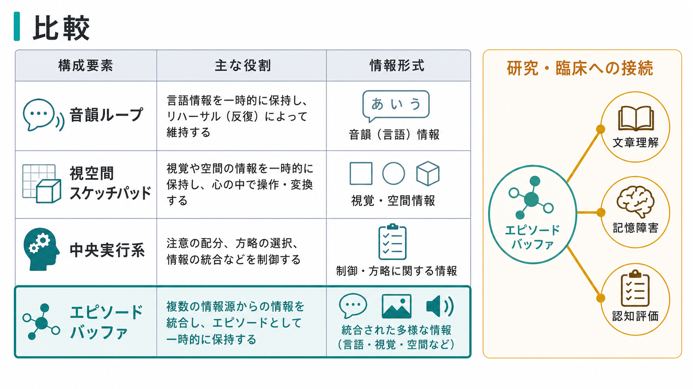
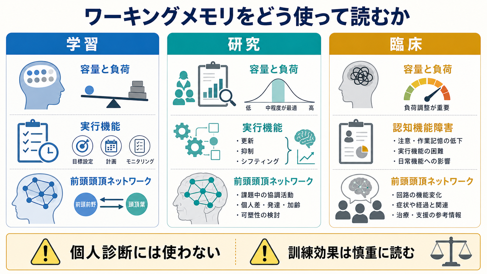

# ワーキングメモリとは何か

## 要点

- ワーキングメモリは、情報を短時間「置いておく」だけでなく、その情報を使って比較、更新、並べ替え、推論、行動選択を行う仕組みである[1][2]。
- 古典的な多成分モデルでは、中央実行系、音韻ループ、視空間スケッチパッド、エピソード・バッファが相互に働く[1][2]。
- 容量には限界があり、保持できる項目数や精度は、注意、妨害、課題方略、長期記憶の支援によって変わる[3]。
- 神経科学的には、前頭前野だけでなく、頭頂葉、感覚皮質、海馬、基底核、広域ネットワークの動的な協調として理解する必要がある[4][5]。
- 臨床や教育で重要だが、ワーキングメモリ成績だけで個人の診断や能力を決めることはできない。訓練効果も、近い課題には出やすい一方、広い生活機能への転移は慎重に読む必要がある[6][8]。

## この記事で答える問い

1. ワーキングメモリは、短期記憶と何が違うのか。
2. 中央実行系、音韻ループ、視空間スケッチパッド、エピソード・バッファは何をしているのか。
3. なぜワーキングメモリには容量の限界があるのか。
4. 研究・臨床・教育では、ワーキングメモリをどのように読めばよいのか。

## まず結論

ワーキングメモリは、「今使う情報を、目的に合わせて一時的に保ち、操作する認知の作業場」である。たとえば、電話番号を聞いて入力する、文章の前半を覚えながら後半を読む、暗算で途中結果を保持する、相手の発言を覚えながら返答を考える、といった場面で働く。

短期記憶が「短時間の保持」を強調する概念だとすれば、ワーキングメモリは「保持しながら処理する」点を強調する。Baddeley と Hitch のモデルは、この違いを明確にし、単一の短期貯蔵庫ではなく、言語情報、視空間情報、注意制御、統合バッファが分担して働くと考えた[1][2]。

ただし、ワーキングメモリは頭の中の固定された箱ではない。容量、速度、正確さは、注意の向け方、妨害刺激、課題の意味づけ、既有知識、疲労、情動、発達、疾患状態によって変わる。したがって、ワーキングメモリは「個人の能力を一発で測る指標」ではなく、現在の課題環境の中で情報をどう保持・操作しているかを見るための枠組みである。

## 背景

記憶研究では長く、感覚記憶、短期記憶、長期記憶という段階モデルが使われてきた。しかし、人間は単に情報を一時保存しているだけではない。読みながら意味を統合し、聞きながら返答を組み立て、予定を保ちながら誘惑を抑える。こうした能動的な処理を説明するために、ワーキングメモリという概念が発展した。

Baddeley と Hitch は、短期記憶を一つの貯蔵庫として扱うだけでは、推論、読解、二重課題の成績を説明しにくいと考えた[1]。後に Baddeley は、複数の情報形式を統合し、長期記憶と接続する「エピソード・バッファ」を追加した[2]。この拡張により、ワーキングメモリは、音韻情報や視空間情報をただ別々に保つだけでなく、場面、意味、順序、文脈を一時的に結びつける仕組みとして理解しやすくなった。

## 基本概念

### 短期記憶との違い

短期記憶は、情報を短時間保持する機能を指すことが多い。数字を数秒だけ覚える、直前に聞いた単語を繰り返す、といった場面が典型である。

ワーキングメモリは、それに操作を加える。途中結果を更新する、不要な情報を抑える、複数の情報を比較する、文脈に合わせて意味を変える、といった処理が含まれる。つまり、ワーキングメモリは「短期記憶 + 注意制御 + 操作」と考えると導入として分かりやすい。

### 多成分モデル

Baddeley の多成分モデルでは、主に次の要素が区別される[1][2]。

| 構成要素 | 主な役割 | 例 |
|---|---|---|
| 中央実行系 | 注意を配分し、処理方略を選び、更新や切り替えを制御する | 暗算の手順を保つ、妨害刺激を無視する |
| 音韻ループ | 言語・音声情報を一時的に保持し、反復で維持する | 電話番号を心の中で繰り返す |
| 視空間スケッチパッド | 視覚・空間情報を保持し、心的に操作する | 道順を頭の中でたどる |
| エピソード・バッファ | 複数形式の情報を統合し、長期記憶と接続する | 文章の意味や場面をまとめる |

### 容量制限

ワーキングメモリの容量は無限ではない。Cowan は、注意の焦点に同時に保持できる情報は少数に限られると整理した[3]。ただし、「何個覚えられるか」は固定値ではない。意味のまとまりを作るチャンキング、長期記憶の知識、課題の馴染み、刺激の類似性、妨害の強さで変わる。

このため、ワーキングメモリ容量を「頭のよさ」と直結させるのは粗い。むしろ、容量制限は、認知システムが限られた注意資源をどの情報へ配分するかという問題として読むほうがよい。

## 仕組み

### 保持と操作は分離しきれない

ワーキングメモリでは、保持と操作はしばしば同時に起こる。文章理解では、前の文の意味を保持しながら、新しい文を取り込み、矛盾や照応を処理する。暗算では、途中結果を保持しながら、次の演算を行う。会話では、相手の発言を保持しながら、自分の返答を計画する。

この同時性が、ワーキングメモリを単なる保存庫ではなく、[[実行機能とは何か]]や[[中央実行ネットワークとは何か]]と結びついた機能として位置づける理由である。

### 神経機構

以前は、前頭前野ニューロンの持続発火がワーキングメモリ保持の中心機構として重視された。しかし現在は、前頭前野、頭頂葉、感覚皮質、海馬、基底核などが課題に応じて協調する分散システムとして理解されることが多い[4]。記憶内容そのものは、前頭前野だけでなく、視覚情報なら視覚皮質、空間情報なら頭頂葉、意味情報なら側頭葉や長期記憶ネットワークと関係しうる。

さらに、ワーキングメモリ表象は常に強く発火し続けるとは限らない。Stokes は、神経活動として一時的に見えにくい「活動サイレント」な状態も含めて、短期保持を動的に捉える必要を論じた[5]。この見方では、ワーキングメモリは電光掲示板のように常時点灯しているのではなく、必要な瞬間に再活性化される潜在状態も含む。

この点は、[[前頭頭頂ネットワークは認知制御をどう支えるのか]]、[[リカレント回路はどのように記憶や持続活動を支えるのか]]、[[ガンマ振動は認知機能にどう関わるのか]]と接続して考えると理解しやすい。

## 図解

図1は、ワーキングメモリを「一時的に保持」「情報を操作」「注意を配分」「容量に限界」「長期記憶と接続」という5つの観点から整理している。短期記憶より能動的な仕組みとして読むのが要点である。

図2は、多成分モデルの整理である。音韻ループと視空間スケッチパッドは情報形式の違いを、中央実行系は注意制御を、エピソード・バッファは複数情報の統合と長期記憶との接続を表している[1][2]。

図3は、学習、研究、臨床での読み方を示している。ワーキングメモリは教育支援や認知評価で有用だが、個人診断の単独根拠にしたり、訓練だけで広範な能力が改善すると断定したりするのは避けるべきである[6][8]。

## 臨床・研究との接続

### 発達と学習

ワーキングメモリは、読解、計算、ノートを取りながら聞くこと、複数手順の課題遂行に関わる。Diamond は、ワーキングメモリ、抑制、認知的柔軟性を実行機能の中核として整理し、発達、学習、自己制御との関連を論じている[6]。

学習支援では、「もっと集中して」と言うだけでは不十分である。手順を外に書き出す、課題を小さく分ける、妨害刺激を減らす、視覚的な手がかりを使う、既有知識と結びつける、といった環境調整が、ワーキングメモリ負荷を下げる。

### 精神医学・神経心理学

統合失調症、ADHD、うつ病、認知症、外傷性脳損傷などでは、ワーキングメモリや実行機能の困難が生活機能に影響することがある。統合失調症では、ワーキングメモリを含む認知機能障害が社会機能と強く関係することが繰り返し示されてきた[7]。ただし、これは個別診断をワーキングメモリ検査だけで行えるという意味ではない。症状、発達歴、生活状況、薬剤、睡眠、身体疾患、教育歴を含めて総合的に評価する必要がある。

この観点は、[[認知機能障害は統合失調症でなぜ重要なのか]]、[[ADHDは前頭線条体回路の障害として説明できるのか]]、[[前頭前野は情動制御にどう関わるのか]]とも関連する。

### ワーキングメモリ訓練

ワーキングメモリ訓練は、訓練した課題や似た課題には改善が出ることがある。しかし、読解、学業、知能、日常機能など広い領域へ安定して転移するかは議論がある。Melby-Lervag らのメタ解析は、訓練効果の解釈には、近い転移と遠い転移、対照条件、出版バイアス、長期追跡を区別する必要があることを示している[8]。

したがって、訓練を読むときは「どの課題が改善したのか」「訓練していない能力へ移ったのか」「どれくらい持続したのか」を分けて確認する。

## よくある誤解

### 誤解1: ワーキングメモリは短期記憶と同じである

短期保持は含まれるが、それだけではない。ワーキングメモリは、保持した情報を目標に合わせて操作し、更新し、不要な情報を抑える機能を含む。

### 誤解2: 容量は固定された個人能力である

容量には個人差があるが、課題、方略、疲労、意味づけ、長期記憶の支援によって変わる。容量だけを切り出して「能力そのもの」と読むのは単純化しすぎである。

### 誤解3: 前頭前野だけがワーキングメモリを担う

前頭前野は重要だが、内容表象、注意制御、更新、行動選択は広いネットワークで支えられる。[[脳内ネットワークとは何か]]や[[機能的結合解析とは何か]]の観点が役立つ。

### 誤解4: ワーキングメモリ訓練であらゆる認知機能が改善する

訓練効果は課題近傍では見えやすいが、遠い転移は限定的または不安定である[8]。教育・臨床では、訓練単体よりも環境調整、方略学習、動機づけ、睡眠、情動負荷の軽減と組み合わせて考える必要がある。

## 関連ノート

- [[中央実行ネットワークとは何か]]
- [[前頭頭頂ネットワークは認知制御をどう支えるのか]]
- [[リカレント回路はどのように記憶や持続活動を支えるのか]]
- [[ガンマ振動は認知機能にどう関わるのか]]
- [[アセチルコリンは注意や記憶にどう関わるのか]]
- [[認知機能障害は統合失調症でなぜ重要なのか]]
- [[ADHDは前頭線条体回路の障害として説明できるのか]]
- [[海馬回路は記憶をどう形成するのか]]

## 理解チェック

1. ワーキングメモリと短期記憶の違いを、「保持」と「操作」という語を使って説明できるか。
2. 音韻ループ、視空間スケッチパッド、中央実行系、エピソード・バッファは、それぞれ何を担うか。
3. ワーキングメモリ容量が固定値として扱いにくい理由は何か。
4. ワーキングメモリ訓練の効果を読むとき、近い転移と遠い転移を分ける必要があるのはなぜか。
5. ワーキングメモリ検査を個人診断の単独根拠にしてはいけない理由は何か。

## MOC更新候補

- `content/00_MOC/MOC｜認知科学・心理学.md` の「注意とワーキングメモリ」周辺に本記事を追加する。
- `content/00_MOC/MOC｜脳・神経科学.md` の認知制御・前頭頭頂ネットワーク関連項目から参照する。

## 未解決問題

- ワーキングメモリ表象のうち、持続発火、短いバースト、活動サイレント状態がどの課題でどの程度寄与するのか。
- 容量制限は、項目数、精度、注意資源、干渉、長期記憶の利用をどのように統合して説明できるのか。
- 訓練、教育支援、環境調整のどの組み合わせが、日常生活の機能改善へ最も安定して結びつくのか。

## 参考文献

[1] Baddeley, A. D., & Hitch, G. (1974). Working memory. *Psychology of Learning and Motivation*, 8, 47-89. https://doi.org/10.1016/S0079-7421(08)60452-1

[2] Baddeley, A. (2000). The episodic buffer: a new component of working memory? *Trends in Cognitive Sciences*, 4(11), 417-423. https://doi.org/10.1016/S1364-6613(00)01538-2

[3] Cowan, N. (2001). The magical number 4 in short-term memory: a reconsideration of mental storage capacity. *Behavioral and Brain Sciences*, 24(1), 87-114. https://doi.org/10.1017/S0140525X01003922

[4] D'Esposito, M., & Postle, B. R. (2015). The cognitive neuroscience of working memory. *Annual Review of Psychology*, 66, 115-142. https://doi.org/10.1146/annurev-psych-010814-015031

[5] Stokes, M. G. (2015). Activity-silent working memory in prefrontal cortex: a dynamic coding framework. *Trends in Cognitive Sciences*, 19(7), 394-405. https://doi.org/10.1016/j.tics.2015.05.004

[6] Diamond, A. (2013). Executive functions. *Annual Review of Psychology*, 64, 135-168. https://doi.org/10.1146/annurev-psych-113011-143750

[7] Forbes, N. F., Carrick, L. A., McIntosh, A. M., & Lawrie, S. M. (2009). Working memory in schizophrenia: a meta-analysis. *Psychological Medicine*, 39(6), 889-905. https://doi.org/10.1017/S0033291708004558

[8] Melby-Lervag, M., Redick, T. S., & Hulme, C. (2016). Working memory training does not improve performance on measures of intelligence or other measures of far transfer: evidence from a meta-analytic review. *Perspectives on Psychological Science*, 11(4), 512-534. https://doi.org/10.1177/1745691616635612
