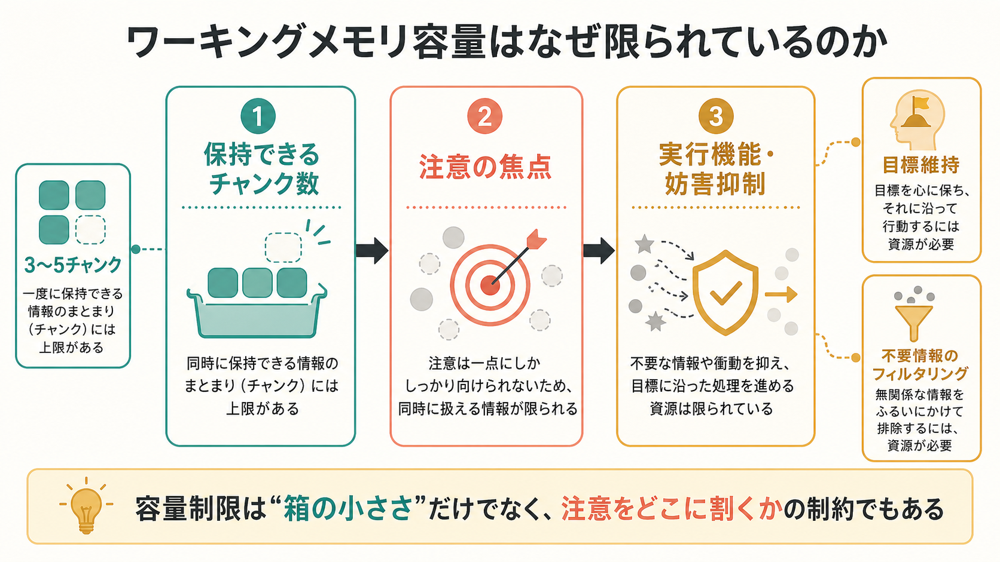
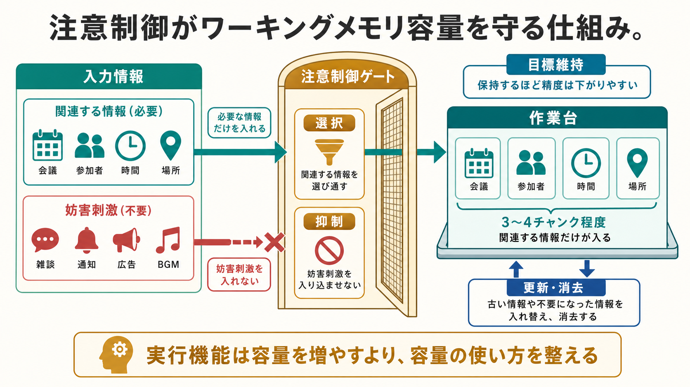

# ワーキングメモリ容量はなぜ限られているのか

## 要点

- ワーキングメモリは、情報を短時間保つだけでなく、目標に沿って操作・更新するための仕組みである[1]。
- 容量制限は「小さな箱に何個入るか」だけではなく、チャンク化、注意の焦点、妨害刺激の抑制、表象の精度の制約が重なって生じる[2][4]。
- 成人の中心的な容量は、条件を統制すると3〜5チャンク程度と見積もられることが多い[2]。
- 視覚ワーキングメモリでは、およそ3〜4個の対象を保持できるという結果が古典的に示されてきたが、近年は「固定スロット」だけでなく「限られた資源を精度に配分する」見方も重視される[3][4]。
- 個人差は、単なる保存容量だけでなく、課題関連情報を選び、不要情報を入れない注意制御の効率とも関係する[6][7]。

## この記事で答える問い

ワーキングメモリ容量は、なぜ無限ではないのだろうか。情報をたくさん入れればよいだけなら、脳は「一時保存用の大きな棚」を用意すればよさそうに見える。しかし実際の認知では、覚えておくこと、無視すること、更新すること、反応を選ぶことが同時に起こる。

この記事では、次の問いに答える。

1. ワーキングメモリ容量は何を数えているのか。
2. なぜ「7個」ではなく「3〜5チャンク」と言われることが多いのか。
3. 注意・実行機能は容量制限とどう関係するのか。
4. 容量制限は神経活動や臨床・研究の問題とどう接続するのか。

## まず結論

ワーキングメモリ容量が限られる主な理由は、脳が一時的に保持できる表象の数に上限があるだけでなく、その表象を目標に合わせて選び、妨害から守り、必要に応じて更新するための制御資源も限られているからである。Baddeleyの古典的モデルでは、ワーキングメモリは音韻ループ、視空間スケッチパッド、中央実行系などから成る限定容量システムとして整理された[1]。この見方は、「保持」と「制御」を分けて考える出発点になる。

ただし、容量は単純な個数ではない。Cowanは、リハーサルや長期記憶による再符号化をできるだけ除くと、中心的な短期保持容量は約4チャンク、広くは3〜5チャンク程度に収まると論じた[2]。ここでいうチャンクとは、意味のまとまりとして扱われる単位である。たとえば「1、9、8、4」を4個の数字として覚えるのと、「1984」という年号として覚えるのでは、同じ刺激でも容量の使い方が違う。

さらに、視覚ワーキングメモリ研究では、保持できる対象数に上限があるというスロット的な見方と、限られた資源を多くの対象へ分配すると各表象の精度が落ちるという資源モデルの見方が併存している[3][4]。したがって、ワーキングメモリ容量は「何個まで入るか」と「どれだけ正確に保てるか」の両方で理解する必要がある。

## 背景

ワーキングメモリは、電話番号を一時的に覚える、暗算の途中結果を保つ、文章の前半を保ちながら後半を読む、会話で相手の意図を追う、といった行為に関わる。短期記憶と重なるが、短期記憶が「短時間の保持」に重点を置くのに対し、ワーキングメモリは保持した情報を現在の課題のために使う点が重要である[1]。

歴史的には、Millerの「7±2」が有名だが、これは容量の厳密な定数というより、複数の課題で見られる処理限界を印象的にまとめた表現だった。Cowanの再検討は、再符号化、リハーサル、長期記憶の助けを取り除くと、より小さな中核容量が見えてくることを強調した[2]。このため、現代の議論では「人は7個覚えられる」と丸暗記するより、「条件によって変わるが、注意の焦点に置ける意味単位は少ない」と捉える方が正確である。

この制限は、[[前頭頭頂ネットワークは認知制御をどう支えるのか|前頭頭頂ネットワーク]]や前頭前野の機能とも関係する。課題目標を保つ、妨害刺激を抑える、反応を切り替える、保持内容を更新する、といった過程は、単なる保存ではなく認知制御である[7]。また、覚醒や入力選択に関わる[[アセチルコリンは注意や記憶にどう関わるのか|アセチルコリン]]などの神経修飾系も、注意と記憶の効率に影響する。

## 基本概念

### チャンク

チャンクとは、複数の要素をひとまとまりとして扱う単位である。電話番号を「0、9、0、...」と一桁ずつ覚えるより、区切りごとにまとまりとして覚える方が楽なのは、個々の数字を大きな単位へ再符号化しているからである。容量制限を議論するときは、物理的な刺激数ではなく、本人がどの単位で情報を表象しているかを見る必要がある[2]。

### 注意の焦点

注意の焦点は、いま処理の中心に置かれている少数の情報を指す。多くの情報が感覚入力や長期記憶に存在していても、同時に精密に操作できる情報は限られる。ワーキングメモリ容量は、この焦点化された表象の限界と深く関係する[2]。

### 実行機能

実行機能は、目標維持、抑制、更新、切り替え、モニタリングなどの制御過程をまとめた概念である。ワーキングメモリ課題では、ただ情報を保つだけでなく、「いま必要な情報だけを残す」「古くなった情報を捨てる」「妨害刺激を入れない」ことが必要になる。KaneとEngleは、ワーキングメモリ容量の個人差を、前頭前野を含む実行的注意の個人差として整理した[7]。

## 仕組み

### 1. 保持できる単位数が少ない

まず、短時間に明瞭に保持できる意味単位そのものが少ない。Cowanのレビューは、中心的な短期保持容量が約4チャンクに収まりやすいことを示す多様な証拠を整理している[2]。LuckとVogelの視覚ワーキングメモリ研究も、色や方位のような特徴を持つ対象について、およそ4対象という上限を示した[3]。

この「少なさ」は欠陥ではない。課題に関係する情報だけを高い優先度で保つには、すべてを同じ強さで保持しない方がよい。多すぎる表象を同時に活性化すると、相互干渉が増え、どれが現在の目標に関係するのかが曖昧になる。

### 2. 数だけでなく精度も下がる

容量制限は、対象数だけで測れるとは限らない。Ma、Husain、Baysは、ワーキングメモリを固定数のスロットではなく、限られた資源を複数の表象へ分配する仕組みとして捉える見方を整理した[4]。この場合、覚える対象が増えるほど「覚えているか、いないか」だけでなく、色、位置、方向などの精度が下がる。

たとえば、2個の色を覚えるときはかなり正確に再現できても、6個の色を覚えると各色の記憶がぼやける。これは、容量制限が「保存失敗」だけでなく「表象の解像度低下」として現れることを意味する。

### 3. 不要情報が容量を消費する

ワーキングメモリ容量は、入れた情報の数だけでなく、何を入れないかにも左右される。Vogelらは、不要刺激を排除する効率の個人差がワーキングメモリ容量と関係することを、神経指標を用いて示した[6]。容量が低い人は、必要な情報が少ないから成績が低いのではなく、無関係な情報まで保持してしまい、使える容量を消費している場合がある。

この点は、日常的にも重要である。会議で発言内容を追うとき、通知音、周囲の会話、別件の心配が作業台に入り込むと、保持すべき論点が押し出される。ワーキングメモリ容量は、情報を増やす能力だけでなく、情報を絞る能力でもある。

### 4. 神経活動にも上限が現れる

VogelとMachizawaは、視覚記憶の保持に関わる脳活動が保持対象数に応じて増えるが、個人の容量上限に近づくと頭打ちになることを示した[5]。この結果は、容量制限が主観的な印象や行動成績だけでなく、神経活動の飽和としても観察できる可能性を示す。

ただし、神経指標は「容量メーター」そのものではない。課題、刺激、注意配分、測定法によって解釈は変わる。重要なのは、ワーキングメモリ容量が行動、注意制御、神経活動の複数レベルで検討できる研究対象だという点である。

## 図解

図1は、ワーキングメモリ容量制限を「保持できるチャンク数」「注意の焦点」「実行機能・妨害抑制」の3つに分けて整理した概念地図である。容量制限を箱の大きさだけでなく、注意をどこに割くかの制約として見るための図である。

図2は、注意制御ゲートが関連情報を選び、妨害刺激を排除し、作業台に3〜4チャンク程度の情報を保持する流れを示している。ここでの実行機能は、容量そのものを魔法のように増やすのではなく、限られた容量の使い方を整える役割を担う。

## 臨床・研究との接続

研究では、ワーキングメモリ容量は知能、読解、推論、学習、注意制御と関連する重要な個人差指標として扱われる。Unsworthらは、ワーキングメモリと流動性知能の関係について、容量、注意制御、二次記憶検索がそれぞれ寄与することを潜在変数解析で示した[8]。つまり、ワーキングメモリ課題の成績は、単一の「保存箱の大きさ」だけで説明しきれない。

臨床・教育場面では、ADHD、統合失調症、うつ病、睡眠不足、加齢、神経発達症などで注意制御やワーキングメモリの問題が語られることが多い。たとえば[[ADHDは前頭線条体回路の障害として説明できるのか|ADHD]]では、目標維持、妨害刺激への脆弱性、課題切り替えの困難がワーキングメモリ課題の成績に影響しうる。ただし、ワーキングメモリ容量の低さだけで個別の診断や治療方針を決めることはできない。症状、生活状況、発達歴、併存症、睡眠、薬物、ストレスなどを含めて評価する必要がある。

神経科学的には、前頭前野、頭頂葉、視覚野、[[リカレント回路はどのように記憶や持続活動を支えるのか|リカレント回路]]、[[ガンマ振動は認知機能にどう関わるのか|神経振動]]などが関連候補になる。ただし、単一部位が容量を決めるというより、課題目標、感覚表象、注意制御、記憶検索を結ぶネットワークとして考える方が自然である。

## よくある誤解

### 誤解1: ワーキングメモリ容量は「7個」で固定されている

7±2は有名だが、厳密な保存容量の定数ではない。リハーサル、チャンク化、長期記憶の利用をどの程度許すかで成績は大きく変わる。中核的な短期保持容量を考えると、3〜5チャンク程度という見方が重要になる[2]。

### 誤解2: 容量が大きい人は、何でも多く詰め込める

容量の高い人は、不要情報をよりよく排除している可能性がある[6]。つまり、良い成績は「たくさん入れる」だけでなく、「余計なものを入れない」ことで生じる。

### 誤解3: 訓練すれば容量そのものが大きく伸びる

訓練で特定課題への慣れ、方略、チャンク化、注意配分は改善しうる。しかし、それが一般的な容量そのものの大幅な増加を意味するとは限らない。改善が近い課題に限られるのか、広い認知能力へ転移するのかを分けて考える必要がある。

### 誤解4: ワーキングメモリ容量は脳の保存領域だけで決まる

保持表象は感覚野や連合野とも関係し、制御は前頭頭頂ネットワークや実行的注意と関係する。容量制限は、保存場所の問題だけでなく、目標維持、選択、抑制、更新を含むネットワーク全体の問題である[7]。

## 関連ノート

- [[前頭頭頂ネットワークは認知制御をどう支えるのか]]
- [[アセチルコリンは注意や記憶にどう関わるのか]]
- [[リカレント回路はどのように記憶や持続活動を支えるのか]]
- [[ガンマ振動は認知機能にどう関わるのか]]
- [[ADHDは前頭線条体回路の障害として説明できるのか]]
- [[認知機能障害は統合失調症でなぜ重要なのか]]

### 関連ノート候補

- 作業記憶とは何か
- 注意制御とは何か
- 実行機能とは何か
- チャンク化とは何か
- 視覚ワーキングメモリとは何か

### MOC更新候補

- `content/00_MOC/MOC｜認知科学・心理学.md` の「認知機能」関連項目に本記事を追加する。
- 並列実行時の競合を避けるため、このジョブではMOC本文は更新しない。

## 理解チェック

1. ワーキングメモリ容量を「物理的な刺激数」ではなく「チャンク数」で考える理由を説明できるか。
2. スロットモデルと資源モデルは、容量制限をそれぞれどのように捉えるか。
3. 不要情報のフィルタリングが失敗すると、なぜ見かけ上の容量が下がるのか。
4. ワーキングメモリ容量の個人差を、実行的注意や前頭前野機能と結びつけて説明できるか。

## 参考文献

[1] Baddeley, A. (2003). Working memory: Looking back and looking forward. *Nature Reviews Neuroscience*, 4, 829-839. https://doi.org/10.1038/nrn1201

[2] Cowan, N. (2001). The magical number 4 in short-term memory: A reconsideration of mental storage capacity. *Behavioral and Brain Sciences*, 24(1), 87-185. https://doi.org/10.1017/S0140525X01003922

[3] Luck, S. J., & Vogel, E. K. (1997). The capacity of visual working memory for features and conjunctions. *Nature*, 390, 279-281. https://doi.org/10.1038/36846

[4] Ma, W. J., Husain, M., & Bays, P. M. (2014). Changing concepts of working memory. *Nature Neuroscience*, 17, 347-356. https://doi.org/10.1038/nn.3655

[5] Vogel, E. K., & Machizawa, M. G. (2004). Neural activity predicts individual differences in visual working memory capacity. *Nature*, 428, 748-751. https://doi.org/10.1038/nature02447

[6] Vogel, E. K., McCollough, A. W., & Machizawa, M. G. (2005). Neural measures reveal individual differences in controlling access to working memory. *Nature*, 438, 500-503. https://doi.org/10.1038/nature04171

[7] Kane, M. J., & Engle, R. W. (2002). The role of prefrontal cortex in working-memory capacity, executive attention, and general fluid intelligence: An individual-differences perspective. *Psychonomic Bulletin & Review*, 9, 637-671. https://doi.org/10.3758/BF03196323

[8] Unsworth, N., Fukuda, K., Awh, E., & Vogel, E. K. (2014). Working memory and fluid intelligence: Capacity, attention control, and secondary memory retrieval. *Cognitive Psychology*, 71, 1-26. https://doi.org/10.1016/j.cogpsych.2014.01.003

## 未解決問題

- ワーキングメモリ容量の上限は、固定スロット、連続資源、注意制御、長期記憶検索のどの組み合わせとして最もよく説明できるのか。
- 容量訓練の効果は、課題方略の改善、注意制御の改善、表象精度の改善のどれを主に反映するのか。
- 精神疾患や神経発達症で観察されるワーキングメモリ困難は、保存容量、妨害抑制、覚醒、動機づけ、処理速度のどの層に由来するのか。
