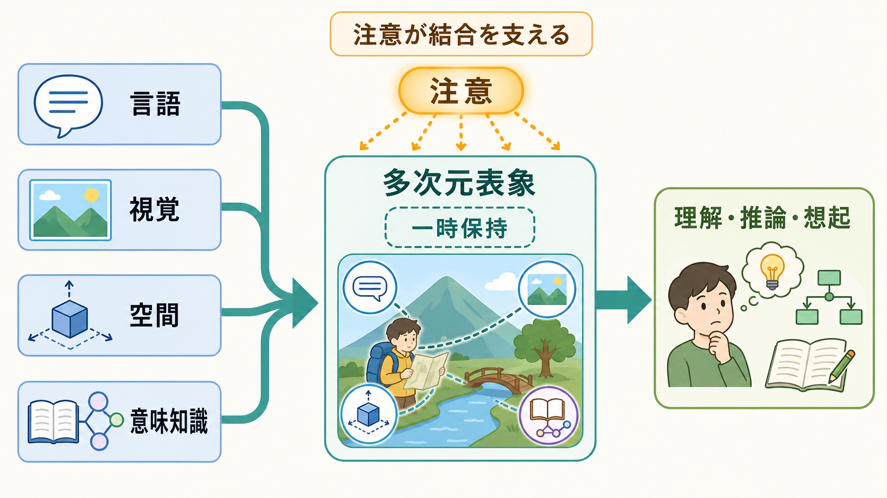

# 中央実行系とは何か

## 要点

- 中央実行系とは、ワーキングメモリの中で「何に注意を向け、何を抑え、どの情報を更新し、どの課題へ切り替えるか」を調整する中核的な制御機能である[1][2]。
- Baddeley と Hitch の多成分モデルでは、中央実行系は音韻ループや視空間スケッチパッドを直接「保存庫」として持つのではなく、それらの働きを配分・調整する監督システムとして置かれた[1]。
- ただし、中央実行系は単一の小人のような司令塔ではない。二重課題の調整、選択的注意、干渉抑制、検索方略の切り替え、情報の操作など、複数の制御過程を束ねる作業仮説として理解するのがよい[2][5]。
- 現代的には、実行機能の「更新」「抑制」「シフティング」は相互に関連しながらも分けて測定できるとされ、中央実行系はこれらの上位概念と重なる[4][5]。
- 神経基盤としては、前頭前野だけでなく頭頂葉を含む前頭前野・頭頂葉ネットワークが、目標や文脈に応じたトップダウン制御を支えると考えられる[6][7]。
- 医療・臨床文脈では、中央実行系の弱さを診断名そのものとして扱うのではなく、注意、作業記憶、切り替え、抑制、日常機能の困難を整理する「機能の見取り図」として使うのが安全である[5]。

## この記事で答える問い

1. 中央実行系は、ワーキングメモリの中で何をしているのか。
2. 音韻ループ、視空間スケッチパッド、エピソード・バッファとはどう違うのか。
3. 注意制御、課題切り替え、抑制、情報更新はどのように関係するのか。
4. 研究や臨床では、中央実行系という概念をどのように使えばよいのか。

## まず結論

中央実行系は、情報をたくさん保存する「容量そのもの」ではなく、限られた容量をどう使うかを決める制御機能である。たとえば会議中に発言内容を聞き、前の議題を覚え、余計な通知を無視し、必要なら別の論点へ切り替えるとき、単なる短期保存だけでは足りない。ここでは、目標を保ち、関連する情報を選び、不要な情報を抑え、状況に応じて保持内容を更新する制御が必要になる。この調整役を、ワーキングメモリモデルでは中央実行系と呼ぶ[1][2]。

ただし、中央実行系を脳内の一箇所にある「司令室」と考えると誤解しやすい。Baddeley 自身も、中央実行系は強力だが曖昧な概念であり、二重課題、選択的注意、方略切り替え、長期記憶内情報の操作などに分解して研究する必要があると述べている[2]。したがって、中央実行系は単一部品ではなく、課題に応じて協調する複数の制御過程の束として読むのが実用的である。

## 背景

短期記憶を単なる一時保存庫とみなすだけでは、読解、暗算、会話、計画、問題解決のような複雑な認知活動を説明しにくい。Baddeley と Hitch は、短期記憶をより能動的なシステムとして捉え直し、ワーキングメモリを「中央実行系」「音韻ループ」「視空間スケッチパッド」からなる多成分モデルとして提案した[1]。その後、複数の情報形式を一時的に結びつける構成要素としてエピソード・バッファが追加され、モデルは言語理解、視空間課題、学習、発達、神経心理学へ応用されてきた[3]。

このモデルで重要なのは、保存と制御を分けて考える点である。音韻ループは言語・音声情報の一時保持に、視空間スケッチパッドは視覚・空間情報の一時保持と操作に、エピソード・バッファは複数の情報源を統合した表象に関わる。一方、中央実行系は、それらの下位システムを「いつ、どれだけ、何のために使うか」を制御する[1][3]。

## 基本概念

### 中央実行系は「保存」より「制御」に近い

中央実行系は、ワーキングメモリ内の情報を直接ため込む容器ではない。むしろ、どの情報を作業台に載せるか、どの情報を降ろすか、どの処理へ注意資源を配分するかを決める機能である[2]。会話を聞きながらメモを取る、料理中に手順を切り替える、計算途中で不要な数字を消すといった行為では、保持だけでなく制御が必要になる。

### 実行機能との関係

実行機能は、目標に沿って思考と行動を調整する広い概念である。Diamond は、中核的な実行機能として抑制、ワーキングメモリ、認知的柔軟性を挙げ、それらの上に推論、問題解決、計画などが成り立つと整理している[5]。中央実行系は、このうちワーキングメモリ内の注意制御と操作に強く関わる概念であり、実行機能全体と同一ではないが大きく重なる。

Miyake らの潜在変数研究は、実行機能が完全に一枚岩ではなく、「更新」「抑制」「シフティング」が互いに相関しつつも分離可能であることを示した[4]。これは、中央実行系を一つの万能機能として扱うより、複数の制御成分へ分けて考える方が研究上も有益であることを示している。

### 監督的注意システムとの関係

中央実行系の理解には、Norman と Shallice の監督的注意システムも関係する。よく慣れた行動は自動的に進みやすいが、新奇な状況、葛藤、エラー、計画、抑制が必要な場面では、より意図的な制御が必要になる[2]。中央実行系は、このような「自動処理だけでは足りない場面」で働く注意制御の枠組みとして読める。

## 仕組み

中央実行系の働きは、次の5つに分けると理解しやすい。

1. **目標保持**: いま何を達成しようとしているかを保つ。読解なら「この段落の論点をつかむ」、会議なら「決定事項を記録する」といった目標である。
2. **入力選択**: 目標に関係する情報を選ぶ。必要な発言、数字、場所、手順を作業台へ載せる。
3. **干渉抑制**: 目標と関係しない刺激や反応を抑える。通知、雑談、連想、習慣的反応をそのまま入れない。
4. **情報更新**: 古くなった情報を入れ替える。予定変更、新しい条件、直前のエラーを反映する。
5. **反応選択とモニタリング**: どの行動を出すか選び、結果を見て修正する。

神経科学的には、前頭前野は課題目標やルールを保持し、関連する感覚・記憶・運動表象にトップダウンのバイアスをかけると考えられる[6]。ただし、これは前頭前野だけで完結するという意味ではない。頭頂葉を含む広いネットワークが、課題要求に応じて協調し、入力選択、維持、操作、反応選択を支える[7]。したがって、中央実行系の脳基盤は「前頭葉の単独機能」ではなく、前頭前野・頭頂葉ネットワークを中心とする分散的な制御システムとして捉える方がよい。

## 図解

図1は、ワーキングメモリ内で中央実行系が音韻ループ、視空間スケッチパッド、エピソード・バッファを調整する位置づけを示している。図2は、必要な情報を選び、妨害刺激を抑え、作業台の内容を更新する注意制御ゲートとして中央実行系を表している。図3は、中央実行系を研究、日常、支援の3つの視点へ接続したものである。

## 臨床・研究との接続

中央実行系は、神経心理学、発達研究、精神医学研究、教育支援で有用な見取り図になる。たとえば、課題fMRIでは、作業記憶負荷や課題切り替えに伴う前頭前野・頭頂葉活動を調べることがある。関連する計測の理解には、[[課題fMRIでは何を比較しているのか]]、[[fMRIは神経活動を直接測っているのか]]、[[BOLD信号とは何か]]が役立つ。

精神医学や臨床心理の文脈では、注意の持続、作業記憶、抑制、柔軟な切り替えの困難が日常機能に影響することがある。ただし、中央実行系の低下だけで個別の診断や治療方針を決めることはできない。教育・研究目的では、[[認知機能障害は統合失調症でなぜ重要なのか]]のように、診断名ではなく認知機能と生活機能の接点を丁寧に見る必要がある。

研究指標としては、二重課題、ランダム生成、ストループ課題、タスクスイッチング、N-back、複雑スパン課題などが用いられる。ただし、どの課題も中央実行系だけを純粋に測るわけではない。課題成績は、知覚、運動、処理速度、動機づけ、疲労、言語能力、方略、測定環境の影響を受ける。[[P300とは何を反映しているのか]]や[[NIRSは精神医学研究でどう使われるのか]]のような指標を使う場合も、単一指標を過剰に解釈しないことが重要である。

支援に応用するなら、中央実行系を「本人の努力不足」の説明に使うのではなく、環境設計の手がかりにする。手順を外に出す、選択肢を減らす、作業時間を短く区切る、通知や騒音を減らす、切り替えの合図を明確にする、メモやチェックリストを使う、といった工夫は、中央実行系にかかる負荷を下げる方法として理解できる[5]。

## よくある誤解

### 誤解1: 中央実行系は脳の中の一つの場所である

中央実行系は、単一の脳部位名ではない。前頭前野は重要だが、実際の制御は頭頂葉、感覚野、運動系、記憶系との相互作用で成り立つ[6][7]。

### 誤解2: 中央実行系が強いほど記憶容量が大きい

中央実行系は、容量そのものを増やすというより、限られた容量の使い方を整える。不要な情報を入れない、必要な情報を更新する、外部メモを使うといった工夫は、保存容量を増やすよりも制御負荷を下げる。

### 誤解3: 中央実行系は実行機能と完全に同じである

中央実行系は実行機能と重なるが、実行機能全体を指すわけではない。実行機能には、抑制、ワーキングメモリ、認知的柔軟性、計画、問題解決など広い範囲が含まれる[5]。

### 誤解4: 中央実行系の困難は本人の意志の弱さである

注意を保てない、切り替えが苦手、妨害刺激に引き込まれやすい、といった困難は、意志だけで説明できない。課題構造、環境、疲労、睡眠、情動、発達特性、神経疾患、精神疾患など複数の要因が関わる。個別の評価や支援では、単純な性格判断ではなく機能と環境の相互作用を見る必要がある。

## 関連ノート

- [[課題fMRIでは何を比較しているのか]]
- [[fMRIは神経活動を直接測っているのか]]
- [[BOLD信号とは何か]]
- [[P300とは何を反映しているのか]]
- [[NIRSは精神医学研究でどう使われるのか]]
- [[認知機能障害は統合失調症でなぜ重要なのか]]

## MOC更新候補

- `content/00_MOC/MOC｜認知科学・心理学.md`
- `content/00_MOC/MOC｜脳・神経科学.md`
- `content/00_MOC/MOC｜精神医学.md`

並列ジョブとの競合を避けるため、このノートではMOC本文の直接更新は行わない。

## 理解チェック

1. 中央実行系を「記憶容量」ではなく「容量の使い方を整える機能」と見ると、どのような日常例が説明しやすくなるか。
2. 音韻ループ、視空間スケッチパッド、エピソード・バッファと中央実行系の役割の違いは何か。
3. 実行機能の「更新」「抑制」「シフティング」は、中央実行系のどの働きと関係するか。
4. 中央実行系を前頭前野だけに局在化して説明すると、何が見落とされるか。
5. 臨床・教育支援で、中央実行系の概念を「診断名」ではなく「機能の見取り図」として使う利点は何か。

## 未解決問題

- 中央実行系を、単一の統合的な制御機能として扱うべきか、複数の相互作用する制御過程の集合として扱うべきかは、現在も理論的に重要な論点である[2][4]。
- 実験課題で測られる「実行機能」と、日常生活で現れる計画・切り替え・自己調整の困難がどの程度一致するかには限界がある。
- 前頭前野・頭頂葉ネットワークの活動差を、個人の能力差、発達差、臨床症状、支援方針へどのように橋渡しするかは慎重な検討が必要である[7]。

## 参考文献

[1] Baddeley, A. D., & Hitch, G. J. (1974). Working memory. In G. H. Bower (Ed.), *The Psychology of Learning and Motivation*, 8, 47-89. Academic Press. https://doi.org/10.1016/S0079-7421(08)60452-1

[2] Baddeley, A. (1996). Exploring the central executive. *The Quarterly Journal of Experimental Psychology Section A*, 49(1), 5-28. https://doi.org/10.1080/713755608

[3] Hitch, G. J., Allen, R. J., & Baddeley, A. D. (2025). The multicomponent model of working memory fifty years on. *Quarterly Journal of Experimental Psychology*, 78(2), 222-239. https://doi.org/10.1177/17470218241290909

[4] Miyake, A., Friedman, N. P., Emerson, M. J., Witzki, A. H., Howerter, A., & Wager, T. D. (2000). The unity and diversity of executive functions and their contributions to complex "frontal lobe" tasks: A latent variable analysis. *Cognitive Psychology*, 41(1), 49-100. https://doi.org/10.1006/cogp.1999.0734

[5] Diamond, A. (2013). Executive functions. *Annual Review of Psychology*, 64, 135-168. https://doi.org/10.1146/annurev-psych-113011-143750

[6] Miller, E. K., & Cohen, J. D. (2001). An integrative theory of prefrontal cortex function. *Annual Review of Neuroscience*, 24, 167-202. https://doi.org/10.1146/annurev.neuro.24.1.167

[7] Duncan, J. (2010). The multiple-demand (MD) system of the primate brain: Mental programs for intelligent behaviour. *Trends in Cognitive Sciences*, 14(4), 172-179. https://doi.org/10.1016/j.tics.2010.01.004
