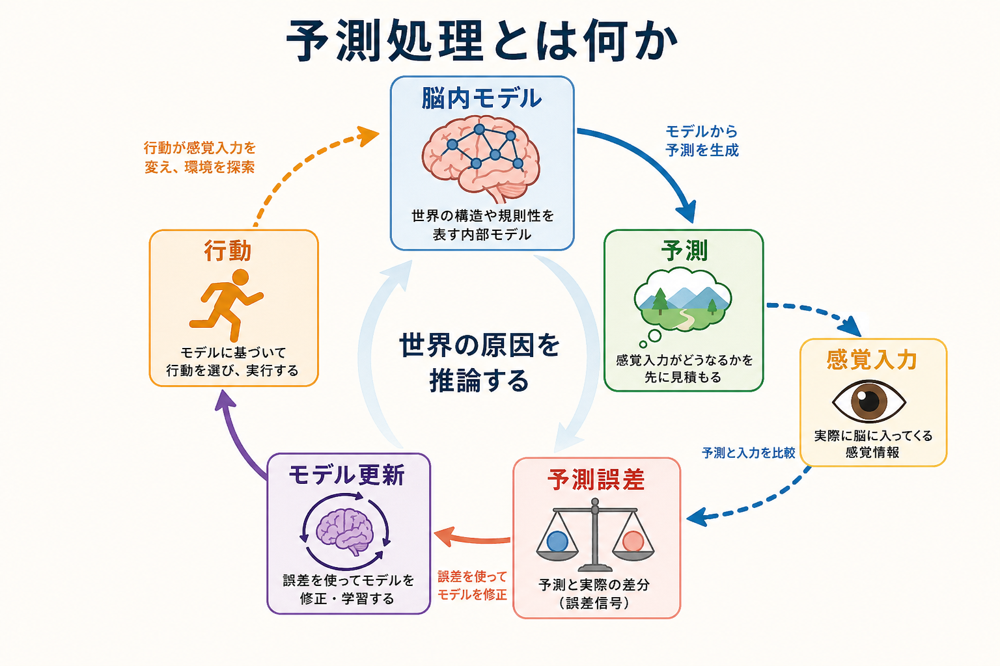
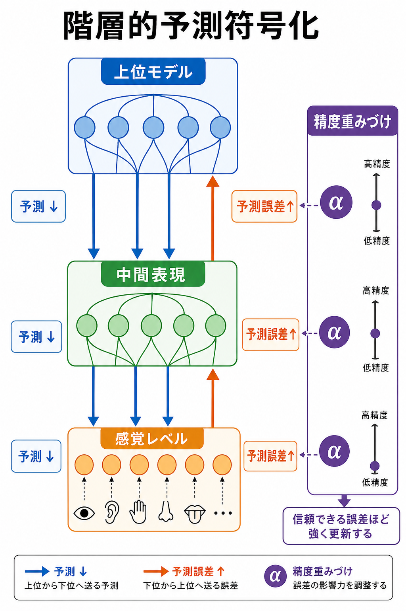
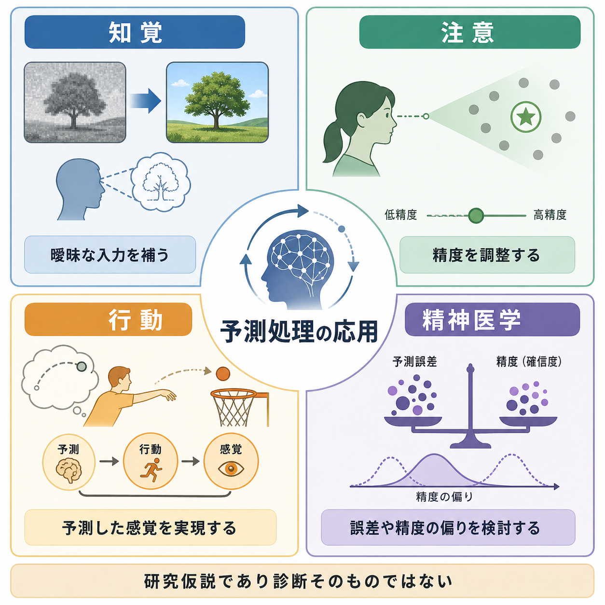

# 予測処理とは何か

## 要点

- 予測処理とは、脳が感覚入力をそのまま受け取る装置ではなく、世界の原因についての予測を作り、入力との差である予測誤差を使って理解を更新する、という枠組みである。
- 知覚は「下から来るデータ」だけで決まるのではなく、脳内モデルからのトップダウン予測と感覚入力の照合で成立する。
- 予測誤差は常に同じ重さで扱われるわけではない。誤差の信頼度、すなわち精度が高いと見積もられるほど、知覚・注意・学習・行動を強く動かす。
- 臨床・精神医学への応用は有望だが、現時点では「診断名を予測処理だけで説明できる」というより、症状や行動を理解するための研究仮説として扱うのが適切である。

## この記事で答える問い

- なぜ予測処理は、[[知覚とは何か]]を考えるうえで重要なのか。
- 予測、予測誤差、精度重みづけは何を意味するのか。
- 予測処理は、[[注意とは何か]]や行動、精神医学研究とどうつながるのか。
- 「脳は現実を勝手に作っている」という単純化は、どこまで正しいのか。

## まず結論

予測処理の核心は、「脳は入力を待つのではなく、入力の原因を推論している」という見方にある。たとえば視界が少し曖昧でも、私たちは過去の経験、文脈、身体状態を使って、そこに何があるかをすばやく見当づける。この見当づけが予測であり、実際の感覚入力との差が予測誤差である。

この枠組みでは、知覚とは感覚データの受動的なコピーではない。脳内モデルが「次にどのような入力が来るはずか」を先に見積もり、その見積もりと入力のズレを減らすようにモデルを更新する過程である。Rao と Ballard の視覚皮質モデルは、上位表現から下位表現への予測と、下位から上位への誤差信号という構図を計算モデルとして示し、後の予測符号化研究の重要な出発点になった[1]。

## 背景

古典的な感覚処理の説明では、外界から来た刺激が感覚器を通り、脳内で段階的に処理され、高次の認識へ到達すると考えられやすい。この見方は、視覚や聴覚の入力経路を理解するうえで今も重要である。一方で、曖昧な図形、錯視、文脈効果、期待による知覚の変化を考えると、知覚は単なるボトムアップ処理だけでは説明しにくい。

予測処理は、この問題を「脳は階層的な生成モデルを使って、感覚入力の原因を推定する」と捉える。Andy Clark は、脳を「予測する機械」として理解することで、知覚、行動、注意、身体化された認知を同じ枠組みで扱えると論じた[2]。Friston の自由エネルギー原理は、脳や生物システムが感覚入力の不確実性を減らす方向に働くという、より一般的な理論的背景を与えている[3]。

## 基本概念

### 予測

予測とは、脳内モデルが「いま、または次に、どのような感覚入力が生じるはずか」を見積もることである。ここでいう予測は、意識的に未来を考えることだけを指さない。視覚対象の形、音声の続き、身体の内側から来る感覚、他者の行動の意味など、さまざまなレベルで働く。

### 予測誤差

予測誤差とは、予測された入力と実際の入力の差である。誤差が大きい場合、脳は「モデルが間違っている」「入力がノイズである」「注意を向けるべき重要な変化が起きた」など、複数の可能性を評価する。予測処理では、この誤差を減らすことが、知覚や学習の中心的な駆動力になる。

### 精度重みづけ

精度とは、ある感覚信号や予測誤差がどれくらい信頼できるかの見積もりである。たとえば、暗い部屋では視覚入力の精度は低く見積もられ、過去の経験や文脈に依存しやすくなるかもしれない。逆に、鮮明で安定した入力では、予測誤差の重みが高まり、脳内モデルの更新を強く促す。

この精度重みづけは、[[選択的注意はどのように働くのか]]と深く関係する。注意は、単に一部の情報を選ぶ仕組みというより、どの予測誤差を信頼して処理するかを調整する仕組みとして理解できる[4]。

## 仕組み

予測処理では、脳は階層構造をもつと考えられる。上位階層は抽象的でゆっくり変化する原因、たとえば「これは顔である」「この状況では相手は怒っているかもしれない」といった表現を扱う。下位階層は、輪郭、明暗、音の高さ、身体感覚の変化など、より具体的で速い信号を扱う。

上位階層は下位階層へ予測を送り、下位階層は実際の入力との差を予測誤差として上位へ返す。Bastos らは、このような予測と誤差のやり取りが、大脳皮質の層構造と結びつく可能性を論じた[4]。この考え方は、[[視覚認知はどのように対象を認識するのか]]を、単なる特徴抽出ではなく、仮説検証の連続として捉え直す手がかりになる。

行動も、この枠組みでは重要な役割をもつ。予測誤差を減らす方法は、脳内モデルを変えることだけではない。身体を動かして、予測された感覚入力が実現するように環境へ働きかけることもできる。たとえば、暗くて見えにくい対象に顔を近づける、聞き取りにくい音へ耳を向ける、といった行動は、感覚入力を能動的に整える働きとして理解できる[3]。

## 図解

予測処理は、次の循環として読むと理解しやすい。

| 段階 | 内容 | 例 |
|---|---|---|
| 脳内モデル | 世界の構造や原因についての仮説を持つ | 「これは木かもしれない」 |
| 予測 | 入ってくる感覚を先に見積もる | 輪郭、色、位置を予測する |
| 感覚入力 | 実際の信号が入る | ぼやけた視覚情報が届く |
| 予測誤差 | 予測と入力のズレを検出する | 形が予想と少し違う |
| 更新・行動 | モデルを修正する、または行動で入力を変える | 近づいて見る、別の対象だと解釈する |

この循環は、[[ワーキングメモリとは何か]]や注意の研究とも接続できる。予測を保つこと、誤差を比較すること、どの誤差を重く見るかを調整することは、短時間の情報保持や実行制御にも関わるからである。

## 臨床・研究との接続

予測処理は、精神医学や臨床心理学でも注目されている。たとえば精神病症状に関する一部の理論では、予測誤差や精度重みづけの偏りが、妄想や幻覚の形成に関わる可能性が検討されている[5]。この見方では、単に「誤った信念がある」と考えるのではなく、どの信号が過度に重要視され、どの予測が修正されにくいのかを問う。

自閉スペクトラム症についても、感覚入力の精度や予測の働きが通常と異なる可能性が議論されてきた[6]。ただし、こうした説明は一枚岩ではない。個人差、発達、課題、感覚領域によって結果が異なりうるため、「自閉症は予測処理の異常である」と断定するのではなく、特定の行動や経験を説明する仮説として慎重に扱う必要がある。

また、身体内部の感覚、すなわち内受容感覚にも予測処理は応用される。Seth らは、感情や自己感の理解において、身体状態の予測と誤差が重要だと論じた[7]。これは、不安、感情調整、身体症状の主観的経験を考えるうえでも示唆的である。ただし本記事の内容は教育・研究目的の整理であり、個別の診断や治療方針を示すものではない。

## よくある誤解

### 誤解1: 予測処理は「脳が現実を作っている」という意味である

予測処理は、外界が存在しないとか、知覚が自由な作り話であるという主張ではない。むしろ、脳が外界からの制約を受けながら、もっともありそうな原因を推定するという説明である。入力が強く、安定し、精度が高いと見積もられるとき、予測は入力によって修正される。

### 誤解2: 予測誤差は悪いものだから消せばよい

予測誤差は学習の材料である。誤差がまったくなければ、環境の変化に気づけない。重要なのは、すべての誤差を消すことではなく、信頼できる誤差を適切に使い、ノイズに過剰反応しないことである。

### 誤解3: 予測処理はすべてを説明する万能理論である

予測処理は強力な統合枠組みだが、実験で検証できる具体的仮説に落とし込む必要がある。どの階層の、どの信号の、どの精度が、どの行動指標に影響するのかを明確にしなければ、説明が広すぎて検証困難になる。

## 関連ノート

- [[知覚とは何か]]
- [[視覚認知はどのように対象を認識するのか]]
- [[注意とは何か]]
- [[選択的注意はどのように働くのか]]
- [[ワーキングメモリとは何か]]

### 関連ノート候補

- 自由エネルギー原理とは何か
- 能動的推論とは何か
- 精度重みづけとは何か
- 内受容感覚とは何か
- 幻覚と予測処理

### MOC更新候補

- `content/00_MOC/` 配下の認知科学・心理学系 MOC
- 脳・神経科学系 MOC
- 計算論的精神医学系 MOC

## 理解チェック

1. 予測処理において、予測と予測誤差はそれぞれ何を指すか。
2. 精度重みづけは、なぜ注意と関係するのか。
3. 予測誤差を減らす方法には、モデル更新以外に何があるか。
4. 臨床応用について、なぜ診断そのものとして扱うべきではないのか。

## 未解決問題

- 予測処理の理論用語を、実験で測定可能な神経指標や行動指標へどう対応づけるか。
- 精度重みづけを、注意、覚醒、神経修飾物質、課題方略からどこまで分離できるか。
- 精神医学的症状を説明するとき、疾患名ではなく症状次元や個人差に基づく検証をどう設計するか。

## 参考文献

[1] Rao, R. P. N., & Ballard, D. H. (1999). Predictive coding in the visual cortex: A functional interpretation of some extra-classical receptive-field effects. *Nature Neuroscience, 2*, 79-87. https://doi.org/10.1038/4580

[2] Clark, A. (2013). Whatever next? Predictive brains, situated agents, and the future of cognitive science. *Behavioral and Brain Sciences, 36*(3), 181-204. https://doi.org/10.1017/S0140525X12000477

[3] Friston, K. (2010). The free-energy principle: A unified brain theory? *Nature Reviews Neuroscience, 11*, 127-138. https://doi.org/10.1038/nrn2787

[4] Bastos, A. M., Usrey, W. M., Adams, R. A., Mangun, G. R., Fries, P., & Friston, K. J. (2012). Canonical microcircuits for predictive coding. *Neuron, 76*(4), 695-711. https://doi.org/10.1016/j.neuron.2012.10.038

[5] Adams, R. A., Stephan, K. E., Brown, H. R., Frith, C. D., & Friston, K. J. (2013). The computational anatomy of psychosis. *Frontiers in Psychiatry, 4*, 47. https://doi.org/10.3389/fpsyt.2013.00047

[6] Pellicano, E., & Burr, D. (2012). When the world becomes "too real": A Bayesian explanation of autistic perception. *Trends in Cognitive Sciences, 16*(10), 504-510. https://doi.org/10.1016/j.tics.2012.08.009

[7] Seth, A. K. (2013). Interoceptive inference, emotion, and the embodied self. *Trends in Cognitive Sciences, 17*(11), 565-573. https://doi.org/10.1016/j.tics.2013.09.007

[8] Hohwy, J. (2013). *The Predictive Mind*. Oxford University Press. https://doi.org/10.1093/acprof:oso/9780199682737.001.0001
