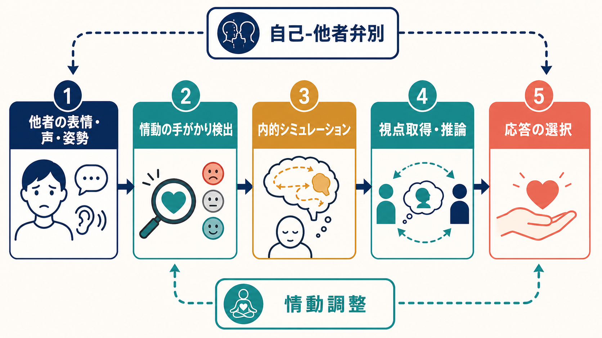
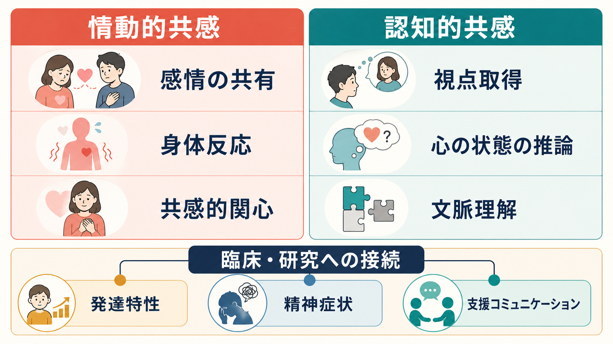

# 共感は認知機能としてどう理解できるのか

## 要点

- 共感は「やさしさ」だけではなく、他者の情動や心的状態を検出し、自己と他者を区別しながら、状況に合う応答を選ぶ複合的な認知機能である。
- 情動的共感は他者の感情への共有・共鳴に近く、認知的共感は視点取得や心の状態の推論に近い。
- 対人理解では、[[知覚とは何か]]、[[注意とは何か]]、[[ワーキングメモリとは何か]]、[[実行機能とは何か]]、[[抑制制御とは何か]]、[[意思決定とは何か]]が組み合わさる。
- 共感が高いことは常に望ましいとは限らない。自己-他者弁別や情動調整が弱いと、共感的関心ではなく個人的苦痛に傾くことがある。

## この記事で答える問い

共感は、しばしば「相手の気持ちがわかること」と説明される。しかし認知機能として見るなら、それは一つの能力ではない。この記事では、情動的共感と認知的共感を分け、対人理解の中でどのように働くのかを整理する。

## まず結論

共感は、他者の状態を自分の内側である程度シミュレートしつつ、その状態が「自分のものではなく相手のもの」だと保つ機能である。Decety と Jackson は、共感を共有表象、自己認識、心的柔軟性、情動調整などの要素が並列に働く機能的構成として整理した[1]。したがって、共感を認知機能として理解するには、「感じる力」と「推論する力」と「調整する力」を分けて考える必要がある。

## 背景

共感研究には、少なくとも三つの流れがある。第一に、他者の表情・声・姿勢を見聞きすると、自分の身体・情動系にも対応する反応が起こるという情動共有の流れである。Preston と de Waal は、対象の状態を知覚すると観察者側の対応表象が活性化し、身体反応や自律神経反応に結びつくという知覚-行為モデルを提案した[2]。

第二に、他者の信念・意図・視点を推論するメンタライジング、つまり心の理論の流れである。これは単なる感情感染ではなく、「相手は何を知っているのか」「なぜその行動をしたのか」を推定する過程であり、[[認知的柔軟性とは何か]]や[[ワーキングメモリとは何か]]とも関係する[8]。

第三に、社会神経科学の流れである。Singer と Lamm は、他者の情動を共有する過程には、本人が同じ情動を経験するときにも関わる神経系が含まれるが、共感反応は文脈、注意、評価、情動調整によって調節されると整理した[3]。

## 基本概念

### 情動的共感

情動的共感は、他者の情動状態に対して、自分の中にも似た情動反応が生じる側面である。典型例は、痛そうな表情を見て自分も不快になる、悲しんでいる人を見て胸が痛む、といった反応である。痛みの共感に関するメタ解析では、他者の痛みを見ると前部島皮質や前部・中部帯状皮質など、痛みの情動的側面に関わる領域が一貫して関与することが示されている[6]。

ただし、情動的共感は「相手を助ける行動」と同じではない。相手の苦痛に巻き込まれすぎると、相手志向の共感的関心ではなく、自分の不快感を下げたいという個人的苦痛に傾くことがある[3]。

### 認知的共感

認知的共感は、他者の視点、信念、意図、感情の原因を推論する側面である。相手が怒っていると感じるだけでなく、「なぜ怒っているのか」「何を期待していたのか」「自分にはどう見えていない情報を相手は持っているのか」を推定する。これは心の理論、視点取得、文脈理解に近い。

Davis の Interpersonal Reactivity Index は、共感を単一次元ではなく、視点取得、空想、共感的関心、個人的苦痛といった複数の下位尺度に分けて測定した[4]。この発想は、共感を「高い・低い」だけでなく、どの成分が強いのかとして見るうえで重要である。

### 自己-他者弁別

共感には、相手と同じように感じる方向と、相手と自分を区別する方向の両方が必要である。自己-他者弁別が弱いと、相手の苦痛が自分の苦痛として過剰に流入しやすい。逆に、自己-他者弁別だけが強く情動共有が弱いと、相手の状態を冷たく分析するだけになる。

## 仕組み

共感の認知過程は、次のように整理できる。

1. 他者の表情、声、姿勢、行動、文脈を[[知覚とは何か]]によって取り込む。
2. どの手がかりに注目するかを[[注意とは何か]]が選ぶ。
3. 情動の手がかりが、自分の身体・情動表象を部分的に活性化する。
4. [[ワーキングメモリとは何か]]が、相手の発話、状況、過去の文脈を一時的に保持する。
5. 心の理論や視点取得によって、相手の信念・意図・感情の原因を推論する。
6. [[抑制制御とは何か]]と情動調整が、自分の反応と相手の状態を混同しすぎないようにする。
7. [[意思決定とは何か]]によって、黙って聴く、質問する、助ける、距離を置くなどの応答が選ばれる。

Shamay-Tsoory らの病変研究は、情動的共感と認知的共感が完全に同じ神経基盤ではないことを示唆した。下前頭回損傷では情動的共感が、腹内側前頭前野損傷では認知的共感がより損なわれるという二重乖離が報告されている[5]。これは、共感が一枚岩の能力ではなく、複数の処理系の組み合わせであることを支持する。

## 図解

| 観点 | 情動的共感 | 認知的共感 |
|---|---|---|
| 中心 | 感情の共有、共感的関心、身体反応 | 視点取得、心の状態の推論、文脈理解 |
| 典型例 | 悲しむ人を見て胸が痛む | 相手が何を誤解しているかを推測する |
| 関連しやすい機能 | 情動認知、身体感覚、情動調整 | ワーキングメモリ、実行機能、認知的柔軟性 |
| 失敗の形 | 巻き込まれ、個人的苦痛、情動疲労 | 冷たい分析、過剰な推測、文脈の読み違い |
| 対人理解での役割 | 相手の状態を重要なものとして感じる | 相手の視点から状況を再構成する |

## 臨床・研究との接続

臨床や発達研究では、「共感があるかないか」ではなく、どの成分がどの状況で働きにくいのかを見ることが重要である。たとえば、他者の苦痛に強く反応するが視点取得が苦手な人もいれば、相手の考えを推論できるが情動的関心が弱い人もいる。Zaki と Ochsner は、共感神経科学の進展を評価しつつ、実験刺激が人工的になりすぎること、脳活動と実際の社会行動の対応が十分に扱われないことを課題として挙げている[7]。

精神医学・心理支援の文脈では、共感は診断名から直接決まるものではない。発達特性、気分状態、不安、疲労、トラウマ経験、対人文脈、文化的規範によって、情動共有、視点取得、自己-他者弁別、応答選択のどこが難しくなるかは変わる。したがって、教育・研究目的で共感を扱うときも、個別診断や治療指示として断定せず、観察可能な行動と文脈を分けて記述する必要がある。

## よくある誤解

### 誤解1: 共感は感情が強いほどよい

感情が強いだけでは、相手を理解できるとは限らない。強すぎる情動反応は、相手の問題ではなく自分の苦痛への対処を優先させることがある。共感には、情動共有だけでなく情動調整が必要である[3]。

### 誤解2: 認知的共感は冷たい能力である

認知的共感は、相手の信念や文脈を推論する能力であり、それ自体は冷たくも温かくもない。情動的共感と組み合わさると、相手の立場に合った支援や説明を選びやすくなる。

### 誤解3: 共感は心を読む能力である

共感は推論であって、相手の心を直接読むことではない。視点取得は誤ることがあり、相手に確認するコミュニケーションが必要である。ここで[[実行機能とは何か]]や[[意思決定とは何か]]が、聞き方、待ち方、介入の仕方を調整する。

### 誤解4: 共感は道徳性と同じである

共感は道徳的判断や向社会的行動に関係するが、同一ではない。誰に共感するかは、親密さ、集団境界、注意、文脈によって偏る。したがって、共感だけに倫理を任せるのではなく、規範、制度、熟慮も必要になる。

## 関連ノート

- [[知覚とは何か]]
- [[注意とは何か]]
- [[ワーキングメモリとは何か]]
- [[実行機能とは何か]]
- [[抑制制御とは何か]]
- [[認知的柔軟性とは何か]]
- [[意思決定とは何か]]

## 今後の作成候補

- 心の理論とは何か
- 社会的認知とは何か
- 情動調整とは何か
- メンタライジングとは何か
- 個人的苦痛と共感的関心は何が違うのか

## MOC更新候補

- `content/00_MOC/` 配下に認知科学・心理学または社会的認知の MOC がある場合、本記事へのリンク追加候補とする。
- 並列生成ジョブとの競合を避けるため、このタスクでは MOC 本体は更新しない。

## 理解チェック

1. 情動的共感と認知的共感は、それぞれ何を中心とする機能か。
2. 自己-他者弁別が弱いと、共感はどのような形で困難になりうるか。
3. 共感を「高い・低い」だけで評価すると、どのような見落としが起こるか。
4. 対人理解において、注意、ワーキングメモリ、実行機能はどの段階で関わるか。

## 未解決問題

- 日常的な対話場面で測定される共感と、実験室課題で測定される共感はどの程度一致するのか。
- 情動的共感と認知的共感を高める介入は、同じ訓練でよいのか、それとも別々に設計すべきか。
- 共感疲労や個人的苦痛を避けながら、相手志向の共感的関心を保つ条件は何か。
- 文化差、集団境界、権力関係は、誰に共感しやすいかをどのように変えるのか。

## 参考文献

[1] Decety, J., & Jackson, P. L. (2004). The functional architecture of human empathy. *Behavioral and Cognitive Neuroscience Reviews, 3*(2), 71-100. https://doi.org/10.1177/1534582304267187

[2] Preston, S. D., & de Waal, F. B. M. (2002). Empathy: Its ultimate and proximate bases. *Behavioral and Brain Sciences, 25*(1), 1-72. https://doi.org/10.1017/S0140525X02000018

[3] Singer, T., & Lamm, C. (2009). The social neuroscience of empathy. *Annals of the New York Academy of Sciences, 1156*, 81-96. https://doi.org/10.1111/j.1749-6632.2009.04418.x

[4] Davis, M. H. (1983). Measuring individual differences in empathy: Evidence for a multidimensional approach. *Journal of Personality and Social Psychology, 44*(1), 113-126. https://doi.org/10.1037/0022-3514.44.1.113

[5] Shamay-Tsoory, S. G., Aharon-Peretz, J., & Perry, D. (2009). Two systems for empathy: A double dissociation between emotional and cognitive empathy in inferior frontal gyrus versus ventromedial prefrontal lesions. *Brain, 132*(3), 617-627. https://doi.org/10.1093/brain/awn279

[6] Lamm, C., Decety, J., & Singer, T. (2011). Meta-analytic evidence for common and distinct neural networks associated with directly experienced pain and empathy for pain. *NeuroImage, 54*(3), 2492-2502. https://doi.org/10.1016/j.neuroimage.2010.10.014

[7] Zaki, J., & Ochsner, K. N. (2012). The neuroscience of empathy: Progress, pitfalls and promise. *Nature Neuroscience, 15*, 675-680. https://doi.org/10.1038/nn.3085

[8] Frith, C. D., & Frith, U. (2006). The neural basis of mentalizing. *Neuron, 50*(4), 531-534. https://doi.org/10.1016/j.neuron.2006.05.001
