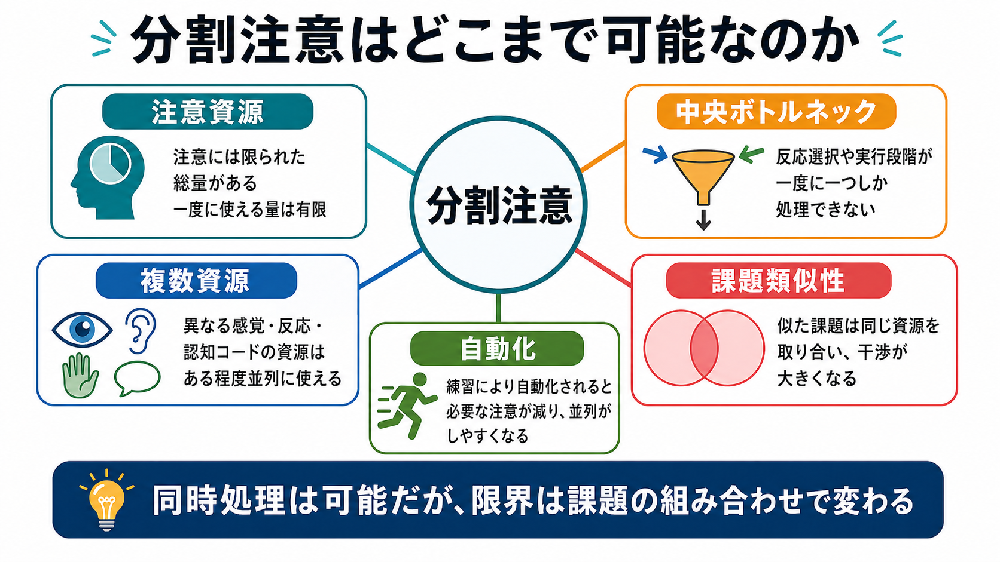
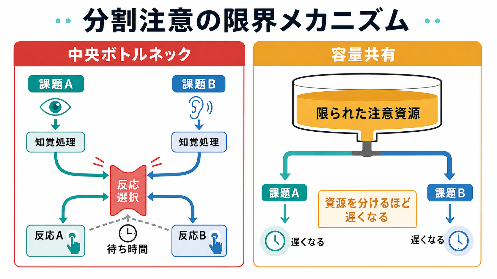
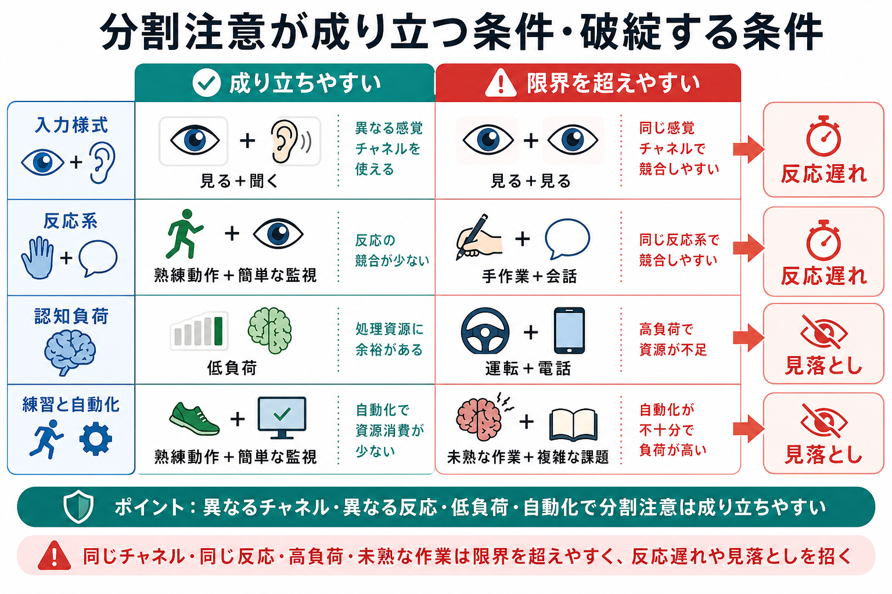

# 分割注意はどこまで可能なのか

## 要点

- 分割注意とは、2つ以上の課題へ同時に注意を配分しようとする働きである。
- 「人は一度に1つしかできない」わけではないが、反応選択、記憶検索、課題切り替え、高負荷な判断では強い干渉が起きやすい[1][2]。
- 干渉の大きさは、単一の注意資源だけでなく、課題が同じ感覚様式・処理段階・反応系・情報コードを共有するかによって変わる[3][4]。
- 練習と自動化により同時処理は改善しうるが、危険場面や新規課題では限界が残る[5][6]。
- 臨床・研究では、分割注意は実行機能、ワーキングメモリ、運転安全、神経心理学的評価と関係する。

## この記事で答える問い

この記事では、[[MOC｜認知科学・心理学]]の中でも注意と実行機能に関わる次の問いを扱う。

1. 分割注意は、単に「注意を半分ずつ使う」ことなのか。
2. 二重課題で反応が遅くなるのは、どこで詰まるからなのか。
3. 練習すれば、どこまでマルチタスクは可能になるのか。
4. 運転中の会話のような日常場面では、なぜ危険が増えるのか。

## まず結論

分割注意は可能だが、万能ではない。かなり単純な課題、よく練習された課題、異なる感覚様式や反応系を使う課題の組み合わせでは、並列処理に近い振る舞いが見られることがある[4][6]。たとえば、歩きながら簡単な会話をする、慣れた動作をしながら単純な監視をする、といった場面では、性能低下が小さく見えることがある。

しかし、2つの課題が同じ処理段階を奪い合うと、性能は急に落ちる。特に、どの反応を選ぶか、どの規則を適用するか、どの記憶を検索するかといった中央段階では、心理的不応期効果として知られる強い遅延が生じやすい[2]。ここでいう心理的不応期は、神経活動の[[不応期はなぜ生じるのか|不応期]]とは別の、認知処理上のボトルネックである。

したがって、「マルチタスクが得意かどうか」よりも、「その2つの課題がどの資源を共有しているか」を見るほうが重要である。運転中の電話のように、手が空いていても視覚情報への注意や判断資源が引き抜かれる場面では、安全上の余裕が減る[8]。

## 背景

注意研究では、分割注意は選択的注意と対になる概念として扱われる。選択的注意が「どれを選ぶか」に焦点を当てるのに対して、分割注意は「複数のものを同時に扱えるか」を問う。古典的には、Kahnemanの容量モデルが、注意を限られた心的努力として捉え、課題要求、覚醒、動機づけ、方略に応じて配分されるものとして説明した[1]。

この考え方は直感的である。難しい暗算をしながら会話を続けるのは難しく、疲労時には小さな割り込みでも作業が止まりやすい。つまり、注意には限られた容量があり、複数課題はその容量を取り合う。

ただし、すべてを単一資源で説明すると粗くなりすぎる。NavonとGopherは、人間の処理システムを限られた資源の経済的配分として捉え、課題や個人の特性によって資源の効率が変わると論じた[3]。さらにWickensの複数資源理論では、感覚様式、処理段階、情報コード、視覚チャンネルなどが異なれば、干渉は小さくなりうると整理される[4]。

## 基本概念

### 分割注意

分割注意とは、複数の入力、目標、反応へ注意を同時に配ろうとする働きである。実験では、二重課題法として測られることが多い。まず各課題を単独で行った成績を測り、次に同時に行わせて、反応時間、正答率、見落とし、主観的負荷がどれだけ悪化するかを見る。

重要なのは、同時処理に見える行動が、必ずしも完全な並列処理とは限らないことである。人は非常に速く課題を切り替えている場合もあるし、一方の課題が自動化されていて中央処理をあまり使っていない場合もある。

### 注意資源

注意資源モデルでは、課題を遂行するための心的努力には限りがあると考える[1]。資源が余っていれば、主課題をしながら副課題にも対応できる。資源が不足すると、反応が遅くなる、誤答が増える、重要な刺激を見落とす。

この考え方は、認知負荷や疲労を説明しやすい。一方で、どの課題同士が強く干渉するかを説明するには、単一資源だけでなく、複数資源や処理段階の区別が必要になる。

### 中央ボトルネック

中央ボトルネックとは、複数課題のうち一部の処理段階が同時に1つしか処理できないという考え方である。Pashlerのレビューは、単純な二重課題でも、反応選択や記憶検索に関わる中央段階で頑固なボトルネックが見られると整理している[2]。

たとえば、音を聞いてボタンを選ぶ課題と、文字を見て別のボタンを選ぶ課題を短い間隔で出すと、2つ目の反応が遅れる。知覚入力はある程度並列に処理できても、「どの反応を出すか」を決める段階で待ち行列ができる。

### 複数資源

複数資源理論では、注意は単一の袋ではなく、いくつかの次元に分かれた資源として捉えられる[4]。視覚と聴覚、知覚・認知段階と反応段階、言語的コードと空間的コード、焦点視と周辺視などが区別される。

このため、2つの課題が別の資源を使うなら、干渉は小さくなりうる。逆に、同じ画面の細部を見ながら別の視覚情報も監視する、手作業をしながら別の手反応を要求される、同じ言語処理を2つ同時に行う、といった組み合わせでは干渉が大きい。

## 仕組み

### 1. 入力段階では、ある程度の並列処理ができる

視覚や聴覚の初期処理は、すべてが逐次処理ではない。複数物体追跡研究では、人が複数の独立した対象を同時に追跡できることが示され、少なくとも一部の視覚的操作は複数位置に並列に及びうると考えられた[7]。もちろん、追跡できる数には限界があり、対象が増えたり動きが複雑になったりすれば性能は落ちる。

つまり、分割注意の限界は「感覚入力は1つずつしか入らない」からではない。初期入力はある程度並列に入るが、それを課題目標に沿って選び、意味づけし、反応へつなげる段階で限界が表面化する。

### 2. 反応選択段階では待ち行列ができやすい

二重課題で最も典型的な遅延は、心理的不応期効果である。第1刺激への反応選択が進行中のときに第2刺激が来ると、第2課題の知覚処理は始まっても、反応選択は待たされる。このため、第2反応が大きく遅れる[2]。

ここで重要なのは、単に「注意が散った」だけではないことである。中央処理には、同時に走りにくい処理段階があり、そこへ2つの課題が到着すると順番待ちになる。反応が遅い、誤る、割り込み後に何をしていたか忘れる、といった日常的な失敗は、この待ち行列と課題再設定の負荷で説明しやすい。

### 3. 課題が似ているほど干渉しやすい

課題Aと課題Bが同じ感覚様式、同じ反応系、同じ情報コードを使うほど、干渉は大きくなる[4]。たとえば、画面上の数字を読みながら別の文章を読むより、音声を聞きながら画面上の位置を監視するほうが干渉は小さい場合がある。

ただし、「見る+聞く」なら常に安全という意味ではない。聴覚課題でも、意味理解、記憶保持、反応判断が必要なら中央資源を使う。運転中の電話が問題になるのは、手を使うかどうかだけでなく、会話が視覚場面への注意配分と状況判断を奪うからである[8]。

### 4. 練習と自動化は限界を変える

練習は、分割注意の性能を大きく改善しうる。Spelke、Hirst、Neisserの古典研究では、参加者が長期練習後に、読解と聞き取り書字を同時にかなり高い水準で行えるようになった[6]。これは、注意容量が固定的な上限だけで決まるという単純な見方に修正を迫る。

ただし、この結果は「どんな課題も練習すれば同時に完全処理できる」という意味ではない。改善は特定の課題組み合わせ、方略、自動化、個人差に依存する。新しい状況、例外処理、危険判断、予期しない割り込みが入ると、自動化された処理でも中央制御を必要とする。

## 図解

分割注意の全体像は、次の3つに分けると見通しがよい。

| 観点 | 成り立ちやすい条件 | 破綻しやすい条件 |
|---|---|---|
| 資源 | 異なる感覚様式・反応系を使う | 同じ感覚様式・同じ反応系を奪い合う |
| 処理段階 | 入力の単純監視、熟練動作 | 反応選択、記憶検索、規則適用 |
| 負荷 | 低負荷で予測可能 | 高負荷、時間圧、割り込み、危険判断 |
| 練習 | 自動化され、手順が安定している | 未熟、例外が多い、状況変化が大きい |

## 臨床・研究との接続

分割注意は、実行機能とワーキングメモリの評価で重要である。Baddeleyは中央実行系の機能を、複数課題の協調、検索方略の切り替え、選択的注意と抑制、長期記憶内情報の保持・操作などに分解して検討する方針を示した[5]。分割注意課題は、このうち「複数課題の協調」を見る入口になる。

臨床・教育場面では、分割注意の弱さを単に「集中力がない」と言い換えると不十分である。どの段階で失敗しているのかを分けて見る必要がある。入力の見落としなのか、反応選択の混線なのか、課題切り替えの遅れなのか、ワーキングメモリ上の保持失敗なのかで、支援や環境調整の考え方が変わる。

安全研究では、運転中の注意分散が代表例である。Strayerらのシミュレータ研究では、ハンズフリー通話であっても前方車両のブレーキへの反応が損なわれ、道路脇情報の記憶も低下した[8]。これは、手の使用だけでなく、視覚場面への注意配分そのものが会話に奪われることを示している。

なお、医療・心理支援に関わる内容は教育・研究目的の一般的説明であり、個別の診断や治療方針を示すものではない。

## よくある誤解

### 誤解1: 分割注意とは、注意を半分ずつ均等に分けることである

実際には、注意配分は均等割りではない。課題の優先度、報酬、危険度、時間圧、練習量によって配分は変わる[1][3]。また、同じ「半分」でも、別資源を使う課題と同一資源を奪い合う課題では干渉が違う[4]。

### 誤解2: マルチタスクが得意な人は、同時に何でもできる

個人差はあるが、二重課題干渉は課題構造に強く依存する。得意に見える場合でも、片方が自動化されている、課題切り替えが速い、片方の品質を下げている、失敗が見えにくいだけ、という可能性がある。

### 誤解3: ハンズフリーなら運転中の電話は安全である

手が空くことは重要だが、それだけでは十分ではない。会話は意味理解、記憶、予測、返答を要求し、視覚場面への注意を減らしうる[8]。安全上は、手の負荷だけでなく認知負荷を見る必要がある。

### 誤解4: 練習すれば注意の限界は消える

練習は限界を押し広げるが、消すわけではない[6]。自動化された手順でも、予期しない事態、例外処理、危険判断では中央制御が必要になり、同時課題の干渉が再び現れる。

## 関連ノート

- [[MOC｜認知科学・心理学]]
- [[アセチルコリンは注意や記憶にどう関わるのか]]
- [[不応期はなぜ生じるのか]]

今後の作成候補:

- 注意とは何か
- 選択的注意はどのように働くのか
- ワーキングメモリとは何か
- 中央実行系とは何か
- マルチタスクはなぜ難しいのか
- 認知負荷とは何か
- 注意ネットワークはどのように分けられるのか

MOC更新候補:

- `content/00_MOC/MOC｜認知科学・心理学.md` の「注意とワーキングメモリ」周辺に、本記事へのリンクを追加する。

## 理解チェック

1. 分割注意で性能が落ちる理由を、注意資源と中央ボトルネックの両方から説明できるか。
2. 「見る+聞く」は「見る+見る」より干渉が小さくなりやすいが、なぜ常に安全とは言えないのか。
3. 心理的不応期効果は、神経の不応期と何が違うか。
4. 練習と自動化は、分割注意のどの限界を変え、どの限界を残すか。
5. 運転中の電話が、手の負荷だけでは説明できない理由を説明できるか。

## 参考文献

[1] Kahneman, D. (1973). *Attention and Effort*. Prentice-Hall. https://books.google.com/books/about/Attention_and_Effort.html?id=tkvuAAAAMAAJ

[2] Pashler, H. (1994). Dual-task interference in simple tasks: Data and theory. *Psychological Bulletin, 116*(2), 220-244. https://doi.org/10.1037/0033-2909.116.2.220

[3] Navon, D., & Gopher, D. (1979). On the economy of the human-processing system. *Psychological Review, 86*(3), 214-255. https://doi.org/10.1037/0033-295X.86.3.214

[4] Wickens, C. D. (2002). Multiple resources and performance prediction. *Theoretical Issues in Ergonomics Science, 3*(2), 159-177. https://doi.org/10.1080/14639220210123806

[5] Baddeley, A. (1996). Exploring the central executive. *The Quarterly Journal of Experimental Psychology Section A, 49*(1), 5-28. https://doi.org/10.1080/713755608

[6] Spelke, E., Hirst, W., & Neisser, U. (1976). Skills of divided attention. *Cognition, 4*(3), 215-230. https://doi.org/10.1016/0010-0277(76)90018-4

[7] Pylyshyn, Z. W., & Storm, R. W. (1988). Tracking multiple independent targets: Evidence for a parallel tracking mechanism. *Spatial Vision, 3*(3), 179-197. https://doi.org/10.1163/156856888X00122

[8] Strayer, D. L., Drews, F. A., & Johnston, W. A. (2003). Cell phone-induced failures of visual attention during simulated driving. *Journal of Experimental Psychology: Applied, 9*(1), 23-32. https://doi.org/10.1037/1076-898X.9.1.23

## 未解決問題

- 二重課題干渉のうち、中央ボトルネック、容量共有、課題切り替え、方略選択がどの程度寄与するかを、課題ごとにどう分離するか。
- 練習による自動化が、単に必要資源を減らすのか、それとも課題表象や神経表現そのものを再編するのか。
- 日常場面のマルチタスク失敗を、実験室の二重課題指標からどこまで予測できるか。
