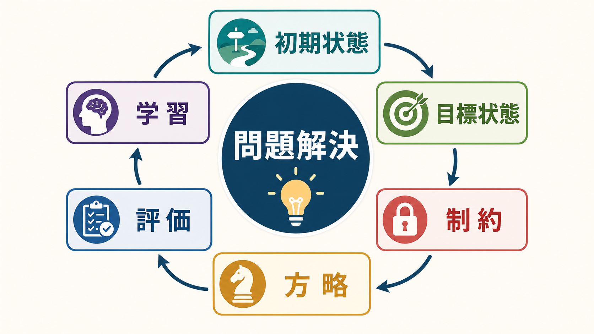
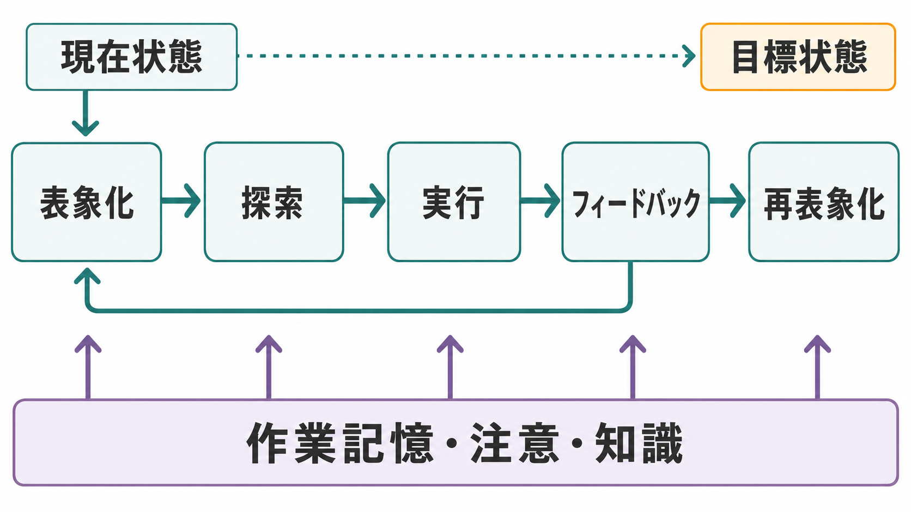
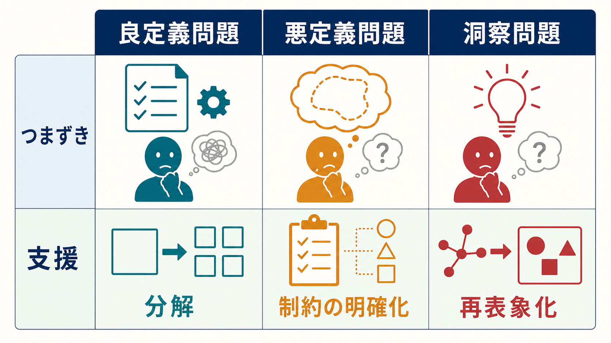

# 問題解決とは何か

## 要点

- 問題解決とは、目標はあるが、そこへ到達する手順がすぐには分からない状況で、状態・制約・操作を表象し、方略を探索し、実行結果を評価する認知過程である[1]。
- 古典的な情報処理アプローチでは、問題解決は「初期状態」から「目標状態」へ向かう問題空間の探索として記述される[2]。
- うまく解けない理由は、知識不足だけではない。問題の表象、作業記憶の負荷、注意配分、固定観念、方略選択、フィードバックの読み取りが関わる[3][4]。
- 熟達者は単に速く考えるのではなく、領域固有の知識やスキーマによって、探索する候補を効率よく絞る[4]。
- 臨床・教育では、問題解決を「本人の努力不足」とみなすのではなく、目標設定、環境調整、認知負荷の低減、代替案生成、実行後の検証を支援する枠組みとして使うのが安全である[7]。

## この記事で答える問い

1. 問題解決とは、単なる「考えること」と何が違うのか。
2. 問題空間、手段目標分析、洞察、ヒューリスティックはどう関係するのか。
3. なぜ同じ問題でも、ある人には簡単で、別の人には難しいのか。
4. 教育・研究・臨床支援では、問題解決をどう扱うとよいのか。

## まず結論

問題解決は、「答えを思いつく能力」ではなく、現在の状態と目標状態の差を把握し、その差を縮める操作を選び、試し、結果から表象を更新する一連の過程である。つまり、問題解決には、[[注意とは何か|注意]]、[[ワーキングメモリとは何か|ワーキングメモリ]]、[[中央実行系とは何か|中央実行系]]、[[意味記憶とは何か|意味記憶]]、[[長期記憶とは何か|長期記憶]]がまとめて関わる。

このため、問題解決の失敗は「能力が低い」ことだけを意味しない。問題の読み取りがずれている、制約が曖昧、使える知識が検索できない、手順を保持する負荷が高い、途中結果を評価する基準がない、という複数の要因で失敗は起こる。

## 背景

心理学における問題解決研究には、大きく二つの流れがある。第一は、ゲシュタルト心理学に由来する「問題をどう見ているか」を重視する流れである。Duncker の研究は、対象の通常の使い方に縛られる機能的固着や、問題の再構成が解決を左右することを示した[3]。

第二は、Newell、Shaw、Simon に代表される情報処理アプローチである。この流れでは、問題解決を記号操作の過程として捉え、問題空間、探索、手段目標分析、ヒューリスティックという概念で説明する[2]。この視点は、認知心理学だけでなく、人工知能、教育心理学、意思決定研究にも影響を与えた。

現在の認知科学では、この二つは対立するというより補完的に扱われる。人は問題空間を探索するが、その空間そのものは、知覚、言語理解、既有知識、文脈、目標の置き方によって作られる。したがって、問題解決を理解するには、「どの候補を探すか」と同時に「そもそも何を問題として表象しているか」を見る必要がある[1][8]。

## 基本概念

### 問題

問題とは、目標状態はあるが、そこへ到達する手段がすぐには利用できない状態である[1]。たとえば、暗算の答えをただ思い出す場合は検索に近いが、複数の条件を満たす計画を作る場合は問題解決に近い。

| 概念 | 意味 | 例 |
|---|---|---|
| 初期状態 | いま与えられている条件 | 手元の材料、現在の成績、現在の症状 |
| 目標状態 | 到達したい状態 | 課題を解く、生活上の困難を減らす |
| 制約 | 使える資源や守るべき条件 | 時間、ルール、体力、予算 |
| 操作 | 状態を変える行為 | 計算する、試す、相談する、書き出す |
| 方略 | 操作を選ぶ方針 | 分解、逆向き推論、類推、試行錯誤 |

### 良定義問題と悪定義問題

良定義問題は、初期状態、目標状態、許される操作、正解判定が比較的明確である。数学の標準問題やパズルが典型である。悪定義問題は、目標や制約が曖昧で、何をもって解決とするかも文脈に依存する。進路選択、研究テーマ設定、対人葛藤、臨床的な生活課題は悪定義問題に近い。

良定義問題では探索手順やアルゴリズムが役立ちやすい。一方、悪定義問題では、問題を小さく定義し直すこと、評価基準を明確にすること、関係者の価値観を扱うことが重要になる。

### 問題空間

問題空間とは、取りうる状態と、それらをつなぐ操作の集合である[2]。迷路を考えると分かりやすい。各地点が状態で、移動が操作で、出口が目標である。ただし、人間の問題解決では、問題空間は外界にそのまま存在するのではなく、解き手の理解によって構成される。

### 手段目標分析

手段目標分析とは、現在状態と目標状態の差を見つけ、その差を縮める操作を選ぶ方略である[2]。たとえば「レポートが未完成」という現在状態と「提出できる状態」という目標状態の差を、資料収集、構成作成、執筆、推敲に分ける。

ただし、手段目標分析は万能ではない。目標との差を常に追いかけると、局所的には前進して見えても、長期的な学習やスキーマ形成に使う認知資源が不足することがある[4]。

## 仕組み

問題解決は、おおまかに次の循環として整理できる。

1. **表象化**: 何が与えられ、何が求められているかを把握する。
2. **探索**: 使えそうな操作、方略、類似事例を探す。
3. **実行**: 選んだ操作を試す。
4. **フィードバック**: 結果が目標に近づいたかを評価する。
5. **再表象化**: 必要に応じて、問題の見方や制約を組み直す。

### 表象化

表象化とは、問題を心的にどう表すかである。ここで誤ると、以後の探索は的外れになる。たとえば「勉強時間が足りない」という問題に見えても、実際には課題の分解ができていない、理解できていない箇所が特定されていない、睡眠不足で[[注意とは何か|注意]]が維持できない、という別の問題かもしれない。

洞察問題では、この表象化の組み替えが特に重要である。問題が解けないとき、同じ探索を続けるより、前提や制約の読み方を変えるほうが解決に近づくことがある[3]。

### 探索

探索には、総当たり、逆向き推論、分解、類推、ヒューリスティックが含まれる。人間は計算機のように全候補を調べることはできないため、多くの場合、経験的に有望そうな候補を優先する。これは効率的だが、思い込みや固定観念も生む。

熟達者は、探索量が単に多いのではなく、探索空間の作り方が違う。領域固有の[[意味記憶とは何か|知識]]やスキーマによって、重要な特徴を早く見抜き、不要な枝を切ることができる[4]。

### 実行とモニタリング

方略は、実行されて初めて評価できる。ここでは、途中結果を保持する[[ワーキングメモリとは何か|ワーキングメモリ]]、注意の切り替え、抑制、更新が必要になる。Miyake らの実行機能研究は、更新、抑制、シフティングが相関しつつも分離できる制御過程であることを示した[5]。問題解決では、これらの制御が「いま試している手順を保つ」「誤った反応を止める」「別の方略へ切り替える」形で働く。

### 学習

問題解決は、成功・失敗を通じて次の問題解決を変える。解けた手順が[[長期記憶とは何か|長期記憶]]内のスキーマとして整理されると、次回は探索が短縮される。ただし、認知負荷が高すぎると、目の前の解を探すことに資源が使われ、学習に回る余裕が少なくなる[4]。

## 図解

図1は、問題解決を「初期状態、目標状態、制約、方略、評価、学習」の循環として表している。重要なのは、解決が一直線ではなく、評価と学習を通じて次の表象や方略が変わる点である。

図2は、問題解決の中心メカニズムを示している。表象化、探索、実行、フィードバック、再表象化の循環は、[[中央実行系とは何か|中央実行系]]、注意、知識に支えられる。

図3は、問題の種類ごとにつまずきと支援を整理している。良定義問題では分解、悪定義問題では制約の明確化、洞察問題では再表象化が特に重要になる。

## 臨床・研究との接続

### 教育

教育では、問題解決を「たくさん問題を解けば自然に身につく」と考えすぎないことが重要である。初心者にとって、手段目標分析は認知負荷が高く、スキーマ形成を妨げる場合がある[4]。そのため、例題、足場かけ、段階的な制約解除、自己説明、途中状態の可視化が役立つ。

### 認知神経科学

認知神経科学では、問題解決は単一の脳部位ではなく、前頭前野、頭頂葉、記憶系、感覚運動系を含む制御ネットワークの相互作用として扱われる。実行機能の研究は、問題解決に必要な制御が、更新、抑制、切り替えなどの部分過程から成ることを示している[5][6]。

### 臨床・支援

臨床領域では、問題解決療法や問題解決訓練が、抑うつ、ストレス、慢性疾患への対処などで検討されてきた。メタ分析では、問題解決療法は一定の有効性を示すが、対象、介入内容、比較条件により効果は異なる[7]。したがって、個別の診断や治療指示としてではなく、目標を具体化し、代替案を作り、実行後に検証する支援技法として位置づけるのが適切である。

## よくある誤解

### 誤解1: 問題解決は頭の回転の速さで決まる

速さは一部にすぎない。重要なのは、問題を適切に表象し、不要な探索を減らし、フィードバックから表象を修正できることである。

### 誤解2: 正しい方略を知ればすべて解ける

方略は文脈依存である。分解が有効な問題もあれば、前提を組み替える再表象化が必要な問題もある。悪定義問題では、解く前に「何を解決と呼ぶか」を決める必要がある。

### 誤解3: 失敗は努力不足である

失敗は、認知負荷、注意、知識、環境、目標設定、評価基準の問題として起こる。支援では、本人の努力だけでなく、課題の分割、外部メモ、環境調整、選択肢の明示化を検討する。

### 誤解4: 洞察は突然のひらめきだけで起こる

洞察には突然性があるように見えるが、その背後には、行き詰まり、制約の見直し、表象の再構成がある[3]。ひらめきは、何もないところから現れるというより、問題の見方が変わった結果として生じる。

## 関連ノート

- [[注意とは何か]]
- [[ワーキングメモリとは何か]]
- [[中央実行系とは何か]]
- [[意味記憶とは何か]]
- [[長期記憶とは何か]]

## MOC更新候補

- `content/00_MOC/` 配下の認知科学・心理学系 MOC に、問題解決、実行機能、思考、学習支援の関連ノートとして追加する。
- 並列ジョブとの競合を避けるため、この作業では MOC 本文は直接更新しない。

## 理解チェック

1. 問題解決を「初期状態」「目標状態」「制約」「操作」という語を使って説明できるか。
2. 良定義問題と悪定義問題では、支援の焦点がどう変わるか。
3. 手段目標分析が有効な場面と、認知負荷を高める場面を区別できるか。
4. 洞察問題で「再表象化」が重要になる理由を説明できるか。
5. 問題解決の困難を、努力不足ではなく、注意・記憶・知識・環境の相互作用として説明できるか。

## 未解決問題

- 問題解決能力を、領域一般の能力としてどこまで測定できるのか。
- 良定義問題で測られる実験室課題の成績は、日常生活の悪定義問題にどの程度転移するのか。
- AI 支援や外部記憶ツールは、人間の問題解決過程を補助するのか、それとも探索や評価を弱めるのか。
- 問題解決療法の効果は、どの対象・症状・介入要素で最も安定するのか。

## 参考文献

[1] Mayer, R. E. (2013). Problem Solving. In *The Oxford Handbook of Cognitive Psychology* (pp. 769-778). Oxford University Press. https://doi.org/10.1093/oxfordhb/9780195376746.013.0048

[2] Newell, A., Shaw, J. C., & Simon, H. A. (1958). Elements of a theory of human problem solving. *Psychological Review, 65*(3), 151-166. https://doi.org/10.1037/h0048495

[3] Duncker, K. (1945). On problem-solving. *Psychological Monographs, 58*(5), i-113. https://doi.org/10.1037/h0093599

[4] Sweller, J. (1988). Cognitive load during problem solving: Effects on learning. *Cognitive Science, 12*(2), 257-285. https://doi.org/10.1207/s15516709cog1202_4

[5] Miyake, A., Friedman, N. P., Emerson, M. J., Witzki, A. H., Howerter, A., & Wager, T. D. (2000). The unity and diversity of executive functions and their contributions to complex "frontal lobe" tasks: A latent variable analysis. *Cognitive Psychology, 41*(1), 49-100. https://doi.org/10.1006/cogp.1999.0734

[6] Friedman, N. P., & Miyake, A. (2017). Unity and diversity of executive functions: Individual differences as a window on cognitive structure. *Cortex, 86*, 186-204. https://doi.org/10.1016/j.cortex.2016.04.023

[7] Malouff, J. M., Thorsteinsson, E. B., & Schutte, N. S. (2007). The efficacy of problem solving therapy in reducing mental and physical health problems: A meta-analysis. *Clinical Psychology Review, 27*(1), 46-57. https://doi.org/10.1016/j.cpr.2005.12.005

[8] Bassok, M., & Novick, L. R. (2012). Problem Solving. In *The Oxford Handbook of Thinking and Reasoning* (pp. 413-432). Oxford University Press. https://doi.org/10.1093/oxfordhb/9780199734689.013.0021
