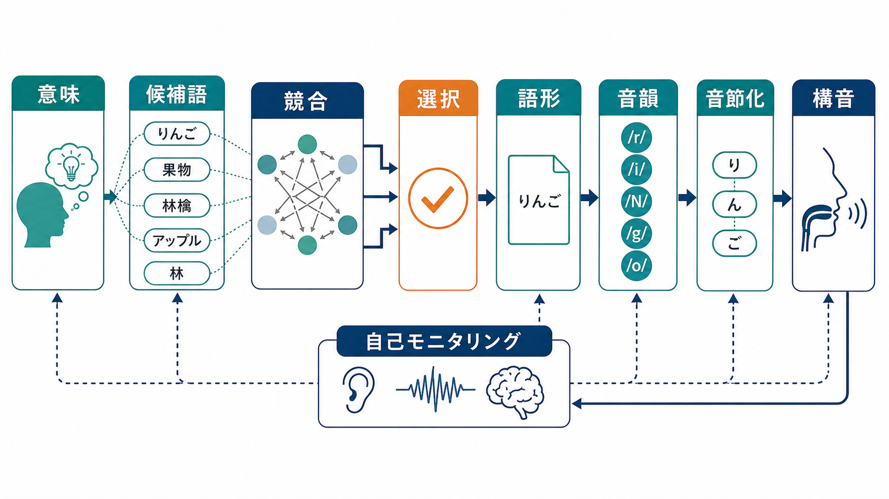
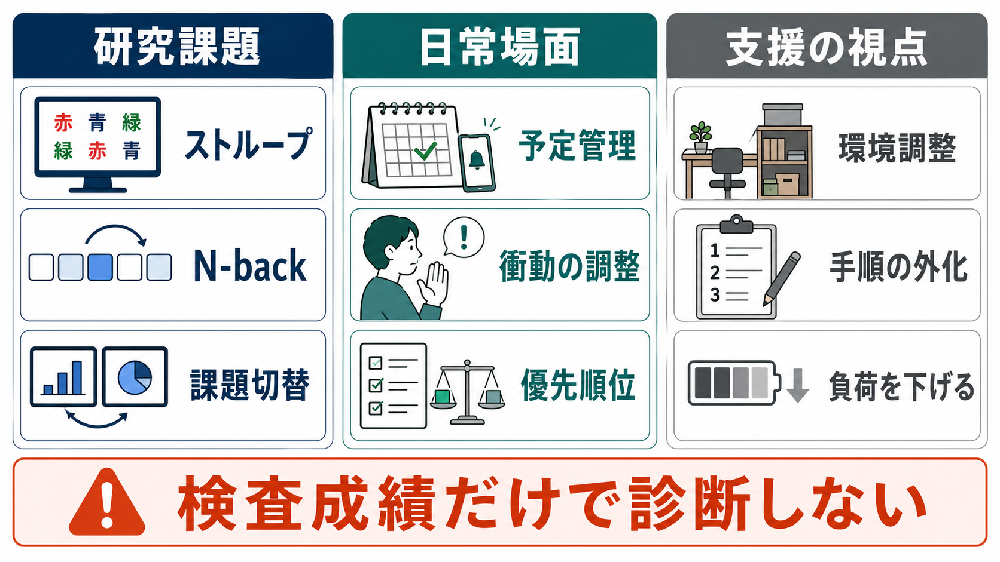

# 実行機能とは何か

## 要点

- 実行機能とは、目標に向けて思考・注意・行動を調整する制御過程の総称である。反射的に反応するのではなく、いったん止まり、必要な情報を保ち、不要な反応を抑え、状況に応じて方略を切り替える働きが含まれる[1][8]。
- 代表的な中核要素は、**抑制**、**ワーキングメモリの更新**、**認知的柔軟性・切り替え**である。ただし、これらは完全に独立した能力でも、ひとつの単一能力でもなく、「共通性」と「多様性」を併せ持つ[1][2][3]。
- 脳内では、前頭前野だけが実行機能を担うのではない。前頭前野、頭頂葉、帯状皮質、基底核などを含む広いネットワークが、課題の目標や文脈を保ち、他の処理系を状況に応じてバイアスする[4][5]。
- 臨床や教育では、検査課題の点数だけで「実行機能が低い」と断定しない。課題の種類、発達段階、睡眠、情動、環境負荷、動機づけ、支援の有無を合わせて読む必要がある[6][7]。

## この記事で答える問い

1. 実行機能は、[[注意とは何か]]、[[ワーキングメモリとは何か]]、[[中央実行系とは何か]]とどう関係するのか。
2. 抑制、更新、切り替えは、それぞれ何をしているのか。
3. 実行機能は脳のどこにあるのか。
4. 発達、ADHD、学習支援、臨床評価では、実行機能をどう読むべきか。

## まず結論

実行機能は、「頭のよさ」や「意志の強さ」そのものではない。むしろ、いまの目標に合わせて処理資源を配分する仕組みである。たとえば、スマートフォン通知を見たい反応を抑えながら文章を読む、会話の途中で相手の発言を保持しつつ返答を考える、予定変更に合わせて行動順序を組み替える、といった場面で働く。

この働きは、ひとつの司令塔がすべてを命令するというより、複数の制御過程が課題に応じて組み合わさるものとして理解した方がよい。Miyake らの潜在変数研究は、更新、抑制、切り替えが互いに関連しながらも分離可能であることを示し、「統一性と多様性」という見方を定着させた[2][3]。

## 背景

実行機能という語は、前頭葉損傷で見られる計画、抑制、柔軟な問題解決の困難を説明する文脈で発展してきた。その後、認知心理学ではストループ課題、Go/No-Go 課題、N-back、課題切替などで測定され、発達心理学、教育、精神医学、神経科学へ広がった[6][8]。

ただし、実行機能は測りにくい。なぜなら、どの課題にも知覚、運動、言語、速度、動機づけ、課題理解が混ざるからである。たとえばストループ課題で成績が悪い場合、それは抑制の問題かもしれないが、色名読みに慣れていない、反応速度が遅い、課題ルールを誤解している、疲労が強い、という可能性もある。

## 基本概念

### 抑制

抑制は、目標に合わない反応や情報の影響を弱める働きである。衝動的な行動を止める反応抑制、競合する情報を無視する干渉制御、不要な思考に巻き込まれない認知的抑制などが含まれる[1]。

日常例では、会議中に通知を見たい反応を止める、怒りに任せた発言を控える、文章を読むとき周囲の会話を背景化する、といった場面で働く。抑制は「何もしない力」ではなく、目標に合う処理を通し、合わない処理の重みを下げる選択的な制御である。

### 更新

更新は、[[ワーキングメモリとは何か]]に保持している情報を、状況に合わせて入れ替える働きである。買い物リストを思い出しながら、すでに買ったものを外し、必要なものを追加する。暗算で途中結果を保ちながら次の演算へ進む。こうした場面では、単に覚えるだけでなく、古くなった情報を捨て、新しい情報を取り込む必要がある[2][3]。

### 切り替え

切り替えは、課題ルール、注意の向け先、行動方略を変える働きである。読書から会話へ移る、資料作成からメール返信へ移る、予定変更に合わせて移動順序を変える、といった場面で必要になる。切り替えは便利だが、頻繁すぎるとコストがかかる。切り替え課題で反応が遅れるのは、古いルールの残り、次のルールの再設定、注意資源の再配分が必要になるためである[2][8]。

### 目標保持とモニタリング

実行機能には、いま何を達成しようとしているのかを保つ働きも含まれる。目標が保たれていなければ、抑制すべき反応も、更新すべき情報も、切り替えるべきタイミングも決められない。また、行動した結果を見て、誤りやズレを検出し、次の行動を調整するモニタリングも重要である[4][5]。

## 仕組み

Miller と Cohen の前頭前野理論では、前頭前野は目標や文脈を能動的に保持し、それに基づいて知覚、記憶、反応選択などの処理をバイアスすると考えられる[4]。これは「前頭前野が全部を処理する」という意味ではない。むしろ、目標に合う経路を強め、合わない経路を弱める調整役として働く。

Duncan の multiple-demand system の議論では、前頭葉と頭頂葉を含む広い領域が、多様な認知課題に共通して動員される。複雑な行動は、小さな下位課題の系列として組み立てられ、現在のステップに必要な情報を焦点化しながら進む[5]。

この仕組みを日常に置き換えると、実行機能は次のように働く。

| 過程 | 何をするか | 日常例 |
|---|---|---|
| 目標保持 | いま達成すべきことを保つ | 「30分で資料の骨子を作る」と決める |
| 注意の選択 | 目標に関係する入力を優先する | 必要な資料だけを開く |
| 抑制 | 競合する反応を弱める | 通知、雑談、別タスクへの反応を止める |
| 更新 | 作業中の情報を入れ替える | 新しい条件に合わせてメモを修正する |
| 切り替え | ルールや方略を変える | 構成作成から推敲へ移る |
| モニタリング | 結果を見て調整する | 進捗を確認し、優先順位を変える |

## 図解

図1は、実行機能を複数の制御過程の組み合わせとして示している。図2は、目標、注意、抑制、更新、切り替え、行動、フィードバックが循環する仕組みを示している。図3は、研究課題・日常場面・支援の視点を分け、検査成績だけで個人の困難を診断しないという注意点を示している。

## 臨床・研究との接続

### 発達

実行機能は幼児期だけで完成するものではない。学齢期から青年期にかけても、[[ワーキングメモリとは何か]]、計画、切り替え、情動調整、学業成績との関係が変化する[6]。発達を読むときは、単純に「できる・できない」ではなく、課題の複雑さ、支援の量、環境の予測可能性を合わせて見る必要がある。

### ADHD と精神医学

ADHD では抑制、ワーキングメモリ、計画、持続的注意などの困難が研究されてきた。Willcutt らのメタ分析は、ADHD 群で実行機能課題の平均的な低下が見られる一方、それだけで ADHD を説明し切れるわけではないことを示している[7]。つまり、実行機能の困難は重要な視点だが、診断名そのものではない。

臨床的には、課題成績だけでなく、生活場面で何が起きているかを確認する。たとえば、手順を忘れるのか、開始できないのか、途中で逸れるのか、切り替えで固まるのか、衝動的に反応してしまうのかによって、支援の設計は変わる。

### 支援

支援では、本人の努力を増やすだけでは限界がある。実行機能に負荷がかかりすぎているなら、環境側で負荷を下げる方が有効なことが多い。

- 手順を紙やチェックリストに外化する。
- 通知、音、視覚的な散らかりを減らす。
- 作業を小さな単位に分け、切り替えタイミングを明示する。
- 予定、締切、優先順位を見える形にする。
- [[持続的注意とは何か]]が必要な作業では、休憩と再開合図を設計する。

## よくある誤解

### 誤解1: 実行機能は前頭前野だけにある

前頭前野は重要だが、実行機能は前頭前野だけで完結しない。課題制御には前頭葉、頭頂葉、帯状皮質、基底核、感覚・運動系、記憶系が関わる[4][5]。したがって「前頭葉が弱いから実行機能が低い」と単純に言い換えるのは避ける。

### 誤解2: 実行機能は意志力である

実行機能には目標維持や抑制が含まれるため、意志力のように見える。しかし、睡眠不足、ストレス、環境の複雑さ、報酬の近さ、課題の曖昧さによって大きく変わる。困難を本人の性格や怠慢だけで説明するのは不正確である。

### 誤解3: 抑制・更新・切り替えは完全に別々の能力である

研究上は分けて測るが、実際の行動では重なり合う。課題を切り替えるには古いルールを抑制し、新しいルールを[[ワーキングメモリとは何か]]に保持する必要がある。Miyake らの研究が示したのは、分離可能性だけでなく、共通因子の存在でもある[2][3]。

### 誤解4: 検査で低ければ生活でも必ず困る

検査課題は重要な手がかりだが、生活機能をそのまま写すものではない。実験室では短時間で明確な課題が提示されるが、日常では目標が曖昧で、割り込みが多く、情動や対人関係も関わる。だからこそ、検査、観察、本人の語り、環境評価を組み合わせる必要がある[7][8]。

## 関連ノート

- [[注意とは何か]]
- [[持続的注意とは何か]]
- [[ワーキングメモリとは何か]]
- [[中央実行系とは何か]]
- [[選択的注意はどのように働くのか]]

## MOC更新候補

- `content/00_MOC/MOC・認知科学・心理学.md`
- `content/00_MOC/MOC・脳・神経科学.md`
- `content/00_MOC/MOC・精神医学.md`

並列生成ジョブとの競合を避けるため、このノートでは MOC 本文の直接更新は行わない。

## 理解チェック

1. 実行機能を「単一の司令塔」ではなく「複数の制御過程の組み合わせ」と見る利点は何か。
2. 抑制、更新、切り替えの違いを、日常場面の例で説明できるか。
3. ストループ課題の成績が悪いとき、実行機能以外にどのような要因を考えるべきか。
4. ADHD における実行機能の困難を、診断名そのものではなく「支援設計の手がかり」として読む理由は何か。

## 未解決問題

- 実行機能の共通因子は、神経回路レベルでどの程度ひとつの機構として説明できるのか。
- 実験室課題で測られる実行機能と、日常生活の計画・自己調整の困難はどの程度一致するのか。
- 実行機能トレーニング、環境調整、教育的支援のどの組み合わせが、どの集団に最も有効なのか。

## 参考文献

[1] Diamond, A. (2013). Executive functions. *Annual Review of Psychology*, 64, 135-168. https://doi.org/10.1146/annurev-psych-113011-143750

[2] Miyake, A., Friedman, N. P., Emerson, M. J., Witzki, A. H., Howerter, A., & Wager, T. D. (2000). The unity and diversity of executive functions and their contributions to complex "frontal lobe" tasks: A latent variable analysis. *Cognitive Psychology*, 41(1), 49-100. https://doi.org/10.1006/cogp.1999.0734

[3] Friedman, N. P., & Miyake, A. (2017). Unity and diversity of executive functions: Individual differences as a window on cognitive structure. *Cortex*, 86, 186-204. https://doi.org/10.1016/j.cortex.2016.04.023

[4] Miller, E. K., & Cohen, J. D. (2001). An integrative theory of prefrontal cortex function. *Annual Review of Neuroscience*, 24, 167-202. https://doi.org/10.1146/annurev.neuro.24.1.167

[5] Duncan, J. (2010). The multiple-demand (MD) system of the primate brain: Mental programs for intelligent behaviour. *Trends in Cognitive Sciences*, 14(4), 172-179. https://doi.org/10.1016/j.tics.2010.01.004

[6] Best, J. R., Miller, P. H., & Jones, L. L. (2009). Executive functions after age 5: Changes and correlates. *Developmental Review*, 29(3), 180-200. https://doi.org/10.1016/j.dr.2009.05.002

[7] Willcutt, E. G., Doyle, A. E., Nigg, J. T., Faraone, S. V., & Pennington, B. F. (2005). Validity of the executive function theory of attention-deficit/hyperactivity disorder: A meta-analytic review. *Biological Psychiatry*, 57(11), 1336-1346. https://doi.org/10.1016/j.biopsych.2005.02.006

[8] Banich, M. T. (2009). Executive function: The search for an integrated account. *Current Directions in Psychological Science*, 18(2), 89-94. https://doi.org/10.1111/j.1467-8721.2009.01615.x
