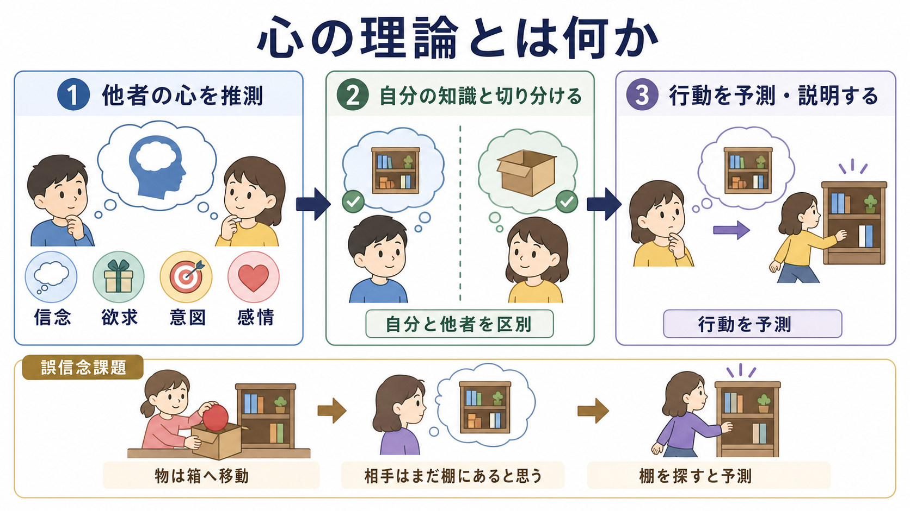
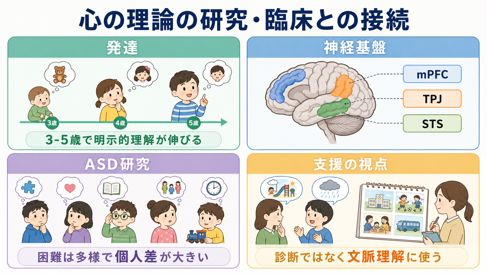

# 心の理論とは何か

## 要点

- 心の理論とは、他者の行動を、見えている刺激だけでなく「その人が何を信じ、何を望み、何を意図しているか」から説明・予測する能力である[1]。
- 典型的な検査課題は「誤信念課題」である。自分は本当の場所を知っていても、相手は古い場所を信じている、と切り分けて考える必要がある[2]。
- 標準的な明示的誤信念課題は、一般に3歳から5歳ごろにかけて大きく伸びるが、課題の言語負荷、実行機能、文脈理解によって成績は変わる[3]。
- [[ASDは脳ネットワークの違いとして理解できるのか|ASD]] 研究では重要な概念だが、心の理論の困難を「共感がない」「人の気持ちがわからない」と単純化してはいけない[4][8]。
- 神経科学では、内側前頭前野、側頭頭頂接合部、上側頭溝、側頭極などを含むメンタライジング・ネットワークが関与するとされる[5][6]。

## この記事で答える問い

1. 心の理論とは、具体的にどのような能力なのか。
2. 誤信念課題は、なぜ心の理論の代表的な課題とされるのか。
3. 心の理論は、発達、脳、ASD研究、臨床的理解とどう接続するのか。
4. 「心の理論が弱い」と言うとき、何を言いすぎてはいけないのか。

## まず結論

心の理論は、他者の行動を「外から見える動き」だけでなく、「内側にあると推定される信念・欲求・意図・知識・感情」から理解するための認知能力である。たとえば、子どもが棚を探すのを見て、「本当は箱に入っているのに、この子はまだ棚にあると思っている」と考えられるなら、観察者は現実と他者の信念を区別している。

ここで重要なのは、心の理論が「相手の心を正確に読む能力」ではないことである。むしろ、限られた手がかりから、相手の視点に立った仮説を作る能力である。したがって、心の理論はしばしば外れる。人は相手の信念を誤推定するし、文化、言語、関係性、状況の曖昧さによって推定の仕方も変わる。

## 背景

「心の理論」という語は、Premack と Woodruff がチンパンジー研究の文脈で提示した問題設定に由来する。彼らは、ある個体が自分や他者に心的状態を帰属し、その帰属にもとづいて行動を予測できるなら、それは一種の「理論」と見なせると論じた[1]。ここでいう理論とは、科学理論のように明文化された説明体系ではなく、直接は観察できない心的状態を推論する枠組みである。

発達心理学では、その後、Wimmer と Perner の誤信念課題が大きな役割を果たした[2]。誤信念課題では、登場人物が物の古い場所を信じたまま戻ってくる。観察している子どもは物の本当の場所を知っているが、登場人物は知らない。このとき「登場人物はどこを探すか」と問われる。正答するには、自分の知識をそのまま相手に投影せず、相手の誤った信念を表象しなければならない。

## 基本概念

### 信念・欲求・意図

心の理論の中心は、行動を心的状態から説明することである。たとえば、同じ「ドアへ向かう」という行動でも、忘れ物を取りに行く、誰かを迎えに行く、部屋から逃げたい、という異なる説明がありうる。心の理論は、このような行動の背後にある信念、欲求、意図を推定する。

この推定は、[[意思決定とは何か|意思決定]] の理解とも関係する。人の行動は、客観的に最善の選択ではなく、その人が信じている状況、その人が望む結果、その人が利用できる情報にもとづいて決まることが多い。

### 誤信念

誤信念とは、現実とは異なる内容を本人が信じている状態である。心の理論の重要なポイントは、「自分が知っている現実」と「相手が信じている世界」を分けられることにある。標準的な誤信念課題は、この切り分けを測るために使われてきた[2][3]。

ただし、誤信念課題に失敗したからといって、子どもが他者の心をまったく理解していないとは言えない。質問文を理解する力、記憶、抑制、注意の切り替え、物語理解も課題成績に影響する。ここで [[実行機能とは何か|実行機能]] や [[言語理解はどのように行われるのか|言語理解]] が関わってくる。

### メンタライジング

神経科学や臨床心理学では、心の理論に近い語として「メンタライジング」が使われる。メンタライジングは、自分や他者の行動を心的状態から理解する働きを広く指す。心の理論が誤信念理解を中心に語られることが多いのに対し、メンタライジングは感情、自己理解、対人関係の文脈を含みやすい。

## 仕組み

心の理論は、単一の部品ではなく、いくつかの処理が組み合わさった働きとして考えると理解しやすい。

1. 状況を把握する。
2. 相手が何を見たか、何を知らないかを推定する。
3. 相手の信念や欲求を、自分の知識から切り離して表象する。
4. その信念や欲求が、次の行動にどうつながるかを予測する。
5. 実際の反応を見て、推定を更新する。

この流れでは、[[注意とは何か|注意]] の配分、[[認知的柔軟性とは何か|認知的柔軟性]]、自己視点の抑制が必要になる。自分が知っていることを一時的に脇に置き、相手が利用できる情報だけから考える必要があるからである。

Apperly と Butterfill は、信念理解には、速いが制約のある処理と、柔軟だが負荷の高い処理が併存する可能性を論じた[7]。この見方では、日常会話の中で素早く相手の視線や行動を読む処理と、明示的に「相手は何を信じているか」を考える処理は、同じではない。心の理論は、直感的な社会的手がかり処理と、言語化された推論の両方にまたがる。

## 図解

図1は、心の理論を「他者の心的状態を推測する」「自分と他者の知識を切り分ける」「行動を予測・説明する」という三つの面から整理している。

図2は、誤信念課題の中心的な仕組みを示している。現実にはボールが箱にあるが、相手は移動を見ていないため「棚にある」と信じている。この差を扱えることが、誤信念理解の核である。

図3は、発達、神経基盤、ASD研究、支援の視点をまとめている。心の理論は研究上有用な概念だが、個人を診断名や単一能力で説明し切る道具ではない。

## 臨床・研究との接続

### 発達研究

Wellman らのメタ分析は、誤信念理解が幼児期に体系的に発達することを示した一方で、課題形式、質問の仕方、文化、言語能力などが成績に影響することも示している[3]。したがって、心の理論を発達指標として使う場合は、「何歳なら必ずできる」と機械的に見るのではなく、課題要求を分解して考える必要がある。

### ASD研究

Baron-Cohen、Leslie、Frith の研究は、ASD児の社会的困難を誤信念理解の観点から説明しようとした古典的研究である[4]。これはASD研究に大きな影響を与えたが、現在では、ASDを「心の理論の欠如」だけで説明する見方は狭すぎると考えられている。

ASDの対人困難には、感覚特性、注意、言語、予測、社会的経験、環境側の理解不足などが関わる。また、心の理論課題に困難があっても、感情的共感や倫理的配慮がないことを意味しない。臨床的には、個別診断や治療指示として断定せず、どの場面で、どの情報が、どのように読み取りにくいのかを丁寧に見る必要がある。

### 神経基盤

Frith と Frith は、メンタライジングに内側前頭前野、側頭極、上側頭溝などのネットワークが関与すると整理した[5]。Saxe と Kanwisher は、側頭頭頂接合部が他者の心的内容を考える課題で強く関与することを報告した[6]。

ただし、脳領域を一対一で「心の理論の場所」と見なすのは単純化である。心の理論課題は、物語理解、注意の切り替え、記憶、言語処理、自己他者区別を同時に含む。近年のレビューは、心の理論という語が広く使われすぎ、測定課題や生物学的基盤の解釈が不明瞭になりやすい点を指摘している[8]。

## よくある誤解

### 「心の理論がある人は相手の気持ちを正確に読める」

心の理論は、読心術ではない。相手の信念や欲求について仮説を作る能力であり、その仮説はしばしば外れる。むしろ重要なのは、相手の視点が自分の視点と異なりうると認め、必要に応じて確認・修正できることである。

### 「心の理論は共感と同じ」

心の理論は、相手が何を考えているかを推定する認知的側面を指すことが多い。一方、共感には、相手の感情を感じ取る、相手の苦痛に反応する、援助したいと思う、といった情動的・動機づけ的側面がある。両者は関係するが同一ではない。

### 「ASDは心の理論がない状態である」

これは不正確である。ASDの人々の経験や能力は多様であり、明示的な推論で補える場合もあれば、特定の社会的文脈や曖昧な合図で困難が強まる場合もある。心の理論はASD理解の一部にはなるが、個人全体を説明するラベルではない。

### 「誤信念課題だけで社会性がわかる」

誤信念課題は重要だが、社会的理解のすべてを測るわけではない。現実の対人場面では、表情、視線、声の調子、会話の含意、過去の関係、文化的規範が同時に働く。課題成績は、社会性そのものではなく、特定の状況で必要な処理の一部を反映している。

## 関連ノート

- [[実行機能とは何か]]
- [[言語理解はどのように行われるのか]]
- [[注意とは何か]]
- [[認知的柔軟性とは何か]]
- [[意思決定とは何か]]
- [[ASDは脳ネットワークの違いとして理解できるのか]]

MOC更新候補: `content/00_MOC/` 配下の認知科学・心理学系MOC、発達心理学・社会的認知系MOCがある場合に追加候補。

今後の作成候補: 「共同注意とは何か」「社会的認知とは何か」「メンタライジングとは何か」「共感とは何か」「誤信念課題とは何か」。

## 理解チェック

1. 誤信念課題で、自分が知っている現実と相手の信念を分ける必要があるのはなぜか。
2. 心の理論と共感は、どこが重なり、どこが異なるか。
3. ASD研究で心の理論を使うとき、どのような単純化に注意すべきか。
4. 心の理論課題に、実行機能や言語理解が関わるのはなぜか。

## 参考文献

[1] Premack, D., & Woodruff, G. (1978). Does the chimpanzee have a theory of mind? *Behavioral and Brain Sciences*, 1(4), 515-526. https://doi.org/10.1017/S0140525X00076512

[2] Wimmer, H., & Perner, J. (1983). Beliefs about beliefs: Representation and constraining function of wrong beliefs in young children's understanding of deception. *Cognition*, 13(1), 103-128. https://doi.org/10.1016/0010-0277(83)90004-5

[3] Wellman, H. M., Cross, D., & Watson, J. (2001). Meta-analysis of theory-of-mind development: The truth about false belief. *Child Development*, 72(3), 655-684. https://doi.org/10.1111/1467-8624.00304

[4] Baron-Cohen, S., Leslie, A. M., & Frith, U. (1985). Does the autistic child have a "theory of mind"? *Cognition*, 21(1), 37-46. https://doi.org/10.1016/0010-0277(85)90022-8

[5] Frith, U., & Frith, C. D. (2003). Development and neurophysiology of mentalizing. *Philosophical Transactions of the Royal Society B*, 358(1431), 459-473. https://doi.org/10.1098/rstb.2002.1218

[6] Saxe, R., & Kanwisher, N. (2003). People thinking about thinking people: The role of the temporo-parietal junction in "theory of mind". *NeuroImage*, 19(4), 1835-1842. https://doi.org/10.1016/S1053-8119(03)00230-1

[7] Apperly, I. A., & Butterfill, S. A. (2009). Do humans have two systems to track beliefs and belief-like states? *Psychological Review*, 116(4), 953-970. https://doi.org/10.1037/a0016923

[8] Schaafsma, S. M., Pfaff, D. W., Spunt, R. P., & Adolphs, R. (2015). Deconstructing and reconstructing theory of mind. *Trends in Cognitive Sciences*, 19(2), 65-72. https://doi.org/10.1016/j.tics.2014.11.007

## 未解決問題

- 乳児期の暗黙的な他者理解と、幼児期以降の明示的な誤信念理解は、同じ能力の発達段階なのか、それとも異なるシステムなのか。
- 心の理論課題の成績と、日常生活での対人理解はどの程度対応するのか。
- 脳画像研究で観察されるメンタライジング・ネットワークを、発達、臨床、個人差の説明にどこまで使えるのか。

