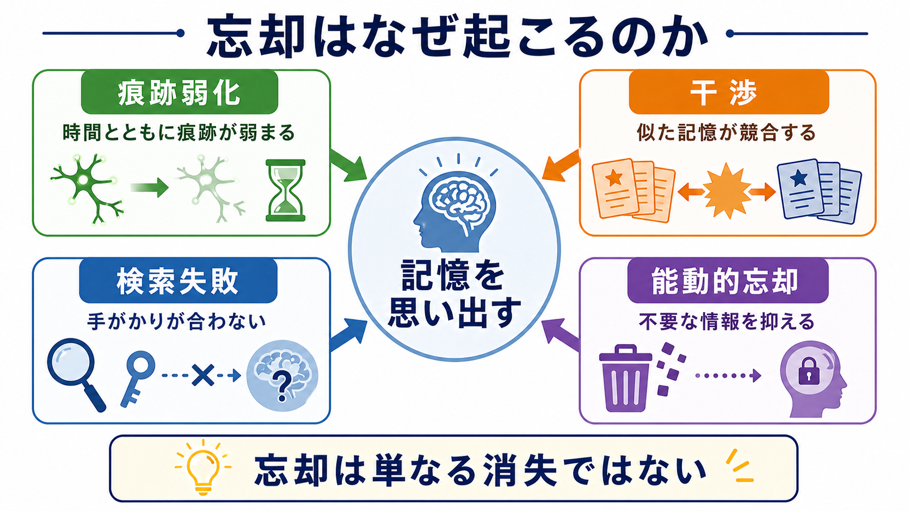
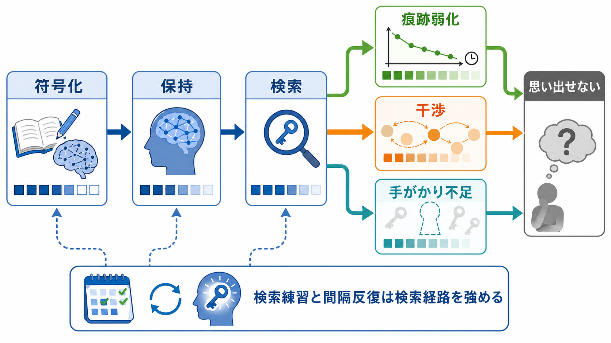

# 忘却はなぜ起こるのか

## 要点

- 忘却は、記憶が単純に「消える」だけではなく、**痕跡の弱化**、**干渉**、**検索手がかりの不一致**、**抑制・能動的忘却**が重なって起こる。
- エビングハウス以来、時間とともに成績が低下する忘却曲線は頑健に観察されるが、時間そのものが原因というより、その間に起こる競合、再学習、睡眠、文脈変化などを区別して考える必要がある[1][2]。
- 「思い出せない」は「保存されていない」と同義ではない。検索手がかりが変わると、保持されていた情報が取り出せなくなることがある[3]。
- 忘却には不適応な面だけでなく、競合する記憶を抑え、現在の目標に必要な情報を選ぶ適応的な面もある[4][5]。

## この記事で答える問い

1. 忘却は、記憶痕跡が弱くなることで起こるのか。
2. 新しい記憶や似た記憶は、なぜ以前の記憶を妨げるのか。
3. 記憶が残っていても、なぜ検索できないことがあるのか。
4. 忘却は失敗だけでなく、適応的な機能としても理解できるのか。

## まず結論

忘却は一つの原因で説明できない。学習後に成績が下がる現象だけを見ると「時間が経つと記憶が薄れる」と言いたくなる。しかし、実際の忘却には、記憶痕跡そのものの不安定化、似た情報どうしの競合、符号化時と検索時の手がかりのずれ、そして不要な記憶を抑える制御過程が関わる[2][3][5]。

したがって、忘却を理解するには [[記銘・保持・想起は何が違うのか]] の三段階を分けるとよい。記銘が浅ければ、そもそも強い痕跡が形成されない。保持のあいだには [[記憶の固定化とは何か]] と再固定化、干渉、睡眠、神経可塑性の変化が起こる。想起では、現在の文脈や手がかりが記憶痕跡とうまく合うかが重要になる。

## 背景

忘却研究の出発点として有名なのが、エビングハウスの無意味音節を用いた実験である。学習後の保持率は急速に低下し、その後ゆるやかに下がる。この曲線は後年の再分析でもおおむね再現され、忘却が時間経過に伴う規則的な低下として測定できることを示した[1]。

ただし、忘却曲線は「時間だけが記憶を壊す」とは言っていない。Wixted は、心理学と神経科学の知見を統合し、忘却を説明するには痕跡減衰、干渉、検索失敗を競合仮説ではなく相補的な説明として扱う必要があると整理した[2]。たとえば、同じ1週間でも、関連する内容を何度も学ぶ1週間と、まったく使わない1週間では、起こる忘却の性質は異なる。

## 基本概念

### 痕跡弱化

痕跡弱化とは、記憶を支える神経・認知的表象が時間とともに弱くなるという考えである。素朴には「使わないと薄れる」という説明に近い。ただし、現代的には、痕跡は静的な刻印ではなく、シナプス可塑性、神経活動、再活性化、固定化、再固定化を通じて変化し続けるものとして理解される[6]。

この見方では、忘却は単なる劣化ではなく、脳内表象が更新される過程の一部でもある。古い細部が弱まる一方で、要点や意味だけが残ることもある。このため、忘却は「量の減少」だけでなく「記憶内容の変形」としても起こる。

### 干渉

干渉とは、ある記憶が別の記憶の保持や検索を妨げることである。新しい学習が古い記憶を妨げる場合を順向干渉、古い学習が新しい記憶を妨げる場合を逆向干渉と呼ぶことが多い。干渉説では、忘却は痕跡が消えたからではなく、複数の候補が競合し、正しい候補を選びにくくなるために起こる[2][5]。

干渉は、日常的には「似たパスワードを何度も変えたら古いものと新しいものが混ざる」「似た概念をまとめて勉強すると区別しにくい」といった形で現れる。[[ワーキングメモリとは何か]] や [[選択的注意はどのように働くのか]] とも関わり、限られた認知資源のなかで競合情報をどう選ぶかが問題になる。

### 検索失敗

検索失敗とは、記憶が保持されていても、それを取り出す手がかりが不十分なために想起できない状態である。Tulving と Thomson の符号化特定性原理は、検索の成功が、学習時に形成された符号化情報と検索時の手がかりの適合に依存することを示した[3]。

この考え方では、忘却は「保存の失敗」だけではない。試験では思い出せなかった内容が、教室、匂い、会話、最初に読んだ文章の文脈によって急に思い出されることがある。これは、[[エピソード記憶とは何か]] が文脈と結びついた記憶であることとも対応する。

### 能動的忘却

能動的忘却とは、脳や認知システムが不要な情報や競合する情報を抑え、現在の目標に合う情報を選びやすくする過程である。検索誘導性忘却の研究では、ある項目を繰り返し検索すると、同じカテゴリ内の検索されなかった競合項目の想起が低下することが示された[4]。

この現象は、記憶検索が単に保存された情報を取り出す作業ではなく、競合を制御する能動的な過程であることを示す。Anderson は、干渉説を再検討し、忘却を実行制御と抑制の観点から理解する必要を論じた[5]。

## 仕組み

忘却の仕組みは、記銘、保持、検索のどこで問題が起こるかによって整理できる。

まず、記銘段階では、注意が向かなかった情報、意味づけが弱い情報、既有知識と結びつかない情報は、後で使える形になりにくい。これは忘却というより、強い記憶痕跡が形成されなかった状態に近い。

次に、保持段階では、記憶痕跡が時間とともに変化する。神経科学的には、シナプス可塑性、睡眠中の再活性化、海馬と皮質の相互作用、新しい学習による干渉などが関係する[6]。Sadeh らは、忘却パターンの違いから、痕跡減衰と干渉を区別して考える必要を示した[7]。

最後に、検索段階では、思い出すための手がかりが適切かどうかが決定的になる。手がかりが合わなければ、記憶が残っていても想起できない。逆に、検索練習は記憶を強める。Roediger と Karpicke は、再読よりもテスト形式で取り出す練習が長期保持を高めることを示し、検索そのものが学習を支えることを明らかにした[8]。

## 図解

上の図では、忘却を三つの経路として整理している。

| 経路 | 何が起こるか | 典型例 | 対応しやすい工夫 |
|---|---|---|---|
| 痕跡弱化 | 表象が弱まり、細部が失われる | しばらく使わない知識が曖昧になる | 間隔反復、睡眠、再活性化 |
| 干渉 | 似た記憶が競合する | 似た専門用語やパスワードが混ざる | 差異化、比較、文脈を分けた練習 |
| 検索失敗 | 手がかりが合わず取り出せない | 見れば分かるが自力で言えない | 検索練習、手がかりの多様化 |
| 能動的忘却 | 競合記憶が抑制される | ある情報を使うほど別候補が出にくい | 必要な候補を意図的に再検索する |

## 臨床・研究との接続

忘却の理論は、教育、臨床心理、神経科学研究にまたがって重要である。教育では、忘却を防ぐには「同じ教材を長く眺める」よりも、時間を空けて検索するほうが有効になりやすい[8]。この知見は、学習計画や復習設計に直結する。

臨床や精神医学の文脈では、忘却を単純に「記憶力の低下」とみなすと誤解が生じる。たとえば、抑うつ、不安、PTSD、睡眠障害では、記憶の形成、保持、検索、情動によるバイアスが異なる形で変化しうる。ただし、この記事の内容は教育・研究目的の整理であり、個別の診断や治療方針を示すものではない。

研究上は、忘却を測る課題設計が重要である。再認、自由再生、手がかり再生、検索練習、干渉課題では、同じ「忘れた」という成績低下でも意味が異なる。したがって、実験結果を読むときは、記憶痕跡そのものの弱化を測っているのか、検索手がかりの不足を測っているのか、競合の制御を測っているのかを区別する必要がある。

## よくある誤解

### 誤解1: 忘却は記憶が完全に消えることだけを指す

多くの場合、忘却は完全消失ではなく、検索しにくさ、競合、細部の変形として現れる。手がかりが変わると思い出せることがあるため、「今思い出せない」ことから「保存されていない」とは直ちに言えない[3]。

### 誤解2: 復習は何度も読み返せばよい

再読は親近感を高めるが、長期保持には検索練習が有利なことがある。自力で思い出す努力は、検索経路を強め、後の想起を助ける[8]。

### 誤解3: 忘却は常に悪い

忘却は、不要な細部や競合情報を減らし、現在の判断をしやすくする機能も持つ。すべてを同じ強さで保持すれば、むしろ検索や意思決定は困難になる[5][6]。

## 関連ノート

- [[記銘・保持・想起は何が違うのか]]
- [[記憶の固定化とは何か]]
- [[エピソード記憶とは何か]]
- [[意味記憶とは何か]]
- [[ワーキングメモリとは何か]]
- [[注意とは何か]]
- [[選択的注意はどのように働くのか]]

MOC更新候補: `content/00_MOC/MOC｜認知科学・心理学.md`

## 理解チェック

1. 「忘れた」と「検索できない」は、どのように違うか。
2. 痕跡弱化説と干渉説は、どのような現象をそれぞれ説明しやすいか。
3. 符号化特定性原理から見ると、試験勉強で手がかりを増やすには何をすればよいか。
4. 検索練習は、なぜ再読とは異なる効果を持つのか。

## 未解決問題

- 痕跡弱化、干渉、検索失敗を、行動実験だけでどこまで分離できるか。
- 能動的忘却は、適応的な情報選択と不適応な記憶回避の境界をどのようにまたぐのか。
- 神経科学的な「痕跡の変化」と、心理学的な「思い出せなさ」をどの粒度で対応づけるべきか。

## 参考文献

[1] Murre, J. M. J., & Dros, J. (2015). Replication and Analysis of Ebbinghaus' Forgetting Curve. *PLOS ONE*, 10(7), e0120644. https://doi.org/10.1371/journal.pone.0120644

[2] Wixted, J. T. (2004). The Psychology and Neuroscience of Forgetting. *Annual Review of Psychology*, 55, 235-269. https://doi.org/10.1146/annurev.psych.55.090902.141555

[3] Tulving, E., & Thomson, D. M. (1973). Encoding specificity and retrieval processes in episodic memory. *Psychological Review*, 80(5), 352-373. https://doi.org/10.1037/h0020071

[4] Anderson, M. C., Bjork, R. A., & Bjork, E. L. (1994). Remembering can cause forgetting: Retrieval dynamics in long-term memory. *Journal of Experimental Psychology: Learning, Memory, and Cognition*, 20(5), 1063-1087. https://doi.org/10.1037/0278-7393.20.5.1063

[5] Anderson, M. C. (2003). Rethinking interference theory: Executive control and the mechanisms of forgetting. *Journal of Memory and Language*, 49(4), 415-445. https://doi.org/10.1016/j.jml.2003.08.006

[6] Davis, R. L., & Zhong, Y. (2017). The Biology of Forgetting: A Perspective. *Neuron*, 95(3), 490-503. https://doi.org/10.1016/j.neuron.2017.05.039

[7] Sadeh, T., Ozubko, J. D., Winocur, G., & Moscovitch, M. (2014). Forgetting patterns differentiate between two forms of memory representation. *Nature Communications*, 5, 5184. https://doi.org/10.1038/ncomms5184

[8] Roediger, H. L., III, & Karpicke, J. D. (2006). Test-enhanced learning: Taking memory tests improves long-term retention. *Psychological Science*, 17(3), 249-255. https://doi.org/10.1111/j.1467-9280.2006.01693.x
