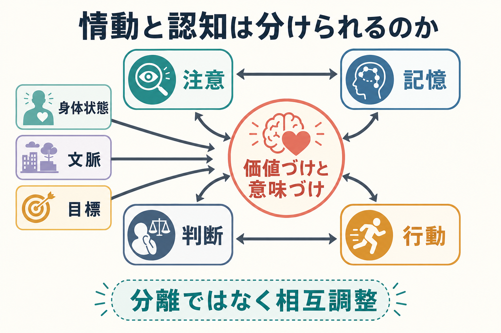
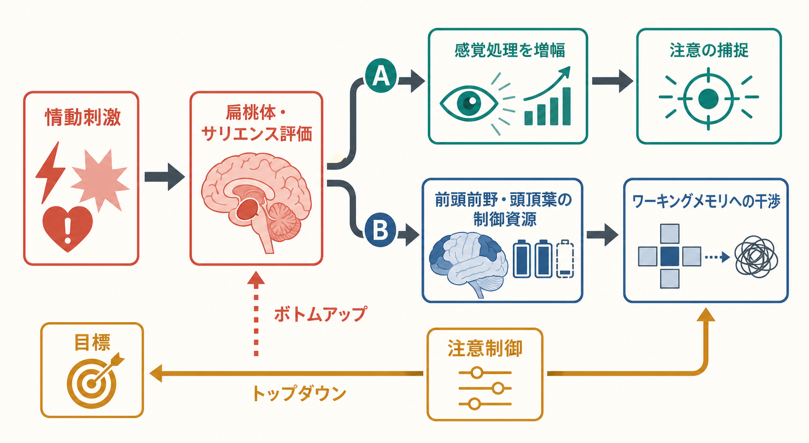
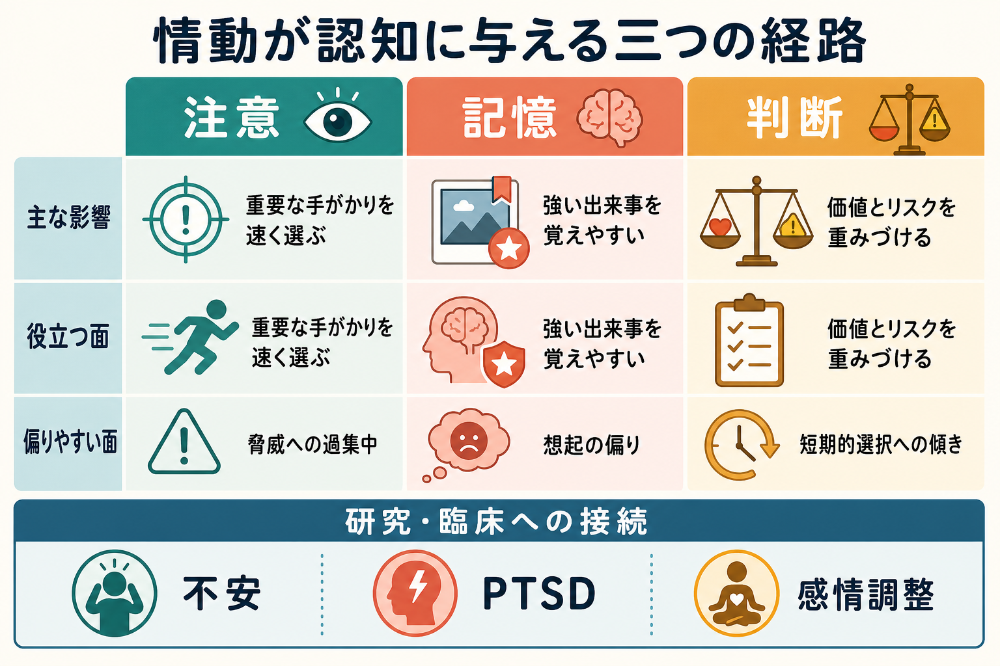

# 情動と認知は分けられるのか

## 要点

- 情動と認知は、教科書上は分けて説明できるが、実際の脳内処理では強く重なり合う。
- 情動は「理性を乱すノイズ」だけではなく、何に注意を向け、何を記憶し、どの選択肢を重く見るかを調整する情報である。
- 扁桃体、海馬、前頭前野、頭頂葉、感覚皮質、身体状態を扱うネットワークは、固定的な「情動領域」「認知領域」としてではなく、課題や文脈に応じて動的に協調する。
- 不安、PTSD、うつ、衝動的意思決定などを理解するには、情動と認知のどちらか一方ではなく、両者の相互作用を見る必要がある。

## この記事で答える問い

- 情動と認知は、どこまで別々の機能として扱えるのか。
- 感情は [[注意とは何か|注意]]、[[エピソード記憶とは何か|記憶]]、[[意思決定とは何か|判断・意思決定]] にどのような影響を与えるのか。
- なぜ強い感情は、役に立つこともあれば、認知機能を妨げることもあるのか。

## まず結論

情動と認知は、分析のためには分けられる。しかし、心の働きとしてはきれいに分離できない。より正確には、情動は認知の外側から介入する別システムではなく、知覚、注意、記憶、予測、価値づけ、行動選択の中に埋め込まれた調整過程である。

Pessoa は、複雑な情動・認知行動は「情動専用領域」と「認知専用領域」の単純な足し算ではなく、複数の脳領域が一時的に作るネットワークの協調から生じると論じた [1]。Phelps も、ヒト扁桃体研究を通じて、情動処理は感情学習、注意、記憶、社会的判断、情動反応の変化にまたがると整理している [2]。この見方では、「感情が認知を邪魔する」という一方向の説明よりも、「価値づけが認知資源の配分を変える」と考える方が理解しやすい。

## 背景

古典的には、情動は身体反応や主観的感情、認知は知覚・記憶・推論・問題解決のような情報処理として分けられてきた。この区分は、授業や研究デザインでは便利である。たとえば、[[ワーキングメモリとは何か|ワーキングメモリ]] 課題に情動刺激を入れる、あるいは恐怖顔や脅威語への反応を測る、という形で実験を組みやすい。

しかし、実際の生活場面では、認知だけが先にあり、後から情動が加わるわけではない。危険そうな音にすばやく振り向く、恥ずかしい出来事を何度も思い出す、損失への不安で選択肢を過大評価する、といった場面では、情動的な意味づけが最初から情報処理の優先順位を変えている。

近年の情動神経科学では、扁桃体だけを「情動の中枢」とみなすより、扁桃体、前頭前野、海馬、視床、線条体、視覚皮質、脳幹、自律神経系を含む広いネットワークとして理解する傾向が強い [7]。このため、情動と認知の境界は、脳の地図上に引ける線というより、研究目的に応じた便宜的な区分に近い。

## 基本概念

### 情動

情動とは、出来事が自分にとってどれほど重要かを評価し、身体状態、注意、行動準備を変える過程である。恐怖、怒り、喜び、悲しみのようなカテゴリーだけでなく、覚醒度、快・不快、脅威、報酬、予測誤差、身体感覚の変化も関わる。

### 認知

認知とは、情報を選び、保持し、意味づけ、推論し、行動を選ぶ過程である。ここには [[選択的注意はどのように働くのか|選択的注意]]、[[長期記憶とは何か|長期記憶]]、[[実行機能とは何か|実行機能]]、[[抑制制御とは何か|抑制制御]] などが含まれる。

### 情動認知相互作用

情動認知相互作用とは、情動が認知を変え、認知が情動を変える循環である。たとえば、脅威刺激は注意を捕捉しやすいが、目標や文脈を使った再評価は情動反応を弱めうる。Ochsner と Gross は、再評価のような認知的情動調整を、情動生成システムと認知制御システムの相互作用として整理している [8]。

## 仕組み

### 1. 情動は注意の優先順位を変える

情動的に重要な刺激は、他の刺激よりも速く検出されやすい。脅威、怒った表情、痛みの手がかり、報酬に結びついた刺激は、感覚処理を増幅し、注意を引きつける。Vuilleumier は、扁桃体が感覚皮質へ直接・間接の調整信号を送り、情動的意味をもつ刺激の表象を強めると整理している [3]。

この働きは適応的である。危険や重要な機会を見逃さないためには、すべてを均等に処理するより、価値の高い刺激に処理資源を寄せる方がよい。一方で、不安が強いと脅威関連刺激への過集中が起こり、[[トップダウン注意とボトムアップ注意は何が違うのか|トップダウン注意]] による目標維持が難しくなることがある。

### 2. 情動は記憶の符号化と固定化を変える

強い情動を伴う出来事は、記憶に残りやすい。これは、情動覚醒が注意を狭め、符号化を強め、扁桃体と内側側頭葉の相互作用を通じて [[記憶の固定化とは何か|記憶の固定化]] を促すためである。LaBar と Cabeza は、扁桃体損傷では情動による記憶増強が弱まり、急性ストレスホルモンや扁桃体・海馬相互作用が情動記憶に関わると整理している [4]。

ただし、「感情的なら必ず正確に覚える」わけではない。情動は中心的な手がかりを強める一方で、周辺情報を落とすことがある。また、強いストレスや慢性的ストレスは想起や海馬機能を損なう場合がある [4]。情動記憶は「鮮明さ」と「正確さ」を混同しやすい点に注意が必要である。

### 3. 情動はワーキングメモリと実行制御を圧迫する

情動刺激は、現在の目標とは無関係でも、処理資源を奪うことがある。Dolcos と McCarthy は、遅延反応型のワーキングメモリ課題中に情動妨害刺激を呈示すると、扁桃体や腹側前頭前野の活動が高まり、背外側前頭前野や頭頂葉などのワーキングメモリ関連活動が相対的に低下し、成績も悪化することを示した [5]。

この結果は、情動が単に「気分」だけを変えるのではなく、課題維持に必要な神経資源の配分そのものを変えることを示している。[[中央実行系とは何か|中央実行系]] や [[ワーキングメモリ容量はなぜ限られているのか|ワーキングメモリ容量]] の観点からいえば、情動的な妨害刺激は、保持すべき情報と競合する高優先度の入力として働く。

### 4. 情動は判断と意思決定の重みづけを変える

判断は、事実の計算だけでなく、価値、損失、期待、身体感覚の重みづけを含む。Lerner らは、感情が意思決定に広く、強く、予測可能に影響し、ときに有害だが、ときに有益な役割ももつと整理した [6]。恐怖はリスク回避を高めやすく、怒りは確信や接近行動を強めやすい。悲しみや嫌悪も、評価や交換判断に異なる影響を与えうる。

これは、情動が「非合理性」そのものだという意味ではない。むしろ情動は、選択肢の価値を素早く圧縮して扱う仕組みでもある。問題は、その重みづけが現在の課題に合っているかである。現実の危険をすばやく避ける場面では有効だが、長期的な計画や複雑な統計判断では短期的な不快感や恐怖が過大評価されることがある。

## 図解

この記事の図解は、情動と認知を二分法ではなく、相互調整として読むことを意図している。

| 図 | 読み方 |
|---|---|
| 図1 | 情動的な価値づけが、注意・記憶・判断・行動の中心に入り、身体状態、文脈、目標から影響を受けることを示す。 |
| 図2 | 情動刺激が扁桃体やサリエンス評価を通じて感覚処理を増幅し、同時に前頭前野・頭頂葉の制御資源と競合することを示す。 |
| 図3 | 注意、記憶、判断という三つの認知機能ごとに、情動の有益な面と偏りやすい面を比較する。 |

## 臨床・研究との接続

不安症では、脅威手がかりへの注意バイアスや予期不安が、知覚、注意、判断を変えうる。PTSD では、情動記憶の侵入的想起、過覚醒、回避が、記憶と注意の相互作用として現れる。うつでは、否定的情報への注意・記憶バイアスや反すうが、気分と認知制御の循環として問題になる。

ただし、これらは個別診断や治療指示ではなく、研究上の理解枠組みである。臨床では、症状、生活文脈、既往、身体疾患、薬物、睡眠、社会的要因を含めて総合的に評価する必要がある。

研究面では、Okon-Singer らが指摘するように、情動認知相互作用を理解するには、課題デザイン、個人差、時間スケール、脳領域間結合、身体状態を同時に考える必要がある [7]。単一領域の活動だけで「情動」や「認知」を代表させると、現象を過度に単純化しやすい。

## よくある誤解

### 誤解1: 情動は認知を邪魔するだけである

情動は、重要な刺激を速く選び、記憶に残し、行動準備を整える。問題は情動の有無ではなく、情動による重みづけが現在の目標や環境に合っているかである。

### 誤解2: 扁桃体は恐怖だけを処理する

扁桃体は恐怖研究で有名だが、より広く、刺激の関連性、価値、学習、注意、記憶との相互作用に関わる [2]。したがって「扁桃体 = 恐怖中枢」とだけ覚えると狭すぎる。

### 誤解3: 認知的に考えれば感情は消せる

再評価や注意の向け替えは情動反応を変えうるが、情動は身体状態、記憶、環境、習慣的予測にも支えられている。[[認知的柔軟性とは何か|認知的柔軟性]] や抑制制御だけで完全に制御できるものではない。

### 誤解4: 感情的な記憶は正確である

情動は記憶の強さや主観的確信を高めることがあるが、詳細の正確さを保証しない。中心情報は強まり、周辺情報や文脈は歪むことがある。

## 関連ノート

- [[注意とは何か]]
- [[選択的注意はどのように働くのか]]
- [[トップダウン注意とボトムアップ注意は何が違うのか]]
- [[ワーキングメモリとは何か]]
- [[エピソード記憶とは何か]]
- [[記憶の固定化とは何か]]
- [[意思決定とは何か]]
- [[実行機能とは何か]]
- [[抑制制御とは何か]]

## MOC更新候補

- `content/00_MOC/` 配下の認知科学・心理学系 MOC に追加候補。
- 「情動」「注意」「記憶」「意思決定」「実行機能」を横断するハブ記事として配置候補。

## 理解チェック

1. 情動と認知を研究上は分けられるが、実際の処理では分離しにくい理由を説明できるか。
2. 情動刺激が注意を捕捉することの利点と欠点を、それぞれ一つずつ挙げられるか。
3. 情動記憶が「強い記憶」になりやすいことと、「正確な記憶」であることが同じではない理由を説明できるか。
4. 情動が意思決定に与える影響を、「非合理」ではなく「価値の重みづけ」として説明できるか。

## 未解決問題

- 情動と認知の境界を、主観報告、行動指標、神経活動、身体信号のどの水準で定義すべきか。
- 情動による注意捕捉が適応的に働く条件と、不安・PTSD・反すうなどで悪循環になる条件をどう区別するか。
- 個人差、発達、文化、学習歴が、情動認知相互作用のどの段階に強く影響するか。
- 大規模脳ネットワークの記述を、臨床的に使える評価や介入へどう接続するか。

## 参考文献

[1] Pessoa, L. (2008). On the relationship between emotion and cognition. *Nature Reviews Neuroscience*, 9, 148-158. https://doi.org/10.1038/nrn2317

[2] Phelps, E. A. (2006). Emotion and cognition: Insights from studies of the human amygdala. *Annual Review of Psychology*, 57, 27-53. https://doi.org/10.1146/annurev.psych.56.091103.070234

[3] Vuilleumier, P. (2005). How brains beware: Neural mechanisms of emotional attention. *Trends in Cognitive Sciences*, 9(12), 585-594. https://doi.org/10.1016/j.tics.2005.10.011

[4] LaBar, K. S., & Cabeza, R. (2006). Cognitive neuroscience of emotional memory. *Nature Reviews Neuroscience*, 7, 54-64. https://doi.org/10.1038/nrn1825

[5] Dolcos, F., & McCarthy, G. (2006). Brain systems mediating cognitive interference by emotional distraction. *The Journal of Neuroscience*, 26(7), 2072-2079. https://doi.org/10.1523/JNEUROSCI.5042-05.2006

[6] Lerner, J. S., Li, Y., Valdesolo, P., & Kassam, K. S. (2015). Emotion and decision making. *Annual Review of Psychology*, 66, 799-823. https://doi.org/10.1146/annurev-psych-010213-115043

[7] Okon-Singer, H., Hendler, T., Pessoa, L., & Shackman, A. J. (2015). The neurobiology of emotion-cognition interactions: Fundamental questions and strategies for future research. *Frontiers in Human Neuroscience*, 9, 58. https://doi.org/10.3389/fnhum.2015.00058

[8] Ochsner, K. N., & Gross, J. J. (2005). The cognitive control of emotion. *Trends in Cognitive Sciences*, 9(5), 242-249. https://doi.org/10.1016/j.tics.2005.03.010
