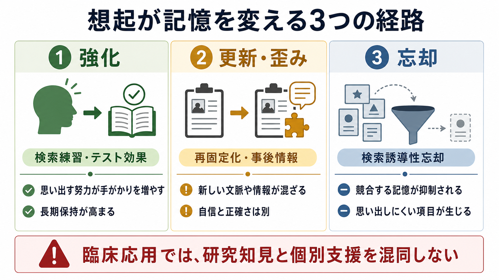
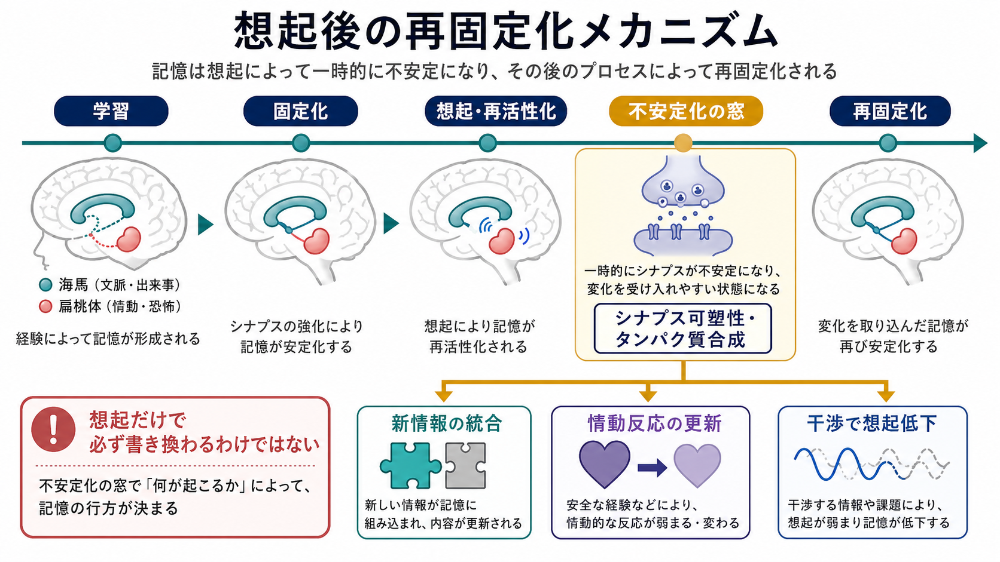

# 想起は記憶を変えるのか

## 要点

- 想起は、保存された記憶をそのまま再生するだけではなく、手がかり・文脈・現在の知識を使って記憶を再構成する過程である。
- 想起された記憶は、条件によって一時的に不安定化し、再固定化の過程で新しい情報や情動的意味づけを取り込むことがある。
- 一方で、想起は常に記憶を歪めるわけではない。検索練習は長期保持を強めることがあり、競合記憶の抑制は検索誘導性忘却を生むことがある。
- 臨床応用では、再固定化研究は有望な枠組みだが、個別の治療指示として単純化してはいけない。

## この記事で答える問い

この記事では、[[記銘・保持・想起は何が違うのか|想起]]が記憶を変えるとはどういう意味かを整理する。中心になる問いは、次の三つである。

1. 思い出すだけで、記憶内容は本当に変わるのか。
2. 変わるとすれば、強化、更新、歪み、忘却はどのように分かれるのか。
3. 教育・証言・トラウマ記憶研究では、この知見をどこまで使えるのか。

## まず結論

想起は記憶を変えうる。ただし、「思い出した瞬間に必ず書き換わる」という意味ではない。エピソード記憶は、出来事を固定された映像として保存するのではなく、手がかりをもとに再構成されるため、想起時の文脈や質問、後から入る情報の影響を受けやすい[1]。

神経科学的には、いったん固定化された恐怖記憶でも、想起によって再活性化されると一時的に不安定になり、再固定化にタンパク質合成などの可塑的過程を必要とすることが示された[2]。ヒトのエピソード記憶でも、さりげないリマインダーの後に新しいリストを学習すると、後日の想起で新情報が元の記憶に混入しやすくなる[3]。

したがって、想起は「記憶の読み出し」であると同時に、「記憶の再編成の機会」でもある。

## 背景

日常的には、記憶は倉庫や録画のように考えられがちである。しかし、[[エピソード記憶とは何か|エピソード記憶]]は、過去の出来事を柔軟に組み合わせ、未来の場面を想像するためにも使われる。Schacter と Addis は、この柔軟性が適応的である一方、錯誤や歪みを生む土台にもなると整理している[1]。

この見方では、想起は単なる出力ではない。何を手がかりにするか、どの文脈で語るか、誰に質問されるか、どんな感情状態にあるかによって、思い出される内容は少しずつ変わる。[[意味記憶とは何か|意味記憶]]や現在の信念も、過去の出来事の解釈に入り込む。

## 基本概念

**固定化**

新しく学習された記憶が、時間とともに比較的安定した状態へ移る過程である。[[記憶の固定化とは何か|記憶の固定化]]には、シナプスレベルの変化と、[[海馬回路は記憶をどう形成するのか|海馬]]と大脳皮質の相互作用が関わる。

**再活性化**

手がかりによって、保存されていた記憶表象が再び活動すること。再活性化は、完全な意識的想起でなくても起こりうる。

**再固定化**

再活性化された記憶が一時的に不安定になり、その後ふたたび安定化する過程である。Nader らの恐怖条件づけ研究は、想起後の恐怖記憶が再固定化に依存することを強く示した[2]。

**検索練習**

学習内容を読み直すだけでなく、自分で思い出そうとする練習である。Roediger と Karpicke は、短期的には再学習が有利な場合があっても、遅延テストでは想起テストを行った群の保持が高いことを示した[4]。

**検索誘導性忘却**

ある項目を繰り返し想起すると、同じカテゴリーに属する競合項目が後で思い出しにくくなる現象である。Anderson, Bjork, Bjork の古典的研究は、「思い出すこと」が関連項目の忘却を生むことを示した[5]。

## 仕組み

想起が記憶を変える経路は、一つではない。少なくとも、次の三つを区別すると理解しやすい。

### 1. 想起が記憶を強める

検索練習では、思い出す努力そのものが後の想起を助ける。これは、単に同じ情報に再接触したからではなく、手がかりから目標記憶へ至る検索経路が強まるためだと考えられる[4]。学習場面では、読み直しだけで「わかった気がする」より、短いテストや自己説明で取り出す方が、長期保持に有利になりやすい。

### 2. 想起が記憶を更新する

再固定化の考え方では、記憶は想起によって一時的に可塑的な状態になり、その後に安定化する。この窓の中で新しい情報、情動反応、文脈が入ると、後で思い出される記憶が変わることがある[2][3]。これは[[シナプス可塑性とは何か|シナプス可塑性]]や[[長期増強LTPとは何か|長期増強]]のような学習機構と接続して考えられる。

ただし、再固定化は万能の書き換え装置ではない。記憶の古さ、強さ、想起の仕方、新情報とのずれ、想起後の時間窓などによって、更新が起こるかどうかは変わる。

### 3. 想起が記憶を歪める・弱める

想起後に入る質問や説明は、記憶に混ざることがある。Loftus と Palmer の研究では、自動車事故映像について使われる動詞が、速度推定や後の記憶報告に影響した[6]。これは、目撃証言や面接で「何を聞くか」が記憶報告を変えうることを示す。

また、競合する記憶がある場合、ある情報を想起することは別の情報へのアクセスを下げる。検索誘導性忘却は、記憶が単に弱くなるというより、競合を減らすための抑制的制御として理解されることが多い[5]。

## 図解

上の図は、想起が記憶に及ぼす変化を、強化、更新・歪み、忘却の三経路として整理している。重要なのは、これらが排他的ではない点である。同じ想起でも、中心情報は強まり、周辺情報は弱まり、情動的意味づけは更新されることがある。

再固定化の図は、学習、固定化、想起・再活性化、不安定化、再固定化という流れを示す。想起後の不安定化の窓では、記憶が変化を受け入れやすくなるが、それは「どんな記憶でも自由に編集できる」という意味ではない。

## 臨床・研究との接続

恐怖記憶の研究では、想起後の時間窓に消去学習を入れることで、恐怖反応の再発を抑えられる可能性が検討されてきた。Schiller らは、ヒトの恐怖条件づけで再固定化更新を利用し、恐怖反応の回復を抑える結果を報告した[7]。この流れは、[[PTSDでは恐怖記憶ネットワークに何が起きているのか|PTSDの恐怖記憶ネットワーク]]や[[扁桃体過活動は不安症やPTSDにどう関わるのか|扁桃体過活動]]の理解と接続する。

ただし、臨床では注意が必要である。研究で示されるのは、特定の実験条件で情動反応が変わりうるという知見であり、個人のトラウマ記憶を単純に「想起すれば書き換えられる」と断定するものではない。医療・心理支援では、安全な関係、適切な評価、症状の重さ、解離や回避の有無を含めて慎重に扱う必要がある。

教育研究では、検索練習は実践的な応用がしやすい。短い小テスト、間隔反復、フィードバックつきの自己テストは、記憶を強める想起の代表例である。一方、証言研究では、誘導的質問や反復質問が記憶報告を変える可能性があるため、面接の手続きそのものが重要になる[6]。

## よくある誤解

**誤解1: 想起すると必ず記憶は歪む**

想起は歪みの機会にもなるが、同時に記憶を強化する機会でもある。検索練習が長期保持を高めることは、想起が学習の道具にもなることを示している[4]。

**誤解2: 記憶は正確か、完全に作り話かのどちらかである**

多くの記憶は、正確な要素と再構成された要素を含む。細部が変わったからといって全体が虚偽とは限らず、逆に鮮明さや自信が高いからといって正確とも限らない。

**誤解3: 再固定化を使えばトラウマ記憶を消せる**

再固定化研究は重要だが、臨床応用は条件依存的である。恐怖反応の変化と、個人史としての記憶内容の消去は同じではない。この記事は教育・研究目的の整理であり、個別の診断や治療指示ではない。

## 関連ノート

- [[記銘・保持・想起は何が違うのか]]
- [[記憶の固定化とは何か]]
- [[エピソード記憶とは何か]]
- [[意味記憶とは何か]]
- [[海馬回路は記憶をどう形成するのか]]
- [[シナプス可塑性とは何か]]
- [[長期増強LTPとは何か]]
- [[PTSDでは恐怖記憶ネットワークに何が起きているのか]]
- [[扁桃体過活動は不安症やPTSDにどう関わるのか]]

## MOC更新候補

- `content/00_MOC/` 内の認知科学・心理学系 MOC に、記憶・想起・再固定化の項目として追加候補。
- 脳・神経科学系 MOC では、海馬、扁桃体、シナプス可塑性、恐怖記憶の橋渡しノートとして追加候補。

## 理解チェック

1. 「想起は記憶を変える」とは、記憶が毎回完全に作り替えられるという意味ではない。では、どの条件で変化しやすいか。
2. 検索練習が記憶を強める場合と、検索誘導性忘却が関連項目を弱める場合は、どこが違うか。
3. 目撃証言や臨床面接で、質問の仕方が重要になるのはなぜか。

## 未解決問題

- ヒトの自然な自伝的記憶で、再固定化による更新がどの程度一般化できるか。
- 情動反応の更新と、出来事内容の記憶更新をどこまで分けて測定できるか。
- 検索練習、再固定化、検索誘導性忘却を統一的な計算モデルで説明できるか。
- 臨床応用で、再固定化の時間窓を安全かつ再現性高く利用できる条件は何か。

## 参考文献

[1] Schacter, D. L., & Addis, D. R. (2007). The cognitive neuroscience of constructive memory: remembering the past and imagining the future. *Philosophical Transactions of the Royal Society B*, 362(1481), 773-786. https://doi.org/10.1098/rstb.2007.2087

[2] Nader, K., Schafe, G. E., & LeDoux, J. E. (2000). Fear memories require protein synthesis in the amygdala for reconsolidation after retrieval. *Nature*, 406, 722-726. https://doi.org/10.1038/35021052

[3] Hupbach, A., Gomez, R., Hardt, O., & Nadel, L. (2007). Reconsolidation of episodic memories: A subtle reminder triggers integration of new information. *Learning & Memory*, 14(1-2), 47-53. https://doi.org/10.1101/lm.365707

[4] Roediger, H. L., III, & Karpicke, J. D. (2006). Test-enhanced learning: Taking memory tests improves long-term retention. *Psychological Science*, 17(3), 249-255. https://doi.org/10.1111/j.1467-9280.2006.01693.x

[5] Anderson, M. C., Bjork, R. A., & Bjork, E. L. (1994). Remembering can cause forgetting: Retrieval dynamics in long-term memory. *Journal of Experimental Psychology: Learning, Memory, and Cognition*, 20(5), 1063-1087. https://doi.org/10.1037/0278-7393.20.5.1063

[6] Loftus, E. F., & Palmer, J. C. (1974). Reconstruction of automobile destruction: An example of the interaction between language and memory. *Journal of Verbal Learning and Verbal Behavior*, 13(5), 585-589. https://doi.org/10.1016/S0022-5371(74)80011-3

[7] Schiller, D., Monfils, M.-H., Raio, C. M., Johnson, D. C., LeDoux, J. E., & Phelps, E. A. (2010). Preventing the return of fear in humans using reconsolidation update mechanisms. *Nature*, 463, 49-53. https://doi.org/10.1038/nature08637

