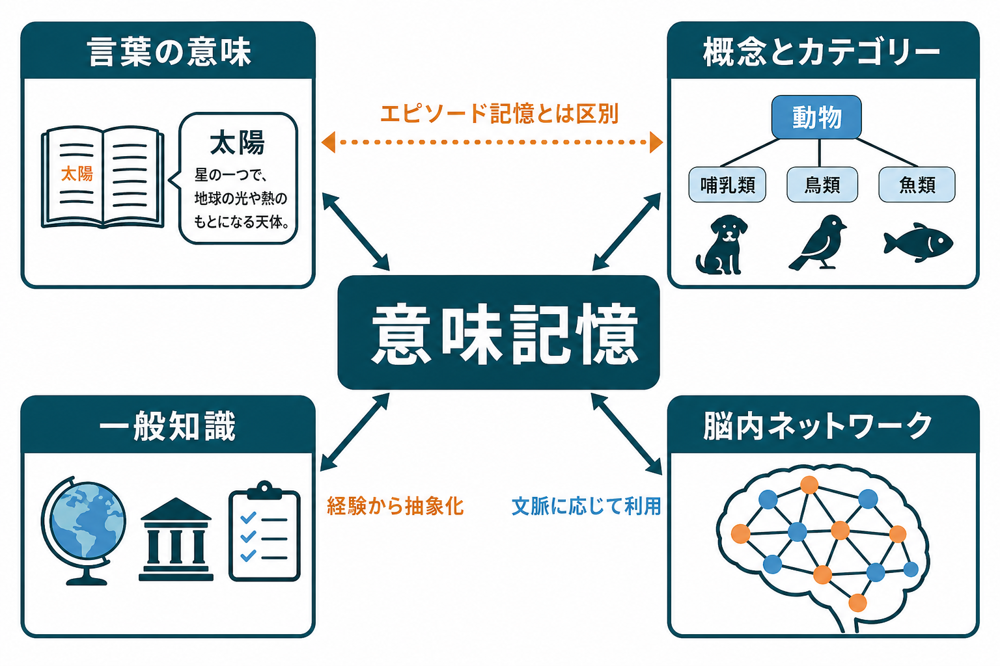
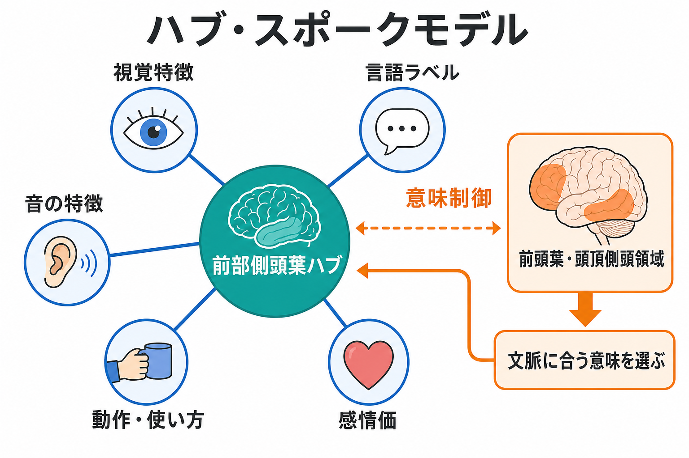

# 意味記憶とは何か

## 要点

- 意味記憶は、言葉の意味、概念、カテゴリー、事実、社会的に共有される一般知識を保持し、利用する長期記憶システムである[1]。
- 「昨日どこで犬を見たか」のような個別経験はエピソード記憶に近く、「犬とはどのような動物か」「犬と猫はどこが違うか」は意味記憶に近い[1]。
- 現代の研究では、意味記憶を単一の貯蔵庫ではなく、感覚・運動・言語・情動情報を統合する表象ネットワークと、文脈に合う意味を選ぶ制御ネットワークの協調として捉える[2][3]。
- 前部側頭葉は、さまざまな特徴を抽象的な概念へ統合する「ハブ」として重視される。一方、下前頭回や後部中側頭回などは、必要な意味を課題に応じて取り出す意味制御に関わる[3][6]。
- 意味性認知症では、言葉や物の意味が徐々に失われ、呼称、語義判断、カテゴリー知識に障害が現れる。これは、前部側頭葉を中心とする意味表象の障害を考えるうえで重要な臨床モデルである[2][7]。

## この記事で答える問い

1. 意味記憶は、エピソード記憶や[[ワーキングメモリ容量はなぜ限られているのか|ワーキングメモリ]]と何が違うのか。
2. 言葉、概念、カテゴリー、一般知識は、どのような形で脳内に表現されるのか。
3. 前部側頭葉、側頭葉皮質、前頭葉、頭頂側頭領域は、意味記憶にどう関わるのか。
4. 意味性認知症、失語、神経心理検査、fMRI、TMS 研究から何が分かるのか。

## まず結論

意味記憶とは、「自分がいつどこで学んだか」を思い出さなくても使える知識の体系である。たとえば「リンゴは果物である」「医師は診療を行う」「三角形には三つの辺がある」「『走る』は移動を表す動詞である」といった知識は、特定の一回きりの出来事から切り離されて利用できる。

ただし、意味記憶は経験から独立して突然生まれるものではない。個別の経験、言語入力、知覚、行為、社会的文脈が繰り返し重なり、共通する構造が抽象化されることで、概念や語の意味として安定していく[5]。この意味で、意味記憶はエピソード記憶と対立するだけでなく、経験から一般知識を作る過程とも深く結びついている。[[海馬回路は記憶をどう形成するのか|海馬回路]]は新しい経験の符号化や再構成に重要だが、長期的な概念知識は広い皮質ネットワークへ分散して支えられると考えられる。

## 背景

記憶研究では、Tulving によるエピソード記憶と意味記憶の区別が大きな出発点になった。エピソード記憶は、自己が経験した出来事を時間・場所・文脈とともに思い出す記憶である。一方、意味記憶は、世界についての一般的知識であり、個別の想起体験を必ずしも伴わない[1]。

この区別は便利だが、境界は絶対ではない。子どもが何度も犬を見る、名前を聞く、触る、絵本で読む、吠え声を聞く、といった経験を通して「犬」という概念を作るように、意味記憶は多くのエピソード的経験から抽象化される。また、意味知識があるからこそ、ある出来事を「犬に吠えられた」と構造化して思い出せる。したがって、意味記憶とエピソード記憶は機能的に区別できるが、実際の認知では相互に支え合う。

神経科学では、意味記憶は長らく「どこに保存されているか」という場所探しとして研究されてきた。しかし、現在は[[脳内ネットワークとは何か|脳内ネットワーク]]としての見方が重要である。単語を読む、物を見る、音を聞く、道具を使う、人物を認識する、といった課題ごとに、視覚、聴覚、運動、情動、言語、制御のネットワークが異なる比重で関わる[3][4]。

## 基本概念

### 意味記憶

意味記憶は、語の意味、物や出来事のカテゴリー、事実、規則、社会的知識などを含む長期記憶である。ここでいう「意味」は、辞書的な定義だけではない。たとえば「ハンマー」は、形、重さ、持ち方、叩くという行為、工具箱や作業場との関係、危険性、名前などの複数の特徴から成る。意味記憶は、こうした特徴を概念としてまとめ、状況に応じて使えるようにする。

### エピソード記憶との違い

エピソード記憶は、「いつ、どこで、誰と、何が起きたか」という出来事の記憶である。意味記憶は、「それが何であるか」「何に属するか」「どのような性質を持つか」という知識である。たとえば、初めて博物館で恐竜の骨格を見た記憶はエピソード記憶に近く、「恐竜は絶滅した爬虫類の一群である」という知識は意味記憶に近い[1]。

### ワーキングメモリとの違い

ワーキングメモリは、今まさに使う情報を短時間保持し操作する仕組みである。意味記憶は、長期的に蓄積された知識の体系である。文章を読むとき、ワーキングメモリは直前の単語や文脈を保持し、意味記憶は各単語の意味や世界知識を提供する。両者は別物だが、実際の理解では密接に協調する。

## 仕組み

### 1. 分散表象: 特徴は脳内に広く分かれる

概念は、一つの場所に丸ごと保存されているわけではない。視覚的特徴は視覚関連皮質、音に関する特徴は聴覚関連皮質、道具の使い方や動作に関する特徴は運動・頭頂領域、情動価は辺縁系や前頭側頭領域と関係する。大規模メタ分析でも、意味処理は側頭葉、頭頂葉、前頭葉を含む広い皮質ネットワークに支えられることが示されている[4]。

この分散表象の考え方は、概念が多面的であることをうまく説明する。「鳥」は見た目、鳴き声、飛ぶ動作、巣、羽、名前などの特徴を持つ。課題が「鳴き声を想像する」なら聴覚的特徴が、「飛び方を考える」なら視覚・運動的特徴が重く使われる。

### 2. ハブ・スポークモデル: 前部側頭葉が特徴を統合する

分散した特徴だけでは、異なる経験を同じ概念として束ねにくい。ハブ・スポークモデルでは、感覚・運動・言語などのモダリティ固有の「スポーク」と、それらを抽象的な概念へ統合する前部側頭葉の「ハブ」が想定される[2][3]。

このモデルでは、前部側頭葉が壊れると、語だけでなく物、顔、音、行為など複数モダリティにまたがる意味知識が崩れやすい。一方、特定モダリティの領域が損なわれると、たとえば道具の使い方や動物の視覚特徴など、より限定された意味障害が生じうる。

### 3. 意味制御: 文脈に合う意味を選ぶ

意味記憶は、知識を持っているだけでは不十分である。文脈に合う意味を選び、不要な連想を抑え、課題に応じて検索する必要がある。たとえば「銀行」という語は、金融機関にも川岸にも関係する。会話文脈に応じて適切な意味を選ぶには、意味表象だけでなく意味制御が必要になる[6]。

意味制御には、左下前頭回、後部中側頭回、下頭頂領域などが関わるとされる[6]。これは[[前頭頭頂ネットワークは認知制御をどう支えるのか|前頭頭頂ネットワーク]]や実行機能と重なる部分を持つが、意味処理に特化した語彙・概念検索の要素も含む。

### 4. 学習: 経験から概念が抽象化される

意味記憶は、反復経験から共通構造を抽出する。並列分散処理モデルでは、多数の特徴の間にある統計的規則性を学習することで、似た概念どうしが近く、異なる概念が遠い表象空間が形成される[5]。この見方では、意味記憶は固定された辞書ではなく、経験に応じて更新される表象ネットワークである。

たとえば、子どもは「犬」「猫」「馬」「鳥」を個別に覚えるだけでなく、動物、ペット、哺乳類、鳴く、動く、飼う、といった特徴の重なりを学ぶ。これにより、見たことのない犬種でも「犬らしい」と判断できる。

## 図解

図1は、意味記憶を言葉、概念とカテゴリー、一般知識、脳内ネットワークの四つの側面から整理した概念地図である。意味記憶は、エピソード記憶と区別される一方、経験から抽象化され、文脈に応じて利用される。

図2は、ハブ・スポークモデルを示す。前部側頭葉ハブは、視覚特徴、音の特徴、動作・使い方、感情価、言語ラベルなどを統合する。意味制御ネットワークは、その中から文脈に合う意味を選ぶ。

図3は、意味記憶、エピソード記憶、ワーキングメモリの比較である。意味記憶は概念・言葉・事実、エピソード記憶は個別の出来事、ワーキングメモリは今使う情報を中心に扱う。

## 臨床・研究との接続

### 意味性認知症

意味性認知症は、意味記憶の神経基盤を考えるうえで重要である。典型例では、流暢に話せても、語の意味、物の名前、カテゴリー知識、人物や物の同定が徐々に損なわれる。前部側頭葉、特に側頭極から前方側頭葉の萎縮が重視される[2][7]。これは[[前頭側頭型認知症はなぜ人格や行動を変えるのか|前頭側頭型認知症]]の臨床像を理解するうえでも重要な視点である。

ただし、意味性認知症の説明を「側頭葉が壊れると名前を忘れる」と単純化してはいけない。障害の中心は、単なる呼称困難ではなく、概念そのものの劣化である。患者は「ラクダ」という名前を出せないだけでなく、ラクダと馬の違い、こぶの意味、生息環境なども曖昧になることがある。

### 失語・脳卒中後の意味障害

脳卒中後には、前部側頭葉そのものが保たれていても、意味検索や選択が難しくなることがある。これは意味表象の劣化というより、意味制御の障害として理解される場合がある[6]。たとえば「塩と関係するものを選ぶ」という課題で、強い連想に引きずられたり、文脈に合う関係を選べなかったりする。

### 神経計測・刺激研究

fMRI 研究は、意味処理が広い皮質ネットワークに分散していることを示してきた[4]。一方、TMS 研究は、前部側頭葉への一時的な干渉が意味判断を遅くすることを示し、前部側頭葉ハブ仮説を支持する証拠を提供している[8]。このような研究は、[[fMRIは神経活動を直接測っているのか|fMRI]]、[[トランスクラニアル磁気刺激TMSは何をしているのか|TMS]]、神経心理学を組み合わせることで、意味記憶の表象と制御を分けて検討できることを示す。

言語理解では、意味的な不一致に反応する ERP 成分として [[N400とは何を反映しているのか|N400]] が知られている。N400 は意味記憶そのものを直接測る指標ではないが、語や文の意味統合、予測、文脈適合性を調べる重要な手がかりになる。

## よくある誤解

### 誤解1: 意味記憶は「単語の辞書」である

意味記憶は語義辞書だけではない。物の見た目、音、使い方、感情価、カテゴリー、社会的規則、事実知識を含む。言葉は重要な入口だが、意味記憶は言語だけに閉じたシステムではない。

### 誤解2: 意味記憶は海馬に保存されている

海馬は新しい経験の符号化やエピソード記憶に重要である。しかし、安定した概念知識は広い皮質ネットワークに支えられる。海馬と意味記憶は無関係ではないが、意味記憶を海馬内の貯蔵庫として考えるのは狭すぎる。

### 誤解3: 前部側頭葉だけで意味記憶は説明できる

前部側頭葉は重要なハブだが、意味記憶は視覚、聴覚、運動、言語、情動、制御ネットワークの協調で成り立つ。前部側頭葉だけを見ても、文脈に応じた検索や制御、モダリティ固有の知識は十分に説明できない[3][6]。

### 誤解4: 名前が出ないなら意味記憶が失われている

呼称困難は、語の検索障害、音韻出力の障害、注意や実行機能の問題でも起こる。意味記憶の障害かどうかを見るには、語義判断、カテゴリー分類、絵と語の対応、物の使用知識などを合わせて評価する必要がある。

## 関連ノート

- [[ワーキングメモリ容量はなぜ限られているのか]]
- [[海馬回路は記憶をどう形成するのか]]
- [[前頭頭頂ネットワークは認知制御をどう支えるのか]]
- [[脳内ネットワークとは何か]]
- [[前頭側頭型認知症はなぜ人格や行動を変えるのか]]
- [[N400とは何を反映しているのか]]
- [[fMRIは神経活動を直接測っているのか]]
- [[トランスクラニアル磁気刺激TMSは何をしているのか]]

### 関連ノート候補

- エピソード記憶とは何か
- 意味性認知症とは何か
- 概念表象とは何か
- 意味制御とは何か
- ハブ・スポークモデルとは何か
- カテゴリー特異的意味障害とは何か

### MOC更新候補

- `content/00_MOC/MOC｜認知科学・心理学.md` の認知機能・記憶関連項目へ追加する。
- `content/00_MOC/MOC｜脳・神経科学.md` の側頭葉・記憶ネットワーク関連項目へ追加する。
- 並列実行時の競合を避けるため、このジョブでは MOC 本体は更新しない。

## 理解チェック

1. 意味記憶とエピソード記憶の違いを、同じ「犬」という例で説明できるか。
2. ハブ・スポークモデルでは、前部側頭葉ハブとモダリティ固有スポークはそれぞれ何を担うか。
3. 意味表象の障害と意味制御の障害は、課題成績としてどのように違って見える可能性があるか。
4. 呼称困難だけで意味記憶障害と断定できない理由を説明できるか。

## 未解決問題

- 前部側頭葉ハブは左右差や下位領域ごとにどの程度異なる役割を持つのか。
- 身体化された意味表象と抽象的な amodal 表象は、どのように共存しているのか。
- 意味記憶の発達、老化、教育、文化差を、同じ神経計算モデルでどこまで説明できるのか。
- 大規模言語モデルの意味表象は、人間の意味記憶モデルの検証にどこまで使えるのか。

## 参考文献

[1] Renoult, L., & Rugg, M. D. (2020). An historical perspective on Endel Tulving's episodic-semantic distinction. *Neuropsychologia*, 139, 107366. https://doi.org/10.1016/j.neuropsychologia.2020.107366

[2] Patterson, K., Nestor, P. J., & Rogers, T. T. (2007). Where do you know what you know? The representation of semantic knowledge in the human brain. *Nature Reviews Neuroscience*, 8, 976-987. https://doi.org/10.1038/nrn2277

[3] Lambon Ralph, M. A., Jefferies, E., Patterson, K., & Rogers, T. T. (2017). The neural and computational bases of semantic cognition. *Nature Reviews Neuroscience*, 18, 42-55. https://doi.org/10.1038/nrn.2016.150

[4] Binder, J. R., Desai, R. H., Graves, W. W., & Conant, L. L. (2009). Where is the semantic system? A critical review and meta-analysis of 120 functional neuroimaging studies. *Cerebral Cortex*, 19(12), 2767-2796. https://doi.org/10.1093/cercor/bhp055

[5] McClelland, J. L., & Rogers, T. T. (2003). The parallel distributed processing approach to semantic cognition. *Nature Reviews Neuroscience*, 4, 310-322. https://doi.org/10.1038/nrn1076

[6] Noonan, K. A., Jefferies, E., Visser, M., & Lambon Ralph, M. A. (2013). Going beyond inferior prefrontal involvement in semantic control: Evidence for the additional contribution of dorsal angular gyrus and posterior middle temporal cortex. *Journal of Cognitive Neuroscience*, 25(11), 1824-1850. https://doi.org/10.1162/jocn_a_00442

[7] Hodges, J. R., & Patterson, K. (2007). Semantic dementia: A unique clinicopathological syndrome. *The Lancet Neurology*, 6(11), 1004-1014. https://doi.org/10.1016/S1474-4422(07)70266-1

[8] Pobric, G., Jefferies, E., & Lambon Ralph, M. A. (2007). Anterior temporal lobes mediate semantic representation: Mimicking semantic dementia by using rTMS in normal participants. *Proceedings of the National Academy of Sciences*, 104(50), 20137-20141. https://doi.org/10.1073/pnas.0707383104
