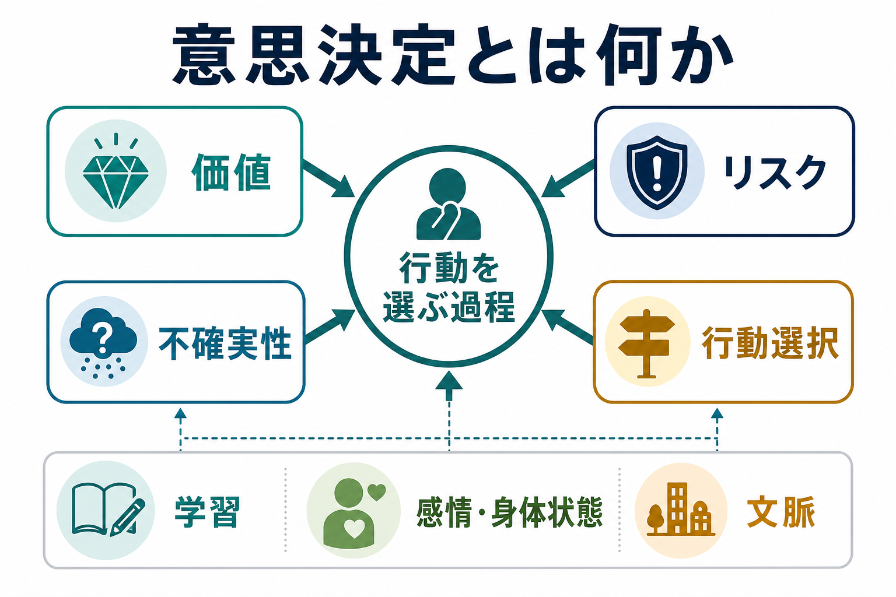
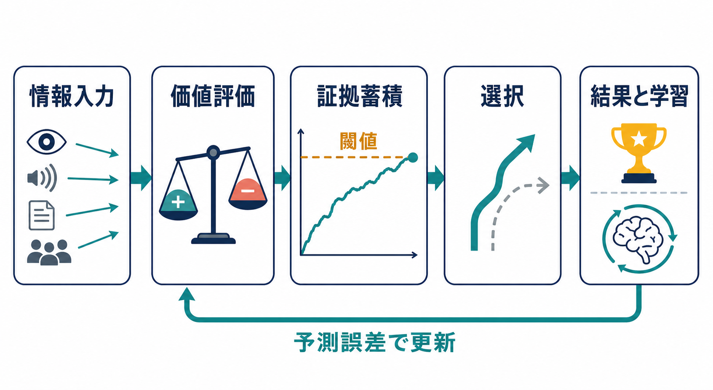
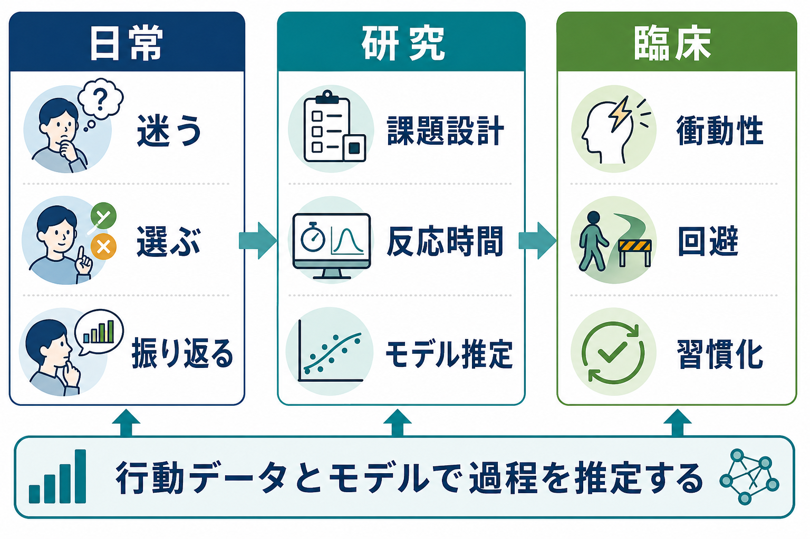

# 意思決定とは何か

## 要点

- 意思決定とは、複数の選択肢について「何が得られそうか」「どれくらい危ないか」「どれくらい確かか」を評価し、行動を一つに絞る過程である。
- 価値ベース意思決定では、表象、価値評価、選択、結果評価、学習更新という段階で考えると理解しやすい[1]。
- 実際の選択は、合理的な期待値計算だけでなく、損失回避、確実性効果、習慣、感情、身体状態、注意、時間圧にも影響される[4]。
- 神経科学では、腹内側前頭前野・線条体などの価値評価系、前頭頭頂領域などの選択・証拠蓄積系、大脳基底核を含む学習系が重視される[2][3]。
- 精神医学・臨床研究では、意思決定を「衝動性」「回避」「報酬感受性」「習慣化」「不確実性への反応」などの構成要素に分け、行動データと計算モデルから推定する[8]。

## この記事で答える問い

このノートでは、意思決定を「頭の中で正解を選ぶ能力」ではなく、環境、身体、記憶、価値、リスク、不確実性を統合して行動を決める過程として説明する。特に、[[注意とは何か]]、[[ワーキングメモリとは何か]]、[[中央実行系とは何か]]、[[計画能力とは何か]]とどのようにつながるのかを見通せるようにする。

## まず結論

意思決定とは、選択肢を比べて「今この状況で、どの行動を取るか」を決める過程である。より正確には、外界や身体からの情報を取り込み、各選択肢の価値、コスト、リスク、時間遅延、不確実性を評価し、行動後の結果から次回の選択を更新する循環的なプロセスである[1]。

たとえば「雨が降りそうな日に傘を持つか」を考えると、傘を持つ利益、荷物が増えるコスト、降水確率、濡れたときの不快さ、過去の経験、出発までの時間が関わる。意思決定は、このような情報を完全に計算するというより、限られた時間と認知資源の中で、十分に納得できる行動を選ぶ働きである。

## 背景

意思決定研究は、心理学、経済学、神経科学、統計学、機械学習にまたがる。経済学では、期待効用のように「確率で重みづけした価値を最大化する」モデルが出発点になる。一方、心理学では、人間の選択が期待効用から系統的にずれることが示されてきた。プロスペクト理論は、人が最終的な富よりも「参照点からの利得・損失」を重視し、損失を利得より強く感じやすいことを説明した[4]。

神経科学では、選択肢の主観的価値をどの脳領域が表現するのか、行動を選ぶ直前にどのように証拠が蓄積するのか、結果からどのように学習するのかが調べられてきた[2][3]。この流れは、[[大脳基底核ループとは何か]]、[[ドパミンは報酬だけの物質なのか]]、[[前頭前野は情動制御にどう関わるのか]]の理解とも接続する。

## 基本概念

### 価値

価値とは、選択肢がもたらすと予測される望ましさである。ここでいう価値は、お金や報酬だけではない。安全、快適さ、社会的承認、時間節約、痛みの回避、将来の目標との整合性も価値になる。価値ベース意思決定の枠組みでは、複数の選択肢が共通の尺度に変換され、比較可能になると考える[1]。

### リスクと不確実性

リスクは、起こりうる結果とその確率がおおよそ分かっている状態を指す。不確実性は、確率自体が分からない、または状況の構造がまだ十分に学習されていない状態を含む。宝くじはリスクの例に近く、新しい職場でどの行動が評価されるか分からない状況は不確実性の例に近い。

### 期待値と主観的価値

単純な期待値は、次のように表せる。

$$
EV = \sum_i p_i v_i
$$

ここで $p_i$ は結果 $i$ の確率、$v_i$ はその結果の価値である。ただし、人間は確率や価値をそのまま扱うとは限らない。小さな確率を過大評価したり、損失を利得より重く扱ったり、すぐ得られる報酬を将来の大きな報酬より好んだりする[4]。

### 目標志向行動と習慣

意思決定には、結果を予測して柔軟に選ぶ目標志向的な制御と、過去に強化された刺激-反応の結びつきで素早く選ぶ習慣的な制御がある。目標志向制御は変化に強いが負荷が高く、習慣制御は効率的だが状況変化に鈍い。強化学習の観点では、この違いはモデルベース制御とモデルフリー制御の違いとして整理できる[6][7]。

## 仕組み

意思決定は、単一の「決断中枢」で起きるのではなく、複数の処理が連鎖して起きる。

1. 情報入力: 感覚情報、記憶、身体状態、社会的文脈が取り込まれる。
2. 表象: どの選択肢があるのか、どの結果がありうるのかが構成される。
3. 価値評価: 報酬、罰、努力、時間遅延、確率が統合される。
4. 証拠蓄積: どちらの選択肢を支持する情報が強いかが時間とともに積み上がる。
5. 選択: ある閾値を超えると行動が実行される。
6. 結果評価: 予測と実際の差が計算され、次回の価値評価が更新される。

速度が求められる課題では、逐次サンプリングモデルや拡散決定モデルがよく使われる。これらのモデルでは、人は noisy な情報を少しずつ蓄積し、証拠が閾値に達した時点で反応すると考える。反応時間と正答率を同時に説明できるため、情報処理の質、慎重さ、事前バイアスを分けて推定しやすい[5]。

学習の面では、結果が予測より良かったか悪かったかが重要になる。強化学習では、この差を予測誤差として扱い、価値の更新に使う[6]。脳内では、ドパミン系や線条体が報酬予測と学習に関わると考えられ、これは[[ドパミンは報酬だけの物質なのか]]や[[報酬系の異常はうつ病をどう説明するのか]]のテーマにつながる。

## 図解

意思決定を一枚で捉えるなら、「価値」「リスク」「不確実性」「行動選択」を中心に置くとよい。もう少し機構に踏み込むなら、入力された情報が価値評価に変換され、証拠蓄積を経て選択に至り、結果が学習として戻る循環として見る。

## 臨床・研究との接続

意思決定研究は、精神疾患や神経疾患の理解にも使われる。ただし、個別の診断や治療方針を直接決めるものではなく、教育・研究目的で「どの認知過程が変化している可能性があるか」を考える道具として用いるのが適切である。

たとえば、依存症では短期的報酬への感受性、習慣化、手がかり反応性が問題になることがある。うつ病では報酬予測、努力に対する価値づけ、将来報酬への期待が変化する可能性がある。強迫症や不安症では、脅威や不確実性を避ける方向に選択が偏ることがある。こうした現象は、[[依存症は報酬学習の病態としてどう理解できるのか]]、[[陰性症状は報酬系や認知制御の障害と関係するのか]]、[[強迫症では皮質線条体視床回路に何が起きているのか]]と接続して読める。

計算論的精神医学では、行動課題の正誤や反応時間だけでなく、学習率、報酬感受性、罰感受性、探索傾向、意思決定ノイズなどの潜在パラメータを推定する。これにより、同じ症状名の中にある異なるメカニズムを区別し、研究仮説を明確にすることが期待されている[8]。

## よくある誤解

### 意思決定は「理性的に考えること」だけではない

意思決定には理性的な比較も含まれるが、感情、身体状態、習慣、社会的文脈、注意の向きも深く関わる。感情は判断を乱すだけでなく、危険や価値を素早く知らせる信号として働くこともある。

### 直感は常に悪いわけではない

直感的判断は、経験が豊富で環境が安定している場合には有効に働くことがある。一方、確率、長期的影響、まれなリスクを扱う場面では、直感が系統的な偏りを生むこともある[4]。

### 脳の一領域だけで意思決定が決まるわけではない

腹内側前頭前野、線条体、前頭頭頂ネットワーク、大脳基底核、扁桃体、海馬などはそれぞれ異なる役割を担うが、単独で「意思決定」を説明するわけではない。価値評価、記憶、注意、行動制御、学習が相互作用して選択が生じる[2][3]。

## 関連ノート

- [[注意とは何か]]
- [[ワーキングメモリとは何か]]
- [[中央実行系とは何か]]
- [[計画能力とは何か]]
- [[大脳基底核ループとは何か]]
- [[ドパミンは報酬だけの物質なのか]]
- [[報酬系の異常はうつ病をどう説明するのか]]
- [[依存症は報酬学習の病態としてどう理解できるのか]]

### 関連ノート候補

- 価値ベース意思決定
- プロスペクト理論
- 拡散決定モデル
- モデルベース強化学習
- モデルフリー強化学習
- 探索と活用
- 損失回避

### MOC更新候補

- `content/00_MOC/MOC｜認知科学・心理学.md`
- `content/00_MOC/MOC｜脳・神経科学.md`
- `content/00_MOC/MOC｜計算論的精神医学.md`

## 理解チェック

1. 意思決定における「価値」と「リスク」はどのように違うか。
2. 期待値が高い選択肢を、人が常に選ぶとは限らない理由は何か。
3. 目標志向行動と習慣的行動は、どのような場面でそれぞれ有利か。
4. 反応時間を測ることで、意思決定過程の何を推定できるか。
5. 臨床研究で意思決定モデルを使うとき、なぜ診断名だけでなく潜在過程を見る必要があるのか。

## 未解決問題

- 主観的価値が、脳内でどの程度まで共通尺度として表現されているのか。
- 感情や身体状態が価値評価に入る仕組みを、どの粒度のモデルで扱うべきか。
- 実験室課題で推定された意思決定パラメータが、日常生活の選択をどこまで予測できるのか。
- 精神疾患の意思決定モデルを、個別の支援や治療選択にどの程度応用できるのか。

## 参考文献

[1] Rangel, A., Camerer, C., & Montague, P. R. (2008). A framework for studying the neurobiology of value-based decision making. *Nature Reviews Neuroscience*, 9, 545-556. https://doi.org/10.1038/nrn2357

[2] Kable, J. W., & Glimcher, P. W. (2009). The neurobiology of decision: consensus and controversy. *Neuron*, 63(6), 733-745. https://doi.org/10.1016/j.neuron.2009.09.003

[3] Gold, J. I., & Shadlen, M. N. (2007). The neural basis of decision making. *Annual Review of Neuroscience*, 30, 535-574. https://doi.org/10.1146/annurev.neuro.29.051605.113038

[4] Kahneman, D., & Tversky, A. (1979). Prospect theory: An analysis of decision under risk. *Econometrica*, 47(2), 263-292. https://www.jstor.org/stable/1914185

[5] Forstmann, B. U., Ratcliff, R., & Wagenmakers, E. J. (2016). Sequential sampling models in cognitive neuroscience: Advantages, applications, and extensions. *Annual Review of Psychology*, 67, 641-666. https://doi.org/10.1146/annurev-psych-122414-033645

[6] Sutton, R. S., & Barto, A. G. (2018). *Reinforcement Learning: An Introduction* (2nd ed.). MIT Press. https://mitpress.mit.edu/9780262039246/reinforcement-learning/

[7] Daw, N. D., Niv, Y., & Dayan, P. (2005). Uncertainty-based competition between prefrontal and dorsolateral striatal systems for behavioral control. *Nature Neuroscience*, 8, 1704-1711. https://doi.org/10.1038/nn1560

[8] Huys, Q. J. M., Maia, T. V., & Frank, M. J. (2016). Computational psychiatry as a bridge from neuroscience to clinical applications. *Nature Neuroscience*, 19, 404-413. https://doi.org/10.1038/nn.4238
